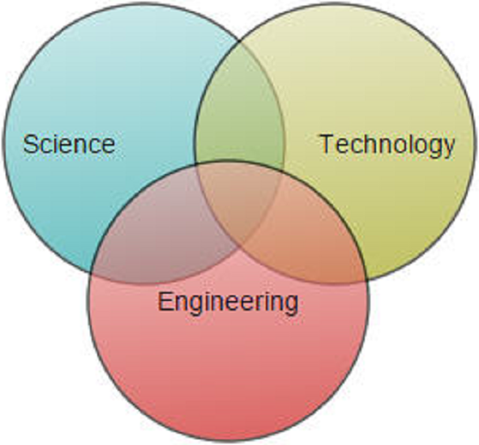

# Nodes in React Diagram Component

Nodes are graphical objects that visually represent entities, processes, data flow, or any business logic within diagrams. They serve as the fundamental building blocks for creating flowcharts, organizational charts, network diagrams, and other visual representations. Each node can be customized with different shapes, sizes, colors, and interactive behaviors to suit specific diagram requirements.

<!-- markdownlint-disable MD033 -->

## Node Fundamentals

Before creating nodes, understanding their core properties helps in effective diagram development:

- **Position**: Defined by `offsetX` and `offsetY` properties for precise placement.
- **Size**: Controlled through `width` and `height` properties.
- **Identification**: Each node requires a unique `id` for runtime operations.
- **Stacking**: Nodes are layered from bottom to top based on addition order.

## Creating Nodes

### Add Nodes through Nodes Collection

To create a node, define the [`node`](https://ej2.syncfusion.com/react/documentation/api/diagram/node/#node) object and add it to the [`nodes`](https://ej2.syncfusion.com/react/documentation/api/diagram/nodeModel/) collection of the diagram model. The [`id`](https://ej2.syncfusion.com/react/documentation/api/diagram/node/#id) property serves as the unique identifier for runtime operations and customization.










 

N> Node id should not begin with numbers(should begin with a letter). Node Id should be unique for all the shapes and connectors.

### Create Node from Data Source

Nodes can be generated automatically using the dataSource property. Default properties for these nodes are retrieved from([`getNodeDefaults`](https://ej2.syncfusion.com/react/documentation/api/diagram/#getnodedefaults)) settings. For detailed information about data binding, refer to [`DataBinding`](./data-binding).









          


### Add Nodes from Symbol Palette

Nodes can be predefined in a symbol palette and dragged into the diagram as needed. This approach provides users with a library of reusable components. For comprehensive guidance on symbol palette integration, refer to  [`Symbol Palette`](https://ej2.syncfusion.com/react/documentation/api/diagram/symbolPaletteModel).









          


### Draw Nodes Interactively

To enable interactive node drawing, activate the drawing tool by setting `DrawOnce` or `ContinuousDraw` to the [`tool`](https://ej2.syncfusion.com/react/documentation/api/diagram/#tool) property and configure the node template using the [`drawingObject`](https://ej2.syncfusion.com/react/documentation/api/diagram/#drawingobject) property. 

The following code example illustrates how to draw a rectangle at runtime.









          


## Runtime Node Operations

### Add and Remove Individual Nodes

Nodes can be dynamically added using the [`add`](https://ej2.syncfusion.com/react/documentation/api/diagram/#add) method and removed using the [`remove`](https://ej2.syncfusion.com/react/documentation/api/diagram/#remove) method. Both operations trigger the [`collectionChange`](https://ej2.syncfusion.com/react/documentation/api/diagram/#collectionchange) event, allowing for custom handling of diagram modifications.

The following code illustrates how to add a node.










 

### Add Multiple Nodes Simultaneously

Collections of nodes can be efficiently added using the[`addElements`](https://ej2.syncfusion.com/react/documentation/api/diagram/#addelements) method. This approach is optimal for bulk operations and triggers the `collectionChange` event for each added element.

The following code illustrates how to add nodes collection at run time.









          


### Update Node Properties

Node properties can be modified at runtime with immediate visual updates. Changes take effect instantly, allowing for dynamic diagram manipulation based on user interactions or data updates.









          


N> Call the [`dataBind`](./data-binding) `dataBind` method after property updates to ensure immediate reflection of changes.

### Clone Node at Runtime

Node cloning creates new instances with identical properties and attributes. Use the [`copy`](https://ej2.syncfusion.com/react/documentation/api/diagram/#copy) and [`paste`](https://ej2.syncfusion.com/react/documentation/api/diagram/#paste) methods to duplicate existing nodes programmatically.

 
The following code example illustrates how to clone node at runtime









          


## Advanced Node Integration

### Import Nodes from External Components

Custom [`dragEnter`](https://ej2.syncfusion.com/react/documentation/api/diagram/#dragenter) functionality enables conversion of elements from other components, such as tree views, into diagram nodes based on the dragged element's data properties.

## See Also

* [How to add annotations to the node.](./labels)
* [How to add ports to the node.](./ports)
* [How to enable/disable the behavior of the node.](./constraints)
* [How to add nodes to the symbol palette.](./symbol-palette)
* [How to edit the node visual interface.](./interaction#selection)
* [How to create diagram nodes using drawing tools.](./tools)
