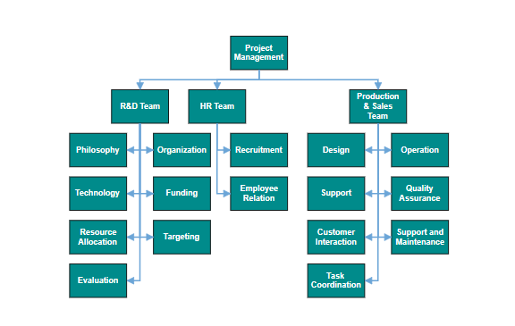
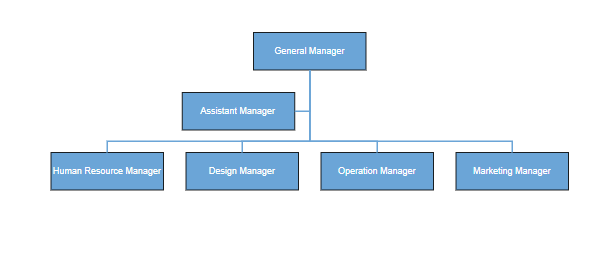

# Organizational Chart Layout in React Diagram Component

An organizational chart is a diagram that displays the hierarchical structure of an organization, showing reporting relationships and roles within the company. The React Diagram component provides specialized support for creating professional organizational charts through automatic layout algorithms. To create an organizational chart, set the [`type`](https://ej2.syncfusion.com/react/documentation/api/diagram/layout#type) of layout should be set as an **OrganizationalChart**.

## Organizational Chart with DataSource

This approach is ideal when working with dynamic data from databases, APIs, or when the organizational structure changes frequently. The component automatically generates nodes and connectors based on the provided data structure.











 

>Note: When using organizational chart layout, both HierarchicalTree and DataBinding modules must be injected into the diagram component.

## Organizational Chart with Nodes and Connectors

You can render an org-chart layout without using DataSource. The following code demonstrates how to render an org-chart layout without using data source.











 

## Advanced Layout Customization with getLayoutInfo

Organizational chart layout starts parsing from root and iterate through all its child elements. The [`getLayoutInfo`](https://ej2.syncfusion.com/react/documentation/api/diagram/layoutmodel#getlayoutinfo) method provides granular control over how each subtree within the organizational chart is arranged. This method is invoked for every node during the layout process, allowing customization of orientation, alignment, spacing, and special node types like assistants.

The organizational chart layout engine parses the hierarchy starting from the root node and processes each subtree. By overriding the `getLayoutInfo` method, developers can customize the arrangement of child nodes based on specific business requirements.

### getLayoutInfo Parameters

The `getLayoutInfo` method accepts the following parameters:

- **node**: The parent node for which layout options are being configured.
- **options**: Configuration object containing customizable layout properties.

### Layout Options Properties

The following table illustrates the properties that “options” argument takes.

| Property | Description | Default Value |
| -------- | ----------- | ------------- |
|options.assistants|By default, the collection is empty. When any of the child nodes have to be set as **Assistant**, you can remove from children collection and have to insert into assistants collection.|Empty array|
|options.orientation|Gets or sets the organizational chart orientation.|SubTreeOrientation.Vertical|
|options.type|Gets or sets the chart organizational chart type.|For horizontal chart orientation:SubTreeAlignments.Center and for vertical chart orientation:SubTreeAlignments.Alternate|
|options.offset|Offset is the horizontal space to be left between parent and child nodes.|20 pixels applicable only for vertical chart orientations.|
|options.hasSubTree|Gets whether the node contains subtrees.|Boolean|
|options.level|Gets the depth of the node from layout root.|Number|
|options.enableRouting|By default, connections are routed based on the chart type and orientations. This property gets or sets whether default routing is to be enabled or disabled.|true|
|options.rows|Sets the number of rows on which the child nodes will be arranged. Applicable only for balanced type horizontal tree.|Number|

### Orientation and Alignment Options

The following table describes the available chart orientations and their corresponding alignment types:

|Orientation|Type|Description|Example|
| -------- | ----------- | ------------- |------|
|Horizontal|Left|Arranges the child nodes horizontally at the left side of the parent.||
||Right|Arranges the child nodes horizontally at the right side of the parent.||
||Center|Arranges the children like standard tree layout orientation.||
||Balanced|Arranges the leaf level child nodes in multiple rows.||
|Vertical|Left|Arranges the children vertically at the left side of the parent.||
||Right|Arranges the children vertically at the right side of the parent.||
||Alternate|Arranges the children vertically at both left and right sides of the parent.||

### Horizontal Subtree Orientation Example

The following example demonstrates customizing subtree alignment for horizontal organizational structures:











 

### Vertical Subtree Orientation Example

This example shows how to implement vertical arrangement for leaf-level organizational trees:











 

### Assistant Nodes

Assistant nodes represent positions with specialized relationships to their parent, such as executive assistants or advisor's. These nodes are positioned in a dedicated area separate from regular child nodes. To designate a node as an assistant, add it to the **assistants** collection within the `getLayoutInfo` options parameter.

The following code example illustrates how to add assistants to layout.











 

>Note: Assistant nodes cannot have child nodes and serve as terminal positions in the organizational hierarchy.

## Best Practices

- Use the DataSource approach for dynamic organizational structures that may change frequently.
- Implement the manual approach when requiring custom node designs or static hierarchies.
- Consider using assistant nodes for specialized roles like executive assistants or advisory positions.
- Apply appropriate orientation and alignment settings based on the size and complexity of the organization.
- Test layout performance with large datasets and consider implementing virtualization for extensive organizational charts.