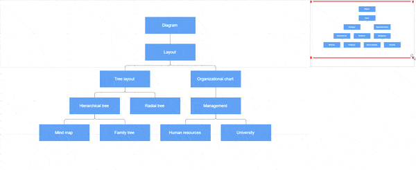

# Overview Component in React Diagram Component

The Overview component provides a miniature preview of the entire diagram content, enabling efficient navigation and viewport management for large diagrams. This component displays a scaled-down version of the diagram with a highlighted rectangle representing the current viewport, allowing users to quickly navigate to specific areas without manual zooming and panning.

## When to Use Overview

The Overview component is essential when working with:

* Large diagrams that exceed the visible viewport.
* Complex flowcharts or organizational charts requiring frequent navigation.
* Multi-section diagrams where users need to jump between different areas.
* Applications where users need spatial awareness of their current position within the diagram.

## Create Overview Component

To implement an overview, configure the [`sourceID`](https://ej2.syncfusion.com/react/documentation/api/overview/overviewModel/#sourceid) property to reference the target diagram's identifier. This establishes the connection between the overview and the main diagram.

Define the overview dimensions using the [`width`](https://ej2.syncfusion.com/react/documentation/api/overview/overviewModel/#width) and [`height`](https://ej2.syncfusion.com/react/documentation/api/overview/overviewModel/#height) properties to ensure optimal visibility and performance.

The following code demonstrates basic overview implementation:










 

## Overview Interactions

The overview displays the current viewport as a red rectangle overlay. This rectangle serves as an interactive control for diagram navigation and zoom operations.

### Available Interactions

* **Resize the rectangle**: Adjusts diagram zoom level proportionally.
* **Drag the rectangle**: Pans the diagram to follow rectangle movement.
* **Click on a position**: Instantly navigates to the clicked location.
* **Click and drag selection**: Defines a specific region for navigation and zoom.

### Interactive Navigation Example










 

The following demonstration shows overview interaction capabilities:

