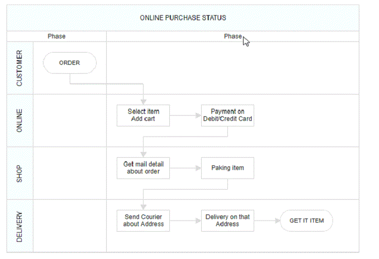

# Phase in React Diagram Component

## Overview

Phases are subprocesses that split each lane horizontally or vertically based on the swimlane orientation. Phases help organize workflow stages within lanes, making it easier to visualize process steps and milestones. Multiple [`Phase`](https://ej2.syncfusion.com/react/documentation/api/diagram/phaseModel)objects can be added to a swimlane to represent different stages of a process.

The following code example illustrates how to create phase.










 

### Dynamically Add and Remove Phases from Lanes

Phases can be added at runtime using the [`addPhases`](https://ej2.syncfusion.com/react/documentation/api/diagram/#addphases) method and removed using the [`removePhase`](https://ej2.syncfusion.com/react/documentation/api/diagram/#removephase) method. This dynamic functionality allows for flexible workflow management as process requirements change.

The following code example illustrates how to add and remove phases at runtime.

  








 

### Customizing Phase Appearance and Properties

Phase appearance and behavior can be customized through several properties:

* The length of each region can be controlled using the[`offset`](https://ej2.syncfusion.com/react/documentation/api/diagram/phaseModel#offset) property of the phase.
* Each phase region can include descriptive text through the[`header`](https://ej2.syncfusion.com/react/documentation/api/diagram/headerModel) property of the phase.
* The height of phases can be increased using the [`phaseSize`](https://ej2.syncfusion.com/react/documentation/api/diagram/swimLaneModel#phaseSize) property of swimlane.
* Additional information can be stored with phases using the [`addInfo`](https://ej2.syncfusion.com/react/documentation/api/diagram/phaseModel#addInfo) property of the phase.

The following code example illustrates how to customize the phase in swimlane.










 

#### Dynamic Customization of Phases

Phase style and text properties can be customized dynamically during runtime. This capability enables responsive design adjustments based on user interactions or changing data requirements.

The following code example illustrates how to customize the phase at runtime.










 

### Phase Interaction Capabilities

#### Resizing Phases

* Phases can be resized using their selection handles.
* The phase header must be selected first to enable phase selection.
* When a phase is resized, the associated lane size updates automatically to maintain layout consistency.

#### Resizing Helper Functionality

* A specialized resize selector is used for phase resizing operations.
* The resize cursor appears in different directions based on swimlane orientation: left and bottom directions for horizontal swimlanes, and top and bottom directions for vertical swimlanes.

#### Phase Header Editing

The diagram component provides support for editing phase headers at runtime through double-click interaction. Double-clicking the header label enables inline editing functionality, allowing users to modify phase titles directly within the diagram.

The following image illustrates the phase header editing process:

