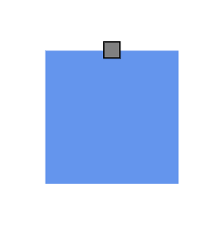
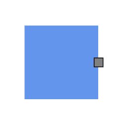
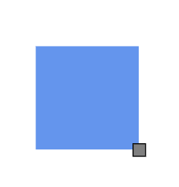
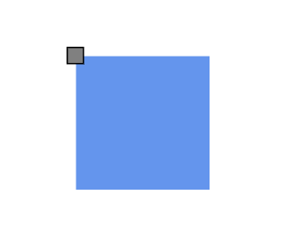
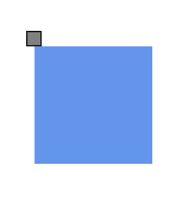

# Port positioning in React Diagram Component

The React Diagram component provides flexible options for positioning ports on nodes. Ports can be precisely positioned using offset coordinates, alignment properties, and margin values to create professional diagram layouts that meet specific design requirements.

## Understanding Port Offset Positioning

The [`offset`](https://ej2.syncfusion.com/react/documentation/api/diagram/pointModel/) property positions ports using fractional coordinates relative to the node boundaries. The coordinate system uses values from 0 to 1, where:

- **0** represents the top edge (for Y-axis) or left edge (for X-axis).
- **1** represents the bottom edge (for Y-axis) or right edge (for X-axis).
- **0.5** represents the center point of the width or height.

The following table demonstrates port positioning with different offset values:

| Offset values | Output |
| -------- | -------- |
| (0,0) |  |
| (0,0.5) |  |
| (0,1) |  |
| (0.5,0) |  |
| (0.5,0.5) | |
| (0.5,1) |  |
| (1,0) |  |
| (1,0.5) |  |
| (1,1) |  |

## Horizontal and Vertical Alignment Options

The [`horizontalAlignment`](https://ej2.syncfusion.com/react/documentation/api/diagram/horizontalAlignment/) and [`verticalAlignment`](https://ej2.syncfusion.com/react/documentation/api/diagram/verticalAlignment/) properties provide fine-grained control over port positioning at the specified offset coordinates. These properties determine how the port aligns relative to its calculated position.












The following table shows all possible alignment combinations when using offset (0, 0):

| Horizontal Alignment | Vertical Alignment | Output with Offset(0,0) |
| -------- | -------- | -------- |
| Left | Top |  |
| Center | Top |  |
| Right | Top |   |
| Left | Center |  |
| Center | Center|  |
| Right | Center |  |
| Left | Bottom |  |
| Center | Bottom |  |
| Right |Bottom | |

## Adding Margin Spacing to Ports

[`Margin`](https://ej2.syncfusion.com/react/documentation/api/diagram/marginModel/) property applies additional spacing around ports using absolute pixel values. Margin creates blank space on any or all four sides of the port, allowing for precise positioning adjustments beyond the basic offset and alignment settings.












## See also

* [How to interact with the ports.](./ports-interaction)

* [How to customize the ports.](./ports-appearance)

* [How to create connector port.](./ports-connector-port)