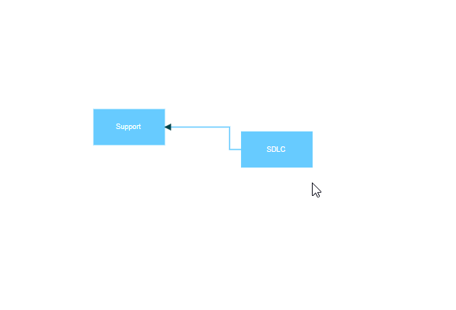

# Ports in React Diagram component

Port is a special connection point in a Node where you can glue the connectors. When you glue a connector to a node or port, they remain connected even if one of the nodes is moved.


## Types of connections

There are two main types of connections, node to node and port to port. The difference between these two connections is whether or not a connector remains glued to a specific connection point when you move the attached node or connector.

### Node to node connection

A node to node connection is one where the connector will move around the node as you move the node. Diagram will always ensure the connector in the shortest, most direct line possible. You can create a node to node connection by selecting the entire node (rather than the port) and connect it to another shape (rather than to a port).

<!-- markdownlint-disable MD033 -->

When a connector is connected between two nodes, its end points are automatically docked to the node’s nearest boundary as shown in the following Gif.



### Port to port connection

Ports act as the connection points of the node and allows creating connections with only those specific points as shown in the following image.


## Create port

To add a connection port, define the port object and add it to node’s [`ports`](https://ej2.syncfusion.com/react/documentation/api/diagram/pointPortModel/) collection. The [`offset`](https://ej2.syncfusion.com/react/documentation/api/diagram/pointModel/) property of the port accepts an object of fractions and is used to determine the position of ports. The following code explains how to add ports when initializing the node.












## Add ports at runtime

You can add ports to the nodes  at runtime by using the diagram method  [`addPorts`](https://ej2.syncfusion.com/react/documentation/api/diagram/#addPorts). The following code illustrates how to add ports to node at runtime.

The port’s ID property is used to define the unique ID for the port and its further used to find the port at runtime.
If ID is not set, then default ID is automatically set.












## Remove ports at runtime

You can remove ports at runtime by using diagram method [`removePorts`](https://ej2.syncfusion.com/react/documentation/api/diagram/#removePorts).Refer to the following example which shows how to remove ports at runtime.












## Update port at runtime

You can change any port properties at runtime and update it through the diagram method [`dataBind`](https://ej2.syncfusion.com/react/documentation/api/diagram/#dataBind).

The following code example illustrates how to change the port offset at runtime.












## Specify connection direction to port

The [`connectionDirection`](https://ej2.syncfusion.com/react/documentation/api/diagram/port/#connectionDirection) property of a port allows users to specify the direction in which a connector should establish a connection. This can be either to the port (incoming) or from the port (outgoing). 













## InEdges and outEdges of ports

The [`inEdges`](https://ej2.syncfusion.com/react/documentation/api/diagram/pointPortModel/#inedges) is used to get the incoming connectors of the port that are connected to the port. [`outEdges`](https://ej2.syncfusion.com/react/documentation/api/diagram/pointPortModel/#outedges)is used to get the outgoing connectors of the port that are connected to the port.

The `inEdges` and `outEdges` of the port are read-only and cannot be customized.












The following code example shows how to get inEdges and outEdges of port.

## Additional information to port

The[ `addInfo`](https://ej2.syncfusion.com/react/documentation/api/diagram/pointPortModel/#addinfo) property of the port allows you to maintain additional information to the port. 

The following code example shows how to set addInfo to the port.

```ts

let port:PointPortModel = {id:'port1',offset:{x:0.5,y:0},addInfo:{position:'TopCenter',id:'port1'}};

```

