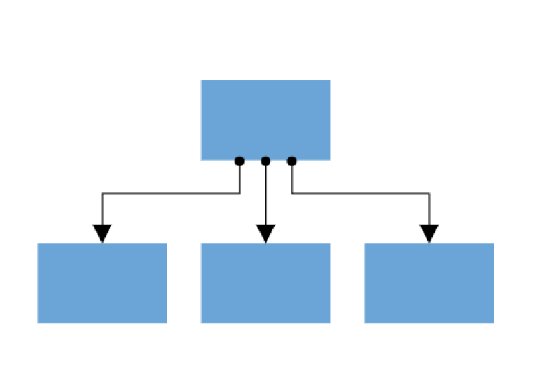
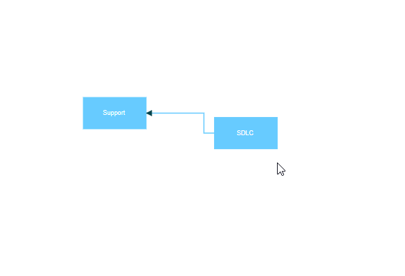
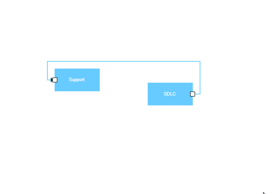
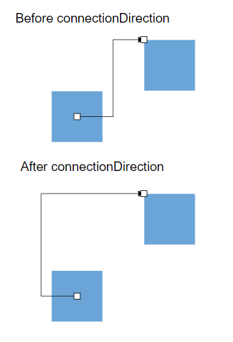

# Ports in React Diagram

Ports are specialized connection points on nodes that provide precise control over where connectors attach. Unlike node-to-node connections that automatically adjust their attachment points, ports maintain fixed connection locations even when nodes are moved, rotated, or resized. This makes ports essential for creating stable, predictable diagram layouts and professional flowcharts.



## Types of Connections

The Diagram component supports two distinct connection methods, each serving different use cases depending on the level of connection control required.

### Node to Node Connection

Node to node connections automatically find the optimal attachment point on a node's boundary. When either connected node moves, the connector dynamically repositions to maintain the shortest path between nodes. This connection type works best for simple diagrams where precise connection points are not critical.

When a connector is connected between two nodes, its end points are automatically docked to the node's nearest boundary as shown in the following gif.



### Port to Port Connection

Port to port connections attach to specific, predefined points on nodes. These connections remain fixed to their designated ports regardless of node movement, ensuring consistent diagram appearance and reliable connector behavior. This connection type is ideal for technical diagrams, flowcharts, and any scenario requiring precise connector placement.



For details on how to create ports, see [Create Port](#create-port).

## Create Port

Before adding ports, ensure the Diagram component is rendered and the required modules are injected. For setup details, see [Getting Started](./getting-started.md) and [Module Injection](./module-injection.md).

Ports are defined as objects within a node's [`ports`](https://ej2.syncfusion.com/react/documentation/api/diagram/pointPortModel) collection. The [`offset`](https://ej2.syncfusion.com/react/documentation/api/diagram/pointModel) property accepts fractional values (0 to 1) that determine the port's position relative to the node's bounds, where (0,0) represents the top-left corner and (1,1) represents the bottom-right corner.

The following code demonstrates how to add ports during node initialization:












N> When setting a Port's ID, ensure that it does not contain white spaces, does not start with a number or special character, and does not include special characters such as underscores (_).

## Add Ports at Runtime

The [`addPorts`](https://ej2.syncfusion.com/react/documentation/api/diagram#addports) method enables dynamic port creation after the diagram has been initialized. This functionality is useful for interactive applications where users can customize node connection points or when ports need to be added based on business logic.

The port's ID property defines a unique identifier that can be used to reference the port in subsequent operations. If no ID is specified, the system automatically generates a default ID.

Use the addPorts method with the following signature: `addPorts(node: NodeModel, ports: PointPortModel[])`. The following example adds a new port to an existing node:












## Remove Ports at Runtime

The [`removePorts`](https://ej2.syncfusion.com/react/documentation/api/diagram#removeports) method allows dynamic removal of ports from nodes. When a port is removed, any connectors attached to that port are automatically disconnected. This method is particularly useful for creating adaptive interfaces or cleaning up unused connection points. If the specified port ID does not exist on the target node, the `removePorts` call is ignored and no exception is thrown.

Use the removePorts method with the following signature: `removePorts(node: NodeModel, portIds: string[])`. The following example removes a port by its ID:












## Update Port at Runtime

Unlike `addPorts` and `removePorts`, port updates do not use a dedicated method. Modify the port object directly, and then call `diagram.dataBind()` to apply the changes. This approach enables dynamic customization of port appearance, position, and behavior based on application state or user interactions.

The following code example illustrates how to change the port offset at runtime.












## Specify Connection Direction to Port

The [`connectionDirection`](https://ej2.syncfusion.com/react/documentation/api/diagram/port#connectiondirection) property controls the side of a port from which connections are allowed. It accepts `Auto`, `Left`, `Right`, `Top`, or `Bottom`. This feature is useful for controlling connector routing in technical diagrams.














## InEdges and OutEdges of Ports

Each port maintains collections of its connected connectors through read-only properties. The [`inEdges`](https://ej2.syncfusion.com/react/documentation/api/diagram/pointPortModel#inedges) property contains the IDs of all connectors that terminate at the port, while [`outEdges`](https://ej2.syncfusion.com/react/documentation/api/diagram/pointPortModel#outedges) contains the IDs of connectors that originate from the port. These properties are automatically maintained by the diagram and provide valuable information for traversing connection relationships.

The `inEdges` and `outEdges` of the port are read-only and cannot be customized.

The following code example shows how to get inEdges and outEdges of a port:












## Additional Information to Port

The [`addInfo`](https://ej2.syncfusion.com/react/documentation/api/diagram/pointPortModel#addinfo) property allows attachment of custom metadata to ports. This property accepts any object and is useful for storing application-specific data, configuration settings, or contextual information that needs to be associated with particular ports. The stored information persists with the port throughout its life cycle and can be accessed when processing port-related events or operations.

The following code example shows how to attach additional information to a port:

```

let port:PointPortModel = {id:'port1',offset:{x:0.5,y:0},addInfo:{position:'TopCenter',id:'port1'}};

// Assign the port to a node's ports collection:
node.ports = [port];

```