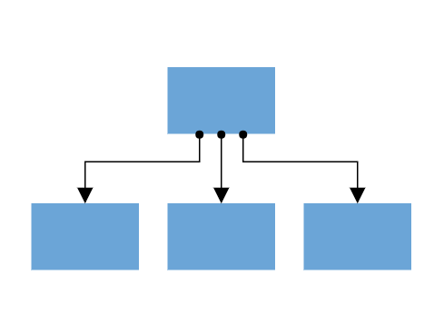

# Ports in React Diagram component

Diagram provides support to define custom ports for making connections.



<!-- markdownlint-disable MD033 -->

When a connector is connected between two nodes, its end points are automatically docked to the node’s nearest boundary as shown in the following image.


Ports act as the connection points of the node and allows to create connections with only those specific points as shown in the following image.


## Create port

## Add ports when initializing nodes

To add a connection port, define the port object and add it to node’s ports collection. The `offset` property of port accepts an object of fractions and used to determine the position of ports. The following code illustrates how to add ports when initializing the node.

```ts
import * as React from "react";
import * as ReactDOM from "react-dom";
import {
    Diagram,
    DiagramComponent,
    NodeModel,
    PortVisibility
} from "@syncfusion/ej2-react-diagrams";
// A node is created and stored in nodes array.
let node: NodeModel[] = [{
    // Position of the node
    offsetX: 250,
    offsetY: 250,
    // Size of the node
    width: 100,
    height: 100,
    style: {
        fill: '#6BA5D7',
        strokeColor: 'white'
    },
    // Initialize port collection
    ports: [{
        // Sets the position for the port
        offset: {
            x: 0.5,
            y: 0.5
        },
        visibility: PortVisibility.Visible
    }]
}];
// initialize Diagram component
function App() {
  return (
    <DiagramComponent
      id="container"
      width={'100%'}
      height={'600px'}
      // Add node
      nodes={node}
      // render initialized Diagram
    />
  );
}
const root = ReactDOM.createRoot(document.getElementById('diagram'));
root.render(<App />);
```

## Add ports at runtime

Add ports at runtime by using the client-side method [`addPorts`](https://ej2.syncfusion.com/react/documentation/api/diagram#addPorts). The following code illustrates how to add ports to node at runtime.

The port’s ID property is used to define the unique ID for the port and its further used to find the port at runtime.
If ID is not set, then default ID is automatically set.

```ts
import * as React from "react";
import * as ReactDOM from "react-dom";
import {
    Diagram,
    DiagramComponent,
    NodeModel,
    PointPortModel,
    PortVisibility
} from "@syncfusion/ej2-react-diagrams";
let diagramInstance:DiagramComponent;
// A node is created and stored in nodes array.
let node: NodeModel[] = [{
    // Position of the node
    offsetX: 250,
    offsetY: 250,
    // Size of the node
    width: 100,
    height: 100,
    style: {
        fill: '#6BA5D7',
        strokeColor: 'white'
    },
}];
// Initialize port collection
let port: PointPortModel[] = [{
        id: 'port1',
        offset: {
            x: 0,
            y: 0.5
        },
        visibility: PortVisibility.Visible
    } {
        id: 'port2',
        offset: {
            x: 1,
            y: 0.5
        },
        visibility: PortVisibility.Visible
    },
    {
        id: 'port3',
        offset: {
            x: 0.5,
            y: 0
        },
        visibility: PortVisibility.Visible
    },
    {
        id: 'port4',
        offset: {
            x: 0.5,
            y: 1
        },
        visibility: PortVisibility.Visible
    }
];
// initialize Diagram component
function App() {
  return (
    <DiagramComponent
      id="container"
      ref={(diagram) => (diagramInstance = diagram)}
      width={'100%'}
      height={'600px'}
      created = { () => {
        // Method to add ports through run time
        diagramInstance.addPorts(diagramInstance.nodes[0], port);
      }}
      // Add node
      nodes={node}
      // render initialized Diagram
    />
  );
}
const root = ReactDOM.createRoot(document.getElementById('diagram'));
root.render(<App />);

```

## Remove ports at runtime

Remove ports at runtime by using client-side method [`removePorts`](https://ej2.syncfusion.com/react/documentation/api/diagram#removePorts). Refer to the following example which shows how to remove ports at runtime.










 

## Update port at runtime

You can change any port properties at runtime and update it through the client-side method [`dataBind`](https://ej2.syncfusion.com/react/documentation/api/diagram#dataBind).

The following code example illustrates how to change the port properties.

```ts
import * as React from "react";
import * as ReactDOM from "react-dom";
import {
    Diagram,
    DiagramComponent,
    NodeModel,
    PortVisibility
} from "@syncfusion/ej2-react-diagrams";
// A node is created and stored in nodes array.
let node: NodeModel[] = [{
    // Position of the node
    offsetX: 250,
    offsetY: 250,
    // Size of the node
    width: 100,
    height: 100,
    style: {
        fill: '#6BA5D7',
        strokeColor: 'white'
    },
    // Initialize port collection
    ports: [{
        offset: {
            x: 0.5,
            y: 0.5
        },
        visibility: PortVisibility.Visible
    }]
}];
let diagramInstance:DiagramComponent;

// initialize Diagram component
function App() {
  return (
    <DiagramComponent
      id="container"
      ref={(diagram) => (diagramInstance = diagram)}
      width={'100%'}
      height={'600px'}
      nodes={node}
      created={() => {
        diagramInstance.nodes[0].ports[0].offset = {
            x: 1,
            y: 1
        };
        diagramInstance.dataBind();
      }}
    />
  );
}
const root = ReactDOM.createRoot(document.getElementById('diagram'));
root.render(<App />);

```

## Appearance

* The shape of port can be changed by using its shape property. To explore the different types of port shapes, refer to Port Shapes. If you need to render a custom shape, then you can set shape as path and define path using path data property of port.

* The appearance of ports can be customized by using [`strokeColor`](https://ej2.syncfusion.com/react/documentation/api/diagram/port#strokeColor-string), [`strokeWidth`](https://ej2.syncfusion.com/react/documentation/api/diagram/port#strokeWidth-string), and [`fill`](https://ej2.syncfusion.com/react/documentation/api/diagram/port#fill-string) properties of the port.

* Customize the port size by using the [`width`](https://ej2.syncfusion.com/react/documentation/api/diagram/port#width-number) and [`height`](https://ej2.syncfusion.com/react/documentation/api/diagram/port#height-number) properties of port.

* The ports [`visibility`](https://ej2.syncfusion.com/react/documentation/api/diagram/port#visibility-boolean) property allows you to define, when the port should be visible.

The following code illustrates how to change the appearance of port.










 

## Offset

The offset property of port is used to align the port based on fractions. 0 represents top/left corner, 1 represents bottom/right corner, and 0.5 represents half of width/height.

## Constraints

The constraints property allows to enable/disable certain behaviors of ports. For more information about port
constraints, refer to [`Port Constraints`](https://ej2.syncfusion.com/react/documentation/api/diagram/port#constraints-portconstraints).

## Specify connection direction to port

The [connectionDirection] property of a port allows users to specify the direction in which a connector should establish a connection. This can be either to the port (incoming) or from the port (outgoing).










 

 