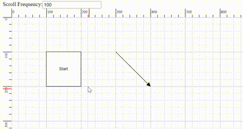

# Scroll Settings in React Diagram

The diagram component provides comprehensive scrolling capabilities through both vertical and horizontal scrollbars, as well as mouse wheel navigation. The diagram's [`scrollSettings`](https://helpej2.syncfusion.com/react/documentation/api/diagram/scrollSettingsModel) enable developers to monitor the current scroll status, viewport dimensions, zoom levels, and programmatically control diagram navigation. These settings are essential for managing large diagrams and providing smooth user interaction experiences.

## Access and Customize Scroll Settings

Scroll settings in a diagram provide access to various properties that control navigation and viewport behavior, including [`horizontalOffset`](https://helpej2.syncfusion.com/react/documentation/api/diagram/scrollSettingsModel#horizontaloffset), [`verticalOffset`](https://helpej2.syncfusion.com/react/documentation/api/diagram/scrollSettingsModel#verticaloffset), [`viewPortWidth`](https://helpej2.syncfusion.com/react/documentation/api/diagram/scrollSettingsModel#viewportwidth), [`viewPortHeight`](https://helpej2.syncfusion.com/react/documentation/api/diagram/scrollSettingsModel#viewportheight), [`currentZoom`](https://helpej2.syncfusion.com/react/documentation/api/diagram/scrollSettingsModel#currentzoom), [`zoomFactor`](https://helpej2.syncfusion.com/react/documentation/api/diagram/scrollSettingsModel#zoomfactor), [`maxZoom`](https://helpej2.syncfusion.com/react/documentation/api/diagram/scrollSettingsModel#maxzoom), [`minZoom`](https://helpej2.syncfusion.com/react/documentation/api/diagram/scrollSettingsModel#minzoom), [`scrollLimit`](https://helpej2.syncfusion.com/react/documentation/api/diagram/scrollSettingsModel#scrolllimit), [`canAutoScroll`](https://helpej2.syncfusion.com/react/documentation/api/diagram/scrollSettingsModel#canautoscroll), [`autoScrollBorder`](https://helpej2.syncfusion.com/react/documentation/api/diagram/marginModel), [`padding`](https://helpej2.syncfusion.com/react/documentation/api/diagram/marginModel), [`scrollableArea`](https://helpej2.syncfusion.com/react/documentation/api/diagram/rect).

These properties enable developers to read and adjust the scroll status, scroll offsets, zoom levels, and scrolling behavior. The `autoScrollBorder` and `padding` properties accept a [`Margin`](https://helpej2.syncfusion.com/react/documentation/api/diagram/marginModel) object with `left`, `right`, `top`, and `bottom` values specified in pixels. For a comprehensive overview of all available properties, refer to the [`Scroll Settings`](https://helpej2.syncfusion.com/react/documentation/api/diagram/scrollSettingsModel)

## Define Scroll Offset

The diagram allows developers to set the initial scroll position before loading, ensuring that any desired region of a large diagram is immediately visible. The initial scroll position can be programmatically configured using the  `horizontalOffset` and `verticalOffset` properties of the scroll settings. The following code illustrates how to programmatically set the diagram's initial scroll position upon initialization, with `scrollLimit` defined as 'Infinity' to enable infinite scrolling. To learn more about scroll limits, refer to the [`scrollLimit`](#scroll-limit) section.

In the example below, the vertical scrollbar is scrolled down by 100 px, and the horizontal scrollbar is scrolled to the right by 100 px.

N> The `horizontalOffset` and `verticalOffset` values are specified in pixels, and both default to `0`.










 

## Update Scroll Offset at Runtime

The diagram provides multiple methods to update scroll offsets during runtime:

* **Scrollbar**: Use the horizontal and vertical scrollbars of the diagram for direct navigation.
* **Mouse wheel**: Scroll vertically with the mouse wheel. Hold the Shift key while scrolling to scroll horizontally.
* **Pan Tool**: Activate the ZoomPan [tool](https://helpej2.syncfusion.com/react/documentation/api/diagram/diagramTools) in the diagram to scroll by panning.
* **Touch**: Use touch pad gestures for smooth scrolling on touch-enabled devices.

### Programmatically Update Scroll Offset

The scroll offsets of the diagram can be programmatically modified by customizing the `horizontalOffset` and `verticalOffset` of [`Scroll Settings`](https://helpej2.syncfusion.com/react/documentation/api/diagram/scrollSettingsModel) at runtime. The following code demonstrates how to change the scroll offsets dynamically.










 

## Update Zoom at Runtime

### Zoom Using Mouse Wheel

The mouse wheel provides a convenient method to zoom in and out of the diagram quickly without requiring additional tools or gestures.

- **Zoom in**: Press Ctrl+mouse wheel, then scroll upward.

- **Zoom out**: Press Ctrl+mouse wheel, then scroll downward.

### Zoom Using Keyboard Shortcuts

Keyboard shortcuts offer a quick and efficient way to zoom the diagram without using the mouse or touch pad.

- **Zoom in**: Press Ctrl and the plus (+) key.

- **Zoom out**: Press Ctrl and the minus (-) key.

### Programmatically Update Zoom

The current zoom level of the diagram can be programmatically modified by utilizing the [`zoomTo`](https://helpej2.syncfusion.com/react/documentation/api/diagram#zoomto) public method.

The [`zoomTo`](https://helpej2.syncfusion.com/react/documentation/api/diagram#zoomto) method takes one parameter [`zoomOptions`](https://helpej2.syncfusion.com/react/documentation/api/diagram/zoomOptions). In that zoomOptions we can specify the [`focusPoint`](https://helpej2.syncfusion.com/react/documentation/api/diagram/pointModel), [`type`](https://helpej2.syncfusion.com/react/documentation/api/diagram/zoomTypes) and [`zoomFactor`](https://helpej2.syncfusion.com/react/documentation/api/diagram/zoomOptions#zoomfactor)

The `type` property accepts one of the following [`ZoomTypes`](https://helpej2.syncfusion.com/react/documentation/api/diagram/zoomTypes) values:
* `ZoomIn` - Zooms in by the specified `zoomFactor`.
* `ZoomOut` - Zooms out by the specified `zoomFactor`.
* `Zoom` - Applies the `zoomFactor` directly to the diagram.

The following example demonstrates how to zoom in and zoom out of the diagram using the zoomTo method:










 

For more information on various ways to zoom and pan the diagram, refer to [`zoomPan with various ways`](https://support.syncfusion.com/kb/article/15191/how-to-zoom-and-pan-in-react-diagram-with-various-ways?highlight=zoom%20and%20pan)

## Auto-scroll

When a node or connector is moved beyond the visible boundary, the auto-scroll feature automatically scrolls the diagram to keep the element in view. This functionality ensures that elements remain visible during operations such as dragging, resizing, and selection, providing a seamless user experience.

The auto-scroll behavior activates automatically when any of the following actions occur near the edges of the diagram:

- Node dragging or resizing operations.
- Connector control point editing.
- Rubber band selection.

The client-side event [`scrollChange`](https://helpej2.syncfusion.com/react/documentation/api/diagram/iScrollChangeEventArgs) is triggered when auto-scroll occurs, enabling custom behavior implementation. See the [Scroll Change Event](#scroll-change-event) section for details.

Auto-scroll behavior can be enabled or disabled using the  [`canAutoScroll`](https://helpej2.syncfusion.com/react/documentation/api/diagram/scrollSettingsModel#canautoscroll) property of the diagram.

### Auto-scroll border

The auto-scroll border defines the maximum distance from the mouse pointer to the diagram edge that triggers auto-scroll behavior. By default, this distance is set to 15 pixels for all sides (left, right, top, and bottom). This distance can be customized using the [`autoScrollBorder`](https://helpej2.syncfusion.com/react/documentation/api/diagram/marginModel) property of the scroll settings.

The following example demonstrates how to configure auto-scroll:










 

N> To use auto-scroll the scrollLimit should be set as 'Infinity'

### Controlling Auto-scroll Speed

The frequency of automatic scrolling in the Diagram component during auto-scroll behavior can be precisely controlled. The scrolling frequency can be adjusted from slow and smooth to quick and rapid to suit different requirements. Configure this by setting a value in milliseconds to the [`autoScrollFrequency`](https://helpej2.syncfusion.com/react/documentation/api/diagram/scrollSettingsModel#autoscrollfrequency) property within the scrollSettings, allowing precise control over auto-scroll timing.

The default value of `autoScrollFrequency` is `15` milliseconds. Lower values produce faster, smoother scrolling; higher values produce slower scrolling.



## Scroll limit

The [`scrollLimit`](https://helpej2.syncfusion.com/react/documentation/api/diagram/scrollSettingsModel#scrolllimit) allows you to define the scrollable region of the diagram. It includes the following options:

* **Infinity**: Allows scrolling in all directions without any restriction.
* **Diagram**: Allows scrolling within the diagram region only.
* **Limited**: Allows scrolling within a specified scrollable area.

The `scrollLimit` property in scroll settings helps to define these scrolling boundaries.

### Scrollable Area

Scrolling beyond a particular rectangular area can be restricted by using the [`scrollableArea`](https://helpej2.syncfusion.com/react/documentation/api/diagram/rect) property in [`scrollSettings`](https://helpej2.syncfusion.com/react/documentation/api/diagram/scrollSettingsModel). To restrict scrolling beyond a custom region, set the scrollLimit to "limited" and define the desired bounds in `scrollableArea` property.

The following code example illustrates how to specify the scroll limit and customize the scrollable area.










 

## Scroll Padding

The [`padding`](https://helpej2.syncfusion.com/react/documentation/api/diagram/marginModel) property of the scroll settings allows you to extend the scrollable region based on the scroll limit. This property is useful for adding extra space around the diagram content, making it easier to navigate and interact with elements near the edges.

The following code example illustrates how to set scroll padding for the diagram region:










 

## Reset Scroll

The [`reset`](https://helpej2.syncfusion.com/react/documentation/api/diagram#reset) method resets both the zoom level and scroller offsets to their default values. This is useful for returning the diagram to its initial state after user interactions.

``` javascript
//Resets the scroll and zoom to default values
diagramInstance.reset();

```

## Update Viewport Dimensions

The [`updateViewPort`](https://helpej2.syncfusion.com/react/documentation/api/diagram#updateviewport) method is used to update the dimensions of the diagram viewport. This method is typically called when the diagram container size changes or when dynamic resizing is required.


```javascript
//Updates diagram viewport
diagramInstance.updateViewPort();

```

## Events

### Scroll Change Event

The [`scrollChange`](https://helpej2.syncfusion.com/react/documentation/api/diagram/iScrollChangeEventArgs) event is triggered whenever the scrollbar is updated. This can occur during actions such as zooming in, zooming out, using the mouse wheel, or panning. The following example shows how to capture the `scrollChange` event.










 
