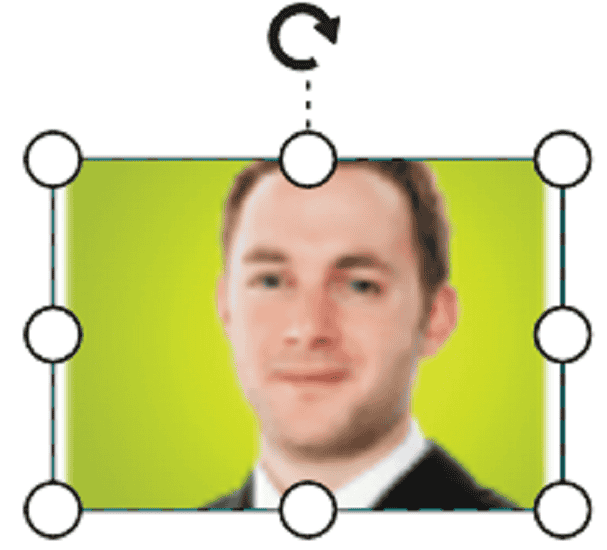

# Different Types of Shapes in React Diagram Component

The React Diagram component provides comprehensive support for adding various types of nodes to create rich, interactive diagrams. Shapes serve as the fundamental building blocks for representing data, processes, and visual elements in your diagrams.

This guide covers the following shape types and their implementation:

* **Text nodes** - Display formatted text content.
* **Image nodes** - Embed images from various sources.
* **HTML nodes** - Include custom HTML elements.
* **Native nodes** - Integrate SVG elements.
* **Basic shapes** - Use predefined geometric shapes.
* **Path shapes** - Create custom geometric paths.
* **Flow shapes** - Represent process workflows.

<!-- markdownlint-disable MD033 -->
<!-- markdownlint-disable MD010 -->

## Text Nodes

Text nodes enable you to add formatted text content directly to your diagram. They are ideal for labels, annotations, and textual information that enhances diagram readability.

To create a text node, set the shape property to [`text`](https://ej2.syncfusion.com/react/documentation/api/diagram/node#shape) and define the content object with your desired text and styling options.










 

## Image Nodes

Image nodes allow you to incorporate visual elements from various sources including URLs, local files, and Base64-encoded data. These nodes are perfect for adding logos, icons, or illustrative content to your diagrams.

To create an image node, set the shape property to [`image`](https://helpej2.syncfusion.com/react/documentation/api/diagram/node/#shape) and specify the image source through the source property.










 

### Base64 Encoded Images

For scenarios where you need to embed images directly without external dependencies, use Base64-encoded image data. This approach ensures your diagrams remain self-contained and portable.










 

N> When deploying applications with image nodes, ensure your HTML files are served from a web server. Local file access restrictions in Chrome and Firefox may prevent image export functionality due to security policies. For more information, refer to browser-specific documentation on local image handling.

Link 1: `http://asked.online/draw-images-on-canvas-locally-using-chrome/2546077/`

Link 2: `http://stackoverflow.com/questions/4761711/local-image-in-canvas-in-chrome`

### Image Alignment and Scaling

Control how images appear within node boundaries using alignment and scaling properties. These features ensure your images display correctly regardless of node dimensions. The [`scale`](https://helpej2.syncfusion.com/react/documentation/api/diagram/image/#scale) property of the node is set as **meet**. The [`align`](https://helpej2.syncfusion.com/react/documentation/api/diagram/imageAlignment/) property controls positioning.

The following code illustrates how to use scale and align properties to stretch the image.










 

The following table illustrates all the possible scale options for the image node.

| Values | Images |
|-------- | -------- |
| None |  |
| Meet | |
| Slice | |
| Stretch | |

N> To visualize the changes in image scaling, it is Essential&reg; to use the align property along with scale.

## HTML Nodes

HTML nodes provide the flexibility to embed rich HTML content directly into your diagrams. This powerful feature enables you to create highly customized visual elements with advanced formatting, styling, and interactivity.

Set the shape property to [`Html`](https://helpej2.syncfusion.com/react/documentation/api/diagram/node/#shape) to create HTML nodes. You can define content using either inline templates or external node templates.

N> HTML nodes cannot be exported to image formats (JPEG, PNG, BMP) due to canvas rendering limitations. This is by design, as converting arbitrary HTML content to canvas equivalents is not feasible for all HTML elements.

### HTML Node with Content Template

To render an HTML node with a content template, we need to define the desired template string within the [`content`](../api/diagram/htmlModel/#content) property. The following code illustrates how to create an HTML node with a content template:










 

#### Functional Content Template.

To render an HTML node using a functional template, we define a function that returns the template string. Within this function, modifications can be made based on the node's ID.

The following code illustrates how to render an HTML node using the function and manipulate its content dynamically.










 

### HTML Node With Node Template

To render html node with nodeTemplate we need to define the nodeTemplate in the html file and assign it to the [`nodeTemplate`](https://helpej2.syncfusion.com/react/documentation/api/diagram/#nodetemplate) property of the diagram. The following code illustrates how to render html node with nodeTemplate.










 

#### Functional NodeTemplate

We can define a function which returns a template string and assign it directly to the `nodeTemplate` property of diagram.

Refer the code example below.










 

## Native Nodes

Native nodes allow you to embed SVG elements directly into your diagrams, providing scalable vector graphics with precise control over visual appearance. This approach is ideal for custom icons, complex shapes, and high-quality graphics that scale well at any size.

To create a [`native`](https://helpej2.syncfusion.com/react/documentation/api/diagram/node/#shape) node, set the shape property to **native** and provide SVG content through the content property.










 

N> Similar to HTML nodes, native nodes cannot be exported to image formats due to canvas rendering limitations. Fill colors of native nodes can be overridden by inline SVG styles or fill attributes specified in the SVG template.

### SVG Content Alignment and Scaling

Stretch and align the svg content anywhere but within the node boundary.

Control how SVG content appears within node boundaries using the same scaling principles as image nodes. The [`scale`](https://helpej2.syncfusion.com/react/documentation/api/diagram/nativeModel/#scale) property determines how SVG content fits within the node bounds.

The following tables illustrates all the possible scale options for the node.

| Values | Images |
|-------- | -------- |
| None |  |
| Meet |  |
| Slice |  |
| Stretch | |

## Basic Shapes

Basic shapes provide a comprehensive set of predefined geometric forms commonly used in diagrams, flowcharts, and technical drawings. These shapes offer consistency and quick deployment for standard diagram elements.

To create [`Basic`](https://helpej2.syncfusion.com/react/documentation/api/diagram/node/#shape) shapes, set the type property to **basic** and choose from the available built-in shapes. For rounded rectangles, use the [`cornerRadius`](https://helpej2.syncfusion.com/react/documentation/api/diagram/basicShapeModel/#cornerradius) property to specify the radius.

The following code example illustrates how to create a basic shape.










 

N> By default, the `shape` property of the node is set as **basic**.

Default property for shape is Rectangle.

N> When the `shape` is not set for a basic shape, it is considered as a **rectangle**.

The list of basic shapes are as follows.

The basic shapes library includes rectangles, ellipses, triangles, polygons, stars, and many other geometric forms suitable for various diagramming needs.

## Path Shapes

Path shapes provide ultimate flexibility for creating custom geometric forms using SVG path data. This approach allows you to define any shape imaginable through precise path coordinates and commands.
To create a [`Path`](https://helpej2.syncfusion.com/react/documentation/api/diagram/node/#shape) node, set the shape property to **path** and define the geometry through the [`data`](https://helpej2.syncfusion.com/react/documentation/api/diagram/pathModel/#data) property using standard SVG path syntax.










 

## Flow Shapes

Flow shapes are specialized elements designed for process modeling, workflow diagrams, and business process documentation. These standardized shapes follow common flowchart conventions and enhance diagram readability.

To create [`flow`](https://helpej2.syncfusion.com/react/documentation/api/diagram/node/#shape) shapes, set the shape type to **flow** and specify the desired flow shape variant. The default flow shape is **process**.










 

The list of flow shapes are as follows.

