# Style in React Diagram Component

The React Diagram component provides extensive styling capabilities through CSS classes. This guide demonstrates how to customize various visual elements including connector handles, selection indicators, and interactive controls using CSS overrides.

## Customizing Connector Endpoint Handles

The connector endpoint handles are visual indicators that appear when hovering over or interacting with connector endpoints. These handles can be styled to match application themes or improve visibility.

### Default Endpoint Handle Styling

Use the following CSS to customize the connector endpoint handle appearance:

```scss

.e-diagram-endpoint-handle {
    fill: red;
    stroke: green;
    stroke-width: 3px;
   }

```
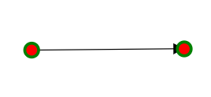

### Connected Endpoint Handle Styling

When a connector endpoint is connected to a node or another connector, apply different styling to indicate the connected state:

```scss
.e-diagram-endpoint-handle.e-connected {
    fill: red;
    stroke: green;
    stroke-width: 3px;
   }
```
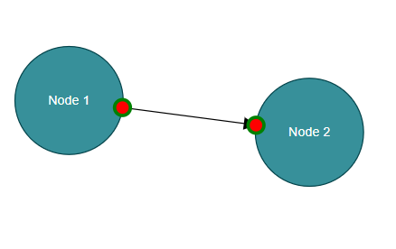

### Disabled Endpoint Handle Styling

For disabled connector endpoints, customize the appearance to clearly indicate the non-interactive state:

```scss

 .e-diagram-endpoint-handle.e-disabled {
      fill: lightgrey;
      opacity: 1;
      stroke: black;
    }

```
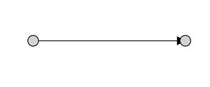

## Customizing Connector Segment Handles

Connector segment handles allow users to manipulate different types of connector paths. Each connector type has specific handle styling options.

### Bezier Segment Handles

The Bezier segment handles control the curvature of Bezier connectors:

```scss

  .e-diagram-bezier-segment-handle{
      stroke:yellow;
      stroke-width:2px;
      fill:green;
  }

```
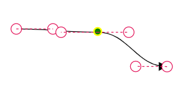

### Bezier Control Point Handles

Control points define the curve shape of Bezier connectors and can be styled independently:

```scss

   .e-diagram-bezier-control-handle {
      stroke:yellow;
        stroke-width:2px;
        fill:green;
    }

```
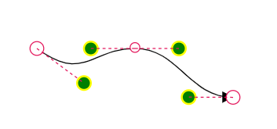

### Orthogonal Segment Handles

Orthogonal connectors use segment handles for adjusting right-angled path segments:

```scss

   .e-diagram-ortho-segment-handle {
        stroke:yellow;
          stroke-width:2px;
          fill:green;
      }

```
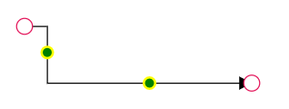

### Straight Segment Handles

Straight connectors provide handles for direct path manipulation:

```scss

    .e-diagram-straight-segment-handle {
      stroke:yellow;
        stroke-width:2px;
        fill:green;
    }

```
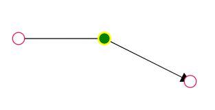

## Customizing Selection and Manipulation Handles

Selection handles and related controls provide visual feedback during object manipulation operations.

### Resize Handles

Resize handles appear on selected objects to enable size adjustments:

```scss

.e-diagram-resize-handle {
    fill: yellow;
    opacity: 1;
    stroke: orange;
  }
```

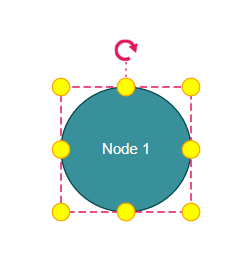

### Selection Indicator

The selector outline indicates which objects are currently selected:

```scss

.e-diagram-selector{
    stroke:yellow;
    stroke-width:2px;
  }
```

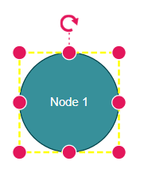

## Customizing the Selector Pivot Line

Use the following CSS to customize the line between the selector and rotate handle.

```scss

 .e-diagram-pivot-line {
    stroke: black;
    stroke-width:2px;
  }

```
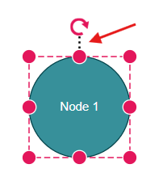

### Selection Border

Customize the border that surrounds selected objects:

```scss

.e-diagram-border {
    stroke: red;
  }

```

## Customizing the Rotate Handle

Use the following CSS to customize the rotate handle properties.

```scss

.e-diagram-rotate-handle {
    fill: yellow;
    stroke: orange;
  }

```

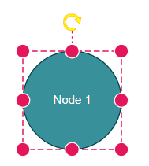

## Customizing Symbol Palette Interactions

The Symbol Palette provides drag-and-drop functionality with interactive states that can be styled.

### Hover state styling

Customize the appearance when hovering over symbols in the palette:

```scss

.e-symbolpalette .e-symbol-hover:hover {
    background: red;
  }

```
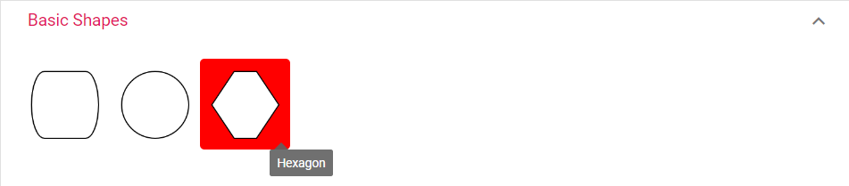

### Selection state styling

Style the selected symbol appearance in the palette:

```scss

.e-symbolpalette .e-symbol-selected {
    background: yellow;
  }

```

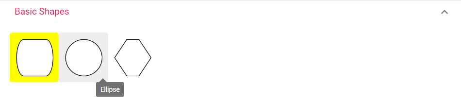

## Customizing Ruler Elements

The ruler provides measurement guidance and can be styled to match the application design.

### Ruler Background and Text

Customize the ruler's background color and font properties:

```scss

.e-diagram .e-ruler {
    background-color: blue;
    font-size: 13px;
  }

```
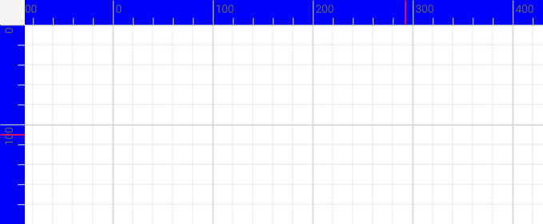

### Ruler Overlap Area

The overlap area where horizontal and vertical rulers intersect can be styled separately:

```scss

.e-diagram .e-ruler-overlap {
    background-color: red;
  }

```
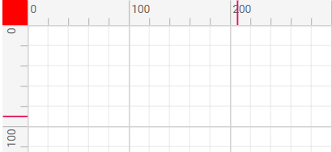

### Ruler Measurement Markers

Customize the color and thickness of measurement markers on the ruler:

```scss

.e-diagram .e-d-ruler-marker {
        stroke: yellow;
        stroke-width:3px;
      }

```
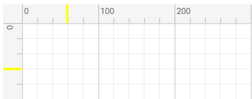

## Customizing Text Editing Interface

The text editing interface appears when editing text content within diagram objects.

### Text Edit Container

Style the text editing container that appears during text input:

```scss

 .e-diagram .e-diagram-text-edit {
     background: white;
      border-color: blue;
      border-style: dashed;
      border-width: 3px;
      box-sizing: content-box;
      color: black;
      min-width: 50px;
  }

```
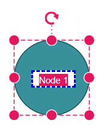 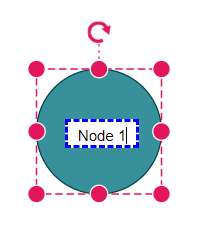 

### Text Selection Highlighting

Customize the appearance of selected text within the editing interface:

```scss
 .e-diagram-text-edit::selection {
    background: yellow;
    color: green;
  }

```
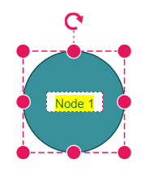 

## Customizing Page Break Indicators

Page break lines help visualize page boundaries when printing or exporting diagrams.

```scss
.e-diagram-page-break {
      stroke: red;
      stroke-width: 2px;
    }
```

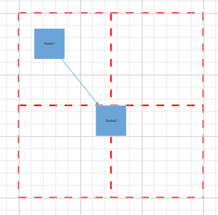 