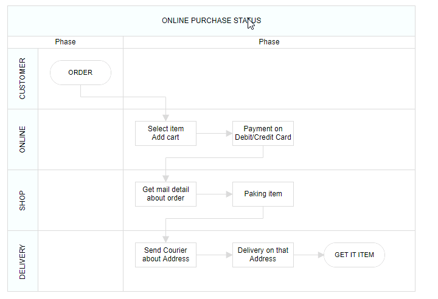

# Swim lane in React Diagram Component

Swimlanes are specialized diagram nodes that visualize business processes by organizing activities into distinct lanes or sections. Each lane typically represents a department, role, or responsibility area, making it easy to understand who is responsible for each step in a process. Swimlanes are particularly useful for workflow documentation, process mapping, and cross-functional process analysis.

## Create a Swimlane
To create a swimlane, set the node's shape type to [`swimlane`](https://ej2.syncfusion.com/react/documentation/api/diagram/swimLaneModel).Swimlanes are arranged horizontally by default and require proper configuration of headers and lanes to function correctly.

The following code example demonstrates how to define a basic swimlane object:










 
 
N> When setting a Swimlane's ID, ensure that it does not contain white spaces, does not start with numbers or special characters, and does not include special characters like underscores (_) or spaces.

## Orientation

Swimlanes support two orientation modes to accommodate different layout requirements and design preferences.

### Horizontal Orientation (default)
Lanes are arranged from top to bottom, with the header positioned on the left side. This orientation works well for processes that flow from left to right.

### Vertical Orientation
Lanes are arranged from left to right, with the header positioned at the top. This orientation suits processes that flow from top to bottom.










 

## Headers

The header serves as the primary identifying element of a swimlane, providing a title or description for the entire swimlane container. The [`header`](https://ej2.syncfusion.com/react/documentation/api/diagram/headerModel) property allows customization of both content and appearance.

>Note: By using this header, the swimlane interaction will be performed, like selection, dragging,etc.

The following code example illustrates how to define a swimlane header.










 

### Header Customization

Swimlane headers can be extensively customized to match design requirements and improve visual clarity. The dimensions can be controlled using [`width`](https://ej2.syncfusion.com/react/documentation/api/diagram/headerModel#width) and [`height`](https://ej2.syncfusion.com/react/documentation/api/diagram/headerModel#height) properties. Visual styling, including background color and text formatting, can be applied through the [`style`](https://ej2.syncfusion.com/react/documentation/api/diagram/headerModel#style) property. The swimlane's orientation can be controlled using the [`orientation`](https://ej2.syncfusion.com/react/documentation/api/diagram/swimLaneModel#header) property.

>Note: By default, the swimlane orientation is Horizontal.

The following code example illustrates how to customize the swimlane header.










 

### Dynamic Header Customization

Headers can be modified programmatically during runtime to respond to user interactions or changing business requirements. This capability enables dynamic updating of swimlane titles, styling, and other properties based on application state or user input.










 

### Header Editing

Diagram provides the support to edit swimlane headers at runtime. We achieve the header editing by double click event. Double clicking the header label will enables the editing of that. The following image illustrates how to edit the swimlane header.
.

## Limitations

* Connectors cannot be added directly to swimlane.