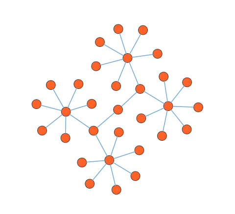

# Symmetric Layout in React Diagram Component

The symmetric layout is a force-directed algorithm that positions nodes by simulating physical forces between them. Nodes are repositioned iteratively by moving them closer together or pushing them further apart until the system reaches an equilibrium state, creating a balanced and visually appealing arrangement.

## Understanding Symmetric Layout

Symmetric layout works by applying spring-like forces between connected nodes and repulsion forces between all nodes. This creates a natural, organic layout where strongly connected components cluster together while maintaining proper spacing throughout the diagram.
The layout’s [`springLength`](https://ej2.syncfusion.com/react/documentation/api/diagram/layout/#springlength)property defines the ideal length that edges should maintain. This serves as the resting length for the springs connecting nodes. 

Edge attraction and vertex repulsion forces are controlled using the layout's [`springFactor`](https://ej2.syncfusion.com/react/documentation/api/diagram/layout/#springfactor)property. Higher values cause sibling nodes to repel each other more strongly, creating greater separation between unconnected elements.

The algorithm continues iterating until node positions stabilize and relative positions no longer change significantly between iterations. You can control the maximum number of iterations using the layout's [`maxIteration`](https://ej2.syncfusion.com/react/documentation/api/diagram/layout/#maxiteration).
## Implementation

The following code demonstrates how to arrange nodes using symmetric layout:











 
 

>Note: If you want to use symmetric layout in diagram, you need to inject SymmetricLayout in the diagram.

