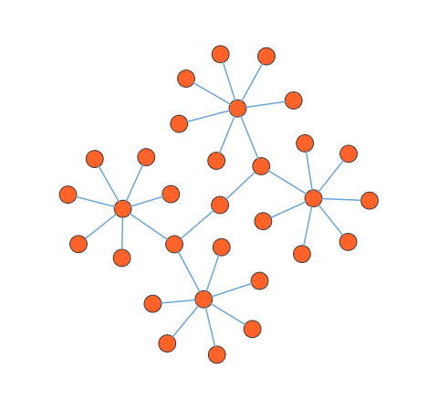

# Symmetric Layout in React Diagram

The symmetric layout is a force-directed algorithm that positions nodes by simulating physical forces between them. Nodes are repositioned iteratively by moving them closer together or pushing them further apart until the system reaches an equilibrium state, creating a balanced and visually appealing arrangement.

## Understanding Symmetric Layout

Symmetric layout works by applying spring-like forces between connected nodes and repulsion forces between all nodes. This creates a natural, organic layout where strongly connected components cluster together while maintaining proper spacing throughout the diagram.

The layout's [`springLength`](https://ej2.syncfusion.com/react/documentation/api/diagram/layout#springlength) property (of type `number`, default `50`) defines the ideal length that edges should maintain. This serves as the resting length for the springs connecting nodes. 

Edge attraction and vertex repulsion forces are controlled using the layout's [`springFactor`](https://ej2.syncfusion.com/react/documentation/api/diagram/layout#springfactor) property (of type `number`). Increasing this value strengthens the repulsion force between nodes, pushing them further apart; decreasing it strengthens the attraction force between connected nodes, pulling them closer together.

The algorithm continues iterating until node positions stabilize and relative positions no longer change significantly between iterations. You can control the maximum number of iterations using the layout's [`maxIteration`](https://ej2.syncfusion.com/react/documentation/api/diagram/layout#maxiteration) (of type `number`, default `40`).

The layout's [`margin`](https://ej2.syncfusion.com/react/documentation/api/diagram/layout#margin) property (of type `MarginModel`) specifies the spacing between the layout content and the diagram boundary, keeping the arranged nodes from being placed flush against the diagram edges.

## Implementation

N> To use the symmetric layout, inject the `SymmetricLayout` module into the diagram.

To arrange nodes using the symmetric layout, set the layout [`type`](https://ej2.syncfusion.com/react/documentation/api/diagram/layout#type) as **SymmetricalLayout**. The following code demonstrates how to arrange nodes using the symmetric layout:











 
 

