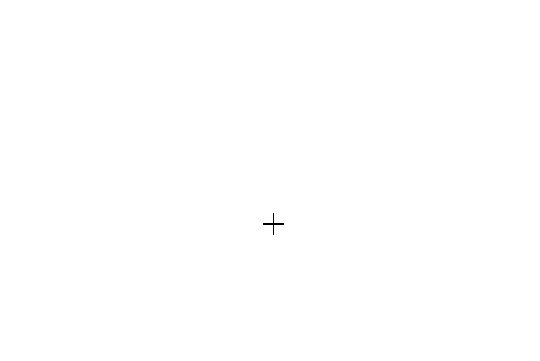
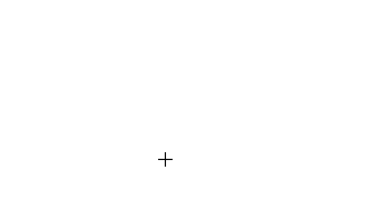

# Tools in React Diagram Component

The React Diagram component provides a comprehensive set of interactive tools that enable users to create, modify, and navigate diagrams efficiently. These tools facilitate real-time interaction with diagram elements through mouse and keyboard operations.

## Overview

The diagram control offers three primary tool categories:

- **Select**: Choose and manipulate specific elements within the diagram.
- **Pan**: Navigate the diagram view to different areas without modifying elements.
- **Draw**: Create new shapes, connectors, and freehand drawings on the diagram surface.

These tools are essential for building complex diagrams and provide the foundation for user interaction within the diagram environment.

## Drawing Tools

Drawing tools enable real-time creation of diagram elements by clicking and dragging on the diagram canvas. All drawing operations are configured through the [`drawingObject`](https://ej2.syncfusion.com/react/documentation/api/diagram/#drawingobject) property and activated using the [`tool`](https://ej2.syncfusion.com/react/documentation/api/diagram/#tool) property.

### Draw Nodes

To draw shapes during runtime, configure the JSON representation of the desired shape in the `drawingObject` property and set the tool to drawing mode. The following example demonstrates how to draw a rectangle shape:










 

Path shapes can be drawn using the same approach with custom path data. The following example shows how to draw a path shape:










 

### Text Nodes

Similarly, you can draw a text node by setting the type of shape as 'Text' in the `drawingObject` property. The [`text`](https://ej2.syncfusion.com/react/documentation/api/diagram/textModel/) node includes a content property that defines the displayed text. Users can add or modify the content after completing the drawing operation:










 

### Draw Connectors

Connectors are drawn by defining the connector configuration in the `drawingObject` property. The drawing tool supports various connector types including straight, orthogonal, and bezier connectors:










 

### Polygon Shapes

The diagram supports interactive polygon creation through point-and-click interaction. Users can define custom shapes with multiple sides by specifying vertices directly on the diagram canvas. To enable polygon drawing, set the `drawingObject` type as **Polygon**:










 

### Polyline Connectors

Polyline connectors enable creation of multi-segment connections with straight lines and angled vertices. Users can interactively add control points by clicking on the diagram canvas. To draw polyline connectors, set the `drawingObject` type as **Polyline**:

The following code illustrates how to draw a polyline connector.










 

 The segments of a polyline connector can be adjusted at runtime by dragging the segment thumb, as shown in the image below. To enable segment editing, you should set the [`DragSegmentThumb`](https://ej2.syncfusion.com/react/documentation/api/diagram/connectorConstraints/) constraint for the connector.

N> To make the segment thumb visible, inject the [`ConnectorEditing`](https://ej2.syncfusion.com/react/documentation/api/diagram/connectorEditing/) module into the diagram.

### Freehand Drawing

The diagram supports free-hand drawing, allowing users to draw anything independently on the diagram page. Free-hand drawing is enabled by setting the type of the `drawingObject` property to '`Freehand`'.

The following code illustrates how to perform freehand drawing:










 

The segments of a freehand connector can be adjusted at runtime by dragging the segment thumb, as shown in the image below. To enable segment editing, you should set the [`DragSegmentThumb`](https://ej2.syncfusion.com/react/documentation/api/diagram/connectorConstraints/) constraint for the connector.

## Tool Selection and Precedence

The diagram supports multiple tool configurations that can be combined for different interaction scenarios. When multiple tools are enabled simultaneously, the system follows a specific precedence order to determine which tool takes priority:

### Tool Precedence Hierarchy

The following table shows the precedence order from highest to lowest priority:

|Precedence|Tool|Description|
|----------|-----|-----------|
|1st|ContinuesDraw|Enables continuous drawing mode. Once activated, prevents all other interactions until deactivated.|
|2nd|DrawOnce|Allows drawing a single element. After completion, automatically enables SingleSelect and MultipleSelect tools.|
|3rd|ZoomPan|Enables diagram panning. When combined with SingleSelect, panning activates when cursor hovers over empty diagram areas.|
|4th|MultipleSelect|Enables selection of multiple elements. When combined with ZoomPan, selection takes priority over panning when hovering over elements.|
|5th|SingleSelect|Enables selection of individual elements.|
|6th|None|Disables all interactive tools.|

These tools provide flexibility and functionality for creating and interacting with elements within the diagram interface.

### Zoom Pan Tool

The pan tool enables users to navigate large diagrams by dragging the view area. To activate panning mode, set the  [`tool`](https://ej2.syncfusion.com/react/documentation/api/diagram/#tool) property to `ZoomPan`:










 

N> Please note that panning the diagram is not possible when 'multiplePage' is set to false if any diagram object (node or connector) is outside the defined page break area.

## Events

The [`elementDraw`](https://ej2.syncfusion.com/react/documentation/api/diagram/#elementdraw) event triggers whenever users create nodes or connectors using drawing tools. This event provides access to the newly created element and enables custom logic during the drawing process:










 