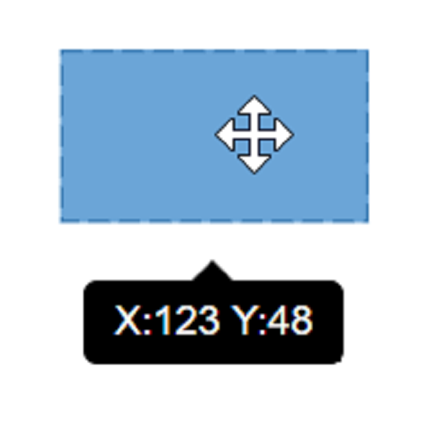
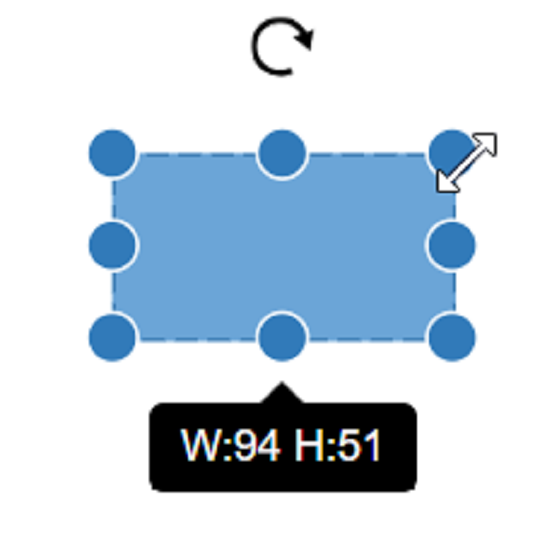
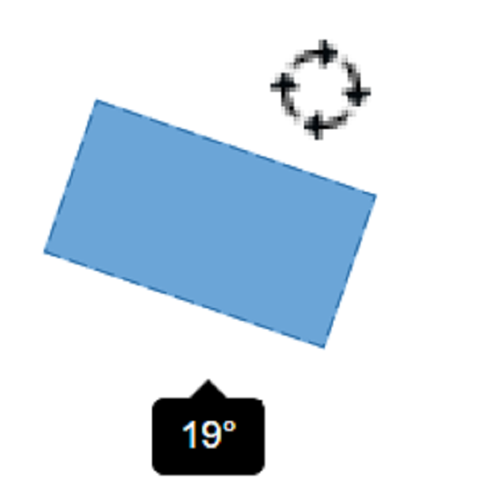
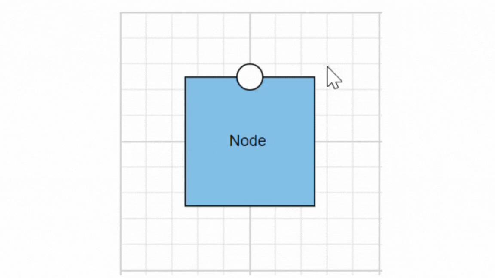

# Tooltip in EJ2 React Diagram Component

<!-- markdownlint-disable MD010 -->

In Graphical User Interface (GUI), a tooltip is a message that appears when the mouse hovers over an element. Tooltips enhance user experience by providing contextual information, guidance, and feedback without cluttering the interface. The diagram component provides comprehensive tooltip support while dragging, resizing, rotating nodes, and when the mouse hovers over any diagram element.

## Default Tooltip

By default, the diagram displays a tooltip showing size, position, and angle information while dragging, resizing, or rotating a node. This provides real-time feedback during interactive operations:

- **Drag**: Shows current X and Y coordinates of the node.
- **Resize**: Displays current width and height dimensions.
- **Rotate**: Indicates the current rotation angle in degrees.

The following images illustrate how the diagram displays node information during these interactions.

| Drag | Resize | Rotate |
|---|---|---|
|  |  |  |

### Disable Default Tooltip

The default tooltip that appears while interacting with nodes can be disabled by removing the tooltip constraints from the [`selectorConstraints`](https://helpej2.syncfusion.com/react/documentation/api/diagram/selectorConstraints/) of the [`selectedItems`](https://helpej2.syncfusion.com/react/documentation/api/diagram/selectorModel/) property of the diagram.










 

## Tooltip for a Specific Node/Connector

The tooltip can be customized for each node and connector. Remove the **InheritTooltip** option from the [`constraints`](https://ej2.syncfusion.com/react/documentation/api/diagram/#constraints) of that node/connector. The following code example illustrates how to customize the tooltip for individual elements.










 

## Inherit Diagram Tooltip

The diagram supports inheriting the diagram tooltip when the mouse hovers over any node or connector. To show a tooltip on mouse over, set the diagram's [`tooltip`](https://helpej2.syncfusion.com/react/documentation/api/diagram/#tooltip) property with the tooltip [`content`](https://helpej2.syncfusion.com/react/documentation/api/diagram/diagramTooltip/#content) and [`position`](https://helpej2.syncfusion.com/react/documentation/api/diagram/diagramTooltip/#position). Ensure that the nodes and connectors have their constraints set to **InheritTooltip**, as shown in the following example.










 

### Disable Tooltip at Runtime

The tooltip on mouse over can be disabled by assigning the diagram's `tooltip` property as **null**. The following code example illustrates how to disable the mouse over tooltip at runtime.

```ts

//Initializes the diagram component
  <DiagramComponent id="container" width={'650px'} height={'350px'} 
    //Defines nodes
    nodes={node} connectors={connector}
    //Disables mouse over tooltip at runtime
    tooltip = {null}
    />

```

## Tooltip for Ports

The tooltip feature has been implemented to support Ports, providing the ability to display information or descriptions when the mouse hovers over them.

To display tooltips on mouseover, set the desired tooltip [`content`](https://helpej2.syncfusion.com/react/documentation/api/diagram/diagramTooltip/#content) by utilizing the `tooltip` property.

Tooltips for Ports can be enabled or disabled using the [`PortConstraints`](https://helpej2.syncfusion.com/react/documentation/api/diagram/port/#constraints) Tooltip property.

```js
let ports: [{
        offset: {x: 1,y: 0.5},
        tooltip: {content: 'Port Tootip'},
        
        //enable Port Tooltip Constraints
        constraints: PortConstraints.Default | PortConstraints.ToolTip,
        
        //disable Port Tooltip Constraints
        constraints: PortConstraints.Default ~& PortConstraints.ToolTip
    }]
```

Dynamic modification of tooltip content is supported, allowing you to change the displayed tooltip content during runtime.

```js
{
    //change tooltip content at run time
    diagram.nodes[0].ports[0].tooltip.content = 'New Tooltip Content';
    diagram.databind;
}
```

Here, the code provided below demonstrates the port tooltip Interaction.










 

The following image illustrates how the diagram displays tooltips during an interaction with ports:



## Tooltip Template Content

The tooltip template content allows you to customize the tooltip by using HTML templates. This means you can define the structure and style of the tooltip using HTML, providing greater flexibility and control over its appearance. By leveraging HTML templates, you can include rich content such as formatted text, images, and other HTML elements within the tooltip, enhancing the user experience with more informative and visually appealing tooltips.

The following code example illustrates how to add formatted HTML content to the tooltip.










 

## Tooltip Alignments

### Tooltip Relative to Object

The diagram provides support to show tooltip around the node/connector that is hovered by the mouse. The tooltip can be aligned by using the [`position`](https://helpej2.syncfusion.com/react/documentation/api/diagram/diagramTooltip/#position) property.  The [`relativeMode`](https://helpej2.syncfusion.com/react/documentation/api/diagram/diagramTooltip/#relativemode) property of the tooltip defines whether the tooltip has to be displayed around the object or at the mouse position.

The following code example illustrates how to position the tooltip around object.










 

### Tooltip Relative to Mouse Position

To display the tooltip at the mouse position, set the **mouse** option in the `relativeMode` property of the tooltip.

The following code example illustrates how to show tooltip at mouse position.










 

## Tooltip Animation

To animate the tooltip, a set of specific animation effects are available, and it can be controlled by using the [`animation`](https://helpej2.syncfusion.com/react/documentation/api/diagram/diagramTooltip/#animation) property. The animation property also allows you to set delay, duration, and various other effects of your choice.

Refer the following sample where we used zoomIn animation for tooltip open and zoomOut animation for tooltip close with delay and duration. 










 

## Sticky Tooltip

A sticky tooltip will remain visible even after you move the mouse away from the node or connector. You can activate this feature by setting the [`isSticky`](https://helpej2.syncfusion.com/react/documentation/api/diagram/diagramTooltip/#issticky) property of the tooltip. 

The following example shows how to render sticky tooltip. 










 

## Hide Tooltip Pointer

The [`showTipPointer`](https://helpej2.syncfusion.com/react/documentation/api/diagram/diagramTooltip/#showtippointer) property allows to control the visibility of tooltip pointer. By default, the `showTipPointer` is set as **true**.










 

## Tooltip Size

By default, the size of the tooltip is calculated based on its content. If you want to customize the size, you can use the  [`width`](https://helpej2.syncfusion.com/react/documentation/api/diagram/diagramTooltip/#width) and [`height`](https://helpej2.syncfusion.com/react/documentation/api/diagram/diagramTooltip/#height) properties of the tooltip.

The following code example shows how to set the size for the tooltip:










 

## Show/Hide Tooltip at Runtime

You can show or hide the tooltip dynamically using a button click with the [`showTooltip`](https://helpej2.syncfusion.com/react/documentation/api/diagram/#showtooltip) and [`hideTooltip`](https://helpej2.syncfusion.com/react/documentation/api/diagram/#hidetooltip) methods of the diagram. This allows you to control the tooltip visibility programmatically rather than relying on user hover actions. In some cases, you may want to display the tooltip without requiring the user to hover over the object.

The following example demonstrates how to show or hide the tooltip at runtime:










 

## Tooltip for Annotation

Tooltips can be added to annotations to display additional information on mouseover. 
To display tooltips on mouseover, set the desired tooltip text to the `tooltip` property of the annotation.
Tooltips for Annotations can be enabled or disabled by setting the [`AnnotationConstraints`](https://helpej2.syncfusion.com/react/documentation/api/diagram/annotationConstraints/) property as `Tooltip`. 










 
