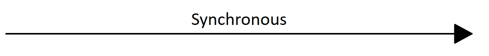
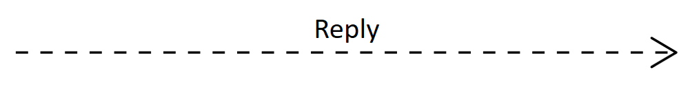
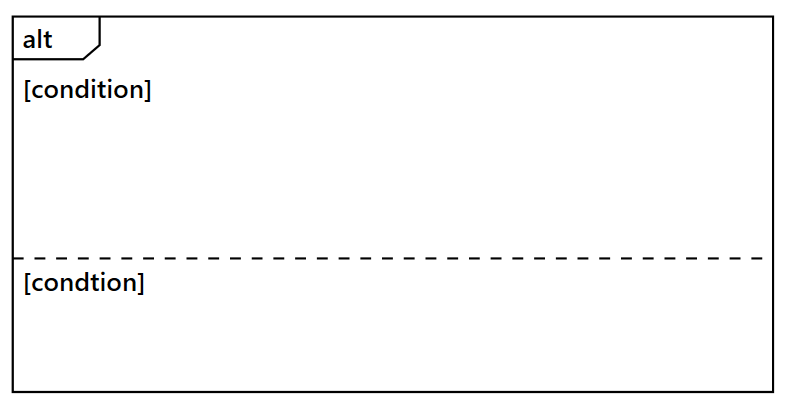

# UML Sequence Diagram in React Diagram Component
A UML sequence diagram is a type of interaction diagram that visualizes how objects communicate with each other over time. These diagrams show the sequence of messages exchanged between participants, making them essential for understanding system interactions, API workflows, and process flows.

The Syncfusion® React Diagram component provides comprehensive support for creating and visualizing UML sequence diagrams through the [`UmlSequenceDiagramModel`](https://ej2.syncfusion.com/react/documentation/api/diagram/UmlSequenceDiagramModel/). This specialized model enables the creation of sequence diagrams with proper UML notation and automated layout capabilities.

## UML Sequence Diagram Elements

A sequence diagram comprises several essential elements that work together to represent system interactions. The following sections demonstrate how to define and configure these components.

### Participants

[`UmlSequenceParticipantModel`](https://ej2.syncfusion.com/react/documentation/api/diagram/UmlSequenceParticipantModel/) represents the entities that participate in the interaction sequence. Participants appear as rectangular boxes at the top of the diagram, with lifelines extending vertically downward to show their existence throughout the interaction timeline.

#### Participant Types

Participants can be displayed in two forms:
- **Actors**: Human users or external systems (displayed with stick figure notation).
- **Objects**: System components, classes, or services (displayed as rectangular boxes).

#### UmlSequenceParticipantModel Properties

| Property | Type | Description |
|---|---|---|
| id | string \| number | A unique identifier for the participant. |
| content | string | The display text for the participant.. |
| isActor | boolean | Specifies whether the participant is displayed as an actor (true) or an object (false). |
| showDestructionMarker | boolean | Indicates whether a destruction marker (X) is shown at the end of the lifeline. |
| activationBoxes | UmlSequenceActivationBoxModel[] | A collection of activation boxes associated with the participant .|

#### Creating Participants

The following code example demonstrates how to create different types of participants:










 

### Messages

[`UmlSequenceMessageModel`](https://ej2.syncfusion.com/react/documentation/api/diagram/UmlSequenceMessageModel/) represents communication between participants . Messages are displayed as arrows connecting lifelines and indicate the flow of information or requests between system components.

#### Message Types and Usage

Different message types serve specific purposes in sequence diagrams:

| Message Type | Description | Example |
|---|---|---|
| Synchronous | The sender waits for a response |  |
| Asynchronous | The sender continues without waiting |  |
| Reply | A response to a previous message |  |
| Create | Creates a new participant |  |
| Delete | Terminates a participant |  |
| Self | A message from a participant to itself |  |

#### UmlSequenceMessageModel Properties

| Property | Type | Description |
|---|---|---|
| id | string \| number | A unique identifier for the message. |
| content | string | The display text for the message. |
| fromParticipantID | string \| number | ID of the participant sending the message.. |
| toParticipantID | string \| number | ID of the participant receiving the message |
| type | UmlSequenceMessageType | Type of the message (Synchronous, Asynchronous, Reply, Create, Delete, Self). |

#### Creating Messages

The following example shows how to create different types of messages between participants:










 
 
### Activation Boxes

[`UmlSequenceActivationBoxModel`](https://ej2.syncfusion.com/react/documentation/api/diagram/UmlSequenceActivationBoxModel/) represents periods when a participant is actively processing or executing operations. Activation boxes appear as thin rectangles overlaid on participant lifelines, indicating the duration of active processing between specific messages.

#### UmlSequenceActivationBoxModel Properties

| Property | Type | Description |
|---|---|---|
| id | string \| number | A unique identifier for the activation box. |
| startMessageID | string \| number | ID of the message that initiates the activation.. |
| endMessageID | string \| number | ID of the message that terminates the activation. |

#### Creating Activation Boxes

The following example demonstrates how to create activation boxes that span specific message sequences:










 

### Fragments

[`UmlSequenceFragmentModel`](https://ej2.syncfusion.com/react/documentation/api/diagram/UmlSequenceFragmentModel/) represents logical groupings of messages based on specific conditions or control structures. Fragments appear as rectangular enclosures that visually organize conditional logic, loops, and alternative execution paths within sequence diagrams.

#### Fragment Applications

Fragments are essential for modeling:
- Conditional logic (if-then-else statements).
- Iterative processes (loops and repetitions).
- Optional operations that may or may not execute.
- Error handling and exception flows.
- Parallel processing scenarios.

#### Fragment Types

The [`UmlSequenceFragmentType`](https://ej2.syncfusion.com/react/documentation/api/diagram/UmlSequenceFragmentType/) enum defines the following fragment types:

| Fragment Type  | Description  | Example  |  
|---------------|-------------|--------|  
| Optional  | Represents a sequence that is executed only if a specified condition is met; otherwise, it is skipped. |  |  
| Alternative | Represents multiple conditional paths (if-else structure), where only one path executes based on the condition. |  |  
| Loop | Represents a repeating sequence of interactions that continues based on a loop condition. |  |  

#### UmlSequenceFragmentModel Properties

| Property | Type | Description |
|---|---|---|
| id | string \| number | A unique identifier for the fragment. |
| type | UmlSequenceFragmentType | Type of the fragment (Optional, Loop, Alternative). |
| conditions | UmlSequenceFragmentConditionModel[] | Collection of conditions for the fragment. |

#### UmlSequenceFragmentConditionModel Properties

| Property | Type | Description |
|---|---|---|
| content | string | Text describing the condition or parameter. |
| messageIds | (string \| number)[] | Collection of message IDs included in this condition section. |
| fragmentIds | string[] | Collection of nested fragments ids (for complex structures). |

#### Creating Fragments

The following example illustrates how to create fragments with different condition types:










 

## Customization Options

### Adjusting Participant Spacing

The [`spaceBetweenParticipants`](https://ej2.syncfusion.com/react/documentation/api/diagram/UmlSequenceDiagramModel/#spaceBetweenParticipants) property controls the horizontal spacing between participants in the sequence diagram. Adjust this value to accommodate longer message labels or improve diagram readability.

```javascript
// Define the UML Sequence Diagram model
const model = {
  // Define the space between participants
  spaceBetweenParticipants: 300,
  participants: participants,    // collection of participants in the sequence diagram  
  messages: messages,            // collection of messages exchanged between participants  
  fragments: fragments           // collection of sequence diagram fragments (opt, alt, loop) 
}
```