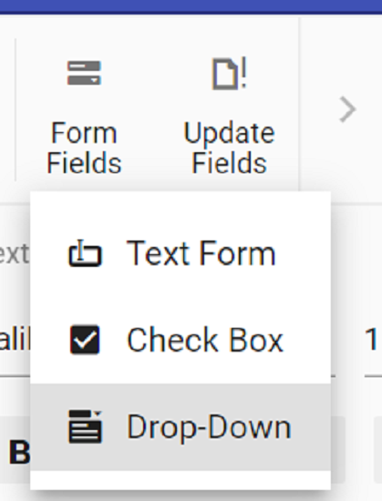

# Form fields in React Document editor component

Document Editor Container component provide support for inserting Text, CheckBox, DropDown form fields through in-built toolbar.



## Insert form field

Form fields can be inserted using [`insertFormField`](https://ej2.syncfusion.com/react/documentation/api/document-editor/editor/#insertformfield) method in editor module.

```ts
//Insert Text form field
documentEditor.editor.insertFormField('Text');
//Insert Checkbox form field
documentEditor.editor.insertFormField('CheckBox');
//Insert Drop down form field
documentEditor.editor.insertFormField('Dropdown');
```

## Get form field names

All the form fields names form current document can be retrieved using [`getFormFieldNames()`](../api/document-editor/#getformfieldnames).

```ts
let formFieldsNames: string[] = documentEditor.getFormFieldNames();
```

## Get form field properties

Form field properties can be retrieved using [`getFormFieldInfo()`](../api/document-editor/#getformfieldinfo).

```ts
//Text form field
let textfieldInfo: TextFormFieldInfo = documentEditor.getFormFieldInfo('Text1') as TextFormFieldInfo;
//Checkbox form field
let checkboxfieldInfo: CheckBoxFormFieldInfo = documentEditor.getFormFieldInfo('Check1') as CheckBoxFormFieldInfo;
//Dropdown form field
let dropdownfieldInfo: DropDownFormFieldInfo = documentEditor.getFormFieldInfo('Drop1') as DropDownFormFieldInfo;
```

## Set form field properties

Form field properties can be modified using [`setFormFieldInfo`](https://ej2.syncfusion.com/react/documentation/api/document-editor/#setformfieldinfo).

```ts
// Set text form field properties
let textfieldInfo: TextFormFieldInfo = documentEditor.getFormFieldInfo('Text1') as TextFormFieldInfo;
textfieldInfo.defaultValue = "Hello";
textfieldInfo.format = "Uppercase";
textfieldInfo.type = "Text";
documentEditor.setFormFieldInfo('Text1',textfieldInfo);

// Set checkbox form field properties
let checkboxfieldInfo: CheckBoxFormFieldInfo = documentEditor.getFormFieldInfo('Check1') as CheckBoxFormFieldInfo;
checkboxfieldInfo.defaultValue = true;
documentEditor.setFormFieldInfo('Check1',checkboxfieldInfo);

// Set checkbox form field properties
let dropdownfieldInfo: DropDownFormFieldInfo = documentEditor.getFormFieldInfo('Drop1') as DropDownFormFieldInfo;
dropdownfieldInfo.dropDownItems = ['One','Two', 'Three']
documentEditor.setFormFieldInfo('Drop1',dropdownfieldInfo);
```

## Export form field data

Data of the all the Form fields in the document can be exported using [`exportFormData`](https://ej2.syncfusion.com/react/documentation/api/document-editor/#exportformdata).

```ts
let formFieldDate: FormFieldData[] = documentEditor.exportFormData();
```

## Import form field data

Form fields can be prefilled with data using [`importFormData`](https://ej2.syncfusion.com/react/documentation/api/document-editor/#importformdata).

```ts
let textformField: FormFieldData = {fieldName: 'Text1', value: 'Hello World'};
let checkformField: FormFieldData = {fieldName: 'Check1', value: true};
let dropdownformField: FormFieldData = {fieldName: 'Drop1', value: 1};
//Import form field data
documentEditor.importFormData([textformField,checkformField,dropdownformField]);
```

## Reset form fields

Reset all the form fields in current document to default value using [`resetFormFields`](https://ej2.syncfusion.com/react/documentation/api/document-editor/#resetformfields).

```ts
documentEditor.resetFormFields();
```

## Protect the document in form filling mode

Document Editor provides support for protecting the document with `FormFieldsOnly` protection. In this protection, user can only fill form fields in the document.

Document editor provides an option to protect and unprotect document using [`enforceProtection`](https://ej2.syncfusion.com/react/documentation/api/document-editor/editor/#enforceprotection) and [`stopProtection`](https://ej2.syncfusion.com/react/documentation/api/document-editor/editor/#stopprotection) API.

The following example code illustrates how to enforce and stop protection in Document editor container.

```ts
import * as ReactDOM from 'react-dom';
import * as React from 'react';
import {
  DocumentEditorContainerComponent,
  Toolbar
} from '@syncfusion/ej2-react-documenteditor';

DocumentEditorContainerComponent.Inject(Toolbar);
function App() {
  let container: DocumentEditorContainerComponent;
  React.useEffect(() => {
    EnforceProtection();
    StopProtection();
}, []);
function EnforceProtection(){
  //enforce protection
  container.documentEditor.editor.enforceProtection('123','CommentsOnly');
}
function StopProtection(){
  //stop the document protection
  container.documentEditor.editor.stopProtection('123');
}
    return (
      <div>
      <button onClick={EnforceProtection}>enforceProtection</button>
      <button onClick={StopProtection}>stopProtection</button>
      <DocumentEditorContainerComponent
        id="container"
        ref={(scope) => {
          container = scope;
        }}
        height={'590px'}
        serviceUrl="https://ej2services.syncfusion.com/production/web-services/api/documenteditor/"
        enableToolbar={true}
      />
      </div>

    );
  
}
export default App;
ReactDOM.render(<App />, document.getElementById('root'));

```

>Note: In enforce Protection method, first parameter denotes password and second parameter denotes protection type. Possible values of protection type are `NoProtection |ReadOnly |FormFieldsOnly |CommentsOnly`. In stop protection method, parameter denotes the password.