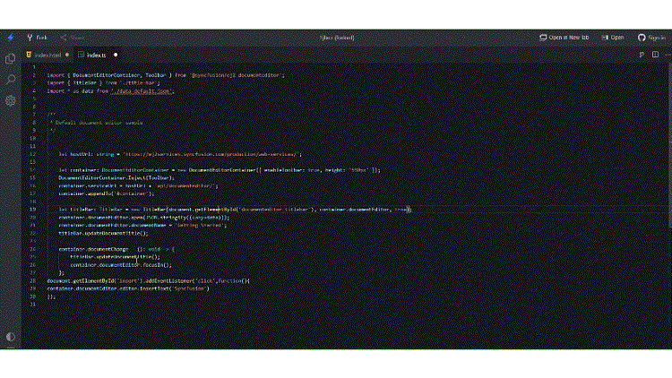

# Insert text in current position in React Document editor component

You can insert the text, paragraph and rich-text content in React Document Editor component.

## Insert text in current cursor position

You can use [`insertText`](https://ej2.syncfusion.com/react/documentation/api/document-editor/editor/#inserttext) API in editor module to insert the text in current cursor position.

The following example code illustrates how to add the text in current selection.

```ts
import * as ReactDOM from 'react-dom/client';
import * as React from 'react';
import {
  DocumentEditorContainerComponent,
  Toolbar,
} from '@syncfusion/ej2-react-documenteditor';

DocumentEditorContainerComponent.Inject(Toolbar);
export class Default extends React.Component {
  inserText() {
    // It will insert the provided text in current selection
    this.container.documentEditor.editor.insertText('Syncfusion');
  }
  render() {
    return (
      <div>
        <button id="insert" onClick={this.inserText.bind(this)}>
          Insert Text
        </button>
        <DocumentEditorContainerComponent
          id="container"
          ref={(scope) => {
            this.container = scope;
          }}
          height={'590px'}
          serviceUrl="https://services.syncfusion.com/react/production/api/documenteditor/"
          enableToolbar={true}
        />
      </div>
    );
  }
}
const root = ReactDOM.createRoot(document.getElementById('sample'));
root.render(<Default />);
```

> The Web API hosted link `https://services.syncfusion.com/react/production/api/documenteditor/` utilized in the Document Editor's serviceUrl property is intended solely for demonstration and evaluation purposes. For production deployment, please host your own web service with your required server configurations. You can refer and reuse the [GitHub Web Service example](https://github.com/SyncfusionExamples/EJ2-DocumentEditor-WebServices) or [Docker image](https://hub.docker.com/r/syncfusion/word-processor-server) for hosting your own web service and use for the serviceUrl property.

Please check below gif which illustrates how to insert text in current cursor position on button click:



## Insert paragraph in current cursor position

To insert new paragraph at current selection, you can can use [`insertText`](https://ej2.syncfusion.com/react/documentation/api/document-editor/editor/#inserttext) API with parameter as `\r\n` or `\n`.

The following example code illustrates how to add the new paragraph in current selection.

```ts
// It will add the new paragraph in current selection
this.container.documentEditor.editor.insertText('\n');
```

## Insert the rich-text content

To insert the HTML content, you have to convert the HTML content to SFDT Format using [`web service`](../../document-editor/web-services-overview). Then use [`paste`](https://ej2.syncfusion.com/react/documentation/api/document-editor/editor/#paste) API to insert the sfdt at current cursor position.

>Note: Html string should be welformatted html. [`DocIO`](https://help.syncfusion.com/file-formats/docio/html) support only welformatted XHTML.  

The following example illustrates how to insert the HTML content at current cursor position.

* Send the HTML content to server side for SFDT conversion. Refer to the following example to send the HTML content to server side and inserting it in current cursor position.

```ts
import * as ReactDOM from 'react-dom/client';
import * as React from 'react';
import {
  DocumentEditorContainerComponent,
  Toolbar,
} from '@syncfusion/ej2-react-documenteditor';

DocumentEditorContainerComponent.Inject(Toolbar);
function App() {
  let container;

  function inserText() {
    let htmltags =
      "<?xml version='1.0' encoding='utf - 8'?><!DOCTYPE html PUBLIC '-//W3C//DTD XHTML 1.0 Strict//EN''http://www.w3.org/TR/xhtml1/DTD/xhtml1-strict.dtd'><html xmlns ='http://www.w3.org/1999/xhtml' xml:lang='en' lang ='en'><body><h1>The img element</h1></body></html>";
    let http = new XMLHttpRequest();
    http.open('POST', 'http://localhost:62869/api/documenteditor/LoadString');
    http.setRequestHeader('Content-Type', 'application/json;charset=UTF-8');
    http.responseType = 'json';
    http.onreadystatechange = function () {
      if (http.readyState === 4) {
        if (http.status === 200 || http.status === 304) {
          // Insert the sfdt content in cursor position using paste API
          container.documentEditor.editor.paste(http.response);
        } else {
          alert('failed;');
        }
      }
    };

    let htmlContent = { content: htmltags };
    http.send(JSON.stringify(htmlContent));
  }

  return (
    <div>
      <button id="export" onClick={inserText.bind(this)}>
        Export HTML
      </button>
      <DocumentEditorContainerComponent
        id="container"
        ref={(scope) => {
          container = scope;
        }}
        height={'590px'}
        serviceUrl="http://localhost:62869/api/documenteditor/"
        enableToolbar={true}
      />
    </div>
  );
}
export default App;
const root = ReactDOM.createRoot(document.getElementById('sample'));
root.render(<App />);
```

> The Web API hosted link `https://services.syncfusion.com/react/production/api/documenteditor/` utilized in the Document Editor's serviceUrl property is intended solely for demonstration and evaluation purposes. For production deployment, please host your own web service with your required server configurations. You can refer and reuse the [GitHub Web Service example](https://github.com/SyncfusionExamples/EJ2-DocumentEditor-WebServices) or [Docker image](https://hub.docker.com/r/syncfusion/word-processor-server) for hosting your own web service and use for the serviceUrl property.

* Please refer the following code example for server-side web implementation for HTML conversion using DocumentEditor.

```c#
//API controller for the conversion.
[HttpPost]
public string LoadString([FromBody]InputParameter data)
{
    // You can also load HTML file/string from server side.
    Syncfusion.EJ2.DocumentEditor.WordDocument document = Syncfusion.EJ2.DocumentEditor.WordDocument.LoadString(data.content, FormatType.Html); // Convert the HTML to SFDT format.
    string json = Newtonsoft.Json.JsonConvert.SerializeObject(document);
    document.Dispose();
    return json;
}

public class InputParameter
{
    public string content {get; set; }
}
```

>Note: The above example illustrates inserting HTML content. Similarly, you can insert any rich-text content by converting any of the supported file formats (DOCX, DOC, WordML, HTML, RTF) to SFDT.