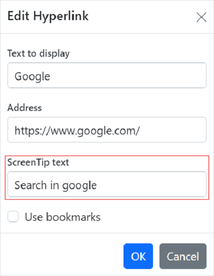

# Link in React Document editor component

Document Editor supports hyperlink field. You can link a part of the document content to Internet or file location, mail address, or any text within the document.

## Navigate a hyperlink

Document Editor triggers ‘requestNavigate’ event whenever user clicks Ctrl key or tap a hyperlink within the document. This event provides necessary details about link type, navigation URL, and local URL (if any) as arguments, and allows you to easily customize the hyperlink navigation functionality.

### Add the requestNavigate event for DocumentEditor

The following example illustrates how to add requestNavigate event for DocumentEditor.












        


### Add the requestNavigate event for DocumentEditorContainer component

The following example illustrates how to add requestNavigate event for DocumentEditorContainer component.

```ts
import * as ReactDOM from 'react-dom';
import * as React from 'react';
import {
  DocumentEditorContainerComponent,
  Toolbar,
  RequestNavigateEventArgs
} from '@syncfusion/ej2-react-documenteditor';

DocumentEditorContainerComponent.Inject(Toolbar);
export class Default extends React.Component {
  onCreated() {
    // Add event listener for requestNavigate event to customize hyperlink navigation functionality
    this.container.documentEditor.requestNavigate = (args: RequestNavigateEventArgs) => {
        if (args.linkType !== 'Bookmark') {
            let link: string = args.navigationLink;
            if (args.localReference.length > 0) {
            link += '#' + args.localReference;
            }
            //Navigate to the selected URL.
            window.open(link);
            args.isHandled = true;
        }
    };
  }
  render() {
    return (
      <DocumentEditorContainerComponent
        id="container"
        ref={(scope) => {
          this.container = scope;
        }}
        height={'590px'}
        serviceUrl="https://ej2services.syncfusion.com/production/web-services/api/documenteditor/"
        enableToolbar={true}
        created={this.onCreated.bind(this)}
      />
    );
  }
}
ReactDOM.render(<Default />, document.getElementById('sample'));
```

If the selection is in hyperlink, trigger this event by calling ‘navigateHyperlink’ method of ‘Selection’ instance. Refer to the following example.

```ts
documenteditor.selection.navigateHyperlink();
```

## Copy link

Document Editor copies link text of a hyperlink field to the clipboard if the selection is in hyperlink. Refer to the following example.

```ts
documenteditor.selection.copyHyperlink();
```

## Add hyperlink

To create a basic hyperlink in the document, press `ENTER` / `SPACEBAR` / `SHIFT + ENTER` / `TAB` key after typing the address, for instance [`http://www.google.com`](http://www.google.com). Document Editor automatically converts this address to a hyperlink field. The text can be considered as a valid URL if it starts with any of the following.

> `<http://>`<br>
> `<https://>`<br>
> `file:///`<br>
> `www.`<br>
> `mailto:`<br>

Refer to the following example.












        


## Customize screen tip

You can customize the screen tip text for the hyperlink by using below sample code.

```ts
documenteditor.insertHyperlink('https://www.google.com', 'Google', '<<Screen tip text>>');
```

Screen tip text can be modified through UI by using the [Hyperlink dialog](../document-editor/dialog#hyperlink-dialog)



## Remove hyperlink

To remove link from hyperlink in the document, press Backspace key at the end of a hyperlink. By removing the link, it will be converted as plain text. You can use ‘removeHyperlink’ method of ‘Editor’ instance if the selection is in hyperlink. Refer to the following example.

```ts
documenteditor.editor.removeHyperlink();
```

## Hyperlink dialog

Document Editor provides dialog support to insert or edit a hyperlink. Refer to the following example.












        


You can use the following keyboard shortcut to open the hyperlink dialog if the selection is in hyperlink.

| Key Combination | Description |
|-----------------|-------------|
|Ctrl + K | Open hyperlink dialog that allows you to create or edit hyperlink|

## See Also

* [Feature modules](../document-editor/feature-module)
* [Hyperlink dialog](../document-editor/dialog#hyperlink-dialog)
