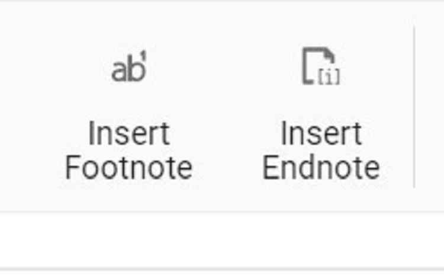

# Notes in React Document editor component

DocumentEditorContainer component provides support for inserting footnotes and endnotes through the in-built toolbar. Refer to the following screenshot.



The Footnotes and endnotes are both ways of adding extra bits of information to your writing outside of the main text. You can use footnotes and endnotes to add side comments to your work or to place other publications like books, articles, or websites.

## Insert footnotes

Document Editor exposes an API to insert footnotes at cursor position programmatically or can be inserted to the end of selected text.

```ts
import * as ReactDOM from 'react-dom';
import * as React from 'react';

import {
    DocumentEditorComponent, Print, SfdtExport, WordExport, TextExport, Selection, Search, Editor, ImageResizer, EditorHistory,
    ContextMenu, OptionsPane, HyperlinkDialog, TableDialog, BookmarkDialog, TableOfContentsDialog,
    PageSetupDialog, StyleDialog, ListDialog, ParagraphDialog, BulletsAndNumberingDialog, FontDialog,
    TablePropertiesDialog, BordersAndShadingDialog, TableOptionsDialog, CellOptionsDialog, StylesDialog
} from '@syncfusion/ej2-react-documenteditor';

//Inject require module.
DocumentEditorComponent.Inject(Print, SfdtExport, WordExport, TextExport, Selection, Search, Editor, ImageResizer, EditorHistory, ContextMenu, OptionsPane, HyperlinkDialog, TableDialog, BookmarkDialog, TableOfContentsDialog, PageSetupDialog, StyleDialog, ListDialog, ParagraphDialog, BulletsAndNumberingDialog, FontDialog, TablePropertiesDialog, BordersAndShadingDialog, TableOptionsDialog, CellOptionsDialog, StylesDialog);
function App() {
    let documenteditor: DocumentEditorComponent=new DocumentEditorComponent(undefined);
return (
            <div>
                <button onClick={Footnote}>insert Footnote</button>
                <DocumentEditorComponent  id="container" height={'330px'} ref={(scope) => { documenteditor = scope; }} serviceUrl="https://services.syncfusion.com/react/production/api/documenteditor/" isReadOnly={false} enablePrint={true}
                    enableSelection={true} enableEditor={true} enableEditorHistory={true}
                    enableContextMenu={true} enableSearch={true} enableOptionsPane={true}
                    enableBookmarkDialog={true} enableBordersAndShadingDialog={true} enableFontDialog={true} enableTableDialog={true} enableParagraphDialog={true} enableHyperlinkDialog={true} enableImageResizer={true} enableListDialog={true}
                    enablePageSetupDialog={true} enableSfdtExport={true}
                    enableStyleDialog={true} enableTableOfContentsDialog={true}
                    enableTableOptionsDialog={true} enableTablePropertiesDialog={true}
                    enableTextExport={true} enableWordExport={true}/>
            </div>
        );
        function Footnote(){
          //Insert footnote.
          documenteditor.editor.insertFootnote();
      }

}
export default App();
ReactDOM.render(<App />, document.getElementById('sample'));

```

> The Web API hosted link `https://services.syncfusion.com/react/production/api/documenteditor/` utilized in the Document Editor's serviceUrl property is intended solely for demonstration and evaluation purposes. For production deployment, please host your own web service with your required server configurations. You can refer and reuse the [GitHub Web Service example](https://github.com/SyncfusionExamples/EJ2-DocumentEditor-WebServices) or [Docker image](https://hub.docker.com/r/syncfusion/word-processor-server) for hosting your own web service and use for the serviceUrl property.

## Insert endnotes

Document Editor exposes an API to insert endnotes at cursor position programmatically or can be inserted to the end of selected text.

```ts
import * as ReactDOM from 'react-dom';
import * as React from 'react';

import {
    DocumentEditorComponent, Print, SfdtExport, WordExport, TextExport, Selection, Search, Editor, ImageResizer, EditorHistory,
    ContextMenu, OptionsPane, HyperlinkDialog, TableDialog, BookmarkDialog, TableOfContentsDialog,
    PageSetupDialog, StyleDialog, ListDialog, ParagraphDialog, BulletsAndNumberingDialog, FontDialog,
    TablePropertiesDialog, BordersAndShadingDialog, TableOptionsDialog, CellOptionsDialog, StylesDialog
} from '@syncfusion/ej2-react-documenteditor';

//Inject require modules.
DocumentEditorComponent.Inject(Print, SfdtExport, WordExport, TextExport, Selection, Search, Editor, ImageResizer, EditorHistory, ContextMenu, OptionsPane, HyperlinkDialog, TableDialog, BookmarkDialog, TableOfContentsDialog, PageSetupDialog, StyleDialog, ListDialog, ParagraphDialog, BulletsAndNumberingDialog, FontDialog, TablePropertiesDialog, BordersAndShadingDialog, TableOptionsDialog, CellOptionsDialog, StylesDialog);

    let documenteditor: DocumentEditorComponent= new DocumentEditorComponent(undefined);
    function App (){
      return (
        <div>
            <button onClick={InsertEndnote}>insert Endnote</button>
            <DocumentEditorComponent id="container" height={'330px'}  ref={(scope) => { documenteditor = scope; }}  serviceUrl="https://services.syncfusion.com/react/production/api/documenteditor/" isReadOnly={false} enablePrint={true}
            enableSelection={true} enableEditor={true} enableEditorHistory={true}
            enableContextMenu={true} enableSearch={true} enableOptionsPane={true}
            enableBookmarkDialog={true} enableBordersAndShadingDialog={true} enableFontDialog={true} enableTableDialog={true} enableParagraphDialog={true} enableHyperlinkDialog={true} enableImageResizer={true} enableListDialog={true}
            enablePageSetupDialog={true} enableSfdtExport={true}
            enableStyleDialog={true} enableTableOfContentsDialog={true}
            enableTableOptionsDialog={true} enableTablePropertiesDialog={true}
            enableTextExport={true} enableWordExport={true} />
        </div>

      );
      function InsertEndnote() {
        //Insert end note.
        documenteditor.editor.insertEndnote();
      }
    }
export default App;
ReactDOM.render(<App />, document.getElementById('sample'));

```

> The Web API hosted link `https://services.syncfusion.com/react/production/api/documenteditor/` utilized in the Document Editor's serviceUrl property is intended solely for demonstration and evaluation purposes. For production deployment, please host your own web service with your required server configurations. You can refer and reuse the [GitHub Web Service example](https://github.com/SyncfusionExamples/EJ2-DocumentEditor-WebServices) or [Docker image](https://hub.docker.com/r/syncfusion/word-processor-server) for hosting your own web service and use for the serviceUrl property.

## Update or edit footnotes and endnotes

You can update or edit the footnotes and endnotes using the built-in context menu shown up by right-clicking it. The footnote endnote dialog box popup and you can customize the number format and start at. Refer to the following screenshot.


