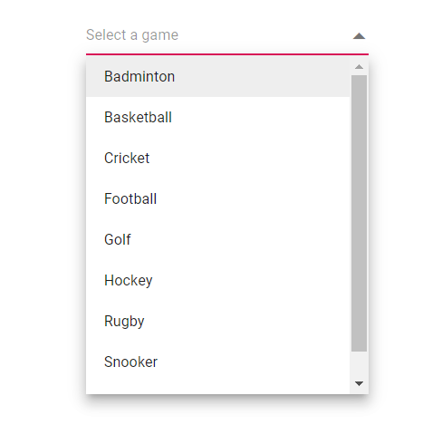

# Getting Started with the React DropDownList Component in the Preact

This article provides a step-by-step guide for setting up a [Preact](https://preactjs.com/) project and integrating the Syncfusion React DropDownList component.

`Preact` is a fast and lightweight JavaScript library for building user interfaces. It's often used as an alternative to larger frameworks like React. The key difference is that Preact is designed to be smaller in size and faster in performance, making it a good choice for projects where file size and load times are critical factors. 

## Prerequisites

[System requirements for Syncfusion React UI components](../system-requirement)

## Set up the Preact project

To create a new `Preact` project, use one of the commands that are specific to either NPM or Yarn.

```bash
npm init preact
```

or

```bash
yarn init preact
```

Using one of the above commands will lead you to set up additional configurations for the project, as below:

1\. Define the project name: We can specify the name of the project directly. Let's specify the name of the project as `my-project` for this article.

```bash
T  Preact - Fast 3kB alternative to React with the same modern API
|
*  Project directory:
|  my-project
—      
```

2\. Choose `JavaScript` as the framework variant to build this Preact project using JavaScript and React.

```bash
T  Preact - Fast 3kB alternative to React with the same modern API
|
*  Project language:
|  > JavaScript
|    TypeScript
—
```

3\. Then configure the project as below for this article.

```bash
T  Preact - Fast 3kB alternative to React with the same modern API
|
*  Use router?
|    Yes / > No
—
|
*  Prerender app (SSG)?
|    Yes / > No
—
|
*  Use ESLint?
|    Yes / > No
—
```

5\. Upon completing the aforementioned steps to create `my-project`, run the following command to jump into the project directory:

```bash
cd my-project
```

Now that `my-project` is ready to run with default settings, let's add Syncfusion components to the project.

## Add the Syncfusion React packages

Syncfusion React component packages are available at [npmjs.com](https://www.npmjs.com/search?q=ej2-react). To use Syncfusion React components in the project, install the corresponding npm package.

This article uses the [React DropDownList component](https://www.syncfusion.com/react-components/react-dropdown-list) as an example. To use the React DropDownList component in the project, the `@syncfusion/ej2-react-dropdowns` package needs to be installed using the following command:

```bash
npm install @syncfusion/ej2-react-dropdowns --save
```

or

```bash
yarn add @syncfusion/ej2-react-dropdowns
```

## Import Syncfusion CSS styles

You can import themes for the Syncfusion React component in various ways, such as using CSS or SASS styles from npm packages, CDN, CRG and [Theme Studio](https://ej2.syncfusion.com/react/documentation/appearance/theme-studio/). Refer to [themes topic](https://ej2.syncfusion.com/react/documentation/appearance/theme/) to know more about built-in themes and different ways to refer to theme's in a React project.

In this article, the `Material 3` theme is applied using CSS styles, which are available in installed packages. The necessary `Material 3` CSS styles for the DropDownList component and its dependents were imported into the **src/style.css** file.




@import "../node_modules/@syncfusion/ej2-base/styles/material3.css";
@import "../node_modules/@syncfusion/ej2-inputs/styles/material3.css";
@import "../node_modules/@syncfusion/ej2-react-dropdowns/styles/material3.css";




> The order of importing CSS styles should be in line with its dependency graph.
## Add the Syncfusion React component

Follow the below steps to add the React DropDownList component to the Vite project:

1\. Before adding the DropDownList component to your markup, import the DropDownList component in the **src/index.jsx** file.




import { DropDownListComponent } from '@syncfusion/ej2-react-dropdowns';




2\. Then, define the DropDownList component with the [dataSource](https://helpej2.syncfusion.com/react/documentation/api/drop-down-list#datasource) property. Declare the values for the `dataSource` property.




import { DropDownListComponent } from '@syncfusion/ej2-react-dropdowns';
import { render } from 'preact';
import './style.css';
function App() {
    // define the array of data
    const sportsData = ['Badminton', 'Basketball', 'Cricket', 'Football', 'Golf', 'Hockey', 'Rugby', 'Snooker', 'Tennis'];
    return (
    // specifies the tag for render the DropDownList component
    <DropDownListComponent id="ddlelement" dataSource={sportsData} placeholder="Select a game"/>);
}
render(<App />, document.querySelector('#app'));




## Run the project

To run the project, use the following command:

```bash
npm run dev
```

or

```bash
yarn run dev
```

The output will appear as follows:



## See also

[Getting Started with the Syncfusion React UI Component](../getting-started/quick-start)
