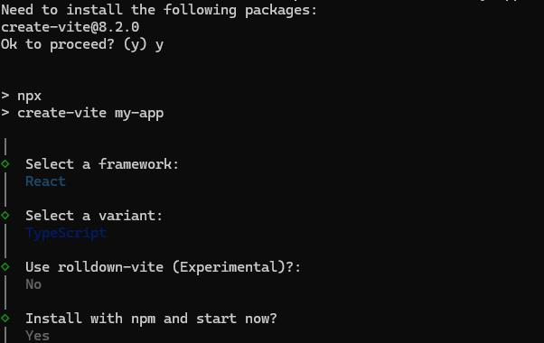

# Getting Started with Syncfusion React File Manager Component

This section explains how to create and configure the **File Manager** component in a React application.

To get started quickly with the React File Manager, refer to the video below:



## Setup for local development

Easily set up a React application using `create-vite-app`, which provides a faster development environment, smaller bundle sizes, and optimized builds compared to traditional tools like `create-react-app`. For detailed steps, refer to the Vite [installation instructions](https://vitejs.dev/guide). Vite sets up your environment using JavaScript and optimizes your application for production.

> **Note:** To create a React application using `create-react-app`, refer to this [documentation](https://ej2.syncfusion.com/react/documentation/getting-started/create-app) for more details.

To create a new React application, run the following command.

```bash
npm create vite@latest my-app
```
This command will prompt you for a few settings for the new project, such as selecting a framework and a variant.



Terminate the application, then run the following command:

```bash
cd my-app
```

## Adding Syncfusion<sup style="font-size:70%">&reg;</sup> React File Manager packages

To install the File Manager component, use the following command:

```bash
npm install @syncfusion/ej2-react-filemanager --save
```

## Adding CSS reference

To render the File Manager component, import File Manager and its dependent styles in **src/App.css**:

```css
@import '../node_modules/@syncfusion/ej2-base/styles/tailwind3.css';
@import '../node_modules/@syncfusion/ej2-icons/styles/tailwind3.css';
@import '../node_modules/@syncfusion/ej2-inputs/styles/tailwind3.css';
@import '../node_modules/@syncfusion/ej2-popups/styles/tailwind3.css';
@import '../node_modules/@syncfusion/ej2-buttons/styles/tailwind3.css';
@import '../node_modules/@syncfusion/ej2-splitbuttons/styles/tailwind3.css';
@import '../node_modules/@syncfusion/ej2-navigations/styles/tailwind3.css';
@import '../node_modules/@syncfusion/ej2-layouts/styles/tailwind3.css';
@import '../node_modules/@syncfusion/ej2-grids/styles/tailwind3.css';
@import "../node_modules/@syncfusion/ej2-react-filemanager/styles/tailwind3.css";
```

To reference `App.css` in the application, import it into the `src/App.tsx` file. Also, remove any unnecessary styles from `src/index.css` and `src/App.css`, as they may affect the File Manager component UI.

> **Note:** If you want to use combined component styles, make use of the [Custom Resource Generator (CRG)](https://crg.syncfusion.com) in your application.

## Adding File Manager component

The File Manager component code should be placed in the **src/App.tsx** file.

To enable file operation functionality in the File Manager, configure the [url](https://ej2.syncfusion.com/react/documentation/api/file-manager/ajaxsettingsmodel#url) property within the `ajaxSettings`. This URL handles the file operation requests from the server.













## Run the application

```bash
npm run dev
```

## See also

* [Ajax Settings Configuration (uploadUrl, downloadUrl, getImageUrl)](./file-operations#ajax-settings-configuration)
* [Injecting Services for Overview](./user-interface#injecting-services-for-overview)
* [File Manager Views](./views)
* [File Manager File Operations](./file-operations)
* [File Manager Upload](./upload)
* [File Manager Customization](./customization)
* [Getting Started with Next.js](./nextjs-getting-started)
