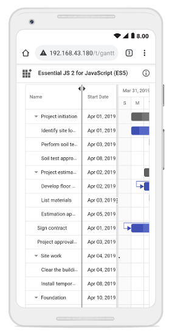

# Resize columns in React Gantt Chart Component

The Syncfusion&reg; React Gantt Chart component allows you to resize columns dynamically by dragging the edges of column headers. This feature enhances readability and layout flexibility, especially when working with large datasets.  To enable this feature, set the [allowResizing](https://ej2.syncfusion.com/react/documentation/api/gantt/#allowresizing) property to **true** in the Gantt configuration. 

Column width can be adjusted by dragging the right edge of the header, with changes applied immediately.  

To use the column resize feature, inject the `Resize` module into the Gantt Chart component.












        


>* You can disable resizing for a particular column, by specifying [columns.allowResizing](https://ej2.syncfusion.com/react/documentation/api/gantt/columnDirective/#allowresizing) to **false**.
>* In RTL mode, you can click and drag the left edge of header cell to resize the column.
>* The [width](https://ej2.syncfusion.com/react/documentation/api/gantt/columnDirective/#width) property of the column can be set initially to define the default width of the column. However, when column resizing is enabled, you can override the default width by manually resizing the columns.

## Restrict the resizing based on minimum and maximum width

The Gantt chart component allows restricting column resizing within a defined range to maintain layout consistency. This ensures column widths remain within the specified limits during resizing.  
  
To enable this, set the [minWidth](https://ej2.syncfusion.com/react/documentation/api/gantt/columnDirective/#minwidth) and [maxWidth](https://ej2.syncfusion.com/react/documentation/api/gantt/columnDirective/#maxwidth) properties in the column configuration.  

The following example demonstrates how the **TaskID** column can be configured with a minimum width of 100 pixels and a maximum of 200 pixels, while the **TaskName** column can be set between 150 and 300 pixels.












        


## Prevent resizing for particular column

You can prevent resizing for a specific column in the Gantt Chart component to maintain a consistent column width. To disable resizing, set the [allowResizing](https://ej2.syncfusion.com/react/documentation/api/gantt/columnDirective/#allowresizing) property of the respective column to **false**.  

The following example demonstrates how to disable resizing for the **TaskID** column.












        


> You can also prevent resizing by setting `args.cancel` to **true** in the [resizeStart](https://ej2.syncfusion.com/react/documentation/api/gantt/#resizestart) event.

## Column resizing modes

The React Gantt Chart component supports two resizing modes that determine how column widths behave during resizing. These modes are configured using the [resizeSettings.mode](https://ej2.syncfusion.com/react/documentation/api/grid/resizeSettings/#mode) property of the underlying TreeGrid. Resizing behavior is defined using the `ResizeSettingsModel` interface, where the `mode` property specifies the type of resizing to be applied.

There are two available resizing modes:

1. **Normal mode**: Columns retain their defined widths. If the total column width is less than the Gantt width, empty space appears to the right. If it exceeds, a horizontal scrollbar is shown.  
2. **Auto mode**: Columns automatically expand or contract to fill the available space based on the Gantt width.

To apply a resizing mode, set the `resizeSettings.mode` property on the `grid` object inside the Gantt instance. This can be done during the `load` event or dynamically based on user interaction.  

The following example demonstrates how to set the `resizeSettings.mode` to **Normal** or **Auto** based on the `DropDownList` [change](https://ej2.syncfusion.com/react/documentation/api/drop-down-list/#change) event.












        


> When the [autoFit](https://ej2.syncfusion.com/react/documentation/api/grid/#autofit) property of grid object in gantt instance is set to **true**, the gantt will automatically adjust its column width based on the content inside them. In `normal` resize mode, if the `autoFit` property is set to **true**, the gantt will maintain any empty space that is left over after resizing the columns. However, in `auto` resize mode, the gantt will ignore any empty space.

## Resize columns programmatically

You can programmatically resize columns in the React Gantt Chart component by accessing the target column using the `getColumnByField` method and updating its [width](https://ej2.syncfusion.com/react/documentation/api/gantt/columnDirective/#width) property. This is useful for implementing custom UI controls or dynamic layout adjustments.  To reflect the change, call the `refreshColumns` method from the `treeGrid` object within the Gantt instance.

The following example demonstrates how to resize a column externally using the [change](https://ej2.syncfusion.com/react/documentation/api/drop-down-list/#change) event of the [DropDownList](https://ej2.syncfusion.com/react/documentation/drop-down-list/getting-started) component. 












        


>  The `refreshColumns` method of `treeGrid` object in gantt instance is used to refresh the gantt after the column widths are updated. Column resizing externally is useful when you want to provide a custom interface to the user for resizing columns.

## Customize column resizing behavior using events

You can control column resizing using [resizeStart](https://ej2.syncfusion.com/react/documentation/gantt/events#resizestart), [resizing](https://ej2.syncfusion.com/react/documentation/gantt/events#resizing), and [resizeStop](https://ej2.syncfusion.com/react/documentation/gantt/events#resizestop) events.

The following example demonstrates how resizing events work: `resizeStart` cancels resizing of the **TaskID** column, `resizing` prevents changes when the field is **Duration**, and `resizeStop` applies custom CSS styles to the resized column.












        


>The `ResizeArgs` object passed to the events contains information such as the current column width, new column width, column index, and the original event. The [resizing](https://ej2.syncfusion.com/react/documentation/api/gantt/#resizing) event is triggered multiple times during a single resize operation, so be careful when performing heavy operations in this event.

## Touch interaction

The Gantt Chart component supports touch interactions for mobile devices. Users can resize columns by tapping and dragging the floating handler, or use the column menu to autofit columns.

**Resizing columns on touch devices:**

To resize a column:

1. Tap the right edge of the column header.
2. A floating handler appears over the column border.
3. Drag the handler to adjust the column width.

The screenshot below illustrates column resizing on a touch device.

