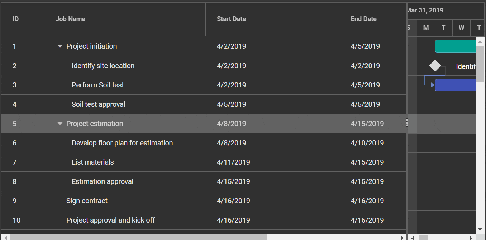

# Columns in React Gantt Chart Component

The Syncfusion<sup style="font-size:70%">&reg;</sup> React Gantt Chart component displays task data in a tabular format using columns. Columns help organize data efficiently and support user interaction within the Gantt chart.

Each column is defined using the [field](https://ej2.syncfusion.com/react/documentation/api/gantt/column#field) property, which maps values from the [dataSource](https://ej2.syncfusion.com/react/documentation/api/gantt#datasource). This mapping ensures accurate data binding and enables formatting and customization for each column.

## Column types

The Syncfusion<sup style="font-size:70%">&reg;</sup> React Gantt Chart component supports specifying the data type for each column using the `type` property. This ensures that values are displayed with the correct formatting—such as number or date—based on the column's data.

**Gantt supports the following column types:**

- **string**: Default type for text data.  
- **number**: For numeric values with formatting.  
- **boolean**: Displays checkboxes for true/false values.  
- **date**: For date values.  
- **datetime**: For date and time values.  
- **checkbox**: Displays a checkbox column.












        


> * If `type` is not defined, it is auto-detected from the first record of the data source.
> * If the first record has a null or blank value, define the `type` explicitly to ensure correct filter dialog behavior.

### Difference between boolean type and checkbox type column 

- Use **boolean** type to bind and edit true/false values from the data source.
- Use **checkbox** type to enable row selection or deselection in the UI.
- When column `type` is **checkbox**, Gantt `selectionSettings` defaults to multiple selection.
- If multiple **checkbox** columns exist, selecting one auto-selects others in the same row.

> To learn more about how to render boolean values as checkboxes in a Syncfusion<sup style="font-size:70%">&reg;</sup> GanttColumn, please refer to the [Render Boolean Values as Checkbox](https://ej2.syncfusion.com/react/documentation/gantt/columns/columns#render-boolean-value-as-checkbox) section.

## Column width

In Syncfusion<sup style="font-size:70%">&reg;</sup> Gantt for React, column width can be adjusted using the [width](https://ej2.syncfusion.com/react/documentation/api/gantt#width) property within the [column](https://ej2.syncfusion.com/react/documentation/api/gantt#columns) configuration. This property accepts values in pixels (e.g., **100**) or percentages (e.g., **25%**) to define the column's width relative to the Gantt container.

1. Column width is calculated based on the total available width. For example, in a container with 4 columns and a total width of 800 pixels, each column will default to 200 pixels.
2. If widths are defined for some columns but not others, the remaining width is distributed equally among columns without explicit widths. For example, if you have 3 columns with widths of 100px, 200px, and no width specified for the third column, the third column will occupy the remaining width after accounting for the first two columns.
3. Percentage-based widths are responsive and adjust dynamically when the Gantt container is resized. For example, a column with a width of 50% will occupy 50% of the gantt width and will adjust proportionally when the gantt container is resized to a smaller size.
4. When columns are manually resized, a minimum width is enforced to maintain readability. By default, this minimum is set to 10 pixels unless specified otherwise.
5. If the total column width exceeds the container width, a horizontal scrollbar appears to enable scrolling.
6. The Gantt Chart component inherits the width of its parent element. If the parent has a fixed width, the Gantt will occupy that space; otherwise, it adjusts dynamically based on available space.

> To learn more about resizing, you can refer to the resizing section [here](https://ej2.syncfusion.com/react/documentation/gantt/columns/column-resizing)

#### Supported types for column width

The Syncfusion<sup style="font-size:70%">&reg;</sup> Gantt supports the following three types of column width:

**1. Auto**

The column width is automatically calculated based on the content within the column cells. If the content exceeds the width of the column, it will be truncated with an ellipsis (...) at the end. You can set the width for columns as **auto** in your Gantt configuration as shown below:

```js
<ColumnDirective field="TaskID" headerText="Task ID" textAlign="Right" width="auto" />
```

**2. Percentage**

The column width is specified as a percentage value relative to the width of the gantt container. For example, a column width of 25% will occupy 25% of the total gantt width. You can set the width for columns as **percentage** in your Gantt configuration as shown below:

```js
<ColumnDirective field="TaskID" headerText="Task ID" textAlign="Right" width="25%" />
```

**3. Pixel**

The column width is specified as an absolute pixel value. For example, a column width of 100px will have a fixed width of 100 pixels regardless of the gantt container size. You can set the width for columns as **pixel** in your Gantt configuration as shown below:

```js
<ColumnDirective field="TaskID" headerText="Task ID" textAlign="Right" width="100" />
```











        


## Column formatting

The Syncfusion<sup style="font-size:70%">&reg;</sup> Gantt Chart component for React supports column formatting to customize data presentation. You can format numbers, dates, or apply templates based on specific requirements. Use the [columns.format](https://ej2.syncfusion.com/react/documentation/api/gantt/column#format) property to define the desired format for each column.












        


>* The Gantt uses the [Internalization](https://ej2.syncfusion.com/react/documentation/common/globalization/internationalization) library to format values based on the specified format and culture.
>* By default, the [number](https://ej2.syncfusion.com/react/documentation/common/globalization/internationalization#number-formatting) and [date](https://ej2.syncfusion.com/react/documentation/common/globalization/internationalization#date-formatting) values are formatted in **en-US** locale. You can localize the currency and date in different locale as explained [here](https://ej2.syncfusion.com/react/documentation/common/globalization/localization).
>* The available format codes may vary depending on the data type of the column.
>* You can also customize the formatting further by providing a custom function to the [format](https://ej2.syncfusion.com/react/documentation/api/gantt/column#format) property, instead of a format string.
>* Make sure that the format string is valid and compatible with the data type of the column, to avoid unexpected results.

### Number formatting

The Syncfusion<sup style="font-size:70%">&reg;</sup> Gantt Chart component for React supports number formatting through the [columns.format](https://ej2.syncfusion.com/react/documentation/api/gantt/column#format) property, where standard format strings define numeric value presentation including currency, percentage, and decimal formats. The following standard format strings are available:

| Format | Description       | Remarks                                                               |
| ------ | ----------------- | --------------------------------------------------------------------- |
| N      | Numeric format    | Use `N2`, `N3`, etc., to set the number of decimal places.            |
| C      | Currency format   | Use `C2`, `C3`, etc., to define precision for currency values.        |
| P      | Percentage format | Input should be between 0 and 1; `P2`, `P3`, etc., control precision. |


The following example code demonstrates the formatting of data for the **TaskID** column using the **N** format, the **Progress** column using the **P** format, and a currency column using the **C** format.












        


>To learn more about number formatting, you can refer to the [number](https://ej2.syncfusion.com/react/documentation/common/globalization/internationalization#number-formatting) section.

### Date formatting

The Syncfusion<sup style="font-size:70%">&reg;</sup> Gantt Chart component for React supports date formatting in columns using the [columns.format](https://ej2.syncfusion.com/react/documentation/api/gantt/column#format) property, where format strings such as **d**, **D**, **MMM dd, yyyy** can be applied. Both built-in formats like **yMd** and custom formats are supported to define the layout and detail of date and time values based on column requirements. The following custom formats and their corresponding output are listed below:

| Format                                                | Formatted value        |
| ----------------------------------------------------- | ---------------------- |
| { type:'date', format:'dd/MM/yyyy' }                  | 04/07/1996             |
| { type:'date', format:'dd.MM.yyyy' }                  | 04.07.1996             |
| { type:'date', skeleton:'short' }                     | 7/4/96                 |
| { type: 'dateTime', format: 'dd/MM/yyyy hh:mm a' }    | 04/07/1996 12:00 AM    |
| { type: 'dateTime', format: 'MM/dd/yyyy hh:mm:ss a' } | 07/04/1996 12:00:00 AM |












        


>To learn more about date formatting, you can refer to [Date formatting](https://ej2.syncfusion.com/react/documentation/common/globalization/internationalization#date-formatting). 

### Format the date column based on localization 

You can format the date column in Gantt Chart component based on localization settings by using the [format](https://ej2.syncfusion.com/react/documentation/api/gantt/column#format) property to define the date pattern and the [locale](https://ej2.syncfusion.com/react/documentation/api/gantt#locale) property to apply regional settings.

The following example demonstrates the `format` property specifies the date format as **yyyy-MMM-dd**, and the `locale` property specifies the locale as **es-AR** for Spanish (Argentina).












        


### Format template column value 

You can customize the appearance of values in Gantt template columns using HTML markup and number formatting. To format values, use React pipes along with the [format](https://ej2.syncfusion.com/react/documentation/api/gantt/column#format) property. In this example, the date pipe formats the **StartDate** value as `'dd/MMM/yyyy'`.

```ts
const dateTemplate = (props) => {
    const date = new Date(props.StartDate);
    return (
        <span>
            {date.getFullYear()}/{date.toLocaleString('default', { month: 'short' })}/{date.getDate()}
        </span>
    );
};
```












        


> In React, you can use JavaScript or TypeScript formatting utilities like **Intl.NumberFormat** or **toLocaleString()** to format values such as **dates**, **currency**, **decimals**, or **percentages** in column templates based on your requirements.

### Custom formatting

The Syncfusion<sup style="font-size:70%">&reg;</sup> Gantt Chart component supports custom formatting for numeric and date values. You can use the [format](https://ej2.syncfusion.com/react/documentation/api/gantt/column#format) property to display data in a specific format based on requirements.

In the example below, `numberFormatOptions` is used for the **Progress** column to show four decimal places, and `dateFormatOptions` is used for the **StartDate** column to display the date as day-of-week, month abbreviation, day, and 2-digit year (e.g., Sun, May 8, '23).












        


>To learn more about custom formatting, you can refer to [Custom Date formatting](https://ej2.syncfusion.com/react/documentation/common/internationalization#custom-formats) and [Custom Number formatting](https://ej2.syncfusion.com/react/documentation/common/internationalization#custom-number-formatting-and-parsing). 

## Align the text of content

You can use the [textAlign](https://ej2.syncfusion.com/react/documentation/api/gantt/column#textalign) property in Gantt Chart component to set the alignment of text within column cells. By default, the text is aligned to the **left**. The available options are:

*	**Left**: Aligns the text to the left (default).
*	**Center**: Aligns the text to the center.
*	**Right**: Aligns the text to the right.
*	**Justify**: Align the text to the justify.












        


>* The `textAlign` property changes the alignment for both the column content and header. If you want to align header differently, you can use the [headerTextAlign](https://ej2.syncfusion.com/documentation/api/gantt/column#headertextalign) property.

## Render boolean value as checkbox

You can render boolean values as checkboxes in Gantt Chart component by setting the [displayAsCheckBox](https://ej2.syncfusion.com/react/documentation/api/gantt/column#displayascheckbox) property to **true** for the desired column. This replaces the default text representation of **true** or **false** with a checkbox, making boolean fields visually clearer and more intuitive.

The following sample demonstrates how to display a boolean value as a checkbox for the **Verified** column.












        


>* The `displayAsCheckBox` property is only applicable to boolean values in Gantt columns.
>* When `displayAsCheckBox` is set to **true**, the boolean values will be rendered as checkboxes in the Gantt column, with checked state indicating **true** and unchecked state indicating **false**.

### How to prevent checkbox for particular row

You can prevent the checkbox from rendering in a specific row of the Gantt even when [displayAsCheckBox](https://ej2.syncfusion.com/react/documentation/api/gantt/column#displayascheckbox) is set to **true** for the column. This can be done using the [rowDataBound](https://ej2.syncfusion.com/react/documentation/gantt/events#rowdatabound) event, where you check the row index and conditionally set the inner HTML of the target cell to an empty string to hide the checkbox.

The following sample hides the checkbox for the row with `ariaRowIndex` set to 3.












        


## Render boolean value as checkbox

You can render boolean values as checkboxes in Gantt Chart component by setting the [displayAsCheckBox](https://ej2.syncfusion.com/react/documentation/api/gantt/column#displayascheckbox) property to **true** for the desired column. This replaces the default text representation of **true** or **false** with a checkbox, making boolean fields visually clearer and more intuitive.

The following sample demonstrates how to display a boolean value as a checkbox for the **Verified** column.












        


>* The `displayAsCheckBox` property is only applicable to boolean values in Gantt columns.
>* When `displayAsCheckBox` is set to **true**, the boolean values will be rendered as checkboxes in the Gantt column, with checked state indicating **true** and unchecked state indicating **false**.

### How to prevent checkbox for particular row

You can prevent the checkbox from rendering in a specific row of the Gantt even when [displayAsCheckBox](https://ej2.syncfusion.com/react/documentation/api/gantt/column#displayascheckbox) is set to **true** for the column. This can be done using the [rowDataBound](https://ej2.syncfusion.com/react/documentation/gantt/events#rowdatabound) event, where you check the row index and conditionally set the inner HTML of the target cell to an empty string to hide the checkbox.

The following sample hides the checkbox for the row with `ariaRowIndex` set to 3.












        


## AutoFit columns

The Syncfusion<sup style="font-size:70%">&reg;</sup> Gantt Chart component for React supports automatic column width adjustment based on content. Double-clicking the column header resizer adjusts the width to fit the maximum content, ensuring clear data visibility without wrapping.

To enable this feature, set [allowResizing](https://ej2.syncfusion.com/react/documentation/api/gantt#allowresizing) to **true** and inject `Resize` in the Gantt Chart component. 

The following screenshot represents the resizing the column using resizer symbol.



### Resizing a column to fit its content using method support

You can resize a column in Gantt to fit its content using the `autoFitColumns` method from the `treeGrid` object. This adjusts the column width based on the widest cell without wrapping. To apply this during initial rendering, call the method in the [dataBound](https://ej2.syncfusion.com/react/documentation/gantt/events#databound) event.












        


> You can autofit all the columns by invoking the `autoFitColumns` method without specifying column names.

## Locked columns

You can lock columns in Syncfusion<sup style="font-size:70%">&reg;</sup> Gantt Chart component to prevent them from being reordered and to keep them fixed at the first position. This is achieved by setting the `column.lockColumn` property to **true** in the column configuration. To visually differentiate locked columns, you can apply custom CSS using attribute selectors.












        


## Show or hide columns

The Syncfusion<sup style="font-size:70%">&reg;</sup> React Gantt Chart component allows dynamic control over column visibility using built-in properties and methods. This is useful for customizing which columns are shown or hidden based on specific requirements.

### Using property

You can control the visibility of columns in the React Gantt Chart component by setting the [visible](https://ej2.syncfusion.com/react/documentation/api/gantt/column#visible) property of each column to **true** or **false**. 

The following example illustrates how to dynamically toggle the visibility of the **Duration** column. Initially, the column is set with the `visible` property as **false**. When the switch component triggers a `change` event, the `getColumnByField` method retrieves the column, its `visible` property is updated based on the switch state, and `refreshColumns` is called to apply the changes to the UI.












        


>* Hiding a column using the `visible` property affects only its display; the data remains accessible in the source.
>* Hidden columns are excluded from the total width calculation.  
>* To keep a column hidden permanently, set `visible` to **false** or remove its definition.

### Using methods

You can also show or hide columns in the React Gantt Chart component using the [showColumn](https://ej2.syncfusion.com/react/documentation/api/gantt#showcolumn) and [hideColumn](https://ej2.syncfusion.com/react/documentation/api/gantt#hidecolumn) methods available in the Gantt. These methods allow you to control column visibility based on either the [headerText](https://ej2.syncfusion.com/react/documentation/api/gantt/column#headertext) or the [field](https://ej2.syncfusion.com/react/documentation/api/gantt/column#field) property.

**Based on header text:**

You can dynamically show or hide columns by passing either a single header text or an array of header texts as the first parameter, and specifying `headerText` as the second parameter.  This enables dynamic control over column visibility based on the displayed header.

You can use the `getGanttColumns` method to retrieve all defined columns, and the `getVisibleColumns` method to get only the visible columns.

The following sample demonstrates how to hide and show columns using button clicks. When the **Hide Column** button is clicked, the `hideColumn` method is called with **Duration** as the first parameter and `headerText` as the second. Clicking the **Show Column** button restores the column using the `showColumn` method.












        


**Based on field:**

You can dynamically show or hide columns by passing either a single field name or an array of field names as the first parameter, and `field` as the second parameter to indicate that visibility is controlled using the field name.

The following sample demonstrates how to hide and show columns using button clicks. When the **Hide Column** button is clicked, the `hideColumn` method is triggered with `['TaskName', 'Duration']` as the first parameter and `field` as the second. Clicking the **Show Column** button displays the columns again using the `showColumn` method.












        


## Controlling Gantt actions

You can manage actions like filtering, sorting, resizing, reordering, editing, and searching for specific columns in the Syncfusion<sup style="font-size:70%">&reg;</sup> React Gantt using the following options:

* [allowEditing](https://ej2.syncfusion.com/react/documentation/api/gantt/columnModel#allowediting): Enables or disables editing for a column.
* [allowFiltering](https://ej2.syncfusion.com/react/documentation/api/gantt/columnModel#allowfiltering): Enables or disables filtering for a column.
* [allowSorting](https://ej2.syncfusion.com/react/documentation/api/gantt/columnModel#allowsorting): Enables or disables sorting for a column.
* [allowReordering](https://ej2.syncfusion.com/react/documentation/api/gantt/columnModel#allowreordering): Enables or disables reordering for a column.
* [allowResizing](https://ej2.syncfusion.com/react/documentation/api/gantt/columnModel#allowresizing): Enables or disables resizing for a column.












        


## Customize column styles

Customizing Gantt column styles allows you to modify the appearance to match your design needs. You can customize font, background color, and other style attributes using supported events, CSS, properties, or methods.

For more information check on this [documentation](https://ej2.syncfusion.com/react/documentation/gantt/style-and-appearance).

## Updating column definitions

To update column definitions in React Gantt Chart component, modify the [columns](https://helpej2.syncfusion.com/react/documentation/api/gantt/column/) property to adjust column appearance and behavior by changing attributes like [headerText](https://ej2.syncfusion.com/react/documentation/api/gantt/column#headertext), [width](https://ej2.syncfusion.com/react/documentation/api/gantt/column#width), or [visible](https://ej2.syncfusion.com/react/documentation/api/gantt/column#visible). After making the required updates, use the `refreshColumns` method from the `treeGrid` object to apply and reflect the changes in the Gantt chart.












        


## Adding/removing columns

You can add or remove columns in the React Gantt by updating the [columns](https://helpej2.syncfusion.com/react/documentation/api/gantt/column/) option in the Gantt instance. To add a column, **push** a new column object into the `columns` array. To remove a column, use **pop** to delete the last item or `splice` to remove a specific one from the array.












        


## Responsive columns

The Syncfusion<sup style="font-size:70%">&reg;</sup> React Gantt Chart component provides a built-in feature to control column visibility based on media queries using the `hideAtMedia` property in the column object. This method can be used to hide columns automatically when the screen width matches specified [media query](http://cssmediaqueries.com/what-are-css-media-queries.html) conditions.

The following example demonstrates a Gantt chart where the **Task Name** column is set to `(min-width: 700px)`, meaning it will be hidden when the browser width is less than or equal to 700px. Similarly, the **Duration** column is set to `(max-width: 500px)`, so it will be hidden when the browser width exceeds 500px.












        


## Clip mode

The clip mode provides options to display overflow cell content using the [columns.clipMode](https://ej2.syncfusion.com/react/documentation/api/gantt/columnModel#clipmode) property.  The following are three types of `clipMode`:

- **Clip**: Truncates content that exceeds the cell width.
- **Ellipsis**: Displays ellipsis when content exceeds the cell area.
- **EllipsisWithTooltip**: Displays ellipsis and shows full content in a tooltip on hover.

> By default, all the column's [clipMode](https://ej2.syncfusion.com/react/documentation/api/gantt/columnModel#clipmode) property is defined as **EllipsisWithTooltip**.












        
