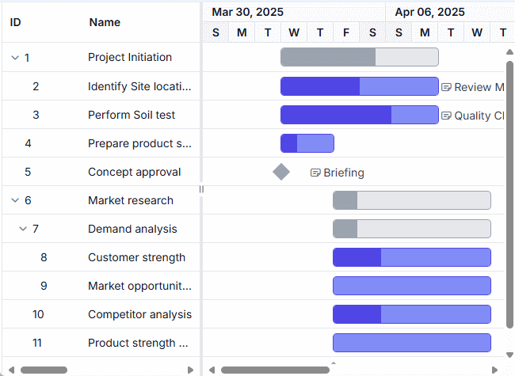

# Data Markers in React Gantt Chart Component

Data markers are visual indicators that highlight significant events, milestones, or important dates within individual project tasks. These markers provide immediate visual context about critical moments in task timelines, enabling effective identification of key dates and tracking of important events at the task level. Understanding data markers implementation ensures effective project visualization and milestone tracking throughout project development cycles.

Data markers utilize specific properties to define their appearance, positioning, and interactive behavior within task timelines:

**Date specification**: The [date](https://ej2.syncfusion.com/react/documentation/api/gantt/iIndicator#date) property establishes the exact timeline position where the marker appears. This date value determines marker placement relative to the task's start and end dates, ensuring accurate event representation.

**Visual styling**: The [iconClass](https://ej2.syncfusion.com/react/documentation/api/gantt/iIndicator#iconclass) property defines the CSS class that controls marker visual appearance. This property enables custom styling through icon fonts, background images, or CSS-based graphics to distinguish different marker types.

**Identification**: The [name](https://ej2.syncfusion.com/react/documentation/api/gantt/iIndicator#name) property provides unique identification for each marker. This name serves as an internal reference and can be used for programmatic marker manipulation or event handling.

**Interactive content**: The [tooltip](https://ej2.syncfusion.com/react/documentation/api/gantt/iIndicator#tooltip) property supplies descriptive text that displays when users hover over markers. This property enhances user experience by providing detailed context about marker significance and related event information.

**Tooltip Rendering Requirements**: Data marker tooltips render only when the tooltip property contains valid content values. Empty or undefined tooltip properties result in no tooltip display, maintaining clean visual presentation for markers without additional descriptions.

## Data mapping and configuration properties

Data markers represent schedule events for specific tasks through visual indicators positioned at designated dates within task timelines. The component renders markers as icon-based elements that display at precise timeline locations, providing instant visual reference for important task-related events.

**Data structure requirements**: Data markers are defined in the data source as arrays of objects containing marker specifications. Each marker object includes date information, visual styling, identification details, and optional tooltip content for enhanced user interaction.

**Mapping configuration**: The marker array connects to the Gantt Chart component through the [taskFields.indicators](https://ej2.syncfusion.com/react/documentation/api/gantt/taskFields#indicators) property mapping. This configuration establishes the relationship between data source marker definitions and component rendering logic.

**Multiple marker support**: Tasks can display multiple data markers simultaneously, allowing comprehensive event tracking within individual task contexts. Each marker maintains independent configuration while sharing the same task timeline space.
The following implementation demonstrates comprehensive data marker integration within a Gantt chart, showcasing multiple markers per task with varied styling and tooltip configurations:












        


## Custom event bind to data markers

Data markers support interactive functionality through click event binding, enabling custom actions when markers are selected. This interaction capability allows the implementation of detailed views, status updates, or navigation to related information based on marker context.

**Event binding implementation**: Click events are bound to data markers using the [dataBound](https://ej2.syncfusion.com/react/documentation/api/gantt#databound) event of the Gantt Chart component. This event fires after data binding completes, ensuring all marker elements are rendered and available for event attachment.

**DOM element selection**: Data markers render with the CSS class **.e-indicator-span**, which serves as the selector for identifying marker elements within the DOM. This class provides a reliable reference for event binding regardless of marker styling or content variations.

The following implementation demonstrates how to open the edit dialog for a specific task when its data marker is clicked:













**Event handler considerations**: The click event handler locates the parent task row using DOM traversal methods, extracts the task information from the current view data, and calls the [openEditDialog](https://ej2.syncfusion.com/react/documentation/api/gantt#openeditdialog) method with the appropriate task ID to display the edit dialog for the selected task.

## Apply custom styling for indicator span

You can programmatically modify the styling of the indicator by targeting the `.e-indicator-span` class.










