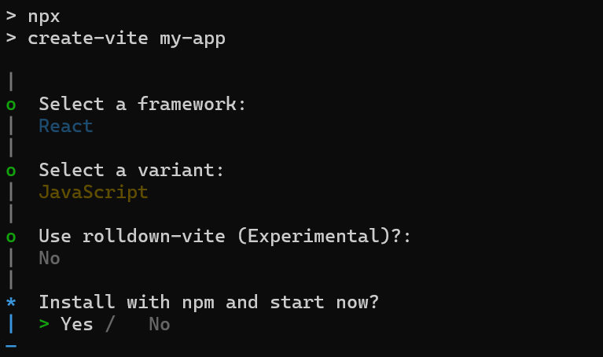
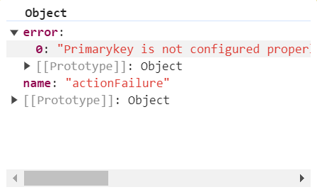

# Getting started With React Gantt Chart Component

This section explains the steps required to create a simple React Gantt Chart component and demonstrate its basic usage in a React environment.

> **Ready to streamline your Syncfusion<sup style="font-size:70%">&reg;</sup> React development?** Discover the full potential of Syncfusion<sup style="font-size:70%">&reg;</sup> React components with Syncfusion<sup style="font-size:70%">&reg;</sup> AI Coding Assistant. Effortlessly integrate, configure, and enhance your projects with intelligent, context-aware code suggestions, streamlined setups, and real-time insights—all seamlessly integrated into your preferred AI-powered IDEs like VS Code, Cursor, Syncfusion<sup style="font-size:70%">&reg;</sup> CodeStudio and more. [Explore Syncfusion<sup style="font-size:70%">&reg;</sup> AI Coding Assistant](https://ej2.syncfusion.com/react/documentation/ai-coding-assistant/overview)

To get started quickly with React Gantt Chart, you can watch this video:



## Dependencies

The following is the list of minimum dependencies required to use the Gantt component.

```javascript
|-- @syncfusion/ej2-react-gantt
  |-- @syncfusion/ej2-grids
  |-- @syncfusion/ej2-gantt
  |-- @syncfusion/ej2-layouts
  |-- @syncfusion/ej2-treegrid
```

## Setup for Local Development

Easily set up a React application using `create-vite-app`, which provides a faster development environment, smaller bundle sizes, and optimized builds compared to traditional tools like `create-react-app`. For detailed steps, refer to the Vite [installation instructions](https://vitejs.dev/guide). Vite sets up your environment using JavaScript and optimizes your application for production.

> **Note:** To create a React application using `create-react-app`, refer to this [documentation](https://ej2.syncfusion.com/react/documentation/getting-started/create-app) for more details.

To create a new React application, run the following command.

```bash
npm create vite@latest my-app
```
This command will prompt you for a few settings for the new project, such as selecting a framework and a variant.


To set up a React application in a TypeScript environment, run the following command:

```bash
npm create vite@latest my-app -- --template react-ts
cd my-app
npm run dev
```

To set up a React application in a JavaScript environment, run the following command:

```bash
npm create vite@latest my-app -- --template react
cd my-app
npm run dev
```

## Adding Syncfusion<sup style="font-size:70%">&reg;</sup> Gantt Chart packages

All the available Essential<sup style="font-size:70%">&reg;</sup> JS 2 packages are published in [npmjs.com](https://www.npmjs.com/~syncfusionorg) public registry.
To install Gantt Chart component, use the following command

```bash
npm install @syncfusion/ej2-react-gantt --save
```
> The --save will instruct NPM to include the Gantt Chart package inside of the **dependencies** section of the package.json.


## Adding CSS reference

The following CSS files are available in the **../node_modules/@syncfusion** package folder. Add these as references in **src/App.css**.

```css
@import "../node_modules/@syncfusion/ej2-base/styles/tailwind3.css";
@import "../node_modules/@syncfusion/ej2-buttons/styles/tailwind3.css";
@import "../node_modules/@syncfusion/ej2-calendars/styles/tailwind3.css";
@import "../node_modules/@syncfusion/ej2-dropdowns/styles/tailwind3.css";
@import "../node_modules/@syncfusion/ej2-gantt/styles/tailwind3.css";
@import "../node_modules/@syncfusion/ej2-grids/styles/tailwind3.css";
@import "../node_modules/@syncfusion/ej2-inputs/styles/tailwind3.css";
@import "../node_modules/@syncfusion/ej2-layouts/styles/tailwind3.css";
@import "../node_modules/@syncfusion/ej2-lists/styles/tailwind3.css";
@import "../node_modules/@syncfusion/ej2-navigations/styles/tailwind3.css";
@import "../node_modules/@syncfusion/ej2-notifications/styles/tailwind3.css";
@import "../node_modules/@syncfusion/ej2-popups/styles/tailwind3.css";
@import "../node_modules/@syncfusion/ej2-richtexteditor/styles/tailwind3.css";
@import "../node_modules/@syncfusion/ej2-treegrid/styles/tailwind3.css";
```

> To refer **App.css** in the application then import it in the **src/App.tsx** file.

## Adding Gantt Chart component

The React Gantt Chart component can be added to the application by following these steps. To get started, add the Gantt Chart component to the **src/App.tsx** file using the following code.

The following Gantt Chart code should be placed in the **src/App.tsx** file.



import * as React from 'react';
import { GanttComponent } from '@syncfusion/ej2-react-gantt';
import './App.css';

function App() {
  return (
    <GanttComponent
    ......
    />
  );
}

export default App;


import * as React from 'react';
import { GanttComponent } from '@syncfusion/ej2-react-gantt';
import './App.css';

function App() {
  return (
    <GanttComponent
      .....
    />
  );
}

export default App;



## Binding Gantt with data

Bind data to the Gantt Chart component by using the [dataSource](https://ej2.syncfusion.com/react/documentation/api/gantt#datasource) property. This property supports assigning an array of JavaScript objects or a `DataManager` instance as the data source for the Gantt Chart.

To ensure that the Gantt component correctly interprets each task's information, map the fields in the data source to the Gantt attributes using the [taskFields](https://ej2.syncfusion.com/react/documentation/api/gantt#taskfields) property. Task field mappings typically include values such as the task ID, name, start date, duration, progress, and parent task identifier for defining hierarchical relationships.



import * as React from 'react';
import { GanttComponent } from '@syncfusion/ej2-react-gantt';
import './App.css';

const GanttData: Object = [
  { TaskID: 1, TaskName: 'Project Initiation', StartDate: new Date('04/02/2019'), EndDate: new Date('04/21/2019') },
  { TaskID: 2, TaskName: 'Identify Site location', StartDate: new Date('04/02/2019'), Duration: 4, Progress: 50, ParentID: 1 },
  { TaskID: 3, TaskName: 'Perform Soil test', StartDate: new Date('04/02/2019'), Duration: 4, Progress: 50, ParentID: 1 },
  { TaskID: 4, TaskName: 'Soil test approval', StartDate: new Date('04/02/2019'), Duration: 4, Progress: 50, ParentID: 1 },
  { TaskID: 5, TaskName: 'Project Estimation', StartDate: new Date('04/02/2019'), EndDate: new Date('04/21/2019') },
  { TaskID: 6, TaskName: 'Develop floor plan for estimation', StartDate: new Date('04/04/2019'), Duration: 3, Progress: 50, ParentID: 5 },
  { TaskID: 7, TaskName: 'List materials', StartDate: new Date('04/04/2019'), Duration: 3, Progress: 50, ParentID: 5 },
  { TaskID: 8, TaskName: 'Estimation approval', StartDate: new Date('04/04/2019'), Duration: 3, Progress: 50, ParentID: 5 }
];

function App() {
  return (
    <GanttComponent
    datasource ={GanttData}
    .....
    />
  );
}

export default App;


import * as React from 'react';
import { GanttComponent } from '@syncfusion/ej2-react-gantt';
import './App.css';

const GanttData = [
  { TaskID: 1, TaskName: 'Project Initiation', StartDate: new Date('04/02/2019'), EndDate: new Date('04/21/2019') },
  { TaskID: 2, TaskName: 'Identify Site location', StartDate: new Date('04/02/2019'), Duration: 4, Progress: 50, ParentID: 1 },
  { TaskID: 3, TaskName: 'Perform Soil test', StartDate: new Date('04/02/2019'), Duration: 4, Progress: 50, ParentID: 1 },
  { TaskID: 4, TaskName: 'Soil test approval', StartDate: new Date('04/02/2019'), Duration: 4, Progress: 50, ParentID: 1 },
  { TaskID: 5, TaskName: 'Project Estimation', StartDate: new Date('04/02/2019'), EndDate: new Date('04/21/2019') },
  { TaskID: 6, TaskName: 'Develop floor plan for estimation', StartDate: new Date('04/04/2019'), Duration: 3, Progress: 50, ParentID: 5 },
  { TaskID: 7, TaskName: 'List materials', StartDate: new Date('04/04/2019'), Duration: 3, Progress: 50, ParentID: 5 },
  { TaskID: 8, TaskName: 'Estimation approval', StartDate: new Date('04/04/2019'), Duration: 3, Progress: 50, ParentID: 5 }
];

function App() {
  return (
    <GanttComponent
      datasource= {GanttData}
      .....
    />
  );
}

export default App;



## Mapping task fields

The data source fields that are required to render tasks are mapped to the Gantt Chart component using the [taskFields](https://ej2.syncfusion.com/react/documentation/api/gantt#taskfields) property.



import * as React from 'react';
import { GanttComponent, TaskFieldsModel } from '@syncfusion/ej2-react-gantt';
import './App.css';

const GanttData: object[] = [
  { TaskID: 1, TaskName: 'Project Initiation', StartDate: new Date('04/02/2019'), EndDate: new Date('04/21/2019') },
  { TaskID: 2, TaskName: 'Identify Site location', StartDate: new Date('04/02/2019'), Duration: 4, Progress: 50, ParentID: 1 },
  { TaskID: 3, TaskName: 'Perform Soil test', StartDate: new Date('04/02/2019'), Duration: 4, Progress: 50, ParentID: 1 },
  { TaskID: 4, TaskName: 'Soil test approval', StartDate: new Date('04/02/2019'), Duration: 4, Progress: 50, ParentID: 1 },
  { TaskID: 5, TaskName: 'Project Estimation', StartDate: new Date('04/02/2019'), EndDate: new Date('04/21/2019') },
  { TaskID: 6, TaskName: 'Develop floor plan for estimation', StartDate: new Date('04/04/2019'), Duration: 3, Progress: 50, ParentID: 5 },
  { TaskID: 7, TaskName: 'List materials', StartDate: new Date('04/04/2019'), Duration: 3, Progress: 50, ParentID: 5 },
  { TaskID: 8, TaskName: 'Estimation approval', StartDate: new Date('04/04/2019'), Duration: 3, Progress: 50, ParentID: 5 }
];

function App() {

  const taskFields: TaskFieldsModel = {
    id: 'TaskID',
    name: 'TaskName',
    startDate: 'StartDate',
    endDate: 'EndDate',
    duration: 'Duration',
    progress: 'Progress',
    parentID: 'ParentID'
  };

  return (
    <GanttComponent
      dataSource={GanttData}
      taskFields={taskFields}
    />
  );
}

export default App;


import * as React from 'react';
import { GanttComponent } from '@syncfusion/ej2-react-gantt';
import './App.css';

const GanttData = [
  { TaskID: 1, TaskName: 'Project Initiation', StartDate: new Date('04/02/2019'), EndDate: new Date('04/21/2019') },
  { TaskID: 2, TaskName: 'Identify Site location', StartDate: new Date('04/02/2019'), Duration: 4, Progress: 50, ParentID: 1 },
  { TaskID: 3, TaskName: 'Perform Soil test', StartDate: new Date('04/02/2019'), Duration: 4, Progress: 50, ParentID: 1 },
  { TaskID: 4, TaskName: 'Soil test approval', StartDate: new Date('04/02/2019'), Duration: 4, Progress: 50, ParentID: 1 },
  { TaskID: 5, TaskName: 'Project Estimation', StartDate: new Date('04/02/2019'), EndDate: new Date('04/21/2019') },
  { TaskID: 6, TaskName: 'Develop floor plan for estimation', StartDate: new Date('04/04/2019'), Duration: 3, Progress: 50, ParentID: 5 },
  { TaskID: 7, TaskName: 'List materials', StartDate: new Date('04/04/2019'), Duration: 3, Progress: 50, ParentID: 5 },
  { TaskID: 8, TaskName: 'Estimation approval', StartDate: new Date('04/04/2019'), Duration: 3, Progress: 50, ParentID: 5 }
];

function App() {

  const taskFields = {
    id: 'TaskID',
    name: 'TaskName',
    startDate: 'StartDate',
    endDate: 'EndDate',
    duration: 'Duration',
    progress: 'Progress',
    parentID: 'ParentID'
  };

  return (
    <GanttComponent
      dataSource={GanttData}
      taskFields={taskFields}
    />
  );
}

export default App;



## Defining columns

Columns can be defined in the Gantt component by assigning them as an array. Each column can be customized using the following properties:

* `field`: Maps a data source field to the corresponding column.
* `headerText`: Specifies the header text displayed for the column.
* `textAlign`: Defines the alignment of column content. Columns are left‑aligned by default; set `textAlign` to Right to right‑align the content.
* `format`: Applies standard or custom formatting to number and date values. This can be used, for example, to display numeric values in a currency format.
  


import * as React from 'react';
import { ColumnDirective, ColumnsDirective, GanttComponent, TaskFieldsModel } from '@syncfusion/ej2-react-gantt';
import './App.css';

const GanttData: object [] = [
  { TaskID: 1, TaskName: 'Project Initiation', StartDate: new Date('04/02/2019'), EndDate: new Date('04/21/2019') },
  { TaskID: 2, TaskName: 'Identify Site location', StartDate: new Date('04/02/2019'), Duration: 4, Progress: 50, ParentID: 1 },
  { TaskID: 3, TaskName: 'Perform Soil test', StartDate: new Date('04/02/2019'), Duration: 4, Progress: 50, ParentID: 1 },
  { TaskID: 4, TaskName: 'Soil test approval', StartDate: new Date('04/02/2019'), Duration: 4, Progress: 50, ParentID: 1 },
  { TaskID: 5, TaskName: 'Project Estimation', StartDate: new Date('04/02/2019'), EndDate: new Date('04/21/2019') },
  { TaskID: 6, TaskName: 'Develop floor plan for estimation', StartDate: new Date('04/04/2019'), Duration: 3, Progress: 50, ParentID: 5 },
  { TaskID: 7, TaskName: 'List materials', StartDate: new Date('04/04/2019'), Duration: 3, Progress: 50, ParentID: 5 },
  { TaskID: 8, TaskName: 'Estimation approval', StartDate: new Date('04/04/2019'), Duration: 3, Progress: 50, ParentID: 5 }
];

function App() {

  const taskFields: TaskFieldsModel = {
    id: 'TaskID',
    name: 'TaskName',
    startDate: 'StartDate',
    endDate: 'EndDate',
    duration: 'Duration',
    progress: 'Progress',
    parentID: 'ParentID'
  };

  return (
    <GanttComponent dataSource={GanttData} height="450px" taskFields={taskFields}>
      <ColumnsDirective>
        <ColumnDirective field='TaskID' width='50' />
        <ColumnDirective field='TaskName' headerText='Job Name' />
        <ColumnDirective field='StartDate' />
        <ColumnDirective field='Duration' />
      </ColumnsDirective>
    </GanttComponent>
  );
}

export default App;


import * as React from 'react';
import { ColumnDirective, ColumnsDirective, GanttComponent } from '@syncfusion/ej2-react-gantt';
import './App.css';

const GanttData = [
  { TaskID: 1, TaskName: 'Project Initiation', StartDate: new Date('04/02/2019'), EndDate: new Date('04/21/2019') },
  { TaskID: 2, TaskName: 'Identify Site location', StartDate: new Date('04/02/2019'), Duration: 4, Progress: 50, ParentID: 1 },
  { TaskID: 3, TaskName: 'Perform Soil test', StartDate: new Date('04/02/2019'), Duration: 4, Progress: 50, ParentID: 1 },
  { TaskID: 4, TaskName: 'Soil test approval', StartDate: new Date('04/02/2019'), Duration: 4, Progress: 50, ParentID: 1 },
  { TaskID: 5, TaskName: 'Project Estimation', StartDate: new Date('04/02/2019'), EndDate: new Date('04/21/2019') },
  { TaskID: 6, TaskName: 'Develop floor plan for estimation', StartDate: new Date('04/04/2019'), Duration: 3, Progress: 50, ParentID: 5 },
  { TaskID: 7, TaskName: 'List materials', StartDate: new Date('04/04/2019'), Duration: 3, Progress: 50, ParentID: 5 },
  { TaskID: 8, TaskName: 'Estimation approval', StartDate: new Date('04/04/2019'), Duration: 3, Progress: 50, ParentID: 5 }
];

function App() {

  const taskFields = {
    id: 'TaskID',
    name: 'TaskName',
    startDate: 'StartDate',
    endDate: 'EndDate',
    duration: 'Duration',
    progress: 'Progress',
    parentID: 'ParentID'
  };

  return (
    <GanttComponent dataSource={GanttData} height="450px" taskFields={taskFields}>
      <ColumnsDirective>
        <ColumnDirective field='TaskID' width='50' />
        <ColumnDirective field='TaskName' headerText='Job Name' />
        <ColumnDirective field='StartDate' />
        <ColumnDirective field='Duration' />
      </ColumnsDirective>
    </GanttComponent>
  );
}

export default App;



## Module Injection

Gantt component features are organized into individual feature‑specific modules. To enable a particular feature, the corresponding module must be injected into the application. In the following example, the editing, sorting, and filtering features are enabled by injecting their respective modules.

The feature modules used in this context are outlined as follows:

- [Edit](https://ej2.syncfusion.com/react/documentation/api/gantt#editmodule): Inject this module to use the editing feature.
- [Filter](https://ej2.syncfusion.com/react/documentation/api/gantt#filtermodule): Inject this module to use the filtering feature.
- [Sort](https://ej2.syncfusion.com/react/documentation/api/gantt#sortmodule): Inject this module to use the sorting feature.

These modules should be injected into the gantt using the **Inject** directive.

> Additional feature modules are available [here](./module).

## Enable editing

The editing feature enables editing of tasks in the Gantt Chart component. It can be enabled by using the [editSettings.allowEditing](https://ej2.syncfusion.com/react/documentation/api/gantt/editSettings#allowediting) and [editSettings.allowTaskbarEditing](https://ej2.syncfusion.com/react/documentation/api/gantt/editSettings#allowtaskbarediting) properties.

The following editing options are available to update tasks in the Gantt Chart:

- Cell
- Dialog
- Taskbar
- Connector line

### Cell editing

Modify task details through cell editing by setting the edit mode to `Auto`. Inject the [Edit](https://ej2.syncfusion.com/react/documentation/api/gantt#editmodule) module as shown. If the `Edit` module is not injected, cell editing cannot be performed when a grid cell is clicked.















> When the edit mode is set to `Auto`, cells can be switched to editable mode by double‑clicking anywhere in the TreeGrid, and task details can be edited in the edit dialog by double‑clicking anywhere in the chart.

### Dialog editing

Modify task details through a dialog by setting the edit mode to `Dialog`. Inject the [Edit](https://ej2.syncfusion.com/react/documentation/api/gantt#editmodule) module as follows. If the `Edit` module is not injected, task details cannot be edited through the edit dialog.















> In dialog editing mode, the edit dialog will appear when performing a double‑click action on both the TreeGrid and chart sides.

### Taskbar editing

Modify task details through user interactions such as resizing and dragging the taskbar by enabling the [allowTaskbarEditing](https://ej2.syncfusion.com/react/documentation/api/gantt/editSettings#allowtaskbarediting) property. Inject the [Edit](https://ej2.syncfusion.com/react/documentation/api/gantt#editmodule) module as follows. If the `Edit` module is not injected, task details cannot be edited while dragging the taskbar.















### Dependency editing

Modify task dependencies using mouse interactions by enabling the [allowTaskbarEditing](https://ej2.syncfusion.com/react/documentation/api/gantt/editSettings#allowtaskbarediting) property along with mapping the task dependency data source field to the [dependency](https://ej2.syncfusion.com/react/documentation/api/gantt/taskFields#dependency) property.















## Enabling predecessors or task relationships

Predecessor or task dependency in the Gantt Chart component is used to depict the relationship between tasks.

* Start to Start (SS): A task cannot start until the dependent task starts.
* Start to Finish (SF): A task cannot finish until the dependent task starts.
* Finish to Start (FS): A task cannot start until the dependent task completes.
* Finish to Finish (FF): A task cannot finish until the dependent task completes.

The relationship between tasks can be shown by mapping the task dependency field to the [dependency](https://ej2.syncfusion.com/react/documentation/api/gantt/taskFields#dependency) property, as demonstrated in the following code example.















## Assigning resources

The Gantt Chart component allows displaying and assigning resources for each task. Create a collection of JSON objects containing the id, name, unit, and group fields for the resources, and assign it to the [resources](https://ej2.syncfusion.com/react/documentation/api/gantt#resources) property. Map these fields to the Gantt Chart component using the [resourceFields](https://ej2.syncfusion.com/react/documentation/api/gantt/index-default#resourcefields) property.















## Enable filtering

The filtering feature allows viewing a reduced set of records based on filter criteria. The Gantt component provides menu filtering support for each column. It can be enabled by setting the [allowFiltering](https://ej2.syncfusion.com/react/documentation/api/gantt#allowfiltering) property to **true**, along with injecting the [Filter](https://ej2.syncfusion.com/react/documentation/api/gantt#filtermodule) module as shown in the following code example. The filtering behavior can also be customized using the [filterSettings](https://ej2.syncfusion.com/react/documentation/api/gantt/filtersettings) property.















## Enable sorting

The sorting feature allows ordering the records. It can be enabled by setting the [allowSorting](https://ej2.syncfusion.com/react/documentation/api/gantt#allowsorting) property to `true`. Inject the [Sort](https://ej2.syncfusion.com/react/documentation/api/gantt#sortmodule) module as follows. If the [Sort](https://ej2.syncfusion.com/react/documentation/api/gantt#sortmodule)  module is not injected, sorting cannot be performed when clicking a column header. The sorting behavior can be customized using the [sortSettings](https://ej2.syncfusion.com/react/documentation/api/gantt/sortsettings) property.















## Run the application

Run the `npm run dev` command in the console to start the development server. This command compiles the code and serves the application locally, opening it in the browser.

```bash
npm run dev
```

The output will appear as follows.















> Refer to the [React Gantt Chart](https://www.syncfusion.com/react-components/react-gantt-chart) feature tour page for detailed feature representations. The [React Gantt Chart example](https://ej2.syncfusion.com/react/demos/#/tailwind3/gantt/default) also illustrates how to render the Gantt Chart in a React application.

## Error handling

Error handling is used to identify errors, display them, and develop recovery strategies to handle errors from gantt. In Gantt, error handling is done by using the [actionFailure](https://ej2.syncfusion.com/react/documentation/api/gantt#actionfailure) event. Some of the scenarios that this event handles are:

- Invalid duration: The [duration](https://ej2.syncfusion.com/react/documentation/api/gantt/taskFields#duration) field accepts only numerical values with an optional decimal point. Entering non-numerical values triggers the `actionFailure` event and displays issue information in the event argument.
- Invalid dependency: The [dependency](https://ej2.syncfusion.com/react/documentation/api/gantt/taskFields#dependency) field accepts only a number followed by a predecessor type (FS, FF, SS, SF). Entering invalid values, such as special characters or incorrect predecessor types, triggers the `actionFailure` event and displays issue information in the event argument.
- Invalid offset: The [offset](https://ej2.syncfusion.com/react/documentation/api/gantt/iPredecessor#offset) accepts only numerical values or their word equivalents followed by a unit. Entering invalid values, such as special characters, triggers `actionFailure` event and displays issue information in the event argument.
- Failure to map task fields : The data source fields necessary for rendering tasks should be mapped to the Gantt control using the [taskFields](https://ej2.syncfusion.com/react/documentation/api/gantt/taskfields) property. Failure to map `taskFields` in the sample triggers `actionFailure` event and displays issue information in the event argument.
- Failure to map resource fields : To assign resources to a task, resource fields should be mapped to the Gantt control using the [resourceFields](https://ej2.syncfusion.com/react/documentation/api/gantt/resourceFields). Failure to map `resourceFields` in the sample triggers `actionFailure` event and displays issue information in the event argument.
- Failure to map `isPrimaryKey` : The [isPrimaryKey](https://ej2.syncfusion.com/react/documentation/api/gantt/column#isprimarykey) field is crucial for CRUD operations. Failure to map [id](https://ej2.syncfusion.com/react/documentation/api/gantt/taskFields#id) column in Gantt Chart column collection or [isPrimaryKey](https://ej2.syncfusion.com/react/documentation/api/gantt/column#isprimarykey) field in one of the columns will trigger `actionFailure` event and display issue information in the event argument.
- Invalid date format : [format](https://ej2.syncfusion.com/react/documentation/api/gantt/itimelineformatter) property under `topTier` and `bottomTier` determines how the timelines are displayed in the top tier and bottom tier of the Gantt chart timeline. If the `format` does not contain a valid standard [date format](https://developer.mozilla.org/en-US/docs/Web/JavaScript/Reference/Global_Objects/Date), it triggers the `actionFailure` event, displaying issue information in the event argument.
- Failure to map `hasChildMapping` : [hasChildMapping](https://ej2.syncfusion.com/react/documentation/api/gantt/taskFields#haschildmapping) property should configured for [load-on-demand](https://ej2.syncfusion.com/react/documentation/gantt/data-binding#load-child-on-demand). Ensure it properly configured in the [taskFields](https://ej2.syncfusion.com/react/documentation/api/gantt/taskfields). Failure to map `hasChildMapping` in the `load-on-demand` sample triggers `actionFailure` event and displays issue information in the event argument.
- Invalid day in event markers : [day](https://ej2.syncfusion.com/react/documentation/api/gantt/eventMarker#day) should configured in [eventMarkers](https://ej2.syncfusion.com/react/documentation/api/gantt/eventmarker) to render striplines in a particular day. Failure to configure the `day` in `eventMarkers` triggers `actionFailure` event and displays issue information in the event argument.

> Additionally, TreeGrid side error handling information is also displayed from the Gantt `actionFailure` event. For more details on TreeGrid side error handling, refer [here](https://ej2.syncfusion.com/react/documentation/treegrid/getting-started#handling-errors).

The following code example shows how to use the [actionFailure](https://ej2.syncfusion.com/react/documentation/api/gantt#actionfailure) event in the Gantt control to display an exception when `isPrimaryKey` is not configured properly in the Gantt Chart column.















The following screenshot represents the Gantt Exception handling in `actionFailure` event.



## See also

* [Getting Started with Next.js](https://ej2.syncfusion.com/react/documentation/gantt/nextjs-getting-started)
* [Getting Started with Preact]([./preact.md](https://ej2.syncfusion.com/react/documentation/gantt/preact))