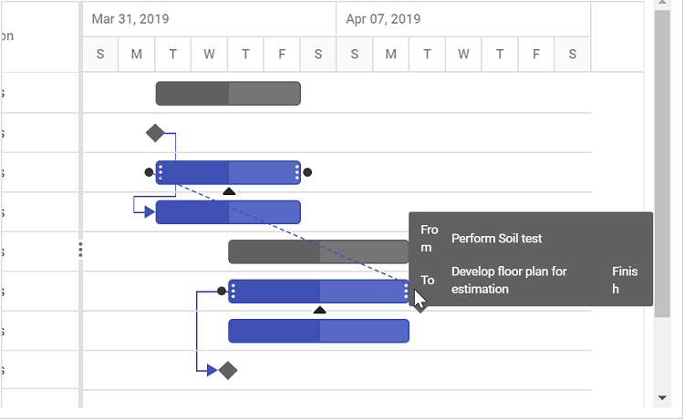
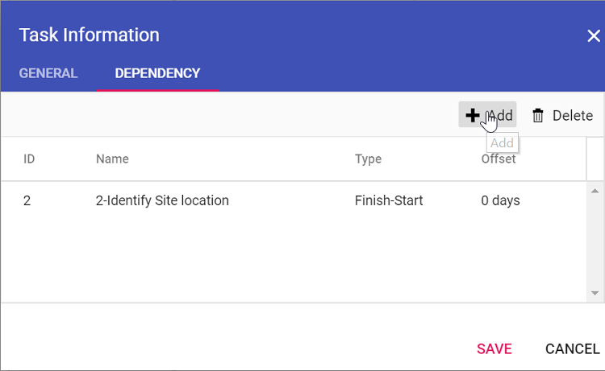
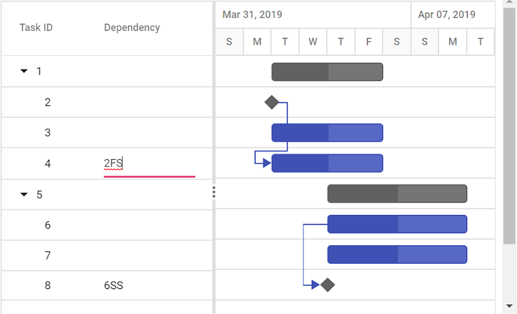

# Editing Tasks in React Gantt Chart Component

Editing tasks in the React Gantt Chart component enables dynamic project updates, such as modifying task durations, names, or dependencies, using cell editing, dialog, taskbar interactions, or programmatic methods. Enable editing by setting [editSettings.allowEditing](https://ej2.syncfusion.com/react/documentation/api/gantt/editSettings#allowediting) and [editSettings.allowTaskbarEditing](https://ej2.syncfusion.com/react/documentation/api/gantt/editSettings#allowtaskbarediting) to **true** with `Edit` injected, ensuring task data aligns with [taskFields](https://ej2.syncfusion.com/react/documentation/api/gantt#taskfields) mappings (e.g., id, name, startDate). Cell editing allows direct updates in the TreeGrid pane, dialog editing provides a comprehensive interface, taskbar dragging adjusts durations or dates, and connector lines manage dependencies via drag-and-drop. Use the [editSettings.mode](https://ej2.syncfusion.com/react/documentation/api/gantt/editSettings#mode) property to control editing behavior (**Auto** or **Dialog**). Customize dialog fields with [addDialogFields](https://ej2.syncfusion.com/react/documentation/api/gantt#adddialogfields) and [editDialogFields](https://ej2.syncfusion.com/react/documentation/api/gantt#editdialogfields) for tailored forms. The [updateRecordById](https://ej2.syncfusion.com/react/documentation/api/gantt#updaterecordbyid) method enables programmatic updates, except for task IDs. Ensure valid data to prevent issues and maintain dependency integrity.

To get start quickly with CRUD functionalities, you can check on this video:



## Edit tasks via cell editing

Enable cell editing by setting [editSettings.allowEditing](https://ej2.syncfusion.com/react/documentation/api/gantt/editSettings#allowediting) to **true**, [editSettings.mode](https://ej2.syncfusion.com/react/documentation/api/gantt/editSettings#mode) to **Auto**, and injecting `Edit`. Double-click a TreeGrid cell to edit fields like task name or duration directly, ideal for quick updates. Ensure `taskFields` mappings are valid for seamless editing.












        


## Edit tasks via dialog

Enable dialog editing by setting [editSettings.allowEditing](https://ej2.syncfusion.com/react/documentation/api/gantt/editSettings#allowediting) to **true**, [editSettings.mode](https://ej2.syncfusion.com/react/documentation/api/gantt/editSettings#mode) to **Dialog**, and injecting `Edit`. Double-click a row on the TreeGrid or chart side to open a dialog for editing task details, such as start date or dependencies, suitable for comprehensive updates. In **Auto** mode, double-clicking the chart side opens the dialog, while the TreeGrid side enables cell editing.












        


## Customize dialog tabs

Customize the edit dialog by defining tabs with [addDialogFields](https://ej2.syncfusion.com/react/documentation/api/gantt#adddialogfields) and [editDialogFields](https://ej2.syncfusion.com/react/documentation/api/gantt#editdialogfields), using the [type](https://ej2.syncfusion.com/react/documentation/api/gantt/dialogFieldType/) property (e.g., General, Dependency). This organizes fields into tabs for focused editing, such as task details or dependencies, with `Edit` required.

The following sample demonstrates customization using properties and the [actionComplete](https://ej2.syncfusion.com/react/documentation/gantt/events#actioncomplete) event.












        


### Limit fields in general tab

Restrict fields in the dialog’s General tab using [addDialogFields](https://ej2.syncfusion.com/react/documentation/api/gantt#adddialogfields) and [editDialogFields](https://ej2.syncfusion.com/react/documentation/api/gantt#editdialogfields) with [type](https://ej2.syncfusion.com/react/documentation/api/gantt/addDialogFieldSettings#type) set to **General** and [fields](https://ej2.syncfusion.com/react/documentation/api/gantt/addDialogFieldSettings#fields) specifying visible fields (e.g., TaskName, Duration). This streamlines editing by showing only relevant fields, requiring `Edit`.












        


## Edit task dependencies

Enable dependency editing by mapping the [dependency](https://ej2.syncfusion.com/react/documentation/api/gantt/taskFields#dependency) property in `taskFields`, setting [editSettings.allowEditing](https://ej2.syncfusion.com/react/documentation/api/gantt/editSettings#allowediting) and [editSettings.allowTaskbarEditing](https://ej2.syncfusion.com/react/documentation/api/gantt/editSettings#allowtaskbarediting) to **true**, and injecting `Edit`. Update dependencies via:

- **Mouse interactions**: Drag connector points on taskbars to create or modify links.

    

- **Dialog**: Edit the Dependency tab in the edit dialog.

    

- **Cell editing**: Update the dependency field in the TreeGrid. Ensure valid dependency strings to avoid circular references.

    












        


## Edit tasks programmatically

You can update tasks programmatically using the [updateRecordById](https://ej2.syncfusion.com/react/documentation/api/gantt#updaterecordbyid) method by specifying the task ID and updated data. This requires `Edit` to be injected and supports automation, such as updating durations through a button. The task ID cannot be changed using this method. Ensure `taskFields` mappings are valid for successful updates.

To update an existing task ID with a new unique ID, use the [updateTaskId](https://ej2.syncfusion.com/react/documentation/api/gantt/index-default#updatetaskid) method.

> You can also update custom column values using the `updateRecordById` method. The `taskID` must be specified for the update to apply.












        


## Render custom edit component

You can render a custom edit component for a column using the [column.edit](https://ej2.syncfusion.com/react/documentation/api/gantt/column#edit) property.  This property supports the following methods to manage the component lifecycle:

- `create`: Initializes the custom component.
- `write`: Renders the component inside the cell.
- `read`: Retrieves the edited value.
- `destroy`: Cleans up the component instance.












        


## See also
- [How to add new tasks?](https://ej2.syncfusion.com/react/documentation/gantt/managing-tasks/adding-new-tasks)
- [How to manage task dependencies?](https://ej2.syncfusion.com/react/documentation/gantt/task-dependency)
- [How to configure critical path?](https://ej2.syncfusion.com/react/documentation/gantt/critical-path)