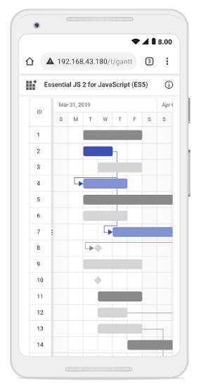

# Managing Tasks in React Gantt Chart Component

Managing tasks in the React Gantt Chart component enables dynamic project updates, such as inserting, deleting, or editing tasks and dependencies, by enabling [allowAdding](https://ej2.syncfusion.com/react/documentation/api/gantt/editSettings#allowadding), [allowDeleting](https://ej2.syncfusion.com/react/documentation/api/gantt/editSettings#allowdeleting), [allowEditing](https://ej2.syncfusion.com/react/documentation/api/gantt/editSettings#allowediting), and [allowTaskbarEditing](https://ej2.syncfusion.com/react/documentation/api/gantt/editSettings#allowtaskbarediting) with `EditService` injected. A primary key column, defined by [columns.isPrimaryKey](https://ej2.syncfusion.com/react/documentation/api/gantt/column#isprimarykey) set to **true** (e.g., on id), ensures reliable CRUD operations and task identification. Editing modes include cell editing for quick TreeGrid updates, dialog editing for comprehensive changes, taskbar dragging for duration or date adjustments, and connector line dragging for dependencies. Customize dialogs with templates or fields using [addDialogFields](https://ej2.syncfusion.com/react/documentation/api/gantt#adddialogfields) and [editDialogFields](https://ej2.syncfusion.com/react/documentation/api/gantt#editdialogfields). Methods like [addRecord](https://ej2.syncfusion.com/react/documentation/api/gantt#addrecord), [deleteRow](https://ej2.syncfusion.com/react/documentation/api/gantt#deleterow), and [updateRecordById](https://ej2.syncfusion.com/react/documentation/api/gantt#updaterecordbyid) support programmatic management. Ensure valid `taskFields` mappings and a primary key to enable editing seamlessly.

The following code example demonstrates editing in the Gantt Chart component.















Editing feature requires a primary key column for CRUD operations. While defining columns in Gantt Chart using the [columns](https://ej2.syncfusion.com/react/documentation/api/gantt#columns) property, it is mandatory that any one of the columns, must be a primary column. By default, the [id](https://ej2.syncfusion.com/react/documentation/api/gantt/taskFields#id) column will be the primary key column.  If [id](https://ej2.syncfusion.com/react/documentation/api/gantt/taskFields#id) column is not defined, we need to enable [isPrimaryKey](https://ej2.syncfusion.com/react/documentation/api/gantt/column#isprimarykey) for any one of the columns defined in the [columns](https://ej2.syncfusion.com/react/documentation/api/gantt#columns) property.

## Open new task dialog with default values

You can set default values when new task dialog opens using [actionBegin](https://ej2.syncfusion.com/react/documentation/api/gantt#actionbegin) event when `requestType` is **beforeOpenAddDialog**.












        


## Cell edit type and its params

The [columns.editType](https://ej2.syncfusion.com/react/documentation/api/gantt/column#edittype) is used to define the edit type for any particular column. You can set the [columns.editType](https://ej2.syncfusion.com/react/documentation/api/gantt/column#edittype) based on data type of the column.

Below is the combined content from the provided markdown sections in bullet points, as requested, ensuring clarity and conciseness while preserving the original information:

- **Cell edit types and components**:
  - **numericedit**: Uses the [NumericTextBox](https://helpej2.syncfusion.com/react/documentation/numerictextbox) component for editing integers, doubles, and decimals.
  - **defaultedit**: Uses the [TextBox](https://helpej2.syncfusion.com/react/documentation/textbox) component for editing string data.
  - **dropdownedit**: Uses the [DropDownList](https://helpej2.syncfusion.com/react/documentation/drop-down-list) component to display all unique values for a field.
  - **booleanedit**: Uses the [CheckBox](https://helpej2.syncfusion.com/react/documentation/check-box) component for editing boolean data.
  - **datepickeredit**: Uses the [DatePicker](https://helpej2.syncfusion.com/react/documentation/datepicker) component for editing date data.
  - **datetimepickeredit**: Uses the [DateTimePicker](https://helpej2.syncfusion.com/react/documentation/datetimepicker) component for editing date-time data.

- **Customization**:
  - Customize editor component behavior using the [columns.edit.params](https://ej2.syncfusion.com/react/documentation/api/gantt/column#edit) property.

- **Edit type parameters**:
  - **numericedit**: Supports parameters like `decimals: 2`, `value: 5`.
  - **dropdownedit**: Supports parameters like `value: 'Germany'`.
  - **booleanedit**: Supports parameters like `checked: true`.
  - **datepickeredit**: Supports parameters like `format: 'dd.MM.yyyy'`.
  - **datetimepickeredit**: Supports parameters like `value: new Date()`.












        


## Prevent particular column and taskbar editing

You can prevent editing for the particular column by setting [columns.allowEditing](https://ej2.syncfusion.com/react/documentation/api/gantt/column/#allowEditing) to **false**.

To restrict taskbar editing, set `args.cancel` to **true** in the [actionBegin](https://ej2.syncfusion.com/react/documentation/gantt/events#actionbegin) event based on `taskbarEditAction`.












        


## Cell Edit Template

The cell edit template is used to create a custom component for a particular column by invoking the following functions:

* `create` - It is used to create the element at the time of initialization.

* `write` - It is used to create the custom component or assign default value at the time of editing.

* `read` - It is used to read the value from the component at the time of save.

* `destroy` - It is used to destroy the component.












        


## Disable editing for particular column

You can disable editing for particular columns, by using the [columns.allowEditing](https://ej2.syncfusion.com/react/documentation/api/gantt/column#allowediting) property.

In the following demo, editing is disabled for the **TaskName** column.












        


## Customize control in add/edit dialog

In Gantt Chart, the controls such as form elements, grid and RTE in add and edit dialog can be customized by using [additionalParams](https://ej2.syncfusion.com/react/documentation/api/gantt/addDialogFieldSettingsModel#additionalParams) property.

### Customize general tab of dialog

The form element in the General tab of the add/edit dialog can be added or removed by using the [fields](https://ej2.syncfusion.com/react/documentation/api/gantt/addDialogFieldSettings#fields) property within the [addDialogFields](https://ej2.syncfusion.com/react/documentation/api/gantt/addDialogFieldSettings) and [editDialogFields](https://ej2.syncfusion.com/react/documentation/api/gantt/editDialogFieldSettings) settings respectively.

The controls of the `fields` can be customized by using the [edit](https://ej2.syncfusion.com/react/documentation/gantt/managing-tasks/managing-tasks#cell-edit-template) template feature.

In the below sample, General tab is customized using the `fields` property. The fields **TaskID**, **TaskName** and **newInput** are added in both `addDialogFields` and `editDialogFields` settings.












        


### Customize dependency, segments and resources tab of dialog

You can customize the dependency, segments, and resource tabs of the dialog box using the [additionalParams](https://ej2.syncfusion.com/react/documentation/api/gantt/addDialogFieldSettingsModel#additionalParams) property within the [addDialogFields](https://ej2.syncfusion.com/react/documentation/api/gantt/addDialogFieldSettings) and [editDialogFields](https://ej2.syncfusion.com/react/documentation/api/gantt/editDialogFieldSettings) settings respectively. This customization involves defining properties from the [grid](https://ej2.syncfusion.com/react/documentation/api/grid) within the `additionalParams` property.

In the example below: 
* The dependency tab enables [sorting](https://ej2.syncfusion.com/react/documentation/api/grid#allowsorting) and [toolbar](https://ej2.syncfusion.com/react/documentation/api/grid#toolbar) options. 
* The segments tab enables `sorting` and `toolbar` options and includes a new column `newData` defined with a specified [field](https://ej2.syncfusion.com/react/documentation/api/grid/columnModel#field).
* The resources tab defines a new column **Segment Task**  with specific properties such as `field`, [width](https://ej2.syncfusion.com/react/documentation/api/grid/columnModel#width) and [headerText](https://ej2.syncfusion.com/react/documentation/api/grid/columnModel#headertext).
These customizations are applied to both `addDialogFields` and `editDialogFields` settings.












        


### Customize note dialog tab

You can customize the note dialog tab using the [additionalParams](https://ej2.syncfusion.com/react/documentation/api/gantt/addDialogFieldSettingsModel#additionalParams) property within the [addDialogFields](https://ej2.syncfusion.com/react/documentation/api/gantt/addDialogFieldSettings) and [editDialogFields](https://ej2.syncfusion.com/react/documentation/api/gantt/editDialogFieldSettings) settings respectively. This customization involves defining properties from the [RTE](https://ej2.syncfusion.com/react/documentation/api/rich-text-editor) module within the `additionalParams` property.

In the following example, the notes tab is customized with the [inlinemode](https://ej2.syncfusion.com/react/documentation/api/rich-text-editor#inlinemode) property enabled, allowing for in-place editing. Additionally, the `OnSelection` property is enabled, which opens the toolbar inline upon selecting text.












        


## Touch interaction

The Gantt control editing actions can be achieved using the double tap and tap and drag actions on a element.

The following table describes different types of editing modes available in Gantt.

Action |Description
-----|-----
[Cell editing](managing-tasks#cell-editing) | To perform double tap on a specific cell, initiate the cell to be in edit state.
[Dialog editing](managing-tasks#dialog-editing) | To perform double tap on a specific row, initiate the edit dialog to be opened.
[Taskbar editing](managing-tasks#taskbar-editing) | Taskbar editing action is initiated using the `tap` action on the taskbar.   **Parent taskbar** : Once you tap on the parent taskbar, it will be changed to editing state. Perform only dragging action on parent taskbar editing.      **Child taskbar** : Once you tap the child taskbar, it will be changed to editing state.      **Dragging taskbar** : To drag a taskbar to the left or right in editing state.     **Resizing taskbar** : To resize a taskbar, drag the left/right resize icon.     **Progress resizing** : To change the progress, drag the progress resize icon to the left or right direction.

### Task dependency editing

You can `tap` the left/right connector point to initiate [task dependencies](managing-tasks/#task-dependencies) edit mode and again tap another taskbar to establish the dependency line between two taskbars.

The following table explains the taskbar state in dependency edit mode.

Taskbar state |Description
-----|-----
`Parent taskbar` | You cannot create dependency relationship to parent tasks.   
`Taskbar without dependency` |  If you tap a valid child taskbar, it will create `FS` type dependency line between tasks, otherwise exits from task dependency edit mode.   
`Taskbar with dependency` | If you tap the second taskbar, which has already been directly connected, it will ask to remove it.   
`Removing dependency` | Once you tap the taskbar with direct dependency, then confirmation dialog will be shown for removing dependency.   












        


>Note: In mobile device, you cannot create dependency other than `FS` by taskbar editing. By using cell/dialog editing, you can add all type of dependencies.

## Taskbar editing tooltip

The taskbar editing tooltip can be customized using the [tooltipSettings.editing](https://ej2.syncfusion.com/react/documentation/api/gantt/tooltipSettings/#editing) property. The following code example shows how to customize the taskbar editing tooltip in Gantt.












        


## See also

- [How to add new tasks?](https://ej2.syncfusion.com/react/documentation/gantt/managing-tasks/adding-new-tasks)
- [How to delete tasks?](https://ej2.syncfusion.com/react/documentation/gantt/managing-tasks/deleting-tasks)
- [How to manage task dependencies?](https://ej2.syncfusion.com/react/documentation/gantt/task-dependency)
- [How to configure critical path?](https://ej2.syncfusion.com/react/documentation/gantt/critical-path)