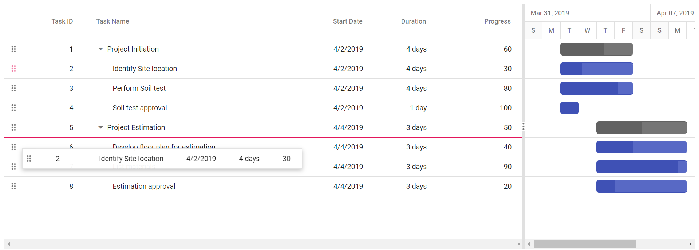
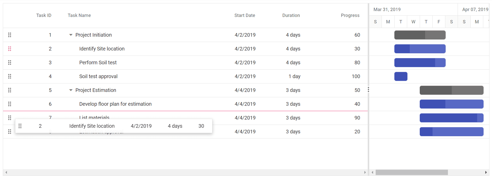
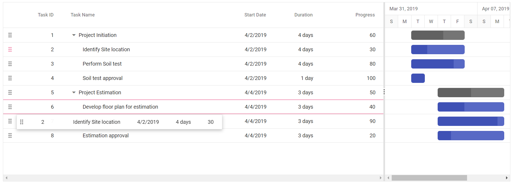

# Row Drag and Drop in React Gantt Chart Component

The Syncfusion<sup style="font-size:70%">&reg;</sup> React Gantt chart component includes built-in support for row drag and drop, enabling rows to be rearranged within the Gantt chart or dropped into custom components. 

To enable this feature, inject the `RowDD` and `Edit` module in the Gantt. Once injected, enable the functionality by setting the [allowRowDragAndDrop](https://ej2.syncfusion.com/react/documentation/api/gantt#allowrowdraganddrop) property.

## Drag and drop within the Gantt chart

The Gantt Chart component allows you to rearrange rows using a drag icon. To enable this feature, set the [allowRowDragAndDrop](https://ej2.syncfusion.com/react/documentation/api/gantt#allowrowdraganddrop) property to **true**.












        


## Different drop positions

In a Gantt chart, drag and drop functionality allows rearranging rows to adjust their position. You can drop rows in the following positions:

1. Above
2. Below
3. Child

**Above**

If the border line appears at the top of the target row (e.g., Task ID: 6) while dropping, the row will be placed `above` the target row as a sibling.



**Below**

If the border line appears at the bottom of the target row (e.g., Task ID: 6) while dropping, the row will be placed `below` the target row as a sibling.



**Child**

If the border line appears at both the top and bottom of the target row (e.g., Task ID: 6) while dropping, the row will be added as a `child` to the target row.



## Drag and drop to custom component 

You can drag rows from the Gantt Chart component into custom components for seamless data transfer. To enable this feature, set the [allowRowDragAndDrop](https://ej2.syncfusion.com/react/documentation/api/gantt#allowrowdraganddrop) property to **true**, and configure the `targetID` property within the `rowDropSettings` object of the `treeGrid` in the Gantt instance, inside the [load](https://ej2.syncfusion.com/react/documentation/gantt/events#load) event. The value of `targetID` must match the ID of the destination component. You can use the [rowDrop](https://ej2.syncfusion.com/react/documentation/gantt/events#rowdrop) event to handle the drop and perform necessary actions.












        


## Drag and drop multiple rows together

You can drag and drop multiple rows simultaneously in the Gantt Chart component. To enable this functionality, set the [selectionSettings.type](https://ej2.syncfusion.com/react/documentation/api/gantt/selectionSettings#type) property to **Multiple** , and set the [allowRowDragAndDrop](https://ej2.syncfusion.com/react/documentation/api/gantt#allowrowdraganddrop) property is set to **true**.












        


## Taskbar drag and drop between rows

You can rearrange rows in the Gantt Chart component by dragging the taskbar element. This functionality is enabled by setting the [allowTaskbarDragAndDrop](https://ej2.syncfusion.com/react/documentation/api/gantt#allowtaskbardraganddrop) property to **true**, allowing taskbars to be repositioned across rows for improved scheduling control.











 



## Drag and drop interactions with server side

You can perform row drag and drop operations in the Gantt Chart component with server-side interaction.

To handle drag and drop on the server side, use the [rowDrop](https://ej2.syncfusion.com/react/documentation/gantt/events#rowdrop) event on the client side. This event must be captured and processed to retrieve the necessary information about the dragged record and its intended new position. On the server, the record should be removed from its original index and inserted at the appropriate location based on the event data.

Follow these steps to implement server-side drag and drop:

**Step 1:** Add the following code to the **index** file to handle the `rowDrop` event:

```typescript

import * as React from 'react';
import * as ReactDOM from 'react-dom';
import {
  GanttComponent,
  ColumnsDirective,
  ColumnDirective,
  Inject,
  Toolbar,
  Edit,
  RowDD
} from '@syncfusion/ej2-react-gantt';
import { DataManager, UrlAdaptor } from '@syncfusion/ej2-data';
import { Ajax } from '@syncfusion/ej2-base';
import { RowDragEventArgs } from '@syncfusion/ej2-react-grids';

function App () {
  let ganttRef: GanttComponent | null = null;

  // DataManager for remote data
  const data = new DataManager({
    url: '/Home/UrlDatasource',
    adaptor: new UrlAdaptor(),
    offline: true
  });

  // Task field mapping
  const taskSettings = {
    id: 'TaskID',
    name: 'TaskName',
    startDate: 'StartDate',
    duration: 'Duration',
    child: 'subtasks',
    parentID: 'ParentId'
  };

  // Toolbar and edit settings
  const editSettings = { allowEditing: true, allowAdding: true, allowDeleting: true };
  const toolbar = ['Add', 'Edit', 'Delete', 'Update', 'Cancel', 'Search'];
  const splitterSettings = { position: '75%' };

  // Row drop event
  const rowDrop = (args: RowDragEventArgs): void => {
    const dragId = args.data[0][(ganttRef as GanttComponent).taskFields.id];
    const dropId = args.dropRecord[(ganttRef as GanttComponent).taskFields.id];
    const dataItem = args.data[0];
    const positions = { dragidMapping: dragId, dropidMapping: dropId, position: args.dropPosition };

    const ajax = new Ajax({
      url: '/Home/DragandDrop',
      type: 'POST',
      dataType: 'json',
      contentType: 'application/json; charset=utf-8',
      data: JSON.stringify({ value: dataItem, pos: positions })
    });

    ganttRef.showSpinner();
    ajax.send();
    ajax.onSuccess = () => {
      ganttRef.hideSpinner();
    };
  };

  return (
    <div>
      <GanttComponent
        ref={(gantt) => (ganttRef = gantt)}
        dataSource={data}
        treeColumnIndex={1}
        rowDrop={rowDrop}
        taskFields={taskSettings}
        splitterSettings={splitterSettings}
        allowRowDragAndDrop={true}
        editSettings={editSettings}
        toolbar={toolbar}
        height="450px"
      >
        <ColumnsDirective>
          <ColumnDirective field="TaskID" headerText="Task ID" isPrimaryKey={true} width="150" />
          <ColumnDirective field="TaskName" headerText="Task Name" width="150" />
          <ColumnDirective field="Duration" headerText="Duration" width="150" textAlign="Right" />
        </ColumnsDirective>
        <Inject services={[Toolbar, Edit, RowDD]} />
      </GanttComponent>
    </div>
  );
};

ReactDOM.render(<App />, document.getElementById('root'));

```

**Step 2:** Implement server-side logic to process the drag and drop operation.

```typescript

        public ActionResult UrlDatasource([FromBody] DataManagerRequest dm)
        {
            IEnumerable DataSource = GanttItems.GetSelfData();
            DataOperations operation = new DataOperations();

            if (dm.Sorted != null && dm.Sorted.Count > 0)
            {
                DataSource = operation.PerformSorting(DataSource, dm.Sorted);
            }
            if (dm.Where != null && dm.Where.Count > 0)
            {
                DataSource = operation.PerformFiltering(DataSource, dm.Where, dm.Where[0].Operator);
            }
            int count = DataSource.Cast<GanttItems>().Count();
            if (dm.Take != 0)
            {
                DataSource = operation.PerformTake(DataSource, dm.Take);
            }
             return dm.RequiresCounts ? Ok(new { result = DataSource, count }) : Ok(DataSource);

        }
          
        //Here handle the code of row drag and drop operations.
        public bool DragandDrop([FromBody] ICRUDModel value)
        {
            if (value.pos.position == "bottomSegment" || value.pos.position == "topSegment")
            {
                //for bottom and top segment drop position. If the dragged record is the only child for a particular record.
                //we need to set parentItem of dragged record to null and isParent of dragged record's parent to false.
                if (value.value.ParentId != null) // if dragged record has parent.
                {
                    var childCount = 0;
                    int parent = (int)value.value.ParentId;
                    childCount += FindChildRecords(parent); // finding the number of child for dragged record's parent.
                    if (childCount == 1) // if the dragged record is the only child for a particular record,
                    {
                        var i = 0;
                        for (; i < GanttItems.GetSelfData().Count; i++)
                        {
                            if (GanttItems.GetSelfData()[i].TaskID == parent)
                            {
                                //set isParent of dragged record's parent to false. 
                                GanttItems.GetSelfData()[i].isParent = false;
                                break;
                            }
                            if (GanttItems.GetSelfData()[i].TaskID == value.value.TaskID)
                            {
                                //set parentItem of dragged record to null.
                                GanttItems.GetSelfData()[i].ParentId = null;
                                break;
                            }


                        }
                    }
                }
                GanttItems.GetSelfData().Remove(GanttItems.GetSelfData().Where(ds => ds.TaskID == value.pos.dragidMapping).FirstOrDefault());
                var j = 0;
                for (; j < GanttItems.GetSelfData().Count; j++)
                {
                    if (GanttItems.GetSelfData()[j].TaskID == value.pos.dropidMapping)
                    {
                        //set dragged records parentItem with parentItem of.
                        //record in dropindex.
                        value.value.ParentId = GanttItems.GetSelfData()[j].ParentId;
                        break;
                    }
                }
                if (value.pos.position == "bottomSegment")
                {
                    this.Insert(value, value.pos.dropidMapping);
                }
                else if (value.pos.position == "topSegment")
                {
                    this.InsertAtTop(value, value.pos.dropidMapping);
                }
            }
            else if (value.pos.position == "middleSegment")
            {
                GanttItems.GetSelfData().Remove(GanttItems.GetSelfData().Where(ds => ds.TaskID == value.pos.dragidMapping).FirstOrDefault());
                value.value.ParentId = value.pos.dropidMapping;
                FindDropdata(value.pos.dropidMapping);
                this.Insert(value, value.pos.dropidMapping);
            }
            return true;
        }

        public ActionResult Insert([FromBody] ICRUDModel value, int rowIndex)
        {
            var i = 0;
            if (value.Action == "insert")
            {
                rowIndex = value.relationalKey;
            }
            Random ran = new Random();
            int a = ran.Next(100, 1000);

            for (; i < GanttItems.GetSelfData().Count; i++)
            {
                if (GanttItems.GetSelfData()[i].TaskID == rowIndex)
                {
                    value.value.ParentId = rowIndex;
                    if (GanttItems.GetSelfData()[i].isParent == false)
                    {
                        GanttItems.GetSelfData()[i].isParent = true;
                    }
                    break;

                }
            }
            i += FindChildRecords(rowIndex);
            GanttItems.GetSelfData().Insert(i, value.value);

            return Json(value.value);
        }

        public void InsertAtTop([FromBody] ICRUDModel value, int rowIndex)
        {
            var i = 0;
            for (; i < GanttItems.GetSelfData().Count; i++)
            {
                if (GanttItems.GetSelfData()[i].TaskID == rowIndex)
                {
                    break;

                }
            }
            i += FindChildRecords(rowIndex);
            GanttItems.GetSelfData().Insert(i - 1, value.value);
        }

        public void FindDropdata(int key)
        {
            var i = 0;
            for (; i < GanttItems.GetSelfData().Count; i++)
            {
                if (GanttItems.GetSelfData()[i].TaskID == key)
                {
                    GanttItems.GetSelfData()[i].isParent = true;
                }
            }
        }

        public int FindChildRecords(int? id)
        {
            var count = 0;
            for (var i = 0; i < GanttItems.GetSelfData().Count; i++)
            {
                if (GanttItems.GetSelfData()[i].ParentId == id)
                {
                    count++;
                    count += FindChildRecords(GanttItems.GetSelfData()[i].TaskID);
                }
            }
            return count;
        }
        public void Remove([FromBody] ICRUDModel value)
        {
            if (value.Key != null)
            {
                // GanttItems value = key;
                GanttItems.GetSelfData().Remove(GanttItems.GetSelfData().Where(ds => ds.TaskID == double.Parse(value.Key.ToString())).FirstOrDefault());
            }

        }

```

## Perform row drag and drop action programmatically

To rearrange rows programmatically in the Gantt Chart component, use the [reorderRows](https://ej2.syncfusion.com/react/documentation/api/gantt#reorderrows) method. This method accepts the following parameters: 

- **fromIndexes**: Indexes of the rows to be moved.  
- **toIndex**: Target index for placement.  
- **position**: Placement relative to the target (e.g., above or below).

In the example, a [click](https://ej2.syncfusion.com/react/documentation/api/button#click) event on an external button moves the row at index 1 **below** the row at index 2.











 



## Customize the drag and drop action

Customize the drag and drop behavior in the Gantt Chart component using the [rowDragStartHelper](https://ej2.syncfusion.com/react/documentation/gantt/events#rowdragstarthelper), [rowDragStart](https://ej2.syncfusion.com/react/documentation/gantt/events#rowdragstart), [rowDrag](https://ej2.syncfusion.com/react/documentation/gantt/events#rowdrag), and [rowDrop](https://ej2.syncfusion.com/react/documentation/gantt/events#rowdrop) events. These events provide control over the drag lifecycle, allowing precise handling of row interactions.

In this example, drag and drop actions are customized using event hooks. The `rowDragStartHelper` event prevents dragging for the row where **TaskID** is 2, while the `rowDrop` event cancels the drop action for the row where **TaskID** is 4. Additionally, `rowDragStart` and `rowDrag` apply background styling based on the values in the **Progress** column.












        


### Prevent reordering a row as child to another row

To prevent rows from being reordered as children, set `args.cancel` to **true** in the [rowDrop](https://ej2.syncfusion.com/react/documentation/api/gantt#rowdrop) event. After canceling the default drop action, use the [reorderRows](https://ej2.syncfusion.com/react/documentation/api/gantt#reorderrows) method to reposition the row at a specific index. 
 
In the example, the drop action in **Child** position is blocked, and the dragged row is reordered **above** the target row.












        


## See also

* [Sorting data in the Syncfusion<sup style="font-size:70%">&reg;</sup> Gantt Chart](https://ej2.syncfusion.com/react/documentation/gantt/sorting)
* [Filtering data in the Syncfusion<sup style="font-size:70%">&reg;</sup> Gantt Chart](https://ej2.syncfusion.com/react/documentation/gantt/filtering/filtering)
* [How to configure row drag and drop?](https://ej2.syncfusion.com/react/documentation/gantt/rows/drag-and-drop)
