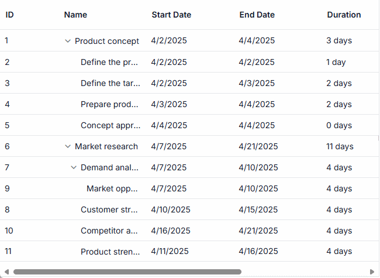

# Splitter in React Gantt Chart Component

The splitter in the React Gantt Chart component divides the TreeGrid pane and Chart pane, enabling flexible width allocation for project visualization. Configured via the [splitterSettings](https://ej2.syncfusion.com/react/documentation/api/gantt/splitterSettings) property, the splitter supports pixel or percentage-based positioning, column-based alignment, and predefined view modes. The [setSplitterPosition](https://ej2.syncfusion.com/react/documentation/api/gantt#setsplitterposition) method adjusts positioning dynamically, while the [splitterResizeStart](https://ej2.syncfusion.com/react/documentation/gantt/events#splitterresizestart), [splitterResizing](https://ej2.syncfusion.com/react/documentation/gantt/events#splitterresizing), and [splitterResized](https://ej2.syncfusion.com/react/documentation/gantt/events#splitterresized) events handle resize interactions. The splitter includes ARIA labels for accessibility, ensuring screen reader compatibility, and adapts to responsive designs, though narrow screens may limit visible columns or timeline segments. By default, both panels are visible with equal width.

## Configure splitter position

Set the splitter position using [splitterSettings.position](https://ej2.syncfusion.com/react/documentation/api/gantt/splitterSettings#position) with pixel (e.g., "300px") or percentage (e.g., "30%") values to define the TreeGrid pane width, or align to a column edge with [splitterSettings.columnIndex](https://ej2.syncfusion.com/react/documentation/api/gantt/splitterSettings#columnindex).

The following example sets a percentage-based splitter position. This configuration allocates 50% width to the TreeGrid panel.












        


> If both [position](https://ej2.syncfusion.com/react/documentation/api/gantt/splitterSettings#position) and [columnIndex](https://ej2.syncfusion.com/react/documentation/api/gantt/splitterSettings#columnindex) are defined in [splitterSettings](https://ej2.syncfusion.com/react/documentation/api/gantt/splitterSettings), only `position` is applied because it takes precedence over `columnIndex`.

## Configure view modes

Set predefined view modes with [splitterSettings.view](https://ej2.syncfusion.com/react/documentation/api/gantt/splitterSettings#view):

- **Default**: Displays both TreeGrid and Chart panels.
- **Grid**: Shows only the TreeGrid panel for data-focused views.
- **Chart**: Shows only the Chart panel for timeline visualization.

The following example configures the Grid view mode. This configuration prioritizes the TreeGrid for detailed task analysis.













## Adjust splitter position dynamically

Change the splitter position using the [setSplitterPosition](https://ej2.syncfusion.com/react/documentation/api/gantt#setsplitterposition) method with pixel, percentage, or column index values, triggered by events like window resizing or button clicks.

The following example adjusts the splitter dynamically:












        


## Customize splitter appearance

Customize the splitter’s appearance in the Gantt Chart component by handling the [dataBound](https://ej2.syncfusion.com/react/documentation/gantt/events#databound), [splitterResizing](https://ej2.syncfusion.com/react/documentation/gantt/events#splitterresizing) and [splitterResized](https://ej2.syncfusion.com/react/documentation/gantt/events#splitterresized) events to dynamically adjust styles, such as the background color or visibility of the resize handler. This enhances visual feedback during splitter interactions, improving usability for resizing the TreeGrid and Chart panels. The splitter retains ARIA labels for accessibility, ensuring screen reader compatibility.

The following example customizes the splitter’s background and hides the resize handler during resizing:















## See also
- [How to configure Gantt Chart columns?](https://ej2.syncfusion.com/react/documentation/gantt/columns/columns)
- [How to customize the timeline?](https://ej2.syncfusion.com/react/documentation/gantt/time-line/time-line)
- [How to handle scrolling?](https://ej2.syncfusion.com/react/documentation/gantt/scrolling)