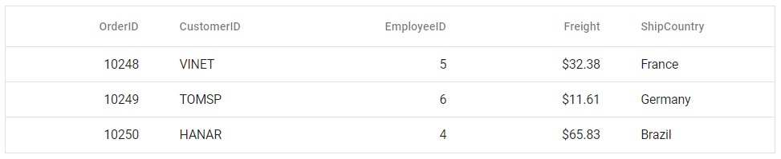

# Getting Started with Syncfusion<sup style="font-size:70%">&reg;</sup> React Components in a Gatsby Project

This article provides a step-by-step guide for creating a [Gatsby](https://www.gatsbyjs.com/) application and integrating Syncfusion<sup style="font-size:70%">&reg;</sup> React UI components.

`Gatsby` is an open-source React-based framework for building high-performance, modern web applications and static websites. It includes out-of-the-box optimizations and integrates React, GraphQL, and the modern JavaScript ecosystem.

## Prerequisites

[System requirements for Syncfusion<sup style="font-size:70%">&reg;</sup> React UI components](../system-requirement)

## Set up the Gatsby project

To create a new `Gatsby` project, use one of the commands that are specific to either NPM or Yarn.

```bash
npm create gatsby@latest
```

or

```bash
yarn create gatsby
```

Using one of the above commands will lead you to set up additional configurations for the project, as below:

**Define the project name:** You can specify the name of the project directly. Let's specify the name of the project as `my-project` for this article.

```bash
What would you like to call your site?
√ · my-project
What would you like to name the folder where your site will be created?
√ / my-project
√ Will you be using JavaScript or TypeScript?       
· TypeScript
√ Will you be using a CMS?
· No (or I'll add it later)
√ Would you like to install a styling system?
· No (or I'll add it later)
√ Would you like to install additional features with other plugins?No items were selected


Thanks! Here's what we'll now do:

    Create a new Gatsby site in the folder my-project

? Shall we do this? (Y/n) » Yes
```

Upon completing the aforementioned steps to create `my-project`, run the following command to jump into the project directory:

```bash
cd my-project
```

Now that `my-project` is ready to run with default settings, let's add Syncfusion<sup style="font-size:70%">&reg;</sup> components to the project.

## Install Syncfusion<sup style="font-size:70%">&reg;</sup> React packages

Syncfusion<sup style="font-size:70%">&reg;</sup> React component packages are available at [npmjs.com](https://www.npmjs.com/search?q=ej2-react). Install the required component package using the following command:

```bash
npm install @syncfusion/ej2-react-grids --save
```

or

```bash
yarn add @syncfusion/ej2-react-grids
```

This guide uses the [React Grid component](https://www.syncfusion.com/react-components/react-data-grid) as an example.

## Import Syncfusion<sup style="font-size:70%">&reg;</sup> CSS styles

Themes for Syncfusion<sup style="font-size:70%">&reg;</sup> React components can be imported using CSS or SASS styles provided in the npm packages. Additional customization options, CDN, and theme generation tools are available; see the [themes topic](https://ej2.syncfusion.com/react/documentation/appearance/theme) for more information.

For this example, the `Tailwind 3` theme is imported into the **src/pages/style.css** file to style the Grid component and its dependencies.




@import "../../node_modules/@syncfusion/ej2-base/styles/tailwind3.css";
@import "../../node_modules/@syncfusion/ej2-buttons/styles/tailwind3.css";
@import "../../node_modules/@syncfusion/ej2-calendars/styles/tailwind3.css";
@import "../../node_modules/@syncfusion/ej2-dropdowns/styles/tailwind3.css";
@import "../../node_modules/@syncfusion/ej2-inputs/styles/tailwind3.css";
@import "../../node_modules/@syncfusion/ej2-navigations/styles/tailwind3.css";
@import "../../node_modules/@syncfusion/ej2-popups/styles/tailwind3.css";
@import "../../node_modules/@syncfusion/ej2-splitbuttons/styles/tailwind3.css";
@import "../../node_modules/@syncfusion/ej2-react-grids/styles/tailwind3.css";




> **Note:** The order of importing CSS styles should be in line with its dependency graph. The Grid component requires CSS from multiple packages because it depends on other Syncfusion components for its full functionality.

## Add a Syncfusion<sup style="font-size:70%">&reg;</sup> React component

Follow the below steps to add the React Grid component to the Gatsby project:

**Step 1:** Import the Grid component and its required directives in the **src/pages/index.tsx** file.




import { GridComponent, ColumnsDirective, ColumnDirective } from '@syncfusion/ej2-react-grids';




**Step 2:** Define the Grid component with the [dataSource](https://ej2.syncfusion.com/react/documentation/api/grid/#datasource) property and column definitions. Declare the values for the `dataSource` property.




import * as React from 'react';
import { GridComponent, ColumnsDirective, ColumnDirective } from '@syncfusion/ej2-react-grids';
import './style.css';

export function App() {
  const data = [
    {
      OrderID: 10248, CustomerID: 'VINET', EmployeeID: 5, ShipCountry: 'France', Freight: 32.38
    },
    {
      OrderID: 10249, CustomerID: 'TOMSP', EmployeeID: 6, ShipCountry: 'Germany', Freight: 11.61
    },
    {
      OrderID: 10250, CustomerID: 'HANAR', EmployeeID: 4, ShipCountry: 'Brazil', Freight: 65.83
    }
  ];
  return (
    <GridComponent dataSource={data}>
      <ColumnsDirective>
        <ColumnDirective field='OrderID' width='100' textAlign="Right" />
        <ColumnDirective field='CustomerID' width='100' />
        <ColumnDirective field='EmployeeID' width='100' textAlign="Right" />
        <ColumnDirective field='Freight' width='100' format="C2" textAlign="Right" />
        <ColumnDirective field='ShipCountry' width='100' />
      </ColumnsDirective>
    </GridComponent>
  );
}

export default App;




## Run the project

To run the project, use the following command:

```bash
npm run develop
```

or

```bash
yarn run develop
```

The output will appear as follows:



## See also

[Getting Started with the Syncfusion<sup style="font-size:70%">&reg;</sup> React UI Component](../getting-started/quick-start)
