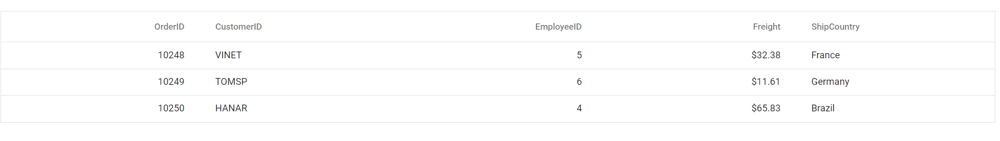

# Getting Started with React UI Components with Next.js

This article provides a step-by-step guide for setting up a [Next.js](https://nextjs.org/) project and integrating the Syncfusion React components.

`Next.js` is a React-based open-source web development framework that allows you to build fast and scalable web applications using JavaScript and React. It provides features such as server-side rendering, automatic code splitting, routing, and API routes, making it an excellent choice for building modern web applications. 

## Prerequisites

[System requirements for Syncfusion React UI components](../system-requirement)

## Set up the Next.js project

To create a new `Next.js` project, use one of the commands that are specific to either NPM or Yarn.

```bash
npx create-next-app@latest
```

or

```bash
yarn create next-app
```

Using one of the above commands will lead you to set up additional configurations for the project as below:

1.Define the project name: We can specify the name of the project directly. Let's specify the name of the project as `my-project` for this article.

```bash
? What is your project named? » my-project
```

2.Select the required packages.
```bash
√ What is your project named? ... my-project
√ Would you like to use TypeScript with this project? ... `No` / Yes
√ Would you like to use ESLint with this project? ... `No` / Yes
√ Would you like to use Tailwind CSS with this project? ... `No` / Yes
√ Would you like to use `src/` directory with this project? ... No / `Yes`
√ Would you like to use experimental `app/` directory with this project? ... `No` / Yes
√ What import alias would you like configured? ... @/*
Creating a new Next.js app in D:\my-project.
```

3.Upon completing the aforementioned steps to create `my-project`, navigate to the directory using the below command:

```bash
cd my-project
```

Now that `my-project` is ready to run with default settings, let's add Syncfusion components to the project.

## Add Syncfusion React packages

Syncfusion React component packages are available at [npmjs.com](https://www.npmjs.com/search?q=ej2-react). To use Syncfusion React components in the project, install the corresponding npm package.

This article uses the [React Grid component](https://www.syncfusion.com/react-components/react-data-grid) as an example. To use the React Grid component in the project, the `@syncfusion/ej2-react-grids` package needs to be installed using the following command:

```bash
npm install @syncfusion/ej2-react-grids --save
```

or

```bash
yarn add @syncfusion/ej2-react-grids
```

## Import Syncfusion CSS styles

You can import themes for the Syncfusion React component in various ways, such as using CSS or SASS styles from npm packages, CDN, [CRG](https://ej2.syncfusion.com/javascript/documentation/common/custom-resource-generator/) and [Theme Studio](https://ej2.syncfusion.com/react/documentation/appearance/theme-studio/). Refer to [themes topic](https://ej2.syncfusion.com/react/documentation/appearance/theme/) to know more about built-in themes and different ways to refer to theme's in a React project.

In this article, `Material` theme is applied using CSS styles, which are available in installed packages. The necessary `Material` CSS styles for the Grid component and its dependents were imported into the **src/pages/_app.js** file and removed the existing style in that file.




import '../../node_modules/@syncfusion/ej2-base/styles/material.css';
import '../../node_modules/@syncfusion/ej2-buttons/styles/material.css';  
import '../../node_modules/@syncfusion/ej2-calendars/styles/material.css';  
import '../../node_modules/@syncfusion/ej2-dropdowns/styles/material.css';  
import '../../node_modules/@syncfusion/ej2-inputs/styles/material.css';  
import '../../node_modules/@syncfusion/ej2-navigations/styles/material.css';
import '../../node_modules/@syncfusion/ej2-popups/styles/material.css';
import '../../node_modules/@syncfusion/ej2-splitbuttons/styles/material.css';
import "../../node_modules/@syncfusion/ej2-react-grids/styles/material.css";




> The order of importing CSS styles should be in line with its dependency graph.

## Add Syncfusion React component

Follow the below steps to add the React Grid component to the Next.js project:

1.Before adding the Grid component to your markup, import the Grid component in the **src/pages/index.js** file.




import { ColumnDirective, ColumnsDirective, GridComponent } from '@syncfusion/ej2-react-grids';




2.Then, define the Grid component with the [dataSource](https://ej2.syncfusion.com/react/documentation/api/grid#datasource) property and column definitions. Declare the values for the `dataSource` property.  




import { ColumnDirective, ColumnsDirective, GridComponent } from '@syncfusion/ej2-react-grids';

export default function Home() {
  const data = [
    {
      OrderID: 10248, CustomerID: 'VINET', EmployeeID: 5, ShipCountry: 'France', Freight: 32.38
    },
    {
      OrderID: 10249, CustomerID: 'TOMSP', EmployeeID: 6, ShipCountry: 'Germany', Freight: 11.61
    },
    {
      OrderID: 10250, CustomerID: 'HANAR', EmployeeID: 4, ShipCountry: 'Brazil', Freight: 65.83
    }
  ];
  return (
    <GridComponent dataSource={data}>
      <ColumnsDirective>
          <ColumnDirective field='OrderID' width='100' textAlign="Right"/>
          <ColumnDirective field='CustomerID' width='100'/>
          <ColumnDirective field='EmployeeID' width='100' textAlign="Right"/>
          <ColumnDirective field='Freight' width='100' format="C2" textAlign="Right"/>
          <ColumnDirective field='ShipCountry' width='100'/>
      </ColumnsDirective>
    </GridComponent>
  );
}




## Run the project

To run the project, use the following command:

```bash
npm run dev
```

or

```bash
yarn run dev
```

The output will appear as follows:


## See also

[Getting Started with the Syncfusion React UI Component](../getting-started/quick-start.md)