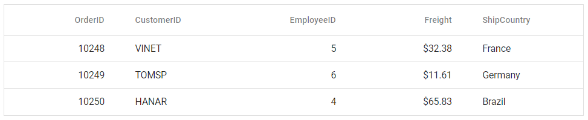

# Getting Started with Syncfusion<sup style="font-size:70%">&reg;</sup> React Components in Preact

This article outlines the steps required to set up a [Preact](https://preactjs.com/) project and integrate Syncfusion<sup style="font-size:70%">&reg;</sup> React components.

`Preact` is a fast, lightweight JavaScript library that provides a modern API similar to React. It is optimized for minimal file size and fast performance, making it well-suited for projects where load time and bundle size are important.

## Prerequisites

[System requirements for Syncfusion<sup style="font-size:70%">&reg;</sup> React UI components](../system-requirement)

## Set up the Preact project

To create a new `Preact` project, use one of the commands that are specific to either NPM or Yarn.

```bash
npm init preact@latest
```

or

```bash
yarn create preact
```

Using one of the above commands will lead you to set up additional configurations for the project, as below:

**Step 1: Define the project name** - You can specify the name of the project directly. Let's specify the name of the project as `my-project` for this article.

```bash
T  Preact - Fast 3kB alternative to React with the same modern API
|
*  Project directory:
|  my-project
—      
```

**Step 2: Choose the project language** - Select `JavaScript` as the framework variant to build this Preact project using JavaScript.

```bash
T  Preact - Fast 3kB alternative to React with the same modern API
|
*  Project language:
|  > JavaScript
|    TypeScript
—
```

**Step 3: Configure project options** - Configure the project as shown below for this article.

```bash
T  Preact - Fast 3kB alternative to React with the same modern API
|
*  Use router?
|    Yes / > No
—
|
*  Prerender app (SSG)?
|    Yes / > No
—
|
*  Use ESLint?
|    Yes / > No
—
```

**Step 4: Navigate to the project directory** - After completing the above steps to create `my-project`, navigate to the project directory using the following command:

```bash
cd my-project
```

Ensure your HTML has a mount point for the app. For example, in `index.html` add:
```html
<div id="app"></div>
```

Now that `my-project` is ready to run with default settings, let's add Syncfusion<sup style="font-size:70%">&reg;</sup> components to the project.

## Install Syncfusion<sup style="font-size:70%">&reg;</sup> React packages

Syncfusion<sup style="font-size:70%">&reg;</sup> React component packages are available at [npmjs.com](https://www.npmjs.com/search?q=ej2-react). To use Syncfusion<sup style="font-size:70%">&reg;</sup> React components in the project, install the corresponding npm package.

This guide uses the [React Grid component](https://www.syncfusion.com/react-components/react-data-grid) as an example. To install the React Grid component package, use the following command:

```bash
npm install @syncfusion/ej2-react-grids --save
```

or

```bash
yarn add @syncfusion/ej2-react-grids
```

## Import Syncfusion<sup style="font-size:70%">&reg;</sup> CSS styles

Themes for Syncfusion<sup style="font-size:70%">&reg;</sup> React components can be added using CSS or SASS styles in the npm packages. Additional options are available via CDN or the [Theme Studio](https://ej2.syncfusion.com/react/documentation/appearance/theme-studio/). See the [themes documentation](https://ej2.syncfusion.com/react/documentation/appearance/theme/) for full details.

This example uses the `Tailwind 3` theme, imported in the **src/style.css** file:




@import "../node_modules/@syncfusion/ej2-base/styles/tailwind3.css";
@import "../node_modules/@syncfusion/ej2-buttons/styles/tailwind3.css";
@import "../node_modules/@syncfusion/ej2-calendars/styles/tailwind3.css";
@import "../node_modules/@syncfusion/ej2-dropdowns/styles/tailwind3.css";
@import "../node_modules/@syncfusion/ej2-inputs/styles/tailwind3.css";
@import "../node_modules/@syncfusion/ej2-navigations/styles/tailwind3.css";
@import "../node_modules/@syncfusion/ej2-popups/styles/tailwind3.css";
@import "../node_modules/@syncfusion/ej2-splitbuttons/styles/tailwind3.css";
@import "../node_modules/@syncfusion/ej2-react-grids/styles/tailwind3.css";




> **Note:** The order of importing CSS styles should be in line with its dependency graph. The Grid component requires CSS from multiple packages because it depends on other Syncfusion components for its full functionality.

## Add a Syncfusion<sup style="font-size:70%">&reg;</sup> React component

Follow the below steps to add the React Grid component to the Preact project:

**Step 1:** Import the Grid component and its required directives in the **src/index.jsx** file.




import { GridComponent, ColumnsDirective, ColumnDirective } from '@syncfusion/ej2-react-grids';




**Step 2:** Define the Grid component with the [dataSource](https://ej2.syncfusion.com/react/documentation/api/grid#datasource) property and column definitions. Declare the values for the `dataSource` property.




import { render } from 'preact';
import { ColumnDirective, ColumnsDirective, GridComponent } from '@syncfusion/ej2-react-grids';
import './style.css';

export function App() {
  const data = [
    {
      OrderID: 10248, CustomerID: 'VINET', EmployeeID: 5, ShipCountry: 'France', Freight: 32.38
    },
    {
      OrderID: 10249, CustomerID: 'TOMSP', EmployeeID: 6, ShipCountry: 'Germany', Freight: 11.61
    },
    {
      OrderID: 10250, CustomerID: 'HANAR', EmployeeID: 4, ShipCountry: 'Brazil', Freight: 65.83
    }
  ];
  return (
    <GridComponent dataSource={data}>
      <ColumnsDirective>
          <ColumnDirective field='OrderID' width='100' textAlign="Right"/>
          <ColumnDirective field='CustomerID' width='100'/>
          <ColumnDirective field='EmployeeID' width='100' textAlign="Right"/>
          <ColumnDirective field='Freight' width='100' format="C2" textAlign="Right"/>
          <ColumnDirective field='ShipCountry' width='100'/>
      </ColumnsDirective>
    </GridComponent>
  );
}

render(<App />, document.getElementById('app'));




## Run the project

To run the project, use the following command:

```bash
npm run dev
```

or

```bash
yarn run dev
```

The output will appear as follows:



## See also

[Getting Started with Syncfusion<sup style="font-size:70%">&reg;</sup> React UI Component](../getting-started/quick-start)
