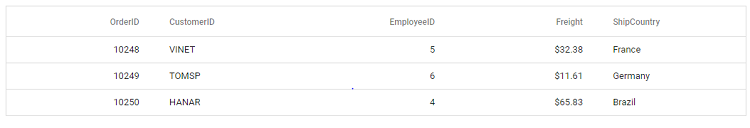

# Getting Started with React UI Components in the SharePoint Framework

This article provides a step-by-step guide for setting up a [SharePoint](https://learn.microsoft.com/en-us/sharepoint/dev/) project and integrating the Syncfusion<sup style="font-size:70%">&reg;</sup> React components.

`SharePoint` Framework (SPFx) is a development model and framework provided by Microsoft for building custom solutions and extensions for SharePoint and Microsoft Teams. It is a modern, client-side framework that allows developers to create web parts, extensions, and customizations that can be deployed and used within SharePoint sites and Teams applications.

## Prerequisites

* [System requirements for Syncfusion<sup style="font-size:70%">&reg;</sup> React UI components](../system-requirement)

* [System requirements for the SharePoint Framework Development Environment](https://learn.microsoft.com/en-us/sharepoint/dev/spfx/set-up-your-development-environment)

## Set up the SharePoint project

Create a new SPFx project using the following command:

**Step 1:** To initiate the creation of a new [SharePoint](https://learn.microsoft.com/en-us/sharepoint/dev/) project, use the following command:

```bash
yo @microsoft/sharepoint
```

**Step 2:** Specify the name of the project as `my-project` and the name of the WebPart as `App` for this article. You will be prompted with a series of configuration questions as shown below:

```bash
Let's create a new Microsoft 365 solution.
? What is your solution name? my-project
? Which type of client-side component to create? WebPart
Add new Web part to solution my-project.
? What is your Web part name? App
? Which template would you like to use? React
```

**Step 3:** To establish trust for the certificate in the development environment, execute the following command:

```bash
gulp trust-dev-cert
```

With these steps complete, your `my-project` SharePoint Framework solution is ready for Syncfusion<sup style="font-size:70%">&reg;</sup> component integration.

## Add Syncfusion<sup style="font-size:70%">&reg;</sup> React packages

Syncfusion<sup style="font-size:70%">&reg;</sup> React component packages are available at [npmjs.com](https://www.npmjs.com/search?q=ej2-react). To use Syncfusion<sup style="font-size:70%">&reg;</sup> React components in the project, install the corresponding npm package.

This guide uses the [React Grid component](https://www.syncfusion.com/react-components/react-data-grid) as an example. To install the React Grid component package, use the following command:

```bash
npm install @syncfusion/ej2-react-grids --save
```

## Import Syncfusion<sup style="font-size:70%">&reg;</sup> CSS styles

Themes for Syncfusion<sup style="font-size:70%">&reg;</sup> React components can be applied using CSS files from npm packages, CDN, CRG, or [Theme Studio](https://ej2.syncfusion.com/react/documentation/appearance/theme-studio/). Refer to the [themes documentation](https://ej2.syncfusion.com/react/documentation/appearance/theme/) for more detail.

This example demonstrates importing the `Material` theme CSS within the `App.tsx` file located at `~/src/webparts/app/components/App.tsx`:




require('@syncfusion/ej2-react-grids/styles/material.css');




## Add Syncfusion<sup style="font-size:70%">&reg;</sup> React component

Follow the below steps to add the React Grid component:

**Step 1:** In the `App.tsx` file inside the **~/src/webparts/app/components** folder, declare the values for the [dataSource](https://ej2.syncfusion.com/react/documentation/api/grid#datasource) property.




const data = [
  {
    OrderID: 10248, CustomerID: 'VINET', EmployeeID: 5, ShipCountry: 'France', Freight: 32.38 
  },
  {
    OrderID: 10249, CustomerID: 'TOMSP', EmployeeID: 6, ShipCountry: 'Germany', Freight: 11.61 
  },
  {
    OrderID: 10250, CustomerID: 'HANAR', EmployeeID: 4, ShipCountry: 'Brazil', Freight: 65.83 
  }
];




**Step 2:** Define the Grid component with the `dataSource` property and column definitions.




import * as React from 'react';
import { ColumnDirective, ColumnsDirective, GridComponent } from '@syncfusion/ej2-react-grids';

export default class App extends React.Component<IAppProps, {}> {
  
  public render(): React.ReactElement<IAppProps> {
    return (
      <GridComponent dataSource={data}>
        <ColumnsDirective>
          <ColumnDirective field='OrderID' width='100' textAlign="Right" />
          <ColumnDirective field='CustomerID' width='100' />
          <ColumnDirective field='EmployeeID' width='100' textAlign="Right" />
          <ColumnDirective field='Freight' width='100' format="C2" textAlign="Right" />
          <ColumnDirective field='ShipCountry' width='100' />
        </ColumnsDirective>
      </GridComponent>
    );
  }
}




Here is the summarized code for the above steps:




import * as React from 'react';
import { IAppProps } from './IAppProps';
import { ColumnDirective, ColumnsDirective, GridComponent } from '@syncfusion/ej2-react-grids';

require('@syncfusion/ej2-react-grids/styles/material.css');

export default class App extends React.Component<IAppProps, {}> {
  
  public render(): React.ReactElement<IAppProps> {
    const data = [
      {
        OrderID: 10248, CustomerID: 'VINET', EmployeeID: 5, ShipCountry: 'France', Freight: 32.38 
      },
      {
        OrderID: 10249, CustomerID: 'TOMSP', EmployeeID: 6, ShipCountry: 'Germany', Freight: 11.61 
      },
      {
        OrderID: 10250, CustomerID: 'HANAR', EmployeeID: 4, ShipCountry: 'Brazil', Freight: 65.83 
      }
    ];

    return (
      <GridComponent dataSource={data}>
        <ColumnsDirective>
          <ColumnDirective field='OrderID' width='100' textAlign="Right" />
          <ColumnDirective field='CustomerID' width='100' />
          <ColumnDirective field='EmployeeID' width='100' textAlign="Right" />
          <ColumnDirective field='Freight' width='100' format="C2" textAlign="Right" />
          <ColumnDirective field='ShipCountry' width='100' />
        </ColumnsDirective>
      </GridComponent>
    );
  }
}




## Run the project

To run the project, use the following command:

```bash
gulp serve
```

The output will appear as follows:


