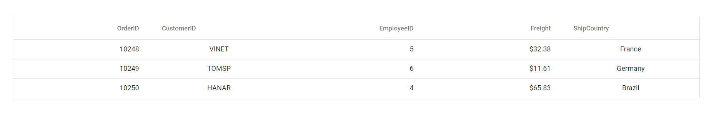

# Getting Started with React UI Components with Vite

This article provides a step-by-step guide for setting up a [Vite](https://vitejs.dev/) project with a JavaScript environment and integrating the Syncfusion<sup style="font-size:70%">&reg;</sup> React components.

`Vite` is a build tool and development server for modern web projects. Vite is designed to be fast and lightweight, supporting modern web technologies such as ES modules, TypeScript, JSX, and CSS modules. Vite's development server uses native ES modules in modern browsers, providing faster startup times and quicker feedback loops during development.

## Prerequisites

[System requirements for Syncfusion<sup style="font-size:70%">&reg;</sup> React UI components](../system-requirement)

## Set up the Vite project

To create a new `Vite` project, use one of the commands that are specific to either NPM or Yarn.

```bash
npm create vite@latest
```

or

```bash
yarn create vite
```

Using one of the above commands will lead you to set up additional configurations for the project as below:

1.Define the project name: We can specify the name of the project directly. Let's specify the name of the project as `my-project` for this article.

```bash
? Project name: » my-project
```

2.Select `React` as the framework. It will creates a React project.

```bash
? Select a framework: » - Use arrow-keys. Return to submit.
  Vanilla
  Vue
> React
  Preact
  Lit
  Svelte
  Others
```

3.Choose `JavaScript` as framework variant to build this Vite project using JavaScript and React.

```bash
? Select a variant: » - Use arrow-keys. Return to submit.
> JavaScript
  TypeScript
  JavaScript + SWC
  TypeScript + SWC
```

4.Upon completing the aforementioned steps to create `my-project`, run the following command to install its dependencies:

```bash
cd my-project
npm install
```

or

```bash
cd my-project
yarn install
```

Now that `my-project` is ready to run with default settings, let's add Syncfusion<sup style="font-size:70%">&reg;</sup> components to the project.

## Add Syncfusion<sup style="font-size:70%">&reg;</sup> React packages

Syncfusion<sup style="font-size:70%">&reg;</sup> React component packages are available at [npmjs.com](https://www.npmjs.com/search?q=ej2-react). To use Syncfusion<sup style="font-size:70%">&reg;</sup> React components in the project, install the corresponding npm package.

This article uses the [React Grid component](https://www.syncfusion.com/react-components/react-grid) as an example. To use the React Grid component in the project, the `@syncfusion/ej2-react-grids` package needs to be installed using the following command:

```bash
npm install @syncfusion/ej2-react-grids --save
```

or

```bash
yarn add @syncfusion/ej2-react-grids
```

## Import Syncfusion<sup style="font-size:70%">&reg;</sup> CSS styles

You can import themes for the Syncfusion<sup style="font-size:70%">&reg;</sup> React component in various ways, such as using CSS or SASS styles from npm packages, CDN, CRG and [Theme Studio](https://ej2.syncfusion.com/react/documentation/appearance/theme-studio/). Refer to [themes topic](https://ej2.syncfusion.com/react/documentation/appearance/theme/) to know more about built-in themes and different ways to refer to theme's in a React project.

In this article, `Material` theme is applied using CSS styles, which are available in installed packages. The necessary `Material` CSS styles for the Grid component and its dependents were imported into the **src/App.css** file.




@import "../node_modules/@syncfusion/ej2-base/styles/material.css";
@import "../node_modules/@syncfusion/ej2-buttons/styles/material.css";
@import "../node_modules/@syncfusion/ej2-calendars/styles/material.css";
@import "../node_modules/@syncfusion/ej2-dropdowns/styles/material.css";
@import "../node_modules/@syncfusion/ej2-inputs/styles/material.css";
@import "../node_modules/@syncfusion/ej2-navigations/styles/material.css";
@import "../node_modules/@syncfusion/ej2-popups/styles/material.css";
@import "../node_modules/@syncfusion/ej2-splitbuttons/styles/material.css";
@import "../node_modules/@syncfusion/ej2-react-grids/styles/material.css";




> The order of importing CSS styles should be in line with its dependency graph.

## Add Syncfusion<sup style="font-size:70%">&reg;</sup> React component

Follow the below steps to add the React Grid component to the Vite project:

1.Before adding the Grid component to your markup, import the Grid component in the **src/App.jsx** file.




import { ColumnDirective, ColumnsDirective, GridComponent } from '@syncfusion/ej2-react-grids';




2.Then, define the Grid component with the [dataSource](https://ej2.syncfusion.com/react/documentation/api/grid#datasource) property and column definitions. Declare the values for the `dataSource` property.




import './App.css'
import { ColumnDirective, ColumnsDirective, GridComponent } from '@syncfusion/ej2-react-grids';

function App() {
  const data = [
    {
      OrderID: 10248, CustomerID: 'VINET', EmployeeID: 5, ShipCountry: 'France', Freight: 32.38
    },
    {
      OrderID: 10249, CustomerID: 'TOMSP', EmployeeID: 6, ShipCountry: 'Germany', Freight: 11.61
    },
    {
      OrderID: 10250, CustomerID: 'HANAR', EmployeeID: 4, ShipCountry: 'Brazil', Freight: 65.83
    }
  ];
  return (
    <GridComponent dataSource={data}>
      <ColumnsDirective>
          <ColumnDirective field='OrderID' width='100' textAlign="Right"/>
          <ColumnDirective field='CustomerID' width='100'/>
          <ColumnDirective field='EmployeeID' width='100' textAlign="Right"/>
          <ColumnDirective field='Freight' width='100' format="C2" textAlign="Right"/>
          <ColumnDirective field='ShipCountry' width='100'/>
      </ColumnsDirective>
    </GridComponent>
  );
}

export default App;




## Run the project

To run the project, use the following command:

```bash
npm run dev
```

or

```bash
yarn run dev
```

The output will appear as follows:



## See also

[Getting Started with the Syncfusion<sup style="font-size:70%">&reg;</sup> React UI Component](../getting-started/quick-start)
