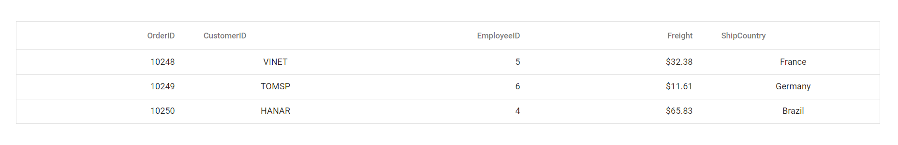

# Getting Started with Syncfusion® React Components in a Vite Project

This article provides a step-by-step guide for setting up a [Vite](https://vite.dev/guide/) project with JavaScript and integrating Syncfusion&reg; React components.

`Vite` is a fast, modern build tool and development server optimized for projects using technologies such as ES modules, TypeScript, JSX, and CSS modules. Its development server leverages native ES modules in modern browsers, providing rapid project startup and efficient feedback during development.

## Prerequisites

[System requirements for Syncfusion&reg; React UI components](../system-requirement)

## Set up the Vite project

To create a new `Vite` project, use one of the commands that are specific to either NPM or Yarn.

> **Tip:** When you run the command below, you will be prompted with **"Install dependencies and start now? (yes/no)"**. Type `yes` to proceed with the installation and automatically start your development server, or `no` if you prefer to install dependencies manually later.



npm create vite@latest my-project -- --template react


yarn create vite my-project --template react



## Add Syncfusion&reg; React packages

Syncfusion&reg; React component packages are available at [npmjs.com](https://www.npmjs.com/search?q=ej2-react). To use Syncfusion&reg; React components in the project, install the corresponding npm package.

This guide uses the [React Grid component](https://www.syncfusion.com/react-components/react-grid) as an example. To install the React Grid component package, use the following command:




npm install @syncfusion/ej2-react-grids --save




yarn add @syncfusion/ej2-react-grids




## Import Syncfusion&reg; CSS styles

Themes for Syncfusion&reg; React components can be applied with CSS files supplied by the npm packages, CDN, CRG, or [Theme Studio](https://ej2.syncfusion.com/react/documentation/appearance/theme-studio). For more information, see the [themes documentation](https://ej2.syncfusion.com/react/documentation/appearance/theme).

By default, Vite projects include a `index.css` file with default styles. These default styles may conflict with Syncfusion component styles. Clear all content from the `index.css` file to prevent style conflicts.

In this example, the `Tailwind 3` theme styles for the Grid component and its dependencies are imported in the **src/App.css** file:




@import "../node_modules/@syncfusion/ej2-base/styles/tailwind3.css";
@import "../node_modules/@syncfusion/ej2-buttons/styles/tailwind3.css";
@import "../node_modules/@syncfusion/ej2-calendars/styles/tailwind3.css";
@import "../node_modules/@syncfusion/ej2-dropdowns/styles/tailwind3.css";
@import "../node_modules/@syncfusion/ej2-inputs/styles/tailwind3.css";
@import "../node_modules/@syncfusion/ej2-navigations/styles/tailwind3.css";
@import "../node_modules/@syncfusion/ej2-popups/styles/tailwind3.css";
@import "../node_modules/@syncfusion/ej2-splitbuttons/styles/tailwind3.css";
@import "../node_modules/@syncfusion/ej2-react-grids/styles/tailwind3.css";




> The order of importing CSS styles should be in line with its dependency graph.

## Add Syncfusion&reg; React component

Now, you can add the React Grid component to your **src/App.jsx** file by importing it and defining it with the [dataSource](https://ej2.syncfusion.com/react/documentation/api/grid#datasource) property and column definitions. Use the following code:




import './App.css'
import { ColumnDirective, ColumnsDirective, GridComponent } from '@syncfusion/ej2-react-grids';

function App() {
  const data = [
    {
      OrderID: 10248, CustomerID: 'VINET', EmployeeID: 5, ShipCountry: 'France', Freight: 32.38
    },
    {
      OrderID: 10249, CustomerID: 'TOMSP', EmployeeID: 6, ShipCountry: 'Germany', Freight: 11.61
    },
    {
      OrderID: 10250, CustomerID: 'HANAR', EmployeeID: 4, ShipCountry: 'Brazil', Freight: 65.83
    }
  ];
  return (
    <GridComponent dataSource={data}>
      <ColumnsDirective>
          <ColumnDirective field='OrderID' width='100' textAlign="Right"/>
          <ColumnDirective field='CustomerID' width='100'/>
          <ColumnDirective field='EmployeeID' width='100' textAlign="Right"/>
          <ColumnDirective field='Freight' width='100' format="C2" textAlign="Right"/>
          <ColumnDirective field='ShipCountry' width='100'/>
      </ColumnsDirective>
    </GridComponent>
  );
}

export default App;




## Run the project

To run the project, use the following command:



npm run dev


yarn run dev



The output will appear as follows:

## See also

[Getting Started with the Syncfusion&reg; React UI Component](../getting-started/quick-start)
