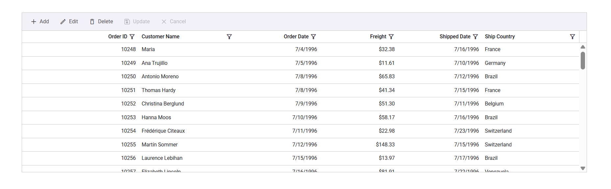

# Getting Started with Syncfusion® React Components in a Vite Project

This article provides a step-by-step guide for setting up a [Vite](https://vite.dev/guide/) project with JavaScript and integrating Syncfusion<sup style="font-size:70%">&reg;</sup> React components.

`Vite` is a fast, modern build tool and development server optimized for projects using technologies such as ES modules, TypeScript, JSX, and CSS modules. Its development server leverages native ES modules in modern browsers, providing rapid project startup and efficient feedback during development.





## Prerequisites

- [Node.js 24+](https://nodejs.org/en) (LTS recommended).
- Syncfusion CLI.

## Install the Syncfusion CLI 

Install the Syncfusion CLI globally using the following command:



npm install -g @syncfusion/cli



## Set up the Vite project using Syncfusion CLI

You can create a React Vite application using the Syncfusion CLI. The CLI provides two ways to create a project:

### Non-interactive mode

Non-interactive mode allows you to create a project directly using a single command with the required command-line arguments.



sf new my-project --framework react --template grid



In this mode, the project configuration is passed directly in the command. The above command creates a React Vite application configured with the Syncfusion<sup style="font-size:70%">&reg;</sup> Grid component.

### Interactive mode

Interactive mode guides you through the project creation process with step-by-step prompts.



sf



When you run the `sf` command, the CLI prompts you to select the required project configuration. To create a React Vite application with the Syncfusion<sup style="font-size:70%">&reg;</sup> Grid component, select the following options:




√ Project name? ... my-project
√ Choose Framework: » React
√ Choose Build Tool: » Vite
√ Choose Language: » JavaScript
√ Choose Template: » Grid
√ Choose Theme: » Material3
√ Choose Style Format: » CSS
√ Would you like to integrate the Syncfusion MCP Server (AI Assistant) into this project? ... no
√ Would you like to install Syncfusion Component Skills for AI-powered development? ... no      
√ Install dependencies and start app now? ... no




The above selections generate a React Vite application configured with the Syncfusion<sup style="font-size:70%">&reg;</sup> Grid component. You can choose different values for language, theme, style format, MCP setup, and skills installation based on your project requirements.

The Syncfusion<sup style="font-size:70%">&reg;</sup> CLI creates the project with a predefined template. After the project is generated, you can customize or replace the component code based on your application requirements.

## Run the project

Once the project is created, navigate to the project directory and run the following commands in your terminal.



cd my-project
npm install
npm run dev



The output will appear as follows:







## Prerequisites

[System requirements for Syncfusion<sup style="font-size:70%">&reg;</sup> React UI components](../system-requirement)

## Set up the Vite project

To create a new `Vite` project, use one of the commands that are specific to either NPM or Yarn.



npm create vite@latest my-project -- --template react


yarn create vite my-project --template react



After running the command, you will be prompted with a series of interactive questions to configure your project. Select the appropriate options for each prompt:

1. **Select a linter to use**: Choose the linter for your project (for example, `ESLint`).
2. **Install with npm and start now?**: Type `Yes` to proceed with installing the dependencies and automatically start the development server, or `No` to install dependencies manually later.

Navigate into the project directory with:

```
cd my-project
```
## Add Syncfusion<sup style="font-size:70%">&reg;</sup> React packages

Syncfusion<sup style="font-size:70%">&reg;</sup> React component packages are available at [npmjs.com](https://www.npmjs.com/search?q=ej2-react). To use Syncfusion<sup style="font-size:70%">&reg;</sup> React components in the project, install the corresponding npm package.

This guide uses the [React Grid component](https://www.syncfusion.com/react-components/react-grid) as an example. To install the React Grid component package, use the following command:




npm install @syncfusion/ej2-react-grids




yarn add @syncfusion/ej2-react-grids




## Import Syncfusion<sup style="font-size:70%">&reg;</sup> CSS styles

Themes for Syncfusion<sup style="font-size:70%">&reg;</sup> React components can be applied using CSS or SASS files from the [npm theme packages](https://ej2.syncfusion.com/react/documentation/appearance/theme#theme-packages), CDN, CRG, or [Theme Studio](https://ej2.syncfusion.com/react/documentation/appearance/theme-studio). For more information, see the [themes documentation](https://ej2.syncfusion.com/react/documentation/appearance/theme).

This guide uses the `Tailwind 3` theme as an example, sourced from the theme package. In this package, each component includes an `index.css` file that automatically loads all the required dependency styles. To install the [Tailwind 3](https://www.npmjs.com/package/@syncfusion/ej2-tailwind3-theme) theme package, use the following command:




npm install @syncfusion/ej2-tailwind3-theme




yarn add @syncfusion/ej2-tailwind3-theme




By default, Vite projects include a `src/index.css` file with default styles. These default styles may conflict with Syncfusion component styles. Clear all content from the `src/index.css` file to prevent style conflicts.

The required styles for the Grid component are imported in the **src/App.css** file:




@import "../node_modules/@syncfusion/ej2-tailwind3-theme/styles/grid/index.css";




## Add Syncfusion<sup style="font-size:70%">&reg;</sup> React component

Now, you can add the React Grid component to your **src/App.jsx** file by importing it and defining it with the [dataSource](https://ej2.syncfusion.com/react/documentation/api/grid#datasource) property and column definitions. Use the following code:




import './App.css';
import { ColumnDirective, ColumnsDirective, GridComponent } from '@syncfusion/ej2-react-grids';

function App() {
  const data = [
    {
      OrderID: 10248, CustomerID: 'VINET', EmployeeID: 5, ShipCountry: 'France', Freight: 32.38
    },
    {
      OrderID: 10249, CustomerID: 'TOMSP', EmployeeID: 6, ShipCountry: 'Germany', Freight: 11.61
    },
    {
      OrderID: 10250, CustomerID: 'HANAR', EmployeeID: 4, ShipCountry: 'Brazil', Freight: 65.83
    }
  ];
  return (
    <GridComponent dataSource={data}>
      <ColumnsDirective>
          <ColumnDirective field='OrderID' width='100' textAlign="Right"/>
          <ColumnDirective field='CustomerID' width='100'/>
          <ColumnDirective field='EmployeeID' width='100' textAlign="Right"/>
          <ColumnDirective field='Freight' width='100' format="C2" textAlign="Right"/>
          <ColumnDirective field='ShipCountry' width='100'/>
      </ColumnsDirective>
    </GridComponent>
  );
}

export default App;




## Run the project

To run the project, use the following command:



npm run dev


yarn run dev



The output will appear as follows:






## See also

[Getting Started with the Syncfusion<sup style="font-size:70%">&reg;</sup> React UI Component](./preact)
