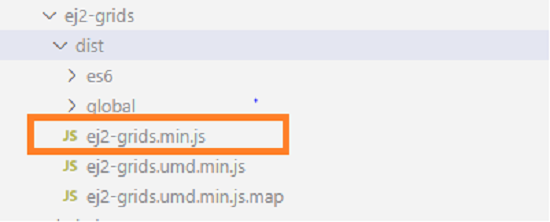

# Getting Started with webpack externals in React

The [Webpack Externals](https://webpack.js.org/configuration/externals/) are used to ignore the packages from the application while bundling and adding them as external CDN script references.

This article provides a step-by-step introduction to creating a simple react application and configuring the Syncfusion react packages with [Externals](https://webpack.js.org/configuration/externals/).

## Prerequisites

[System requirements for Syncfusion React UI components](../system-requirement)

## Create the React application

* Open the command prompt in your desired location. To create the application folder, use the following commands.

    ```bash
    mkdir Syncfusion-react-demo

    cd Syncfusion-react-demo
    ```

* Use the following commands to create a `package.json` file. Then install the [react](https://www.npmjs.com/package/react) and [react-dom](https://www.npmjs.com/package/react-dom) packages in the application.

     ```bash
     npm init

     npm install react react-dom
     ```

## Add Syncfusion React packages

Install the required Syncfusion React component package in the application. All Syncfusion React (Essential JS 2) packages are published on the [npmjs.com](https://www.npmjs.com/~syncfusionorg) public registry. So, choose the component that you want to install.

In this article, the Grid component is used as an example. To install the Grid component package, use the following command.

```bash
npm install @syncfusion/ej2-react-grids --save
```

## Add babel packages

Install the required babel presets packages in the application.

```bash
npm install babel-loader @babel/preset-react @babel/preset-env @babel/core --save-dev
```

## Add Syncfusion Grid component

* Create an `src` folder in the application repository. Then create an `index.html` Html, `index.js` entry and `App.js` component files inside the `src` folder location. Start adding the required components to the application.

* Open the `src/App.js` file and add the Grid component as follows.


    ```javascript
    import React from "react";
    import { ColumnDirective, ColumnsDirective, GridComponent } from '@syncfusion/ej2-react-grids';

    function App() {
      const data = [
        {
          OrderID: 10248, CustomerID: 'VINET', EmployeeID: 5, OrderDate: new Date(8364186e5),
          ShipName: 'Vins et alcools Chevalier', ShipCity: 'Reims', ShipAddress: '59 rue de l Abbaye',
          ShipRegion: 'CJ', ShipPostalCode: '51100', ShipCountry: 'France', Freight: 32.38, Verified: !0
        },
        {
          OrderID: 10249, CustomerID: 'TOMSP', EmployeeID: 6, OrderDate: new Date(836505e6),
          ShipName: 'Toms Spezialitäten', ShipCity: 'Münster', ShipAddress: 'Luisenstr. 48',
          ShipRegion: 'CJ', ShipPostalCode: '44087', ShipCountry: 'Germany', Freight: 11.61, Verified: !1
        },
        {
          OrderID: 10250, CustomerID: 'HANAR', EmployeeID: 4, OrderDate: new Date(8367642e5),
          ShipName: 'Hanari Carnes', ShipCity: 'Rio de Janeiro', ShipAddress: 'Rua do Paço, 67',
          ShipRegion: 'RJ', ShipPostalCode: '05454-876', ShipCountry: 'Brazil', Freight: 65.83, Verified: !0
        }
      ];
      return (
        <GridComponent dataSource={data}>
          <ColumnsDirective>
              <ColumnDirective field='OrderID' width='100' textAlign="Right"/>
              <ColumnDirective field='CustomerID' width='100'/>
              <ColumnDirective field='EmployeeID' width='100' textAlign="Right"/>
              <ColumnDirective field='Freight' width='100' format="C2" textAlign="Right"/>
              <ColumnDirective field='ShipCountry' width='100'/>
          </ColumnsDirective>
        </GridComponent>
      );
    }

    export default App;
    ```

*  Open the `src/index.js` file and add the app component as follows.

``` js
import React from "react";
import ReactDOM from "react-dom/client";
import App from "./App";

const root = ReactDOM.createRoot(document.getElementById("root"));
root.render(
    <App />
);
```

## Install and configure the webpack

* Install the webpack packages by using the following command.

    ```bash
     npm install webpack webpack-cli webpack-dev-server html-webpack-plugin --save-dev
    ```

* Create a `webpack.config.js` file in the application root repository using the following code sample.

```js
const path =  require('path');
const HTMLWebpackPlugin = require('html-webpack-plugin');

module.exports = {
    entry: path.resolve(__dirname, "src/index.js"),
    output: {
        path: path.join(__dirname, '/build'),
        filename: 'bundles.js',
        libraryTarget: 'umd',
    },
    plugins: [
        new HTMLWebpackPlugin({
            template: './src/index.html'
        }),
    ],
    module: {
        rules: [
            {
                test: /\.js$/,
                exclude: /node_modules/,
                use: {
                    loader: "babel-loader",
                    options: {
                        presets: ["@babel/preset-env", "@babel/preset-react"]
                    }
                }
            },
        ]
    }
}
```

## Configuring the webpack externals

* The Syncfusion react library name in the externals should be `SyncfusionReact[PackageName]`. The `PackageName` should start with a capital letter for every hyphen like `SyncfusionReactBarcodeGenerator` for ej2-react-**barcode-generator** package.

* Open the `webpack.config.js` file and add the Syncfusion react packages in the externals option as follows.

   ``` js
    module.exports = {
    ---
    externals: {
        "react": "React",
        "react-dom": "ReactDOM",
        "@syncfusion/ej2-react-grids": "SyncfusionReactGrids"
     },
     ---
    }
  ```

* Find the Syncfusion external CDN script `[package-name].min.js` file inside `dist` folder of the packages.

    

* Add the [React](https://reactjs.org/docs/cdn-links.html) and Syncfusion react Grid CDN references in the `src/index.html` file. The order of individual Syncfusion control package loading should be in line with its dependency graph. The CDN of the Dependency Packages should be included manually before the intended individual Syncfusion control package CDN.

```html
<!DOCTYPE html>
<html lang="en">
<head>
    <meta charset="UTF-8">
    <meta http-equiv="X-UA-Compatible" content="IE=edge">
    <meta name="viewport" content="width=device-width, initial-scale=1.0">
    <!-- React and ReactDom scripts -->
    <script crossorigin src="https://unpkg.com/react@18.2.0/umd/react.production.min.js"></script>
    <script crossorigin src="https://unpkg.com/react-dom@18.2.0/umd/react-dom.production.min.js"></script>

    <!-- Syncfusion React controls styles -->
    <link rel="stylesheet" href="https://cdn.syncfusion.com/ej2/material.css" />

    <!-- Syncfusion React controls scripts -->
    <script src="https://cdn.syncfusion.com/ej2/ej2-base/dist/ej2-base.min.js"></script>
    <script src="https://cdn.syncfusion.com/ej2/ej2-data/dist/ej2-data.min.js"></script>
    <script src="https://cdn.syncfusion.com/ej2/ej2-buttons/dist/ej2-buttons.min.js"></script>
    <script src="https://cdn.syncfusion.com/ej2/ej2-splitbuttons/dist/ej2-splitbuttons.min.js"></script>
    <script src="https://cdn.syncfusion.com/ej2/ej2-popups/dist/ej2-popups.min.js"></script>
    <script src="https://cdn.syncfusion.com/ej2/ej2-navigations/dist/ej2-navigations.min.js"></script>
    <script src="https://cdn.syncfusion.com/ej2/ej2-inputs/dist/ej2-inputs.min.js"></script>
    <script src="https://cdn.syncfusion.com/ej2/ej2-dropdowns/dist/ej2-dropdowns.min.js"></script>
    <script src="https://cdn.syncfusion.com/ej2/ej2-calendars/dist/ej2-calendars.min.js"></script>
    <script src="https://cdn.syncfusion.com/ej2/ej2-lists/dist/ej2-lists.min.js"></script>
    <script src="https://cdn.syncfusion.com/ej2/ej2-excel-export/dist/ej2-excel-export.min.js"></script>
    <script src="https://cdn.syncfusion.com/ej2/ej2-pdf-export/dist/ej2-pdf-export.min.js"></script>
    <script src="https://cdn.syncfusion.com/ej2/ej2-file-utils/dist/ej2-file-utils.min.js"></script>
    <script src="https://cdn.syncfusion.com/ej2/ej2-compression/dist/ej2-compression.min.js"></script>
    <script src="https://cdn.syncfusion.com/ej2/ej2-grids/dist/ej2-grids.min.js"></script>
    <script src="https://cdn.syncfusion.com/ej2/ej2-react-base/dist/ej2-react-base.min.js"></script>
    <script src="https://cdn.syncfusion.com/ej2/ej2-react-grids/dist/ej2-react-grids.min.js"></script>
    <title>Document</title>
</head>
<body>
  <div id="root"></div>
</body>
</html>
```

> Refer to the [Script Dependency](../common/script-dependency) section to discover the correct script reference sequence and its dependencies for a certain Syncfusion React component.

## Configure the package JSON

Open the `package.json` file and configure the application process in the scripts as follows.

```
{
  "scripts": {
    "start": "webpack-dev-server --mode development --open --hot",
    "build": "webpack --mode production"
  }
}
```

## Run the application

Run the application using the following command.

```bash
npm start
```


>[View Sample in GitHub.](https://github.com/SyncfusionExamples/ej2-react-webpack-externals)