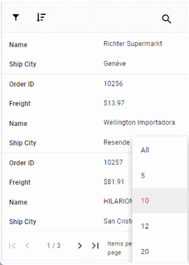

# Adaptive in React Grid component

The Grid user interface (UI) was redesigned to provide an optimal viewing experience and improve usability on small screens. This interface will render the filter, sort, column chooser, column menu(supports only when the `rowRenderingMode` as Horizontal) and edit dialogs adaptively and have an option to render the grid row elements in the vertical direction.

## Render adaptive dialogs

The Syncfusion React Grid offers a valuable feature for rendering adaptive dialogs, specifically designed to enhance the user experience on smaller screens. This feature proves especially useful for optimizing the interface on devices with limited screen real estate. The functionality is achieved by enabling the [enableAdaptiveUI](https://ej2.syncfusion.com/react/documentation/api/grid/#enableadaptiveui) property, allowing the grid to render filter, sort, and edit dialogs in full-screen mode.

Additionally, apply the `e-bigger` class to the grid's parent element to enable the adaptive view.

The following sample demonstrates how to enable and utilize adaptive dialogs in the Syncfusion React Grid:
















 

## Vertical row rendering

The Syncfusion React Grid introduces the feature of vertical row rendering, allowing you to display row elements in a vertical order. This is particularly useful for scenarios where a vertical presentation enhances data visibility. This is achieved by setting the [rowRenderingMode](https://ej2.syncfusion.com/react/documentation/api/grid#rowrenderingmode) property to the value **Vertical**.

>The default row rendering mode is **Horizontal**.

The following sample demonstrates how to dynamically change the row rendering mode between **Vertical** and **Horizontal** based on a DropDownList selection:




import { DropDownListComponent } from '@syncfusion/ej2-react-dropdowns';
import { ColumnDirective, ColumnsDirective, GridComponent, Inject, } from '@syncfusion/ej2-react-grids';
import { AggregateColumnsDirective, AggregateColumnDirective, AggregateDirective, AggregatesDirective } from '@syncfusion/ej2-react-grids';
import { Filter, Sort, Edit, Toolbar, Aggregate, Page } from '@syncfusion/ej2-react-grids';
import * as React from 'react';
import { data } from './datasource';

function App() {
  const editSettings = { allowEditing: true, allowAdding: true, allowDeleting: true, mode: 'Dialog' };
  const toolbarOptions = ['Add', 'Edit', 'Delete', 'Update', 'Cancel', 'Search'];
  const validationRule = { required: true };
  const orderidRules = { required: true, number: true };
  const filterOptions = { type: 'Excel' };
  const renderingMode = 'Vertical';
  const dropDownData = [
    { text: 'Vertical', value: 'Vertical' },
    { text: 'Horizontal', value: 'Horizontal' },
  ];
  let grid;
  const created = () => {
    grid.adaptiveDlgTarget = document.getElementsByClassName('e-mobile-content')[0];
  }
  const changeAlignment = (args) => {
    grid.rowRenderingMode = args.value
  }
  const footerSum = (props) => {
    return (Total Models: {props.Count});
  };
  let menuFilter = { type: 'Menu' };
  let checkboxFilter = { type: 'CheckBox' };
  return (

    

      <label style={{ padding: "30px 17px 0 0" }}> Select row rendering mode :</label>
      <DropDownListComponent index={0} width={150} dataSource={dropDownData} change={changeAlignment}></DropDownListComponent>
    

    

      

        

          <GridComponent id="adaptivebrowser" dataSource={data} height='100%' ref={g => grid = g} enableAdaptiveUI={true} rowRenderingMode={renderingMode} allowFiltering={true} allowSorting={true} allowPaging={true} filterSettings={filterOptions} toolbar={toolbarOptions} editSettings={editSettings} created={created}>
            <ColumnsDirective>
              <ColumnDirective field='SNO' headerText='S NO' width='150' isPrimaryKey={true} validationRules={orderidRules}></ColumnDirective>
              <ColumnDirective field='Model' headerText='Model Name' width='200' editType='dropdownedit' validationRules={validationRule} />
              <ColumnDirective field='Developer' headerText='Developer' width='200' filter={menuFilter} validationRules={validationRule}></ColumnDirective>
              <ColumnDirective field='ReleaseDate' headerText='Released Date' editType='datepickeredit' type='date' format='yMMM' width='200'></ColumnDirective>
              <ColumnDirective field='AndroidVersion' headerText='Android Version' width='200' filter={checkboxFilter} validationRules={validationRule}></ColumnDirective>
            </ColumnsDirective>
            <Inject services={[Filter, Sort, Edit, Toolbar, Aggregate, Page]} />
            <AggregatesDirective>
              <AggregateDirective>
                <AggregateColumnsDirective>
                  <AggregateColumnDirective field='Model' type='Count' footerTemplate={footerSum}> </AggregateColumnDirective>
                </AggregateColumnsDirective>
              </AggregateDirective>
            </AggregatesDirective>
          </GridComponent>
        

      

        
      
Source:
        <a href="https://en.wikipedia.org/wiki/List_of_Android_smartphones"
          target="_blank">Wikipedia: List of Android smartphones</a>
      

    

  )
}
export default App;




import { DropDownListComponent, ChangeEventArgs } from '@syncfusion/ej2-react-dropdowns';
import { ColumnDirective, ColumnsDirective, GridComponent, Inject, FilterSettingsModel, EditSettingsModel, ToolbarItems, RowRenderingDirection } from '@syncfusion/ej2-react-grids';
import { AggregateColumnsDirective, AggregateColumnDirective, AggregateDirective, AggregatesDirective } from '@syncfusion/ej2-react-grids';
import { Filter, Sort, Edit, Toolbar, Aggregate, Page } from '@syncfusion/ej2-react-grids';
import * as React from 'react';
import { data } from './datasource';

function App() {
  const editSettings: EditSettingsModel = { allowEditing: true, allowAdding: true, allowDeleting: true, mode: 'Dialog' };
  const toolbarOptions: ToolbarItems[] = ['Add', 'Edit', 'Delete', 'Update', 'Cancel', 'Search'];
  const validationRule: Object = { required: true };
  const orderidRules: Object = { required: true, number: true };
  const filterOptions: FilterSettingsModel = { type: 'Excel' };
  const renderingMode: string = 'Vertical';
  const dropDownData: Object[] = [
    { text: 'Vertical', value: 'Vertical' },
    { text: 'Horizontal', value: 'Horizontal' },
  ];
  let grid: GridComponent | null;
  const created = (): void => {
    (grid as GridComponent).adaptiveDlgTarget = document.getElementsByClassName('e-mobile-content')[0] as HTMLElement;
  }
  const changeAlignment = (args: ChangeEventArgs) => {
    (grid as GridComponent).rowRenderingMode = (args.value as RowRenderingDirection)
  }
  const footerSum = (props) => {
    return (Total Models: {props.Count});
  };
  let menuFilter = { type: 'Menu' };
  let checkboxFilter = { type: 'CheckBox' };
  return (

    

      <label style={{ padding: "30px 17px 0 0" }}> Select row rendering mode :</label>
      <DropDownListComponent index={0} width={150} dataSource={dropDownData} change={changeAlignment}></DropDownListComponent>
    

    

      

        

          <GridComponent id="adaptivebrowser" dataSource={data} height='100%' ref={g => grid = g} enableAdaptiveUI={true} rowRenderingMode={renderingMode} allowFiltering={true} allowSorting={true} allowPaging={true} filterSettings={filterOptions} toolbar={toolbarOptions} editSettings={editSettings} created={created}>
            <ColumnsDirective>
              <ColumnDirective field='SNO' headerText='S NO' width='150' isPrimaryKey={true} validationRules={orderidRules}></ColumnDirective>
              <ColumnDirective field='Model' headerText='Model Name' width='200' editType='dropdownedit' validationRules={validationRule} />
              <ColumnDirective field='Developer' headerText='Developer' width='200' filter={menuFilter} validationRules={validationRule}></ColumnDirective>
              <ColumnDirective field='ReleaseDate' headerText='Released Date' editType='datepickeredit' type='date' format='yMMM' width='200'></ColumnDirective>
              <ColumnDirective field='AndroidVersion' headerText='Android Version' width='200' filter={checkboxFilter} validationRules={validationRule}></ColumnDirective>
            </ColumnsDirective>
            <Inject services={[Filter, Sort, Edit, Toolbar, Aggregate, Page]} />
            <AggregatesDirective>
              <AggregateDirective>
                <AggregateColumnsDirective>
                  <AggregateColumnDirective field='Model' type='Count' footerTemplate={footerSum}> </AggregateColumnDirective>
                </AggregateColumnsDirective>
              </AggregateDirective>
            </AggregatesDirective>
          </GridComponent>
        

      

        
      
Source:
        <a href="https://en.wikipedia.org/wiki/List_of_Android_smartphones"
          target="_blank">Wikipedia: List of Android smartphones</a>
      

    

  )
}
export default App;
 









 

> * [enableAdaptiveUI](https://ej2.syncfusion.com/react/documentation/api/grid/#enableadaptiveui) property must be enabled for vertical row rendering.

### Supported features by vertical row rendering

The following features are only supported in vertical row rendering:

* Paging, including Page size dropdown
* Sorting
* Filtering
* Selection
* Dialog Editing
* Aggregate
* Infinite scroll
* Toolbar - Options like **Add**, **Filter**, **Sort**, **Edit**, **Delete**, **Search**, and **Toolbar template** are available when their respective features are enabled. The toolbar dynamically includes a three-dotted icon, containing additional features like **ColumnChooser**, **Print**, **PdfExport**, **ExcelExport**, or **CsvExport**, once these features are enabled. Please refer to the following snapshot.

A snapshot of the adaptive grid displaying enabled paging along with a pager dropdown.

> The Column Menu feature, which includes grouping, sorting, autofit, filter, and column chooser, is exclusively supported for the Grid in **Horizontal** [rowRenderingMode](https://ej2.syncfusion.com/react/documentation/api/grid#rowRenderingMode/).

## Rendering an adaptive layout for smaller screens alone

By default, adaptive UI layout is rendered in both mobile devices and desktop mode too while setting the [enableAdaptiveUI](https://ej2.syncfusion.com/react/documentation/api/grid/#enableadaptiveui) property as **true**. Now the DataGrid component has an option to render an adaptive layout only for mobile screen sizes. This can be achieved by specifying the `AdaptiveUIMode` property value as `Mobile`. The default value of the `AdaptiveUIMode` property is "Both".

> The [rowRenderingMode](https://ej2.syncfusion.com/react/documentation/api/grid#rowrenderingmode) property is rendered on the adaptive layout based on the `AdaptiveUIMode` property.




import { ColumnDirective, ColumnsDirective, GridComponent, Inject, } from '@syncfusion/ej2-react-grids';
import { Filter, Sort, Edit, Toolbar, Page, ColumnChooser, Group, ExcelExport, PdfExport } from '@syncfusion/ej2-react-grids';
import * as React from 'react';
import { data } from './datasource';

function App() {
  const editSettings = { allowEditing: true, allowAdding: true, allowDeleting: true, mode: 'Dialog' };
  const toolbarOptions = ['Add', 'Edit', 'Delete', 'Update', 'Cancel', 'Search', 'ColumnChooser', 'ExcelExport', 'PdfExport'];
  const customeridRule = { required: true };
  const freightRule = { required: true };
  const orderidRules = { required: true, number: true };
  const filterOptions = { type: 'Excel' };
  const selectionSettings = { type: 'Multiple' };
  const dateFormat = { type: 'dateTime', format: 'M/d/y hh:mm a' };
  const adaptiveUIMode = 'Mobile'
  let grid;
  const created = () => {
    grid.adaptiveDlgTarget = document.getElementsByClassName('e-mobile-content')[0];
  }
  function toolbarClick(args) {
    switch (args.item.id) {
      case 'Grid_pdfexport':
        grid.pdfExport();
        break;
      case 'Grid_excelexport':
        grid.excelExport();
        break;
    }
  }
  return (
    

      

        

          <GridComponent id="Grid" dataSource={data} height='100%' ref={g => grid = g} enableAdaptiveUI={true} adaptiveUIMode={adaptiveUIMode}
            allowFiltering={true} allowSorting={true} allowPaging={true} allowGrouping={true} showColumnChooser={true} allowSelection={true} selectionSettings={selectionSettings} 
            filterSettings={filterOptions} toolbar={toolbarOptions} editSettings={editSettings} allowExcelExport={true} allowPdfExport={true} created={created} toolbarClick={toolbarClick}>
              <ColumnsDirective>
              <ColumnDirective field='OrderID' headerText='Order ID' width='150' textAlign='Right' validationRules={orderidRules} isPrimaryKey={true}></ColumnDirective>
              <ColumnDirective field='CustomerID' headerText='Customer Name' width='160' minWidth='80' maxWidth='300' validationRules={customeridRule}></ColumnDirective>
              <ColumnDirective field='Freight' headerText='Freight' width='150' minWidth='80' maxWidth='300' format='C2' textAlign='Right' validationRules={freightRule} editType='numericedit' ></ColumnDirective>
              <ColumnDirective field='OrderDate' headerText='Order Date' format={dateFormat} width='170' editType='datepickeredit'></ColumnDirective>
              <ColumnDirective field='ShipCountry' headerText='Ship Country' width='150' editType='dropdownedit'></ColumnDirective>
              </ColumnsDirective>
              <Inject services={[Filter, Sort, Edit, Group, Toolbar, Page, ColumnChooser, ExcelExport, PdfExport]} />
            </GridComponent>
        

      

    

  )
}
export default App;




import { ColumnDirective, ColumnsDirective, GridComponent, Inject, FilterSettingsModel, EditSettingsModel, ToolbarItems, SelectionSettingsModel } from '@syncfusion/ej2-react-grids';
import { Filter, Sort, Edit, Toolbar, Page, ColumnChooser, Group, ExcelExport, PdfExport } from '@syncfusion/ej2-react-grids';
 import { ClickEventArgs } from '@syncfusion/ej2-navigations'
import * as React from 'react';
import { data } from './datasource';

function App() {
  
  const editSettings: EditSettingsModel = { allowEditing: true, allowAdding: true, allowDeleting: true, mode: 'Dialog' };
  const toolbarOptions: ToolbarItems[] = ['Add', 'Edit', 'Delete', 'Update', 'Cancel', 'Search', 'ColumnChooser', 'ExcelExport', 'PdfExport'];
  const customeridRule: Object = { required: true };
  const freightRule: Object = { required: true };
  const orderidRules: Object = { required: true, number: true };
  const filterOptions: FilterSettingsModel = { type: 'Excel' };
  const selectionSettings: SelectionSettingsModel = { type: 'Multiple' };
  const dateFormat: Object = { type: 'dateTime', format: 'M/d/y hh:mm a' };
  const adaptiveUIMode: String = 'Mobile'
  let grid: GridComponent | null;
  const created = (): void => {
    (grid as GridComponent).adaptiveDlgTarget = document.getElementsByClassName('e-mobile-content')[0] as HTMLElement;
  }
  function toolbarClick(args: ClickEventArgs): void {
    switch (args.item.id) {
      case 'Grid_pdfexport':
        grid.pdfExport();
        break;
      case 'Grid_excelexport':
        grid.excelExport();
        break;
      
    }
  }
  return (
    

      

        

          <GridComponent id="Grid" dataSource={data} height='100%' ref={g => grid = g} enableAdaptiveUI={true} adaptiveUIMode={adaptiveUIMode}
          allowFiltering={true} allowSorting={true} allowPaging={true} allowGrouping={true} showColumnChooser={true} allowSelection={true} selectionSettings={selectionSettings} 
          filterSettings={filterOptions} toolbar={toolbarOptions} editSettings={editSettings} allowExcelExport={true} allowPdfExport={true} created={created} toolbarClick={toolbarClick}>
            <ColumnsDirective>
            <ColumnDirective field='OrderID' headerText='Order ID' width='150' textAlign='Right' validationRules={orderidRules} isPrimaryKey={true}></ColumnDirective>
            <ColumnDirective field='CustomerID' headerText='Customer Name' width='160' minWidth='80' maxWidth='300' validationRules={customeridRule}></ColumnDirective>
            <ColumnDirective field='Freight' headerText='Freight' width='150' minWidth='80' maxWidth='300' format='C2' textAlign='Right' validationRules={freightRule} editType='numericedit' ></ColumnDirective>
            <ColumnDirective field='OrderDate' headerText='Order Date' format={dateFormat} width='170' editType='datepickeredit'></ColumnDirective>
            <ColumnDirective field='ShipCountry' headerText='Ship Country' width='150' editType='dropdownedit'></ColumnDirective>
            </ColumnsDirective>
            <Inject services={[Filter, Sort, Edit, Group, Toolbar, Page, ColumnChooser, ExcelExport, PdfExport]} />
          </GridComponent>
        

      

    

  )
}
export default App;











