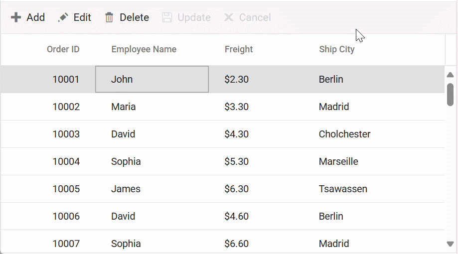

# Foreign key column in React Grid component

The foreign key column in the Syncfusion<sup style="font-size:70%">&reg;</sup> React Grid component displays related data from a foreign key data source. This feature enables representation of foreign key relationships between data sources, displaying meaningful values instead of raw key identifiers.

**Example:**

1. **Main Grid Data**: Contains the foreign key ID (e.g., "EmployeeID: 3")
2. **Foreign Data Source**: Contains the full details (e.g., Employee with ID "3" is "Maria Gonzalez")
3. **Grid Display**: Shows the meaningful value ("Maria Gonzalez") instead of the ID ("3")

To enable the foreign key column in the Grid:

**Step 1: Inject the ForeignKey module**

Import and inject the `ForeignKey` module into the Grid component:

```typescript
import { ForeignKey } from '@syncfusion/ej2-react-grids';

function App() {
  return <GridComponent>
    <Inject services={[ForeignKey]} />
  </GridComponent>
};
```

**Step 2: Define the foreign key column**

Configure the foreign key column using three essential properties:

* [dataSource](https://ej2.syncfusion.com/react/documentation/api/grid/column#datasource): The external data source containing the related information (e.g., employee details).

* [foreignKeyField](https://ej2.syncfusion.com/react/documentation/api/grid/column#foreignkeyfield): The field in the foreign data source that matches the ID in the main Grid (e.g., "EmployeeID" in both sources).

* [foreignKeyValue](https://ej2.syncfusion.com/react/documentation/api/grid/column#foreignkeyvalue): The field from the foreign data source to display in the Grid (e.g., "FirstName" to show employee names).

```typescript
<ColumnDirective 
  field='EmployeeID'              // Field in main data containing the ID
  foreignKeyField='EmployeeID'     // Matching field in foreign data source
  foreignKeyValue='FirstName'      // Field to display from foreign data source
  dataSource={employeeData}        // Foreign data source
  headerText='Employee Name' 
  width='150'>
</ColumnDirective>
```

## Binding local data

The Grid supports binding local data to a foreign key column, enabling display of related data from a local data source.

In the following example:
- **Main Data (orders)**: Contains order records with "EmployeeID" values (1, 2, 3, etc.).
- **Foreign Data (employees)**: Contains employee records with "EmployeeID" and "FirstName" fields.
- **Result**: The Grid displays employee first names instead of numeric IDs.

For instance, if an order has "EmployeeID: 1", the Grid looks up the employee with "EmployeeID: 1" in the "employeeData" and displays their "FirstName" (e.g., "Nancy").


















> If `foreignKeyField` is not defined, the column uses [field](https://ej2.syncfusion.com/react/documentation/api/grid/column#field).

## Binding remote data

Foreign key column supports binding remote data, enabling it to fetch related data from web services or APIs instead of local arrays. To achieve this, assign the service data as an instance of `DataManager` to the `dataSource` property, and provide the endpoint `URL` as the data source URL.

The following example demonstrates foreign key column implementation with remote data binding using the [ODataV4Adaptor](https://ej2.syncfusion.com/react/documentation/grid/data-binding/remote-data#odata-v4-adaptor---binding-odata-v4-service):


















> For remote data, sorting and grouping operations are performed based on `foreignKeyField` (the ID field) instead of `foreignKeyValue` (the display field) for better performance.

## Use edit template in foreign key column

The Grid supports custom edit templates for foreign key columns. By default, a `DropDownList` component renders for editing. Alternative components can be rendered using the [edit](https://ej2.syncfusion.com/react/documentation/api/grid/column#edit) property. The `edit` property accepts an object with four callback functions:

- **`create`**: Creates the input element when editing begins.
- **`write`**: Initializes the component with the current value.
- **`read`**: Retrieves the selected value from the component when editing ends.
- **`destroy`**: Cleans up the component when editing ends.

In the following example, an [AutoComplete](https://ej2.syncfusion.com/react/demos/#/bootstrap5/auto-complete/default) component is rendered as the edit template for the "EmployeeID" foreign key column. The [dataSource](https://ej2.syncfusion.com/react/documentation/api/auto-complete#datasource) property of the `AutoComplete` component is set to the employees data, and the `fields` property is configured to display the "FirstName" field as the value.


















## Customize filter UI of foreign key column

The Grid supports customization of the filtering UI for foreign key columns using the [filter](https://ej2.syncfusion.com/react/documentation/api/grid/column#filter) property. By default, an `AutoComplete` component renders for filtering. Custom filtering UI can be created by specifying a template function for the `filter` property. The `filter` property requires the following callback functions:

- **`ui.create`**: Generates the filter input element.
- **`ui.write`**: Initializes the filter component with existing filter values.
- **`ui.read`**: Extracts the filter value when filtering is applied.

In the following example, a [DropDownList](https://ej2.syncfusion.com/react/demos/#/bootstrap5/drop-down-list/default) component is rendered as the filter UI for the "EmployeeID" foreign key column. The [dataSource](https://ej2.syncfusion.com/react/documentation/api/drop-down-list#datasource) property of the `DropDownList` component is set to the employees data, with the `fields` property configured to display the "FirstName" field as the `text` and the "EmployeeID" field as the `value`. The `value` property is bound to the current filter value of the column.


















## Use filter bar template in foreign key column

The filter bar for foreign key columns can be customized using the [filterBarTemplate](https://ej2.syncfusion.com/react/documentation/api/grid/column#filterbartemplate) property. This enables customization of the filter bar with a custom component or HTML template.

**Filter Bar vs Filter Menu:**

- **Filter Bar**: A simple input field that appears directly below each column header.
- **Filter Menu**: Opens a popup with advanced filtering options.

In the following example, the "EmployeeID" column is a foreign key column with the `filter` function defined as the filter bar template. The `filter` function returns a `DropDownList` component for the filter bar. When filtering, an employee name is selected from the dropdown, and the Grid filters rows based on the selected "EmployeeID".


















## Perform aggregation in foreign key column

By default, aggregations (sum, average, count, etc.) are not supported in foreign key columns because they display text values from related data sources. Aggregation can be achieved using [customAggregate](https://ej2.syncfusion.com/react/documentation/api/grid/aggregateColumn#customaggregate).

**Steps to aggregate foreign key data:**

1. Define a foreign key column in the Grid.
2. Implement a custom aggregate function to calculate the aggregation based on the foreign key values.
3. Set the `customAggregate` property to the custom aggregate function.

**How custom aggregate works:**

The custom aggregate function receives the Grid data and processes it to calculate a meaningful result. In the following example, the `customAggregateFn` function:

1. Calls `getForeignData` to get related data from the foreign source based on "EmployeeID".
2. Filters the data to find all records with "FirstName: Margaret".
3. Counts how many times "Margaret" appears.
4. Displays the result ("Margaret: 8") in the Grid footer using the `#footerTemplate` reference.


















## Render foreign key value in column template

Foreign key values can be rendered within column templates to enhance display of related data. This enables more meaningful representation with custom formatting, styling, or additional information beyond just displaying the foreign key value. To render foreign key values in a column template, define the [template](https://ej2.syncfusion.com/react/documentation/api/grid/column#template) property for the column. The `template` property accepts either an HTML element or a function that returns the desired HTML element. Within the template, access the foreign key data using the row data properties.


















## Enable multiple foreign key columns

The Grid supports multiple foreign key columns with editing capabilities. This enables display of multiple columns from different foreign data sources simultaneously.

In the following example, "Customer Name" and "Ship City" are foreign key columns displaying the "ContactName" and "City" columns from their respective foreign data sources. This demonstrates that a single Grid row can display related information from multiple external data sources.


















## Edit template in foreign key column using remote data

The Grid supports customization of edit templates for foreign key columns when using remote data. By default, a [DropDownList](https://ej2.syncfusion.com/react/documentation/drop-down-list/getting-started) component renders for editing. Alternative components can be rendered by configuring the `column.edit` property. 

The following example demonstrates a complete implementation with React and ASP.NET Core. An [AutoComplete](https://ej2.syncfusion.com/react/documentation/auto-complete/getting-started) component is rendered as the edit template for the "EmployeeID" foreign key column. The `dataSource` property of the `AutoComplete` component is set to the employees data from the remote API, and the [field](https://helpej2.syncfusion.com/react/documentation/api/grid/column#field) property is configured to display the "FirstName" field as the value.

**Step 1:** Open Visual Studio and create a **React and ASP.NET Core** project named **EditTemplate**. Refer to the documentation [link](https://learn.microsoft.com/en-us/visualstudio/javascript/tutorial-asp-net-core-with-react?view=vs-2022) for detailed steps.

**Step 2:** Create a Grid following the [Getting Started](https://ej2.syncfusion.com/react/documentation/grid/getting-started) documentation.

**Step 3:** In the React component styles file (**styles.css**), include the following styles to import necessary Syncfusion<sup style="font-size:70%">&reg;</sup> styles:

```css
@import '../node_modules/@syncfusion/ej2-base/styles/tailwind3.css';
@import '../node_modules/@syncfusion/ej2-buttons/styles/tailwind3.css';
@import '../node_modules/@syncfusion/ej2-calendars/styles/tailwind3.css';
@import '../node_modules/@syncfusion/ej2-dropdowns/styles/tailwind3.css';
@import '../node_modules/@syncfusion/ej2-inputs/styles/tailwind3.css';
@import '../node_modules/@syncfusion/ej2-navigations/styles/tailwind3.css';
@import '../node_modules/@syncfusion/ej2-popups/styles/tailwind3.css';
@import '../node_modules/@syncfusion/ej2-splitbuttons/styles/tailwind3.css';
@import '../node_modules/@syncfusion/ej2-react-grids/styles/tailwind3.css';
```

**Step 4:** In the React component file (e.g., **App.js**), define the Grid with the required configurations, including a foreign key column for "EmployeeID", and implement the required logic to manage its behavior.

```js
import './App.css';
import { ColumnDirective, ColumnsDirective, GridComponent, Toolbar, Edit, ForeignKey, Inject } from '@syncfusion/ej2-react-grids';
import { DataManager, UrlAdaptor } from "@syncfusion/ej2-data";
import { createElement, getValue } from '@syncfusion/ej2-base';
import { AutoComplete } from '@syncfusion/ej2-dropdowns';
function App() {
  // Configure remote data sources with API URLs
  const data = new DataManager({
    url: 'https://localhost:****/api/Grid',          // Main data endpoint
    insertUrl: 'https://localhost:****/api/Grid/Insert',  // Create operation
    updateUrl: 'https://localhost:****/api/Grid/Update',  // Update operation
    removeUrl: 'https://localhost:****/api/Grid/Remove',  // Delete operation
    adaptor: new UrlAdaptor()
  }); //Use remote server host number instead ****.
  
  // Configure foreign key data source for employee information
  const employeeData = new DataManager({
    url: 'https://localhost:****/api/Grid/employees',  // Employee data endpoint
    adaptor: new UrlAdaptor(),
    crossDomain: true,
  }); //Use remote server host number instead ****.

  const editSettings = { allowEditing: true, allowAdding: true, allowDeleting: true, mode: 'Normal' };
  const toolbar = ['Add', 'Edit', 'Delete', 'Update', 'Cancel'];
  const orderIDRules = { required: true };
  let autoComplete;
  
  // Define custom edit template with AutoComplete component
  const edit = {
    create: () => {
      // Step 1: Create input element for AutoComplete
      return createElement('input');
    },
    destroy: () => {
      // Step 4: Clean up AutoComplete when editing ends
      autoComplete.destroy();
    },
    read: () => {
      // Step 3: Return selected employee ID when saving
      return autoComplete.itemData?.employeeID;
    },
    write: (args) => {
      // Step 2: Initialize AutoComplete with current employee name
      let selectedValue = args.foreignKeyData?.length > 0 ? args.foreignKeyData[0]['firstName'] : '';
      autoComplete = new AutoComplete({
        dataSource: employeeData,
        fields: { value: 'firstName' },  // Display employee first names
        value: selectedValue             // Set current employee name
      });
      autoComplete.appendTo(args.element);
    }
  };
  return (
    <>
      <GridComponent dataSource={data} editSettings={editSettings} toolbar={toolbar} height={250}>
        <ColumnsDirective>
          <ColumnDirective field='OrderID' headerText='Order ID' isPrimaryKey={true} width='100' textAlign='Right' validationRules={orderIDRules}></ColumnDirective>
          {/* Foreign key column with custom AutoComplete editor */}
          <ColumnDirective 
            field='EmployeeID' 
            headerText='Employee Name' 
            foreignKeyValue='FirstName'      // Display employee first name
            foreignKeyField='EmployeeID'     // Match on employee ID
            dataSource={employeeData}        // Remote employee data
            edit={edit}                      // Custom AutoComplete editor
            width='120'>
          </ColumnDirective>
          <ColumnDirective field='Freight' headerText='Freight' format='C2' editType='numericedit' width='100'></ColumnDirective>
          <ColumnDirective field='ShipCity' headerText='Ship City' width='150' />
        </ColumnsDirective>
        <Inject services={[Toolbar, Edit, ForeignKey]} />
      </GridComponent>
    </>            
  );    
};
export default App;

```

**Step 5:** On the server side, create a controller named **GridController.cs** under the **Controllers** folder for handling API requests.

```cs
using Microsoft.AspNetCore.Http;
using Microsoft.AspNetCore.Mvc;
using Syncfusion.EJ2.Base;
using EditTemplate.Server.Models;

namespace EditTemplate.Server.Controllers
{
  [ApiController]
  public class GridController : Controller
  {
    [HttpGet]
    [Route("employees")]

    public ActionResult<List<Employee>> GetEmployees()
    {
      return Employee.GetAllEmployees();
    }
    [HttpPost]
    [Route("api/[controller]")]
    public object Post()
    {
      // Retrieve data from the data source (e.g., database).
      IQueryable<OrdersDetails> DataSource = GetOrderData().AsQueryable();

      // Get the total records count.
      int totalRecordsCount = DataSource.Count();

      // Return data based on the request.
      return new { result = DataSource, count = totalRecordsCount };
    }
    [HttpPost]
    [Route("api/[controller]/employees")]
    public ActionResult<List<Employee>> employees()
    {
      return Employee.GetAllEmployees();
    }
    [HttpGet]
    [Route("api/[controller]")]
    public List<OrdersDetails> GetOrderData()
    {
      var data = OrdersDetails.GetAllRecords().ToList();
      return data;
    }
    /// <summary>
    /// Inserts a new data item into the data collection.
    /// </summary>
    /// <param name="addRecord">The order to be inserted.</param>
    /// <returns>It returns the newly inserted record detail.</returns>
    [HttpPost]
    [Route("api/[controller]/Insert")]
    public ActionResult Insert([FromBody] CRUDModel<OrdersDetails> newRecord)
    {
      if (newRecord.value != null)
      {
        OrdersDetails.GetAllRecords().Insert(0, newRecord.value);
      }
      return Json(newRecord.value);
    }

    /// <summary>
    /// Updates an existing order.
    /// </summary>
    /// <param name="updateRecord">The updated order details.</param>
    /// <returns>It returns the updated order details.</returns>
    [HttpPost]
    [Route("api/[controller]/Update")]
    public object Update([FromBody] CRUDModel<OrdersDetails> updatedRecord)
    {
      var updatedOrder = updatedRecord.value;
      if (updatedOrder != null)
      {
        var data = OrdersDetails.GetAllRecords().FirstOrDefault(or => or.OrderID == updatedOrder.OrderID);
        if (data != null)
        {
          // Update the existing record.
          data.OrderID = updatedOrder.OrderID;
          data.EmployeeID = updatedOrder.EmployeeID;
          data.Freight = updatedOrder.Freight;
          data.ShipCity = updatedOrder.ShipCity;
          // Update other properties similarly.
        }
      }
      return updatedRecord;
    }
    /// <summary>
    /// Deletes an order.
    /// </summary>
    /// <param name="deletedRecord">It contains the specific record detail which is need to be removed.</param>
    /// <returns>It returns the deleted record detail.</returns>
    [HttpPost]
    [Route("api/[controller]/Remove")]
    public object Remove([FromBody] CRUDModel<OrdersDetails> deletedRecord)
    {
      int orderId = int.Parse(deletedRecord.key.ToString()); // Get key value from the deletedRecord.
      var data = OrdersDetails.GetAllRecords().FirstOrDefault(orderData => orderData.OrderID == orderId);
      if (data != null)
      {
        // Remove the record from the data collection.
        OrdersDetails.GetAllRecords().Remove(data);
      }
      return deletedRecord;
    }
    public class CRUDModel<T> where T : class
    {
      public string? action { get; set; }

      public string? keyColumn { get; set; }

      public object? key { get; set; }

      public T? value { get; set; }

      public List<T>? added { get; set; }

      public List<T>? changed { get; set; }

      public List<T>? deleted { get; set; }

      public IDictionary<string, object>? @params { get; set; }
    }
  }
}

```

**Step 6:** Create a model class named **OrdersDetails.cs** under the **Models** folder to represent order data and employee data.

```cs

namespace EditTemplate.Server.Models
{
  public class OrdersDetails
  {
    private static List<OrdersDetails> order = new List<OrdersDetails>();

    public OrdersDetails() { }

    public OrdersDetails(int OrderID, string CustomerId, int EmployeeId, double Freight, bool Verified,
      DateTime OrderDate, string ShipCity, string ShipName, string ShipCountry,
      DateTime ShippedDate, string ShipAddress)
    {
      this.OrderID = OrderID;
      this.CustomerID = CustomerId;
      this.EmployeeID = EmployeeId;
      this.Freight = Freight;
      this.ShipCity = ShipCity;
      this.Verified = Verified;
      this.OrderDate = OrderDate;
      this.ShipName = ShipName;
      this.ShipCountry = ShipCountry;
      this.ShippedDate = ShippedDate;
      this.ShipAddress = ShipAddress;
    }

    public static List<OrdersDetails> GetAllRecords()
    {
      if (order.Count == 0)
      {
        int code = 10000;
        List<Employee> employees = Employee.GetAllEmployees();
        int employeeCount = employees.Count;

        for (int i = 1; i < 10; i++)
        {
          order.Add(new OrdersDetails(code++, "ALFKI", employees[(code + 0) % employeeCount].EmployeeID, 2.3 * i, false, new DateTime(1991, 05, 15), "Berlin", "Simons bistro", "Denmark", new DateTime(1996, 7, 16), "Kirchgasse 6"));
          order.Add(new OrdersDetails(code++, "ANATR", employees[(code + 1) % employeeCount].EmployeeID, 3.3 * i, true, new DateTime(1990, 04, 04), "Madrid", "Queen Cozinha", "Brazil", new DateTime(1996, 9, 11), "Avda. Azteca 123"));
          order.Add(new OrdersDetails(code++, "ANTON", employees[(code + 2) % employeeCount].EmployeeID, 4.3 * i, true, new DateTime(1957, 11, 30), "Cholchester", "Frankenversand", "Germany", new DateTime(1996, 10, 7), "Carrera 52 con Ave. Bolívar #65-98 Llano Largo"));
          order.Add(new OrdersDetails(code++, "BLONP", employees[(code + 3) % employeeCount].EmployeeID, 5.3 * i, false, new DateTime(1930, 10, 22), "Marseille", "Ernst Handel", "Austria", new DateTime(1996, 12, 30), "Magazinweg 7"));
          order.Add(new OrdersDetails(code++, "BOLID", employees[(code + 4) % employeeCount].EmployeeID, 6.3 * i, true, new DateTime(1953, 02, 18), "Tsawassen", "Hanari Carnes", "Switzerland", new DateTime(1997, 12, 3), "1029 - 12th Ave. S."));
        }
      }
      return order;
    }

    public int? OrderID { get; set; }
    public string? CustomerID { get; set; }
    public int? EmployeeID { get; set; }
    public double? Freight { get; set; }
    public string? ShipCity { get; set; }
    public bool? Verified { get; set; }
    public DateTime OrderDate { get; set; }
    public string? ShipName { get; set; }
    public string? ShipCountry { get; set; }
    public DateTime ShippedDate { get; set; }
    public string? ShipAddress { get; set; }
  }
  public class Employee
  {
    public int EmployeeID { get; set; }
    public string? FirstName { get; set; }
    public string? LastName { get; set; }
    public string? Department { get; set; }
    public string? Email { get; set; }
    public string? PhoneNumber { get; set; }

    public static List<Employee> GetAllEmployees()
    {
      return new List<Employee>
      {
        new Employee { EmployeeID = 1, FirstName = "John", LastName = "Doe", Department = "Sales", Email = "john.doe@example.com", PhoneNumber = "123-456-7890" },
        new Employee { EmployeeID = 2, FirstName = "David", LastName = "Smith", Department = "Marketing", Email = "david.smith@example.com", PhoneNumber = "987-654-3210" },
        new Employee { EmployeeID = 3, FirstName = "Maria", LastName = "Gonzalez", Department = "HR", Email = "maria.gonzalez@example.com", PhoneNumber = "456-789-0123" },
        new Employee { EmployeeID = 4, FirstName = "Sophia", LastName = "Brown", Department = "Finance", Email = "sophia.brown@example.com", PhoneNumber = "321-654-0987" },
        new Employee { EmployeeID = 5, FirstName = "James", LastName = "Wilson", Department = "IT", Email = "james.wilson@example.com", PhoneNumber = "654-321-7654" },
        new Employee { EmployeeID = 6, FirstName = "Emma", LastName = "Taylor", Department = "Operations", Email = "emma.taylor@example.com", PhoneNumber = "213-546-8790" },
        new Employee { EmployeeID = 7, FirstName = "Daniel", LastName = "Anderson", Department = "Logistics", Email = "daniel.anderson@example.com", PhoneNumber = "789-654-3210" },
        new Employee { EmployeeID = 8, FirstName = "Olivia", LastName = "Thomas", Department = "Procurement", Email = "olivia.thomas@example.com", PhoneNumber = "567-890-1234" },
        new Employee { EmployeeID = 9, FirstName = "Michael", LastName = "Harris", Department = "R&D", Email = "michael.harris@example.com", PhoneNumber = "890-123-4567" },
        new Employee { EmployeeID = 10, FirstName = "Lucas", LastName = "Martin", Department = "Customer Service", Email = "lucas.martin@example.com", PhoneNumber = "345-678-9012" },
        new Employee { EmployeeID = 11, FirstName = "Elijah", LastName = "Clark", Department = "Support", Email = "elijah.clark@example.com", PhoneNumber = "741-852-9630" },
        new Employee { EmployeeID = 12, FirstName = "Isabella", LastName = "Hall", Department = "Legal", Email = "isabella.hall@example.com", PhoneNumber = "963-852-7410" },
        new Employee { EmployeeID = 13, FirstName = "Ethan", LastName = "Young", Department = "Administration", Email = "ethan.young@example.com", PhoneNumber = "258-963-1470" },
        new Employee { EmployeeID = 14, FirstName = "Charlotte", LastName = "Scott", Department = "Design", Email = "charlotte.scott@example.com", PhoneNumber = "147-258-3690" },
        new Employee { EmployeeID = 15, FirstName = "Alexander", LastName = "Allen", Department = "Engineering", Email = "alexander.allen@example.com", PhoneNumber = "369-147-2580" }
      };
    }
  }
}

```

**Step 7:** Add the following configuration in the **Program.cs** file.

```cs
var builder = WebApplication.CreateBuilder(args);
// Add services to the container.
builder.Services.AddControllers();
// Learn more about configuring OpenAPI at https://aka.ms/aspnet/openapi.
builder.Services.AddOpenApi();
builder.Services.AddCors(options =>
{
  options.AddDefaultPolicy(builder =>
  {
    builder.AllowAnyOrigin().AllowAnyMethod().AllowAnyHeader();
  });
});
var app = builder.Build();
app.UseCors();
app.UseDefaultFiles();
app.MapStaticAssets();
// Configure the HTTP request pipeline.
if (app.Environment.IsDevelopment())
{
  app.MapOpenApi();
}
app.UseHttpsRedirection();
app.UseAuthorization();
app.MapControllers();
app.MapFallbackToFile("/index.html");
app.Run();
```

