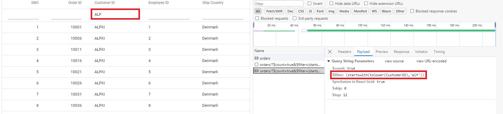
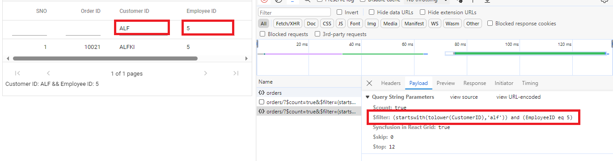
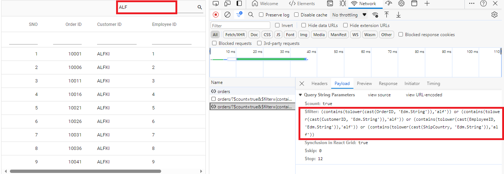
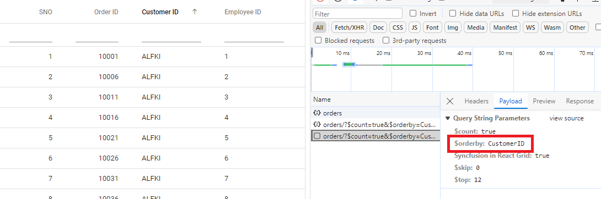
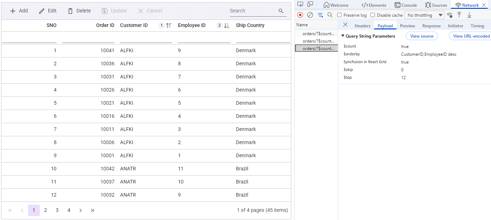
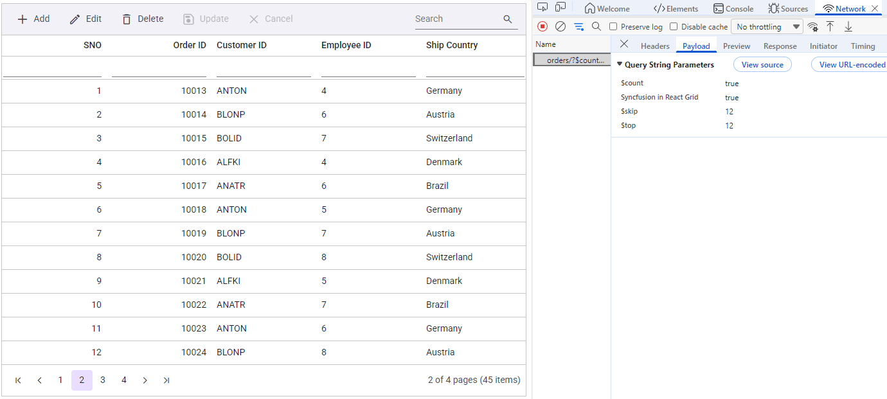
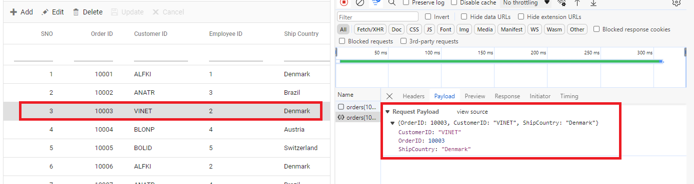
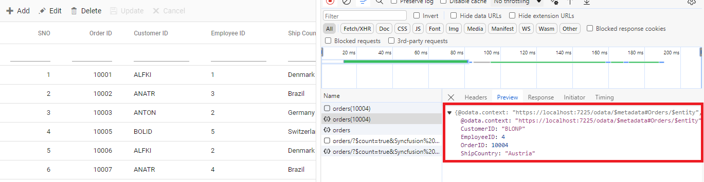

# Custom Remote Data Binding in Syncfusion React Grid

The `CustomAdaptor` in the Syncfusion<sup style="font-size:70%">&reg;</sup> React Grid is a powerful extension mechanism that **customizes any existing adaptor** ([UrlAdaptor](./url-adaptor), [WebApiAdaptor](./webapi-adaptor), [ODataV4Adaptor](./odatav4-adaptor), [GraphQLAdaptor](./graphql-adaptor)) to meet specific application requirements. Instead of creating an entirely new adaptor from scratch, `CustomAdaptor` extends and modifies the behavior of existing adaptors by intercepting and customizing HTTP requests and responses.

For detailed guidance, refer to the DataManager CustomAdaptor documentation, which explains the usage of custom adaptors in depth. For complete server-side setup and advanced implementation details, see the DataManager ODataV4Adaptor documentation, covering endpoint configuration, query handling, and recommended practices for integrating OData V4 services.

Once the project creation and backend setup are complete, the next step is to render the Syncfusion<sup style="font-size:70%">&reg;</sup> React Grid component on the client side.

## React Grid setup and client-side configuration

After finishing the backend setup for the **ODataV4Adaptor** ASP.NET Core project, next step is to integrate the Syncfusion<sup style="font-size:70%">&reg;</sup> React Grid on the client side by following these instructions.

### Step 1: Installing Syncfusion packages

Right‑click the **ODataV4Adaptor.client** folder in **Solution Explorer** and select **Open in Terminal** (available in newer Visual Studio versions), or open a Developer Command Prompt/PowerShell from the Start menu and navigate manually to the **ODataV4Adaptor.client** directory. Once inside the folder, confirm that **package.json** is present, then run the following commands to install the required Syncfusion<sup style="font-size:70%">&reg;</sup> packages:

```bash
npm install @syncfusion/ej2-react-grids --save
npm install @syncfusion/ej2-data --save
```

### Step 2: Add CSS styles

Navigate to the **src** folder and open the **index.css** stylesheet file. Add the required CSS import statements to include the Syncfusion<sup style="font-size:70%">&reg;</sup> Grid styles.

```css
@import '../node_modules/@syncfusion/ej2-base/styles/material3.css';
@import '../node_modules/@syncfusion/ej2-buttons/styles/material3.css';
@import '../node_modules/@syncfusion/ej2-calendars/styles/material3.css';
@import '../node_modules/@syncfusion/ej2-dropdowns/styles/material3.css';
@import '../node_modules/@syncfusion/ej2-inputs/styles/material3.css';
@import '../node_modules/@syncfusion/ej2-navigations/styles/material3.css';
@import '../node_modules/@syncfusion/ej2-popups/styles/material3.css';
@import '../node_modules/@syncfusion/ej2-splitbuttons/styles/material3.css';
@import '../node_modules/@syncfusion/ej2-react-grids/styles/material3.css';
```

Import the stylesheet in the **main.jsx** application entry point:

```js
import { StrictMode } from 'react'
import { createRoot } from 'react-dom/client'
import './index.css'
import App from './App.jsx'

createRoot(document.getElementById('root')).render(
  <StrictMode>
    <App />
  </StrictMode>,
)
```

### Step 3: Create React Grid component with CustomAdaptor

Integrating a `CustomAdaptor` with the Syncfusion<sup style="font-size:70%">&reg;</sup> React Grid requires configuring the `DataManager` as the communication bridge between the Grid component and the backend data source. The `CustomAdaptor` serves as a powerful customization layer that provides complete control over how data operations—such as filtering, sorting, paging, and querying—are processed and transmitted to the server.

#### Step 3.1: Creating an Extended ODataV4Adaptor:

The first step involves creating a custom adaptor by extending the existing `ODataV4Adaptor` class. This extension allows modification of the default behavior to meet specific application requirements. 

Begin by creating a new TypeScript file named **CustomAdaptor.ts** in the project's source directory. This file will house the custom adaptor class definition.

**Understanding the SerialNoAdaptor implementation:**

The example below demonstrates a `SerialNoAdaptor` class that extends `ODataV4Adaptor` to dynamically add serial numbers to each record after receiving the response from the server. This is particularly useful when the server data does not include sequential numbering but the Grid needs to display row numbers.

The implementation requires importing specific modules from Syncfusion packages:
- `setValue` from `@syncfusion/ej2-base` – A utility function for safely setting property values on objects
- `DataManager`, `ODataV4Adaptor`, and `Query` from `@syncfusion/ej2-data` – Core data management classes

The Syncfusion<sup style="font-size:70%">&reg;</sup> DataManager provides built‑in extensibility points that allow custom logic to be applied both before a request is sent to the server and after a response is received. This is achieved by overriding adaptor methods, ensuring that request customization and response transformation are handled in a consistent and centralized manner. The following table explains the overridden methods in a CustomAdaptor and their execution phases:


| Method            | Execution Phase                          | Purpose & Key Actions                                                                 |
|-------------------|------------------------------------------|---------------------------------------------------------------------------------------|
| `processResponse` | After receiving server response, before Grid rendering | Adds sequential "SNo" (serial number) to each record by iterating through `response.result` → displays row numbers when the server does not provide them |
| `processQuery`    | Before sending request to server         | Sets custom OData endpoint URL and adds extra query parameters → enables dynamic URLs and request tracking/identification |
| `beforeSend`      | Immediately before HTTP request is sent  | Adds `Authorization: Bearer` header using token from `window` → automatically authenticates every API request |




import { setValue } from '@syncfusion/ej2-base';
import { DataManager, ODataV4Adaptor, Query, } from '@syncfusion/ej2-data';
export class SerialNoAdaptor extends ODataV4Adaptor {
    public processResponse() {
        let i = 0;
        const original: any = super.processResponse.apply(this, arguments as any);
        /* Adding serial number */
        if (original.result) {
            original.result.forEach((item: any) => setValue('SNo', ++i, item));
        }
        return original;
    }

    public processQuery(dm: DataManager, query: Query): Object {
        dm.dataSource.url = 'https://localhost:xxxx/odata/orders';
        query.addParams('Syncfusion in React Grid', 'true');
        const result = super.processQuery.apply(this, arguments as any);
        return result;
    }

    public beforeSend(dm: any, request: any, settings: any) {
        request.headers.set('Authorization', `Bearer ${(window as any).token}`);
        super.beforeSend(dm, request, settings);
    }
}




#### Step 3.2: Integrating CustomAdaptor into React Grid:

After creating the custom adaptor class, integrate it with the React Grid in the main application file (typically **App.tsx** or **App.jsx**). This requires importing the necessary modules and configuring the Grid to use the custom adaptor:

- Import `DataManager` from `@syncfusion/ej2-data` to act as the link between the Grid and the OData service.
- Import `CustomAdaptor` from the local **./CustomAdaptor** file to apply custom request and response logic.
- Create DataManager instance by setting the service endpoint URL **(e.g., https://localhost:xxxx/odata/Orders)** in the `url` property.
- Assign `CustomAdaptor` to the `adaptor` property so that all operations (filtering, sorting, paging, querying) use the customized pipeline.
- Bind DataManager to the Grid’s `dataSource` property, enabling the Grid to automatically apply the custom logic during data communication.




import { DataManager } from '@syncfusion/ej2-data';
import {CustomAdaptor} from './CustomAdaptor';
import { ColumnDirective, ColumnsDirective, GridComponent } from '@syncfusion/ej2-react-grids';

function App() {
    const data = new DataManager({ 
      url:'https://localhost:xxxx/odata/Orders', // Here xxxx represents the port number
      adaptor: new CustomAdaptor()
    });
    return <GridComponent dataSource={data} >
        <ColumnsDirective>
            <ColumnDirective field='SNo' headerText='SNO' width='150'/>
            <ColumnDirective field='OrderID' headerText='Order ID' isPrimaryKey={true} width='150' textAlign='Right'></ColumnDirective>
            <ColumnDirective field='CustomerID' headerText='Customer ID' width='150'></ColumnDirective>
            <ColumnDirective field='EmployeeID' headerText='Employee ID' width='150'/>
            <ColumnDirective field='ShipCountry' headerText='Ship Country' width='150'/>
        </ColumnsDirective>
    </GridComponent>
};
export default App;




> Replace **https://localhost:xxxx/odata/Orders** with the actual API endpoint that returns data in JSON format.

## Performing data operations

This section covers implementation of advanced Grid features including filtering, sorting, pagination, and complete CRUD operations.

### Filtering

Filtering is enabled by setting the [allowFiltering](https://ej2.syncfusion.com/react/documentation/api/grid/index-default#allowfiltering) property to `true` and injecting the `Filter` module from `@syncfusion/ej2-react-grids` into the Grid.

```ts

import { ColumnDirective, ColumnsDirective, GridComponent, Filter, Inject } from '@syncfusion/ej2-react-grids';

function App() {
    return <GridComponent dataSource={data} allowFiltering={true}>
        <ColumnsDirective>
            <ColumnDirective field='SNo' headerText='SNO' width='150' allowSorting={false} allowFiltering={false} allowSearching={false} isIdentity={true} />
            {/* Include additional columns here */}
        </ColumnsDirective>
        <Inject services={[Filter]} />
    </GridComponent>
};
```

When working with a custom adaptor, filter operations can be enabled by extending OData support within the service configuration. As part of this setup, the `Filter` method is included in the OData configuration, allowing the service to interpret filtering criteria. Once configured, clients can use the `$filter` query option in their requests to retrieve data entries that match specific conditions.

**Single column filtering:**




**Multi-column filtering:**

Multiple columns can be filtered simultaneously. Example: Apply filter criteria "ShipCountry = "Denmark" AND OrderID > 10005".





// Create a new instance of the web application builder
var builder = WebApplication.CreateBuilder(args);

// Create an ODataConventionModelBuilder to build the OData model
var modelBuilder = new ODataConventionModelBuilder();

// Register the "Orders" entity set with the OData model builder
modelBuilder.EntitySet<OrdersDetails>("Orders");

// Add services to the container.

// Add controllers with OData support to the service collection
builder.Services.AddControllers().AddOData(
    options => options
        .Count()
        .Filter() //filtering
        .AddRouteComponents("odata", modelBuilder.GetEdmModel()));




import { DataManager } from '@syncfusion/ej2-data';
import {CustomAdaptor} from './CustomAdaptor';
import { ColumnDirective, ColumnsDirective, GridComponent, Filter } from '@syncfusion/ej2-react-grids';

function App() {
    const data = new DataManager({ 
      url:'https://localhost:xxxx/odata/Orders', // Here xxxx represents the port number.
      adaptor: new CustomAdaptor()
    });
    return <GridComponent dataSource={data} allowFiltering={true}>
        <ColumnsDirective>
            <ColumnDirective field='SNo' headerText='SNO' width='150'/>
            <ColumnDirective field='OrderID' headerText='Order ID' isPrimaryKey={true} width='150' textAlign='Right'></ColumnDirective>
            <ColumnDirective field='CustomerID' headerText='Customer ID' width='150'></ColumnDirective>
            <ColumnDirective field='EmployeeID' headerText='Employee ID' width='150'/>
            <ColumnDirective field='ShipCountry' headerText='Ship Country' width='150'/>
        </ColumnsDirective>
         <Inject services={[Filter]} />
    </GridComponent>
};
export default App;




### Searching

The searching feature in the Grid is enabled by adding `Search` to the Grid’s [toolbar](https://ej2.syncfusion.com/react/documentation/api/grid/index-default#toolbar) items and injecting the `Toolbar` module.

```ts
import { ColumnDirective, ColumnsDirective, GridComponent, Toolbar, Inject } from '@syncfusion/ej2-react-grids';

function App() {
    const toolbar = ['Search'];
    return <GridComponent dataSource={data} allowFiltering={true} toolbar={toolbar}>
        <ColumnsDirective>
            <ColumnDirective field='SNo' headerText='SNO' width='150' allowSorting={false} allowFiltering={false} allowSearching={false} isIdentity={true} />
            {/* Include additional columns here */}
        </ColumnsDirective>
        <Inject services={[Toolbar]} />
    </GridComponent>
};
```

When working with a custom adaptor, search operations can be enabled by extending OData support within the service configuration. As part of this setup, the `Filter` method is included in the OData configuration, allowing the service to interpret search criteria. Once configured, clients can use the `$filter` query option in their requests to retrieve data entries that match search conditions.

**Search usage:**

The search box in the Grid top‑right corner can be used to enter any keyword, and matching records from all columns will be shown instantly. Clear the search input to return to the full data set.





// Create a new instance of the web application builder
var builder = WebApplication.CreateBuilder(args);

// Create an ODataConventionModelBuilder to build the OData model
var modelBuilder = new ODataConventionModelBuilder();

// Register the "Orders" entity set with the OData model builder
modelBuilder.EntitySet<OrdersDetails>("Orders");

// Add services to the container.

// Add controllers with OData support to the service collection
builder.Services.AddControllers().AddOData(
    options => options
        .Count()
        .Filter() // searching
        .AddRouteComponents("odata", modelBuilder.GetEdmModel()));



import { DataManager } from '@syncfusion/ej2-data';
import {CustomAdaptor} from './CustomAdaptor';
import { ColumnDirective, ColumnsDirective, GridComponent, Toolbar, ToolbarItems } from '@syncfusion/ej2-react-grids';

function App() {
    const data = new DataManager({ 
      url:'https://localhost:xxxx/odata/Orders', // Here xxxx represents the port number.
      adaptor: new CustomAdaptor()
    });
    const toolbar: ToolbarItems[] = ['Search'];
    return <GridComponent dataSource={data} toolbar={toolbar}>
        <ColumnsDirective>
            <ColumnDirective field='OrderID' headerText='Order ID' isPrimaryKey={true} width='150' textAlign='Right'></ColumnDirective>
            <ColumnDirective field='CustomerID' headerText='Customer ID' width='150'></ColumnDirective>
            <ColumnDirective field='EmployeeID' headerText='Employee ID' width='150'/>
            <ColumnDirective field='ShipCountry' headerText='Ship Country' width='150'/>
        </ColumnsDirective>
        <Inject services={[Toolbar]} />
    </GridComponent>
};
export default App;




### Sorting 

The sorting feature in the Grid allows users to organize records in ascending or descending order based on one or more columns. The sorting feature in the Grid is enabled by setting the [allowSorting](https://ej2.syncfusion.com/react/documentation/api/grid/index-default#allowsorting) property to `true` and injecting the `Sort` module.

```ts
import { ColumnDirective, ColumnsDirective, GridComponent, Sort, Inject } from '@syncfusion/ej2-react-grids';

function App() {
    return (
        <GridComponent dataSource={data} allowSorting={true}>
            <ColumnsDirective>
                <ColumnDirective field='SNo' headerText='SNO' width='150' allowSorting={false} allowFiltering={false} allowSearching={false} isIdentity={true} />
                {/* Include additional columns here */}
            </ColumnsDirective>
            <Inject services={[Sort]} />
        </GridComponent>
    );
}
```

When working with a custom adaptor, sorting functionality is supported by extending OData within the service configuration. As part of this setup, the `OrderBy` method is included in the OData configuration, enabling the service to interpret sorting criteria. Once configured, clients can use the `$orderby` query option in their requests to sort data entries based on the required attributes.

**Single column sorting:**

Click the "Customer ID" column header to sort by "CustomerID" field.



**Multi-column sorting:**

Hold the <kbd>ctrl</kbd> key and click "Employee ID" followed by "Customer ID" to establish hierarchical sort (primary sort by "Customer ID", secondary sort by "Employee ID" within each "Customer ID" group).





// Create a new instance of the web application builder 
var builder = WebApplication.CreateBuilder(args);

// Create an ODataConventionModelBuilder to build the OData model
var modelBuilder = new ODataConventionModelBuilder();

// Register the "Orders" entity set with the OData model builder
modelBuilder.EntitySet<OrdersDetails>("Orders");

// Add services to the container.

// Add controllers with OData support to the service collection
builder.Services.AddControllers().AddOData(
    options => options
        .Count()
        .OrderBy() // sorting
        .AddRouteComponents("odata", modelBuilder.GetEdmModel()));



import { DataManager } from '@syncfusion/ej2-data';
import {CustomAdaptor} from './CustomAdaptor';
import { ColumnDirective, ColumnsDirective, GridComponent, Sort } from '@syncfusion/ej2-react-grids';

function App() {
    const data = new DataManager({ 
      url:'https://localhost:xxxx/odata/Orders', // Here xxxx represents the port number.
      adaptor: new CustomAdaptor()
    });
    return <GridComponent dataSource={data} allowSorting={true}>
        <ColumnsDirective>
            <ColumnDirective field='SNo' headerText='SNO' width='150'/>
            <ColumnDirective field='OrderID' headerText='Order ID' isPrimaryKey={true} width='150' textAlign='Right'></ColumnDirective>
            <ColumnDirective field='CustomerID' headerText='Customer ID' width='150'></ColumnDirective>
            <ColumnDirective field='EmployeeID' headerText='Employee ID' width='150'/>
            <ColumnDirective field='ShipCountry' headerText='Ship Country' width='150'/>
        </ColumnsDirective>
        <Inject services={[Sort]} />
    </GridComponent>
};
export default App;




### Pagination

The paging feature allows efficient loading of large data sets through on‑demand loading. Paging in the Grid is enabled by setting the [allowPaging](https://ej2.syncfusion.com/react/documentation/api/grid/index-default#allowpaging) property to `true` and injecting the `Page` module. This sends parameters to fetch only the data required for the current viewport.

```ts
import { ColumnDirective, ColumnsDirective, GridComponent, Page, Inject } from '@syncfusion/ej2-react-grids';

function App() {
    return (
        <GridComponent dataSource={data} allowPaging={true}>
            <ColumnsDirective>
                <ColumnDirective field='SNo' headerText='SNO' width='150' allowSorting={false} allowFiltering={false} allowSearching={false} isIdentity={true} />
                {/* Include additional columns here */}
            </ColumnsDirective>
            <Inject services={[Page]} />
        </GridComponent>
    );
}
```

When working with a custom adaptor, paging operations can be enabled by extending OData support within the service configuration. As part of this setup, the `SetMaxTop` method is included in the OData configuration, defining the maximum number of records that can be returned in a single response. Once configured, clients can use the `$skip` and `$top` query options in their requests to control the number of records to omit and the number of records to retrieve, ensuring predictable paging behavior within the application’s data handling process.

The following screenshot illustrates the custom adaptor extending OData V4 with a paging query in operation.





// Create a new instance of the web application builder
var builder = WebApplication.CreateBuilder(args);

// Create an ODataConventionModelBuilder to build the OData model
var modelBuilder = new ODataConventionModelBuilder();

// Register the "Orders" entity set with the OData model builder
modelBuilder.EntitySet<OrdersDetails>("Orders");

// Add services to the container.

// Add controllers with OData support to the service collection
builder.Services.AddControllers().AddOData(
    options => options
        .Count()
        .SetMaxTop(null)
        .AddRouteComponents("odata", modelBuilder.GetEdmModel()));



import { DataManager } from '@syncfusion/ej2-data';
import {CustomAdaptor} from './CustomAdaptor';
import { ColumnDirective, ColumnsDirective, GridComponent, Page } from '@syncfusion/ej2-react-grids';

function App() {
    const data = new DataManager({ 
      url: 'https://localhost:xxxx/odata/Orders', // Here xxxx represents the port number.
      adaptor: new CustomAdaptor()
    });
    return <GridComponent dataSource={data} allowPaging={true}>
        <ColumnsDirective>
            <ColumnDirective field='SNo' headerText='SNO' width='150'/>
            <ColumnDirective field='OrderID' headerText='Order ID' isPrimaryKey={true} width='150' textAlign='Right'></ColumnDirective>
            <ColumnDirective field='CustomerID' headerText='Customer ID' width='150'></ColumnDirective>
            <ColumnDirective field='EmployeeID' headerText='Employee ID' width='150'/>
            <ColumnDirective field='ShipCountry' headerText='Ship Country' width='150'/>
        </ColumnsDirective>
        <Inject services={[Page]} />
    </GridComponent>
};
export default App;




The Grid has now been successfully created with full functionality, including paging, sorting, filtering, and CRUD features.

## CRUD Operations

CRUD (Create, Read, Update, Delete) operations using a `CustomAdaptor` are handled by setting up the Grid for editing and employing the sample **OrdersController** in the server application. This controller manages standard HTTP requests such as `GET`, `POST`, `PATCH`, and `DELETE` to support complete data modification processes.

To enable CRUD operations in the Syncfusion<sup style="font-size:70%">&reg;</sup> Grid component within a React application, the following steps outline the required setup:



import { ColumnDirective, ColumnsDirective, GridComponent, ToolbarItems, EditSettingsModel, Toolbar, Edit, Inject } from '@syncfusion/ej2-react-grids';
import { DataManager } from '@syncfusion/ej2-data';
import {CustomAdaptor} from './CustomAdaptor';

function App() {
    const data = new DataManager({ 
      url: 'https://localhost:xxxx/odata/Orders', // Here xxxx represents the port number.
      adaptor: new CustomAdaptor()
    });
    const editSettings: EditSettingsModel = { allowEditing: true, allowAdding: true, allowDeleting: true, mode: 'Normal' };
    const toolbar: ToolbarItems[] = ['Add', 'Edit', 'Delete', 'Update', 'Cancel'];
    const orderIDRules: object = {required: true};
    const customerIDRules: object = {required: true, minLength: 3};
    return <GridComponent dataSource={data} editSettings={editSettings} toolbar={toolbar} height={320}>
        <ColumnsDirective>
            <ColumnDirective field='SNo' headerText='SNO' width='150'/>
            <ColumnDirective field='OrderID' headerText='Order ID' isPrimaryKey={true} width='150' textAlign='Right' validationRules={orderIDRules}></ColumnDirective>
            <ColumnDirective field='CustomerID' headerText='Customer ID' width='150' validationRules={customerIDRules}></ColumnDirective>
            <ColumnDirective field='EmployeeID' headerText='Employee ID' width='150'/>
            <ColumnDirective field='ShipCountry' headerText='Ship Country' width='150'/>
        </ColumnsDirective>
        <Inject services={[Toolbar, Edit]} />
    </GridComponent>
};
export default App;




> Normal/Inline editing is the default edit [mode](https://ej2.syncfusion.com/react/documentation/api/grid/editsettings#mode) for the Grid component. To enable CRUD operations, ensure that the [isPrimaryKey](https://ej2.syncfusion.com/react/documentation/api/grid/column#isprimarykey) property is set to `true` for a specific Grid column, ensuring that its value is unique.

**Insert Record:**

Insertion of a new record in the Syncfusion<sup style="font-size:70%">&reg;</sup> Grid is handled through the `HttpPost` method in the server application.


```cs
/// <summary>
/// Inserts a new order to the collection.
/// </summary>
/// <param name="addRecord">The order to be inserted.</param>
/// <returns>It returns the newly inserted record detail.</returns>
[HttpPost]
[EnableQuery]
public IActionResult Post([FromBody] OrdersDetails addRecord)
{
    if (order == null)
    {
        return BadRequest("Null order");
    }

    OrdersDetails.GetAllRecords().Insert(0, addRecord);
    return Ok(addRecord);
}
```

**Update Record:**

Updating an existing record in the Syncfusion<sup style="font-size:70%">&reg;</sup> Grid is handled through the `HttpPatch` method within the controller.



```cs
/// <summary>
/// Updates an existing order.
/// </summary>
/// <param name="key">The ID of the order to update.</param>
/// <param name="updateRecord">The updated order details.</param>
/// <returns>It returns the updated order details.</returns>
[HttpPatch("{key}")]
public IActionResult Patch(int key, [FromBody] OrdersDetails updatedOrder)
{
    if (updatedOrder == null)
    {
        return BadRequest("No records");
    }
    var existingOrder = OrdersDetails.GetAllRecords().FirstOrDefault(o => o.OrderID == key);
    if (existingOrder != null)
    {
        // If the order exists, update its properties
        existingOrder.CustomerID = updatedOrder.CustomerID ?? existingOrder.CustomerID;
        existingOrder.EmployeeID = updatedOrder.EmployeeID ?? existingOrder.EmployeeID;
        existingOrder.ShipCountry = updatedOrder.ShipCountry ?? existingOrder.ShipCountry;
    }
    return Ok(existingOrder);
}
```

**Delete Record:**

Deletion of a record from the Syncfusion<sup style="font-size:70%">&reg;</sup> Grid is handled through the `HttpDelete` method in the controller. The following example demonstrates the delete operation in the **OrdersController**:




```cs
/// <summary>
/// Deletes an order.
/// </summary>
/// <param name="key">The key of the order to be deleted.</param>
/// <returns>The deleted order.</returns>
[HttpDelete("{key}")]
public IActionResult Delete(int key)
{
    var order = OrdersDetails.GetAllRecords().FirstOrDefault(o => o.OrderID == key);
    if (order != null)
    {
        OrdersDetails.GetAllRecords().Remove(order);
    }
    return Ok(order);
}
```

## Application execution and verification

**Starting the application:** Run the application by pressing <kbd>F5</kbd> in Visual Studio. The browser opens and the Grid loads all orders from the service.

**Connection verification:** Open the browser Developer Tools (<kbd>F12</kbd>) and select the "Network" tab. Refresh the page to confirm a request to **https://localhost:xxxx** and verify that the response contains JSON data.

## Troubleshooting

| Issue | Cause | Solution |
|-------|-------|----------|
| Grid shows no data | Response format incorrect | Ensure `processResponse` returns `{result: [], count: 0}` |
| Authentication fails | Token not added to headers | Verify `beforeSend` sets "Authorization" header |
| Paging does not work | Missing `count` in response | Ensure response contains `count` property |
| Computed fields missing | Not setting values properly | Use `setValue(fieldName, value, item)` in `processResponse` |
| CRUD operations fail | URLs not configured | Set `insertUrl`, `updateUrl`, `removeUrl` in `DataManager` |
| API called twice | Calling super twice | Call `super.methodName()` only once per method |

## Method override summary

| Method | When to override | Common use cases |
|--------|------------------|------------------|
| `processQuery` | Need to modify request before it is built | • Change API endpoints<br>• Add query parameters<br>• Route by environment |
| `beforeSend` | Need to modify request just before sending | • Add auth headers<br>• Add API keys<br>• Log requests |
| `processResponse` | Need to transform incoming response | • Transform data format<br>• Add calculated fields<br>• Handle errors |

## Complete sample repository

A complete, working sample implementation is available in the [GitHub]() repository.

## See also
- [Using Remote Data Binding in ASP.NET Web APIs](https://ej2.syncfusion.com/react/documentation/grid/connecting-to-adaptors/webapi-adaptor)
- [Connect to custom REST APIs](https://ej2.syncfusion.com/react/documentation/grid/connecting-to-adaptors/url-adaptor)
- [Hybrid data binding](https://ej2.syncfusion.com/react/documentation/grid/connecting-to-adaptors/remote-save-adaptor)
- [RESTful CRUD Operations in ASP.NET WebForms](https://ej2.syncfusion.com/react/documentation/grid/connecting-to-adaptors/web-method-adaptor)
- [Connect to OdataV4 services](https://ej2.syncfusion.com/react/documentation/grid/connecting-to-adaptors/odatav4-adaptor)
- [GraphQL Integration for Syncfusion React Grids](https://ej2.syncfusion.com/react/documentation/grid/connecting-to-adaptors/graphql-adaptor)
