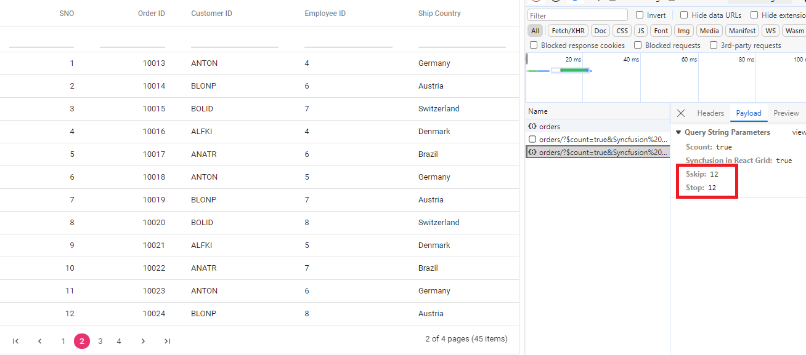

# Extending Adaptors with CustomAdaptor in React Grid

The `CustomAdaptor` in the Syncfusion<sup style="font-size:70%">&reg;</sup> React Grid is a powerful extension mechanism that **customizes any existing adaptor** ([UrlAdaptor](./url-adaptor), [WebApiAdaptor](./webapi-adaptor), [ODataV4Adaptor](./odatav4-adaptor), [GraphQLAdaptor](./graphql-adaptor)) to meet specific application requirements. Instead of creating an entirely new adaptor from scratch, `CustomAdaptor` extends and modifies the behavior of existing adaptors by intercepting and customizing HTTP requests and responses.

For comprehensive guidance on server‑side configuration and implementation, refer to the [DataManager CustomAdaptor](https://ej2.syncfusion.com/react/documentation/data/adaptors) documentation. It provides detailed information on setting up endpoints, processing queries, and following best practices for integrating backend services.

## React Grid setup and client-side configuration

To integrate the Syncfusion<sup style="font-size:70%">&reg;</sup> Grid component into a React and ASP.NET Core project using Visual Studio, follow the below steps:

### Syncfusion package installation

Open a terminal inside the **ClientApp** (React project) folder and ensure **package.json** is present, then run:s

```bash
npm install @syncfusion/ej2-react-grids --save
npm install @syncfusion/ej2-data --save
```
- `@syncfusion/ej2-react-grids`: Complete React Grid component library with comprehensive UI features.
- `@syncfusion/ej2-data`: Data management library containing `DataManager` and adaptors including `CustomAdaptor`.

### Syncfusion stylesheet integration

Navigate to the **src** folder and open (or create) the stylesheet such as **styles.css** or **App.css**, then add the required CSS import statements to apply the Grid's styling.

```css
@import '../node_modules/@syncfusion/ej2-base/styles/material3.css';
@import '../node_modules/@syncfusion/ej2-buttons/styles/material3.css';
@import '../node_modules/@syncfusion/ej2-calendars/styles/material3.css';
@import '../node_modules/@syncfusion/ej2-dropdowns/styles/material3.css';
@import '../node_modules/@syncfusion/ej2-inputs/styles/material3.css';
@import '../node_modules/@syncfusion/ej2-navigations/styles/material3.css';
@import '../node_modules/@syncfusion/ej2-popups/styles/material3.css';
@import '../node_modules/@syncfusion/ej2-splitbuttons/styles/material3.css';
@import '../node_modules/@syncfusion/ej2-react-grids/styles/material3.css';
```

> **Theme customization**: Alternative themes available include `bootstrap5.css`, `fluent.css`, `tailwind.css`, and others. All theme files maintain consistent path structure with only the filename varying.

Import the stylesheet in the **main.jsx** or **index.jsx** application entry point:

```js
import './styles.css';
```

### Basic Grid component implementation

To integrate a `CustomAdaptor` with the Syncfusion<sup style="font-size:70%">&reg;</sup> React Grid, the `DataManager` is configured as the communication layer between the Grid and the underlying data source. The `CustomAdaptor` provides complete control over data operations, including filtering, sorting, paging, and querying, as well as their processing and transmission to the server.

**Custom Adaptor with Extended ODataV4Adaptor:**

A `CustomAdaptor` can be created by adding a new component file, such as **CustomAdaptor.ts**. The `DataManager` and `ODataV4Adaptor` modules are imported from `@syncfusion/ej2-data`, and a new adaptor class is defined by extending the `ODataV4Adaptor` base class to provide full customization of data request generation and processing.

The extended adaptor typically overrides three primary methods:

- **`processQuery`** – The `processQuery` method is used to modify the API endpoint URL and configure additional parameters required to execute the query.
- **`beforeSend`** – The `beforeSend` method is used to send the custom header for `Authorization` in the request header.
- **`processResponse`** – Interprets and transforms the server response to a structure suitable for binding within the React Grid.



import { setValue } from '@syncfusion/ej2-base';
import { DataManager, ODataV4Adaptor, Query, } from '@syncfusion/ej2-data';
export class SerialNoAdaptor extends ODataV4Adaptor {
    public processResponse() {
        let i = 0;
        const original: any = super.processResponse.apply(this, arguments as any);
        /* Adding serial number */
        if (original.result) {
            original.result.forEach((item: any) => setValue('SNo', ++i, item));
        }
        return original;
    }

    public processQuery(dm: DataManager, query: Query): Object {
        dm.dataSource.url = 'https://localhost:xxxx/odata/orders';
        query.addParams('Syncfusion in React Grid', 'true');
        const result = super.processQuery.apply(this, arguments as any);
        return result;
    }

    public beforeSend(dm: any, request: any, settings: any) {
        request.headers.set('Authorization', `Bearer${(window as any).token}`);
        super.beforeSend(dm, request, settings);
    }
}




### Adding Syncfusion<sup style="font-size:70%">&reg;</sup> Grid Component

In the component file (for example, **App.tsx**), the DataManager module is imported from `@syncfusion/ej2-data`, and the `CustomAdaptor` class is imported from the local **./CustomAdaptor** file. A `DataManager` instance is then created by assigning the API endpoint URL (e.g., `https://localhost:xxxx/odata/Orders`) to the `url` property and specifying `CustomAdaptor` as the adaptor for handling data operations.



import { DataManager } from '@syncfusion/ej2-data';
import {CustomAdaptor} from './CustomAdaptor';
import { ColumnDirective, ColumnsDirective, GridComponent } from '@syncfusion/ej2-react-grids';

function App() {
    const data = new DataManager({ 
      url:'https://localhost:xxxx/odata/Orders', // Here xxxx represents the port number
      adaptor: new CustomAdaptor()
    });
    return <GridComponent dataSource={data} >
        <ColumnsDirective>
            <ColumnDirective field='SNo' headerText='SNO' width='150'/>
            <ColumnDirective field='OrderID' headerText='Order ID' isPrimaryKey={true} width='150'textAlign='Right'></ColumnDirective>
            <ColumnDirective field='CustomerID' headerText='Customer ID' width='150'></ColumnDirective>
            <ColumnDirective field='EmployeeID' headerText='Employee ID' width='150'/>
            <ColumnDirective field='ShipCountry' headerText='Ship Country' width='150'/>
        </ColumnsDirective>
    </GridComponent>
};
export default App;




> Replace `https://localhost:xxxx/odata/Orders` with the actual URL of the API endpoint that provides data in a consumable format (e.g., JSON).

### Application execution and verification

**Starting the application:** Start the application by pressing **F5** in Visual Studio, which opens it in the browser, and the Grid should load all "45" orders from the OData service.

**Connection verification:** Use the browser **Developer Tools (F12)** and check the **Network** tab after refreshing the page to confirm a request to `https://localhost:xxxx/odata/Orders` and verify that its response contains JSON data.

> **Notes**:
> - Verify in the Network tab that the GET request to the Orders OData endpoint returns a "200" response with valid JSON data.
> - CORS configuration is included in the **Complete Program.cs Implementation** section during server setup. Refer to that section for detailed CORS implementation and security considerations for production environments.

## Performing data operations

This section covers implementation of advanced Grid features including filtering, sorting, pagination, and complete CRUD operations.

### Filtering

To enable filter operations when working with a custom adaptor, the configuration begins by extending OData support within the service collection. As part of this setup, the `Filter` method is included in the OData configuration, allowing the service to interpret filtering criteria. With this configuration in place, clients can make use of the `$filter` query option in their requests to retrieve data entries that match specific conditions.



// Create a new instance of the web application builder
var builder = WebApplication.CreateBuilder(args);

// Create an ODataConventionModelBuilder to build the OData model
var modelBuilder = new ODataConventionModelBuilder();

// Register the "Orders" entity set with the OData model builder
modelBuilder.EntitySet<OrdersDetails>("Orders");

// Add services to the container.

// Add controllers with OData support to the service collection
builder.Services.AddControllers().AddOData(
    options => options
        .Count()
        .Filter() //filtering
        .AddRouteComponents("odata", modelBuilder.GetEdmModel()));




import { DataManager } from '@syncfusion/ej2-data';
import {CustomAdaptor} from './CustomAdaptor';
import { ColumnDirective, ColumnsDirective, GridComponent, Filter } from '@syncfusion/ej2-react-grids';

function App() {
    const data = new DataManager({ 
      url:'https://localhost:xxxx/odata/Orders', // Here xxxx represents the port number.
      adaptor: new CustomAdaptor()
    });
    return <GridComponent dataSource={data} allowFiltering={true}>
        <ColumnsDirective>
            <ColumnDirective field='SNo' headerText='SNO' width='150'/>
            <ColumnDirective field='OrderID' headerText='Order ID' isPrimaryKey={true} width='150'textAlign='Right'></ColumnDirective>
            <ColumnDirective field='CustomerID' headerText='Customer ID' width='150'></ColumnDirective>
            <ColumnDirective field='EmployeeID' headerText='Employee ID' width='150'/>
            <ColumnDirective field='ShipCountry' headerText='Ship Country' width='150'/>
        </ColumnsDirective>
         <Inject services={[Filter]} />
    </GridComponent>
};
export default App;




**Single column filtering:**


**Multi-column filtering:**

Multiple columns can be filtered simultaneously. Example: Apply filter criteria ShipCountry = "Denmark" AND OrderID > 10005.


### Searching

To enable search operations when working with a custom adaptor, the configuration begins by extending OData support within the service collection. As part of this setup, the `Filter` method is included in the OData configuration, allowing the service to interpret search‑related criteria. With this configuration in place, clients can use the $filter query option in their requests to search for data entries that match specific conditions.



// Create a new instance of the web application builder
var builder = WebApplication.CreateBuilder(args);

// Create an ODataConventionModelBuilder to build the OData model
var modelBuilder = new ODataConventionModelBuilder();

// Register the "Orders" entity set with the OData model builder
modelBuilder.EntitySet<OrdersDetails>("Orders");

// Add services to the container.

// Add controllers with OData support to the service collection
builder.Services.AddControllers().AddOData(
    options => options
        .Count()
        .Filter() // searching
        .AddRouteComponents("odata", modelBuilder.GetEdmModel()));



import { DataManager } from '@syncfusion/ej2-data';
import {CustomAdaptor} from './CustomAdaptor';
import { ColumnDirective, ColumnsDirective, GridComponent, Toolbar, ToolbarItems } from '@syncfusion/ej2-react-grids';

function App() {
    const data = new DataManager({ 
      url:'https://localhost:xxxx/odata/Orders', // Here xxxx represents the port number.
      adaptor: new CustomAdaptor()
    });
    const toolbar: ToolbarItems[] = ['Search'];
    return <GridComponent dataSource={data} toolbar={toolbar}>
        <ColumnsDirective>
            <ColumnDirective field='OrderID' headerText='Order ID' isPrimaryKey={true} width='150'textAlign='Right'></ColumnDirective>
            <ColumnDirective field='CustomerID' headerText='Customer ID' width='150'></ColumnDirective>
            <ColumnDirective field='EmployeeID' headerText='Employee ID' width='150'/>
            <ColumnDirective field='ShipCountry' headerText='Ship Country' width='150'/>
        </ColumnsDirective>
        <Inject services={[Toolbar]} />
    </GridComponent>
};
export default App;




**Search usage:**

Use the search box in the Grid's top‑right corner to enter any keyword, and matching records from all columns will be shown instantly. Clear the search input to return to the full data set.


### Sorting 

To enable sorting operations when working with a custom adaptor, the configuration begins by extending OData support within the service collection. As part of this setup, the `OrderBy` method is included in the OData configuration, allowing the service to interpret sorting criteria. With this configuration in place, clients can use the `$orderby` query option in their requests to sort data entries based on the required attributes.



// Create a new instance of the web application builder 
var builder = WebApplication.CreateBuilder(args);

// Create an ODataConventionModelBuilder to build the OData model
var modelBuilder = new ODataConventionModelBuilder();

// Register the "Orders" entity set with the OData model builder
modelBuilder.EntitySet<OrdersDetails>("Orders");

// Add services to the container.

// Add controllers with OData support to the service collection
builder.Services.AddControllers().AddOData(
    options => options
        .Count()
        .OrderBy() // sorting
        .AddRouteComponents("odata", modelBuilder.GetEdmModel()));



import { DataManager } from '@syncfusion/ej2-data';
import {CustomAdaptor} from './CustomAdaptor';
import { ColumnDirective, ColumnsDirective, GridComponent, Sort } from '@syncfusion/ej2-react-grids';

function App() {
    const data = new DataManager({ 
      url:'https://localhost:xxxx/odata/Orders', // Here xxxx represents the port number.
      adaptor: new CustomAdaptor()
    });
    return <GridComponent dataSource={data} allowSorting={true}>
        <ColumnsDirective>
            <ColumnDirective field='SNo' headerText='SNO' width='150'/>
            <ColumnDirective field='OrderID' headerText='Order ID' isPrimaryKey={true} width='150'textAlign='Right'></ColumnDirective>
            <ColumnDirective field='CustomerID' headerText='Customer ID' width='150'></ColumnDirective>
            <ColumnDirective field='EmployeeID' headerText='Employee ID' width='150'/>
            <ColumnDirective field='ShipCountry' headerText='Ship Country' width='150'/>
        </ColumnsDirective>
        <Inject services={[Sort]} />
    </GridComponent>
};
export default App;



**Single column sorting:**

Click "Customer ID" column header to sort by OrderID field.


**Multi-column sorting:**

Hold Ctrl key and click "Employee ID" followed by "Customer ID" to establish hierarchical sort (primary sort by country, secondary sort by ID within each country group).


### Pagination

Paging operations with a `CustomAdaptor` extended from OData are supported through the inclusion of the `SetMaxTop` method in the OData configuration. This method defines the maximum number of records that can be returned in a single response. After this configuration is in place, clients make use of the `$skip` and `$top` query options in their requests to indicate the number of records to omit and the number of records to retrieve. This setup establishes predictable paging behavior within the application’s data handling process.



// Create a new instance of the web application builder
var builder = WebApplication.CreateBuilder(args);

// Create an ODataConventionModelBuilder to build the OData model
var modelBuilder = new ODataConventionModelBuilder();

// Register the "Orders" entity set with the OData model builder
modelBuilder.EntitySet<OrdersDetails>("Orders");

// Add services to the container.

// Add controllers with OData support to the service collection
builder.Services.AddControllers().AddOData(
    options => options
        .Count()
        .SetMaxTop(null)
        .AddRouteComponents("odata", modelBuilder.GetEdmModel()));



import { DataManager } from '@syncfusion/ej2-data';
import {CustomAdaptor} from './CustomAdaptor';
import { ColumnDirective, ColumnsDirective, GridComponent, Page } from '@syncfusion/ej2-react-grids';

function App() {
    const data = new DataManager({ 
      url: 'https://localhost:xxxx/odata/Orders', // Here xxxx represents the port number.
      adaptor: new CustomAdaptor()
    });
    return <GridComponent dataSource={data} allowPaging={true}>
        <ColumnsDirective>
            <ColumnDirective field='SNo' headerText='SNO' width='150'/>
            <ColumnDirective field='OrderID' headerText='Order ID' isPrimaryKey={true} width='150'textAlign='Right'></ColumnDirective>
            <ColumnDirective field='CustomerID' headerText='Customer ID' width='150'></ColumnDirective>
            <ColumnDirective field='EmployeeID' headerText='Employee ID' width='150'/>
            <ColumnDirective field='ShipCountry' headerText='Ship Country' width='150'/>
        </ColumnsDirective>
        <Inject services={[Page]} />
    </GridComponent>
};
export default App;




The following screenshot illustrates the custom adaptor extending OData V4 with a paging query in operation.



## CRUD Operations

CRUD (Create, Read, Update, Delete) operations with a `CustomAdaptor` are managed by configuring the Grid for editing and by using the sample **OrdersController** implementation in the server application. The controller processes standard HTTP requests, including `GET`, `POST`, `PATCH`, and `DELETE`, to support complete data modification workflows.

To enable CRUD operations in the Syncfusion<sup style="font-size:70%">&reg;</sup> Grid component within a React application, the following steps outline the required setup:



import { ColumnDirective, ColumnsDirective, GridComponent, ToolbarItems, EditSettingsModel, Toolbar, Edit, Inject } from '@syncfusion/ej2-react-grids';
import { DataManager } from '@syncfusion/ej2-data';
import {CustomAdaptor} from './CustomAdaptor';

function App() {
    const data = new DataManager({ 
      url: 'https://localhost:xxxx/odata/Orders', // Here xxxx represents the port number.
      adaptor: new CustomAdaptor()
    });
    const editSettings: EditSettingsModel = { allowEditing: true, allowAdding: true, allowDeleting: true, mode: 'Normal' };
    const toolbar: ToolbarItems[] = ['Add', 'Edit', 'Delete', 'Update', 'Cancel'];
    const orderIDRules: object = {required: true};
    const customerIDRules: object = {required: true, minLength: 3};
    return <GridComponent dataSource={data} editSettings={editSettings} toolbar={toolbar} height={320}>
        <ColumnsDirective>
            <ColumnDirective field='SNo' headerText='SNO' width='150'/>
            <ColumnDirective field='OrderID' headerText='Order ID' isPrimaryKey={true} width='150' textAlign='Right' validationRules={orderIDRules}></ColumnDirective>
            <ColumnDirective field='CustomerID' headerText='Customer ID' width='150' validationRules={customerIDRules}></ColumnDirective>
            <ColumnDirective field='EmployeeID' headerText='Employee ID' width='150'/>
            <ColumnDirective field='ShipCountry' headerText='Ship Country' width='150'/>
        </ColumnsDirective>
        <Inject services={[Toolbar, Edit]} />
    </GridComponent>
};
export default App;




> Normal/Inline editing is the default edit [mode](https://ej2.syncfusion.com/react/documentation/api/grid/editsettings#mode) for the Grid component. To enable CRUD operations, ensure that the [isPrimaryKey](https://ej2.syncfusion.com/react/documentation/api/grid/column#isprimarykey) property is set to true for a specific Grid column, ensuring that its value is unique.

**Insert Record:**

Insertion of a new record in the Syncfusion<sup style="font-size:70%">&reg;</sup> Grid is handled through the `HttpPost` method in the server application. The following example demonstrates the OrdersController processing an insert operation:

```cs
/// <summary>
/// Inserts a new order to the collection.
/// </summary>
/// <param name="addRecord">The order to be inserted.</param>
/// <returns>It returns the newly inserted record detail.</returns>
[HttpPost]
[EnableQuery]
public IActionResult Post([FromBody] OrdersDetails addRecord)
{
    if (order == null)
    {
        return BadRequest("Null order");
    }

    OrdersDetails.GetAllRecords().Insert(0, addRecord);
    return Ok(addRecord);
}
```


**Update Record:**

Updating an existing record in the Syncfusion<sup style="font-size:70%">&reg;</sup> Grid is handled through the HttpPatch method within the controller. The following example illustrates the way the OrdersController processes an update operation:

```cs
/// <summary>
/// Updates an existing order.
/// </summary>
/// <param name="key">The ID of the order to update.</param>
/// <param name="updateRecord">The updated order details.</param>
/// <returns>It returns the updated order details.</returns>
[HttpPatch("{key}")]
public IActionResult Patch(int key, [FromBody] OrdersDetails updatedOrder)
{
    if (updatedOrder == null)
    {
        return BadRequest("No records");
    }
    var existingOrder = OrdersDetails.GetAllRecords().FirstOrDefault(o => o.OrderID == key);
    if (existingOrder != null)
    {
        // If the order exists, update its properties
        existingOrder.CustomerID = updatedOrder.CustomerID ?? existingOrder.CustomerID;
        existingOrder.EmployeeID = updatedOrder.EmployeeID ?? existingOrder.EmployeeID;
        existingOrder.ShipCountry = updatedOrder.ShipCountry ?? existingOrder.ShipCountry;
    }
    return Ok(existingOrder);
}
```


**Delete Record:**

Deletion of a record from the Syncfusion<sup style="font-size:70%">&reg;</sup> Grid is handled through the HttpDelete method in the controller. The following example demonstrates the delete operation in the OrdersController:

```cs
/// <summary>
/// Deletes an order.
/// </summary>
/// <param name="key">The key of the order to be deleted.</param>
/// <returns>The deleted order.</returns>
[HttpDelete("{key}")]
public IActionResult Delete(int key)
{
    var order = OrdersDetails.GetAllRecords().FirstOrDefault(o => o.OrderID == key);
    if (order != null)
    {
        OrdersDetails.GetAllRecords().Remove(order);
    }
    return Ok(order);
}
```


## Troubleshooting

| Issue | Cause | Solution |
|-------|-------|----------|
| Grid shows no data | Response format incorrect | Ensure `processResponse` returns `{result: [], count: 0}` |
| Authentication fails | Token not added to headers | Verify `beforeSend` sets `Authorization` header |
| Paging doesn't work | Missing count in response | Ensure response contains `count` property |
| Computed fields missing | Not setting values properly | Use `setValue('fieldName', value, item)` in `processResponse` |
| CRUD operations fail | URLs not configured | Set `insertUrl`, `updateUrl`, `removeUrl` in DataManager |
| API called twice | Calling super twice | Call `super.methodName()` only once per method |

## Method override summary

| Method | When to override | Common use cases |
|--------|------------------|------------------|
| `processQuery` | Need to modify request before it's built | • Change API endpoints<br>• Add query parameters<br>• Route by environment |
| `beforeSend` | Need to modify request just before sending | • Add auth headers<br>• Add API keys<br>• Log requests |
| `processResponse` | Need to transform incoming response | • Transform data format<br>• Add calculated fields<br>• Handle errors |