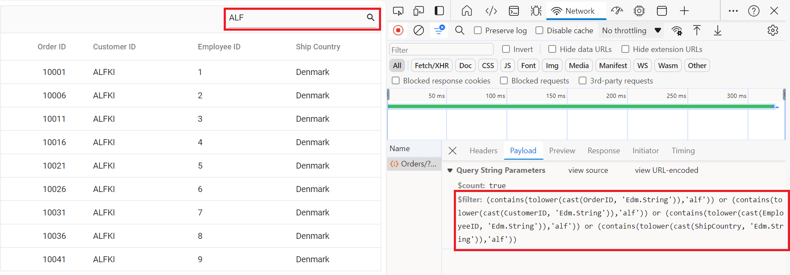

# ODataV4 in Syncfusion React Grid Component

The Syncfusion<sup style="font-size:70%">&reg;</sup> React Grid connects to remote data sources through [DataManager](https://ej2.syncfusion.com/react/documentation/data/getting-started), which provides different adaptors to integrate with various backend APIs. For OData V4 services, the connection is established using the `ODataV4Adaptor`, a specialized adaptor that enables seamless communication between the React Grid and OData V4 endpoints. It automatically converts Grid operations such as filtering, sorting, paging, and editing into OData‑compliant queries and processes the responses into a format the Grid can easily consume.

For complete server‑side configuration and additional implementation details, refer to the [DataManager ODataV4Adaptor](https://ej2.syncfusion.com/react/documentation/data/adaptors) documentation, which covers endpoint setup, query processing, and best practices for integrating OData V4 services.

## React Grid setup and client-side configuration

With the OData service operational, the next phase involves configuring the React Grid component to consume and display data from the service.

### Syncfusion package installation

Open a terminal inside the **ClientApp** (React project) folder and ensure **package.json** is present, then run:s

```bash
npm install @syncfusion/ej2-react-grids --save
npm install @syncfusion/ej2-data --save
```
- `@syncfusion/ej2-react-grids`: Complete React Grid component library with comprehensive UI features.
- `@syncfusion/ej2-data`: Data management library containing `DataManager` and adaptors including `ODataV4Adaptor`.

### Syncfusion stylesheet integration

Navigate to the **src** folder and open (or create) the stylesheet such as **styles.css** or **App.css**, then add the required CSS import statements to apply the Grid's styling.

```css
@import '../node_modules/@syncfusion/ej2-base/styles/tailwind3.css';
@import '../node_modules/@syncfusion/ej2-buttons/styles/tailwind3.css';
@import '../node_modules/@syncfusion/ej2-calendars/styles/tailwind3.css';
@import '../node_modules/@syncfusion/ej2-dropdowns/styles/tailwind3.css';
@import '../node_modules/@syncfusion/ej2-inputs/styles/tailwind3.css';
@import '../node_modules/@syncfusion/ej2-navigations/styles/tailwind3.css';
@import '../node_modules/@syncfusion/ej2-popups/styles/tailwind3.css';
@import '../node_modules/@syncfusion/ej2-splitbuttons/styles/tailwind3.css';
@import '../node_modules/@syncfusion/ej2-react-grids/styles/tailwind3.css';
```

> **Theme customization**: Alternative themes available include `bootstrap5.css`, `fluent.css`, `tailwind.css`, and others. All theme files maintain consistent path structure with only the filename varying.

Import the stylesheet in the **main.jsx** or **index.jsx** application entry point:

```js
import './styles.css';
```

### Basic Grid component implementation

Navigate to the **src** folder and open **App.jsx**, then set up the React Grid component and integrate it with the OData service.



import { DataManager, ODataV4Adaptor } from '@syncfusion/ej2-data';
import { ColumnDirective, ColumnsDirective, GridComponent } from '@syncfusion/ej2-react-grids';

function App() {
    // Create DataManager with ODataV4Adaptor
    const data = new DataManager({ 
      url: 'https://localhost:xxxx/odata/Orders', // Replace xxxx with actual port number
      adaptor: new ODataV4Adaptor(), // Handles all OData communication
      crossDomain: true // Enables cross-domain requests
    });
    
    return (
      <div style={{ margin: '20px' }}>
        <h2>Orders Grid</h2>
        <GridComponent dataSource={data}>
          <ColumnsDirective>
            <ColumnDirective field='OrderID' headerText='Order ID' isPrimaryKey={true} width='150' textAlign='Right' /> 
            <ColumnDirective field='CustomerID' headerText='Customer ID' width='150' />
            <ColumnDirective field='EmployeeID' headerText='Employee ID' width='150' />
            <ColumnDirective field='ShipCountry' headerText='Ship Country' width='150' />
          </ColumnsDirective>
        </GridComponent>
      </div>
    );
}

export default App;




**DataManager configuration:**
- `url`: Specifies OData service endpoint URL.
- `adaptor: new ODataV4Adaptor()`: Configures `DataManager` to utilize OData V4 protocol.
- Request pattern: Generates HTTP requests such as `GET https://localhost:xxxx/Orders`.
- `crossDomain: true`: Enables cross-origin requests.

### Application execution and verification

**Starting the application:** Start the application by pressing **F5** in Visual Studio, which opens it in the browser, and the Grid should load all "45" orders from the OData service.

**Connection verification:** Use the browser **Developer Tools (F12)** and check the **Network** tab after refreshing the page to confirm a request to `https://localhost:xxxx/odata/Orders` and verify that its response contains JSON data.

> **Notes**:
> - Verify in the Network tab that the GET request to the Orders OData endpoint returns a "200" response with valid JSON data.
> - CORS configuration is included in the **Complete Program.cs Implementation** section during server setup. Refer to that section for detailed CORS implementation and security considerations for production environments.

## Performing data operations

This section covers implementation of advanced Grid features including filtering, sorting, pagination, and complete CRUD operations.

### Filtering

Filtering enables data refinement by applying conditional criteria. Examples include displaying only orders from Denmark or orders with OrderID greater than "10005".

**Filtering workflow:**
1. Filter criteria entered in Grid column header.
2. `ODataV4Adaptor` converts criteria to OData query syntax: `$filter=ShipCountry eq 'Denmark'`.
3. Server processes filter query and returns matching records.
4. Grid renders filtered result set.

**Implementation steps:**

**Server-side filtering configuration:**

Verify **Program.cs** includes `.Filter()` method in OData configuration (configured in previous steps):



// Create a new instance of the web application builder.
var builder = WebApplication.CreateBuilder(args);

// Create an ODataConventionModelBuilder to build the OData model.
var modelBuilder = new ODataConventionModelBuilder();

// Register the "Orders" entity set with the OData model builder.
modelBuilder.EntitySet<OrdersDetails>("Orders");

// Add services to the container.

// Add controllers with OData support to the service collection.
builder.Services.AddControllers().AddOData(
    options => options
        .Count()
        .Filter() // Enable filtering support.
        .AddRouteComponents("odata", modelBuilder.GetEdmModel()));




import { DataManager, ODataV4Adaptor } from '@syncfusion/ej2-data';
import { ColumnDirective, ColumnsDirective, GridComponent, Filter, Inject } from '@syncfusion/ej2-react-grids';

function App() {
    const data = new DataManager({ 
      url:'https://localhost:xxxx/odata/Orders', // Replace with the actual API endpoint URL.
      adaptor: new ODataV4Adaptor(),
      crossDomain: true
    });
    return <GridComponent dataSource={data} allowFiltering={true}>
        <ColumnsDirective>
            <ColumnDirective field='OrderID' headerText='Order ID' isPrimaryKey={true} width='150' textAlign='Right' />
            <ColumnDirective field='CustomerID' headerText='Customer ID' width='150' />
            <ColumnDirective field='EmployeeID' headerText='Employee ID' width='150' textAlign='Right' />
            <ColumnDirective field='ShipCountry' headerText='Ship Country' width='150'/>
        </ColumnsDirective>
        <Inject services={[Filter]} />
    </GridComponent>
};
export default App;




**Filter usage:**

Open the filter by clicking the icon in the column header, enter a value (e.g., "Denmark", "10248", "ALFKI"), and apply the filter to view matching records. Clear or modify the filter to adjust or restore the full data set.

**Column types with corresponding filter operators:**
- **String columns**: Contains, Equals, Starts With, Ends With operators.
- **Number columns**: Equals, Greater Than, Less Than operators.
- **Date columns**: Equals, Before, After operators.

**Single column filtering:**


**Multi-column filtering:**

Multiple columns can be filtered simultaneously. Example: Apply filter criteria ShipCountry = "Denmark" AND OrderID > 10005.


### Searching

The search feature provides a global search interface that queries across all columns simultaneously. Unlike column-specific filtering, searching performs keyword matching across the entire data set.

**Filtering vs. Searching:**
- **Filtering**: Column-specific with precise conditional logic (example: ShipCountry = "Denmark")
- **Searching**: Global keyword matching across all columns (example: "Denmark" matches any column containing the term)

**Search workflow:**
1. Search term entered in search box.
2. `ODataV4Adaptor` constructs composite `$filter` query checking all columns.
3. Server returns records with matches in any column.
4. Grid displays aggregated search results.

**Implementation steps:**

**Server-side configuration:**

Search functionality requires `Filter()` method support (previously configured in Program.cs during OData setup).




// Create a new instance of the web application builder.
var builder = WebApplication.CreateBuilder(args);

// Create an ODataConventionModelBuilder to build the OData model.
var modelBuilder = new ODataConventionModelBuilder();

// Register the "Orders" entity set with the OData model builder.
modelBuilder.EntitySet<OrdersDetails>("Orders");

// Add services to the container.

// Add controllers with OData support to the service collection.
builder.Services.AddControllers().AddOData(
    options => options
        .Count()
        .Filter() // Enable filter for search functionality.
        .AddRouteComponents("odata", modelBuilder.GetEdmModel()));




import { DataManager, ODataV4Adaptor } from '@syncfusion/ej2-data';
import { ColumnDirective, ColumnsDirective, GridComponent, Toolbar, Inject } from '@syncfusion/ej2-react-grids';

function App() {
    const data = new DataManager({ 
      url:'https://localhost:xxxx/odata/Orders', // Replace with the actual API endpoint URL.
      adaptor: new ODataV4Adaptor(),
      crossDomain: true
    });
    const toolbar = ['Search'];
    return <GridComponent dataSource={data} toolbar={toolbar}>
        <ColumnsDirective>
            <ColumnDirective field='OrderID' headerText='Order ID' isPrimaryKey={true} width='150' textAlign='Right' />
            <ColumnDirective field='CustomerID' headerText='Customer ID' width='150' />
            <ColumnDirective field='EmployeeID' headerText='Employee ID' width='150' textAlign='Right'/>
            <ColumnDirective field='ShipCountry' headerText='Ship Country' width='150'/>
        </ColumnsDirective>
        <Inject services={[Toolbar]} />
    </GridComponent>
};
export default App;





**Search usage:**

Use the search box in the Grid's top‑right corner to enter any keyword, and matching records from all columns will be shown instantly. Clear the search input to return to the full data set.



### Sorting 

Sorting arranges records in ascending or descending order based on column values. Both single-column and multi-column sorting are supported.

**Sorting workflow:**
1. Column header clicked
2. First click: Ascending sort applied (A→Z, 0→9)
3. Second click: Descending sort applied (Z→A, 9→0)
4. Third click: Sort removed
5. `ODataV4Adaptor` generates OData query: `$orderby=ColumnName asc/desc`

**Multi-column sorting:**
Hold **Ctrl** key (Windows) or **Cmd** key (Mac) and click multiple column headers to establish multi-column sort priority.

**Implementation steps:**

**Server-side sorting configuration:**

Verify **Program.cs** includes `.OrderBy()` method in OData configuration (configured in previous steps).




// Create a new instance of the web application builder .
var builder = WebApplication.CreateBuilder(args);

// Create an ODataConventionModelBuilder to build the OData model.
var modelBuilder = new ODataConventionModelBuilder();

// Register the "Orders" entity set with the OData model builder.
modelBuilder.EntitySet<OrdersDetails>("Orders");

// Add controllers with OData support to the service collection.
builder.Services.AddControllers().AddOData(
    options => options
        .Count()
        .OrderBy() // Enable sorting support.
        .AddRouteComponents("odata", modelBuilder.GetEdmModel()));




import { DataManager, ODataV4Adaptor } from '@syncfusion/ej2-data';
import { ColumnDirective, ColumnsDirective, GridComponent, Sort, Inject } from '@syncfusion/ej2-react-grids';

function App() {
    const data = new DataManager({ 
      url:'https://localhost:xxxx/odata/Orders', // Replace with the actual API endpoint URL.
      adaptor: new ODataV4Adaptor(),
      crossDomain: true
    });
    return <GridComponent dataSource={data} allowSorting={true}>
        <ColumnsDirective>
            <ColumnDirective field='OrderID' headerText='Order ID' isPrimaryKey={true} width='150' textAlign='Right' />
            <ColumnDirective field='CustomerID' headerText='Customer ID' width='150' />
            <ColumnDirective field='EmployeeID' headerText='Employee ID' width='150' textAlign='Right'/>
            <ColumnDirective field='ShipCountry' headerText='Ship Country' width='150'/>
        </ColumnsDirective>
        <Inject services={[Sort]} />
    </GridComponent>
};
export default App;




**Single column sorting:**

Click "Order ID" column header to sort by OrderID field.


**Multi-column sorting:**

Hold Ctrl key and click "Ship Country" followed by "Order ID" to establish hierarchical sort (primary sort by country, secondary sort by ID within each country group).


**Sort indicator legend:**
- ↑ (Up arrow): Indicates ascending sort direction
- ↓ (Down arrow): Indicates descending sort direction
- Numeric indicator (1, 2, 3): Displays sort priority in multi-column sorting scenarios

### Pagination

**Pagination overview:**

Pagination divides large datasets into manageable pages, enhancing performance and usability. Instead of loading all 45 orders simultaneously, pagination displays a subset (e.g., 10 orders per page).

**Pagination workflow:**
1. Page navigation triggered (Next Page button or page number selection).
2. `ODataV4Adaptor` generates query with `$skip` and `$top` parameters.
3. Example query for page 2 with 10 records per page: `$skip=10&$top=10`.
4. Server returns requested page data only.
5. Grid renders current page data.

**Implementation steps:**

**Server-side pagination configuration:**

Utilize `SetMaxTop()` method in **Program.cs** to establish maximum records per request limit (previously configured with `SetMaxTop(100)`). 




// Paging is already configured in Program.cs with:
builder.Services.AddControllers().AddOData(
    options => options
        .Select()
        .Filter()
        .OrderBy()
        .Expand()
        .Count()           // Required for paging to show total count
        .SetMaxTop(100)    // Maximum 100 records per page
        .AddRouteComponents("odata", modelBuilder.GetEdmModel()));




import { DataManager, ODataV4Adaptor } from '@syncfusion/ej2-data';
import { ColumnDirective, ColumnsDirective, GridComponent, Page, Inject } from '@syncfusion/ej2-react-grids';

function App() {
    const data = new DataManager({ 
      url: 'https://localhost:xxxx/odata/Orders', // Replace with the actual API endpoint URL.
      adaptor: new ODataV4Adaptor(),
      crossDomain: true
    });
    const pageSettings = { pageSize: 10, pageSizes: true };
    return <GridComponent dataSource={data} allowPaging={true} pageSettings={pageSettings}>
        <ColumnsDirective>
            <ColumnDirective field='OrderID' headerText='Order ID' isPrimaryKey={true} width='150' textAlign='Right' />
            <ColumnDirective field='CustomerID' headerText='Customer ID' width='150' />
            <ColumnDirective field='EmployeeID' headerText='Employee ID' width='150' textAlign='Right'/>
            <ColumnDirective field='ShipCountry' headerText='Ship Country' width='150'/>
        </ColumnsDirective>
        <Inject services={[Page]} />
    </GridComponent>
};
export default App;




The following screenshot illustrates the ODataV4Adaptor with paging query.


> For more information about paging, refer to the [Paging](https://ej2.syncfusion.com/react/documentation/grid/paging) documentation.

### CRUD operations

CRUD refers to the four essential data operations: **Create** (add records), **Read** (view records), **Update** (modify records), and **Delete** (remove records).

**CRUD works with OData:**

| Operation | HTTP Method | URL Example | Description |
|-----------|-------------|-------------|-------------|
| **Read** | GET | `/odata/Orders` | Get all records |
| **Create** | POST | `/odata/Orders` | Add a new record |
| **Update** | PATCH | `/odata/Orders(10001)` | Update record with key 10001 |
| **Delete** | DELETE | `/odata/Orders(10001)` | Delete record with key 10001 |

**Implementation steps:**

### Step 1: Complete server-Side controller

Add all CRUD methods to the **OrdersController.cs**. Replace the entire controller with this complete version:




using Microsoft.AspNetCore.Mvc;
using Microsoft.AspNetCore.OData.Query;
using Microsoft.AspNetCore.OData.Routing.Controllers;
using ODataV4Adaptor.Server.Models;

namespace ODataV4Adaptor.Server.Controllers
{
    [Route("[controller]")]
    [ApiController]
    public class OrdersController : ODataController
    {
        // READ: Get all orders
        [HttpGet]
        [EnableQuery]
        public IActionResult Get()
        {
            var data = OrdersDetails.GetAllRecords().AsQueryable();
            return Ok(data);
        }

        // READ: Get single order by key
        [HttpGet("{key}")]
        [EnableQuery]
        public IActionResult Get(int key)
        {
            var order = OrdersDetails.GetAllRecords().FirstOrDefault(o => o.OrderID == key);
            if (order == null)
            {
                return NotFound();
            }
            return Ok(order);
        }

        // CREATE: Insert new order
        [HttpPost]
        [EnableQuery]
        public IActionResult Post([FromBody] OrdersDetails addRecord)
        {
            if (addRecord == null)
            {
                return BadRequest("Order cannot be null");
            }

            // Add to the beginning of the list
            OrdersDetails.GetAllRecords().Insert(0, addRecord);
            return Created(addRecord);
        }

        // UPDATE: Modify existing order
        [HttpPatch("{key}")]
        public IActionResult Patch(int key, [FromBody] OrdersDetails updatedOrder)
        {
            if (updatedOrder == null)
            {
                return BadRequest("Order data cannot be null");
            }

            var existingOrder = OrdersDetails.GetAllRecords().FirstOrDefault(o => o.OrderID == key);
            if (existingOrder == null)
            {
                return NotFound();
            }

            // Update properties (null-coalescing handles partial updates)
            existingOrder.CustomerID = updatedOrder.CustomerID ?? existingOrder.CustomerID;
            existingOrder.EmployeeID = updatedOrder.EmployeeID ?? existingOrder.EmployeeID;
            existingOrder.ShipCountry = updatedOrder.ShipCountry ?? existingOrder.ShipCountry;

            return Ok(existingOrder);
        }

        // DELETE: Remove order
        [HttpDelete("{key}")]
        public IActionResult Delete(int key)
        {
            var order = OrdersDetails.GetAllRecords().FirstOrDefault(o => o.OrderID == key);
            if (order == null)
            {
                return NotFound();
            }

            OrdersDetails.GetAllRecords().Remove(order);
            return NoContent(); // 204 No Content is standard for successful DELETE
        }
    }
}




**Controller method breakdown:**

- **Get()**: Returns all orders; `[EnableQuery]` allows OData filtering/sorting.
- **Get(int key)**: Returns specific order by ID.
- **Post()**: Creates new order; `Created()` returns 201 status with new record.
- **Patch()**: Updates existing order; only changes specified fields.
- **Delete()**: Removes order; `NoContent()` returns 204 status.

### Step 2: client-side grid configuration

Now configure the React Grid to enable editing:



import { ColumnDirective, ColumnsDirective, GridComponent, Toolbar, Edit, Inject } from '@syncfusion/ej2-react-grids';
import { DataManager, ODataV4Adaptor } from '@syncfusion/ej2-data';

function App() {
    const data = new DataManager({ 
      url: 'https://localhost:xxxx/odata/Orders', // Here xxxx represents the port number.
      adaptor: new ODataV4Adaptor(),
      crossDomain: true
    });
    
    // Configure editing options
    const editSettings = { 
      allowEditing: true,   // Enable edit button
      allowAdding: true,    // Enable add button
      allowDeleting: true,  // Enable delete button
      mode: 'Normal',       // Inline editing mode
      showDeleteConfirmDialog: true  // Enable confirmation dialog
    };
    
    // Configure toolbar buttons
    const toolbar = ['Add', 'Edit', 'Delete', 'Update', 'Cancel', 'Search'];
    
    // Validation rules
    const orderIDRules = { required: true };
    const customerIDRules = { required: true, minLength: 3 };
    
    return <GridComponent 
      dataSource={data} 
      editSettings={editSettings} 
      toolbar={toolbar} 
      height={320}>
        <ColumnsDirective>
            <ColumnDirective field='OrderID' headerText='Order ID' isPrimaryKey={true} width='150' textAlign='Right' validationRules={orderIDRules} />
            <ColumnDirective field='CustomerID' headerText='Customer ID' width='150' validationRules={customerIDRules} />
            <ColumnDirective field='EmployeeID' headerText='Employee ID' width='150' textAlign='Right' />
            <ColumnDirective field='ShipCountry' headerText='Ship Country' width='150' />
        <Inject services={[Toolbar, Edit]} />
    </GridComponent>
};
export default App;




>  The OrderID field must have `isPrimaryKey={true}` for CRUD operations to function correctly.

### Step 3: Using CRUD features

**Adding a new record:**

Click Add to create a new row, fill in the details, save with Update (or cancel), and the grid then sends a `POST` request to the server.


**Editing an existing record:**

Select the record, click Edit, modify the fields, save with Update (or cancel), and the grid sends a `PATCH` request to the server.


**Deleting a record:**

Select the record, click Delete, confirm in the dialog, and the grid sends a `DELETE` request to the server.


> For more details about the edit configuration and available [modes](https://ej2.syncfusion.com/react/documentation/api/grid/editsettings#mode), refer to [Edit Types](https://ej2.syncfusion.com/react/documentation/grid/editing/edit-types).

### Custom URLs for CRUD operations

By default, `ODataV4Adaptor` uses standard OData conventions:
- Create: `POST /odata/Orders`.
- Update: `PATCH /odata/Orders(10001)`.
- Delete: `DELETE /odata/Orders(10001)`.

Custom URLs become necessary in these scenarios:
- Existing non-OData endpoints cannot be modified.
- CRUD operations must route to different controllers.
- Custom business logic requires special routing.
- Third-party API integration is required.

**Custom URL implementation:**

Explicitly specify which URL `DataManager` uses for each operation instead of relying on OData routing conventions.

**Configuring custom URLs:**

`DataManager` supports these custom URL properties:

| Property | Purpose | Default Behavior |
|----------|---------|------------------|
| `url` | Read (GET) operations. | `/odata/Orders` |
| `insertUrl` | Create (POST) operations. | Uses `url`. |
| `updateUrl` | Update (PATCH/PUT) operations. | Uses `url/{key}`. |
| `removeUrl` | Delete (DELETE) operations. | Uses `url/{key}`. |
| `batchUrl` | Batch operations. | Uses `url/$batch`. |

### Example 1: Separate URLs for each operation

**Scenario:** Different controllers handle different operations.



import { ColumnDirective, ColumnsDirective, GridComponent, Toolbar, Edit, Inject } from '@syncfusion/ej2-react-grids';
import { DataManager, ODataV4Adaptor } from '@syncfusion/ej2-data';

function App() {
    const data = new DataManager({ 
      url: 'https://localhost:xxxx/odata/Orders',              // GET: Read operations
      insertUrl: 'https://localhost:xxxx/odata/Orders/Insert', // POST: Create operations
      updateUrl: 'https://localhost:xxxx/odata/Orders/Update', // PATCH: Update operations
      removeUrl: 'https://localhost:xxxx/odata/Orders/Delete', // DELETE: Delete operations
      adaptor: new ODataV4Adaptor(),
      crossDomain: true
    });
    
    const editSettings = { 
      allowEditing: true, 
      allowAdding: true, 
      allowDeleting: true, 
      mode: 'Normal' 
    };
    const toolbar = ['Add', 'Edit', 'Delete', 'Update', 'Cancel', 'Search'];
    const orderIDRules = { required: true };
    const customerIDRules = { required: true, minLength: 3 };
    
    return <GridComponent dataSource={data} editSettings={editSettings} toolbar={toolbar} height={320}>
        <ColumnsDirective>
            <ColumnDirective field='OrderID' headerText='Order ID' isPrimaryKey={true} width='150' textAlign='Right' validationRules={orderIDRules} />
            <ColumnDirective field='CustomerID' headerText='Customer ID' width='150' validationRules={customerIDRules} />
            <ColumnDirective field='EmployeeID' headerText='Employee ID' width='150'/>
            <ColumnDirective field='ShipCountry' headerText='Ship Country' width='150'/>
        </ColumnsDirective>
        <Inject services={[Toolbar, Edit]} />
    </GridComponent>
};
export default App;




**Important:**  Server routes must be created to handle these custom URLs.

### Example 2: Batch editing with custom URL

**Scenario:** Multiple changes are processed in a single request for improved efficiency.



import { ColumnDirective, ColumnsDirective, GridComponent, Toolbar, Edit, Inject } from '@syncfusion/ej2-react-grids';
import { DataManager, ODataV4Adaptor } from '@syncfusion/ej2-data';

function App() {
    const data = new DataManager({ 
      url: 'https://localhost:xxxx/odata/Orders',
      batchUrl: 'https://localhost:xxxx/odata/Orders/Batch',  // All CRUD operations go here
      adaptor: new ODataV4Adaptor(),
      crossDomain: true
    });
    
    const editSettings = { 
      allowEditing: true, 
      allowAdding: true, 
      allowDeleting: true, 
      mode: 'Batch'  // Important: Use Batch mode
    };
    const toolbar = ['Add', 'Edit', 'Delete', 'Update', 'Cancel', 'Search'];
    const orderIDRules = { required: true };
    const customerIDRules = { required: true, minLength: 3 };
    
    return <GridComponent dataSource={data} editSettings={editSettings} toolbar={toolbar} height={320}>
        <ColumnsDirective>
            <ColumnDirective field='OrderID' headerText='Order ID' isPrimaryKey={true} width='150' textAlign='Right' validationRules={orderIDRules} />
            <ColumnDirective field='CustomerID' headerText='Customer ID' width='150' validationRules={customerIDRules} />
            <ColumnDirective field='EmployeeID' headerText='Employee ID' width='150'/>
            <ColumnDirective field='ShipCountry' headerText='Ship Country' width='150'/>
        </ColumnsDirective>
        <Inject services={[Toolbar, Edit]} />
    </GridComponent>
};
export default App;




**Batch mode benefits:**

Batch mode allows editing multiple rows at once and sending all modifications in a single request, reducing server calls.

> **Note:** Custom URL server endpoints must be configured with proper routing in the ASP.NET Core application.

## Troubleshooting common issues

### Issue 1: empty grid

**Symptom:** Grid displays but no data appears.

**Solutions:** Check the console and Network tab to confirm the request succeeds and returns data.
Ensure "GetAllRecords()" provides results and the controller includes the [EnableQuery] attribute.

### Issue 2: CRUD operations not working

**Symptom:** Add/Edit/Delete buttons malfunction or throw errors.

**Solutions:** Ensure the primary key is configured correctly and the controller supports POST, PATCH, and DELETE operations. Also confirm CORS allows these methods and that validation rules aren’t blocking the actions.

### Issue 3: Styles not applied

**Symptom:** Grid appears plain without Syncfusion styling.

**Solutions:** Confirm that the Syncfusion CSS files are properly imported with the correct paths and without console errors.
If styles still don't load, clear the browser cache to ensure the latest CSS is applied.

## Summary

- **ODataV4Adaptor Integration**: Installing and configuring Syncfusion React Grid efficiently.
- **Data binding**: Seamlessly connecting Grid to OData service with `ODataV4Adaptor`.
- **Data Operations**: Handles paging, sorting, and searching to efficiently manage and display data in the Grid.
- **CRUD operations**: Complete Create, Read, Update, Delete functionality.
- **Custom URLs**: Advanced routing options for specialized CRUD scenarios.