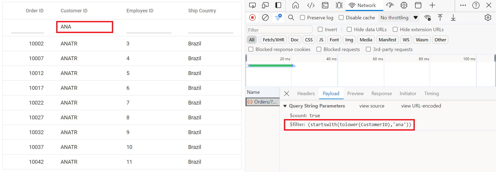
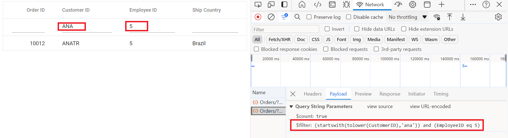

# ODataV4Adaptor in Syncfusion React Grid Component

The `ODataV4Adaptor` in the Syncfusion React Grid Component allows seamless integration of the React Grid with OData V4 services, enabling efficient data fetching and manipulation. This guide provides detailed instructions on binding data and performing CRUD (Create, Read, Update, Delete) actions using the `ODataV4Adaptor` in your Syncfusion React Grid Component.
 
## Creating an OData service

To configure a server with Syncfusion React Grid, you need to follow the below steps:

**1. Project Creation:**

Open Visual Studio and create an React and ASP.NET Core project named **ODataV4Adaptor**. To create an React and ASP.NET Core application, follow the documentation [link](https://learn.microsoft.com/en-us/visualstudio/javascript/tutorial-asp-net-core-with-react?view=vs-2022) for detailed steps.

**2. Install NuGet Packages**

Using the NuGet package manager in Visual Studio (Tools → NuGet Package Manager → Manage NuGet Packages for Solution), install the `Microsoft.AspNetCore.OData` NuGet package.

**3. Model Class Creation:**

Create a model class named **OrdersDetails.cs** in the server-side **Models** folder to represent the order data.




using System.ComponentModel.DataAnnotations;

namespace ODataV4Adaptor.Server.Models
{
    public class OrdersDetails
    {
        public static List<OrdersDetails> order = new List<OrdersDetails>();
        public OrdersDetails()
        {

        }
        public OrdersDetails(
        int OrderID, string CustomerId, int EmployeeId, string ShipCountry)
        {
            this.OrderID = OrderID;
            this.CustomerID = CustomerId;
            this.EmployeeID = EmployeeId;
            this.ShipCountry = ShipCountry;
        }   

        public static List<OrdersDetails> GetAllRecords()
        {
            if (order.Count() == 0)
            {
                int code = 10000;
                for (int i = 1; i < 10; i++)
                {
                    order.Add(new OrdersDetails(code + 1, "ALFKI", i + 0, "Denmark"));
                    order.Add(new OrdersDetails(code + 2, "ANATR", i + 2, "Brazil"));
                    order.Add(new OrdersDetails(code + 3, "ANTON", i + 1, "Germany"));
                    order.Add(new OrdersDetails(code + 4, "BLONP", i + 3, "Austria"));
                    order.Add(new OrdersDetails(code + 5, "BOLID", i + 4, "Switzerland"));
                    code += 5;
                }
            }
            return order;
        }
        [Key]
        public int? OrderID { get; set; }
        public string? CustomerID { get; set; }
        public int? EmployeeID { get; set; }
        public string? ShipCountry { get; set; }
    }
}




**4. Build the Entity Data Model**

To construct the Entity Data Model for your OData service, utilize the `ODataConventionModelBuilder` to define the model's structure. Start by creating an instance of the `ODataConventionModelBuilder`, then register the entity set **Orders** using the `EntitySet<T>` method, where `OrdersDetails` represents the CLR type containing order details. 

```cs
// Create an ODataConventionModelBuilder to build the OData model
var modelBuilder = new ODataConventionModelBuilder();

// Register the "Orders" entity set with the OData model builder
modelBuilder.EntitySet<OrdersDetails>("Orders");
```

**5. Register the OData Services**

Once the Entity Data Model is built, you need to register the OData services in your ASP.NET Core application. Here's how:

```cs
// Add controllers with OData support to the service collection
builder.Services.AddControllers().AddOData(
    options => options
        .Count()
        .AddRouteComponents("odata", modelBuilder.GetEdmModel()));
```

**6. Add controllers**

Finally, add controllers to expose the OData endpoints. Here's an example:

```cs
using Microsoft.AspNetCore.Mvc;
using Microsoft.AspNetCore.OData.Query;
using ODataV4Adaptor.Server.Models;

namespace ODataV4Adaptor.Server.Controllers
{
    [Route("[controller]")]
    [ApiController]
    public class OrdersController : ControllerBase
    {
        /// <summary>
        /// Retrieves all orders.
        /// </summary>
        /// <returns>The collection of orders.</returns>
        [HttpGet]
        [EnableQuery]
        public IActionResult Get()
        {
            var data = OrdersDetails.GetAllRecords().AsQueryable();
            return Ok(data);
        }
    }
}
```

**7. Run the Application:**

Run the application in Visual Studio. It will be accessible on a URL like **https://localhost:xxxx**. 

After running the application, you can verify that the server-side API controller is successfully returning the order data in the URL(https://localhost:xxxx/odata/Orders). Here **xxxx** denotes the port number.

## Connecting Syncfusion React Grid to an OData service

To integrate the Syncfusion Grid component into your React and ASP.NET Core project using Visual Studio, follow the below steps:

**Step 1: Install Syncfusion Package**

Open your terminal in the project's client folder and install the required Syncfusion packages using npm:

```bash
npm install @syncfusion/ej2-react-grids --save
npm install @syncfusion/ej2-data --save
```

**Step 2: Adding CSS reference**

Include the necessary CSS files in your `styles.css` file to style the Syncfusion React component:




@import '../node_modules/@syncfusion/ej2-base/styles/material.css';
@import '../node_modules/@syncfusion/ej2-buttons/styles/material.css';
@import '../node_modules/@syncfusion/ej2-calendars/styles/material.css';
@import '../node_modules/@syncfusion/ej2-dropdowns/styles/material.css';
@import '../node_modules/@syncfusion/ej2-inputs/styles/material.css';
@import '../node_modules/@syncfusion/ej2-navigations/styles/material.css';
@import '../node_modules/@syncfusion/ej2-popups/styles/material.css';
@import '../node_modules/@syncfusion/ej2-splitbuttons/styles/material.css';
@import '../node_modules/@syncfusion/ej2-react-grids/styles/material.css';




**Step 4: Adding Syncfusion Component**

In your component file (e.g., App.tsx), import `DataManager` and `ODataV4Adaptor` from `@syncfusion/ej2-data`. Create a `DataManager` instance specifying the URL of your API endpoint(https:localhost:xxxx/odata/Orders) using the `url` property and set the adaptor `ODataV4Adaptor`.



import { DataManager, ODataV4Adaptor } from '@syncfusion/ej2-data';
import { ColumnDirective, ColumnsDirective, GridComponent } from '@syncfusion/ej2-react-grids';

function App() {
    const data = new DataManager({ 
      url:'https://localhost:xx/odata/Orders', // Here xx represents the port number
      adaptor: new ODataV4Adaptor()
    });
    return <GridComponent dataSource={data} >
        <ColumnsDirective>
            <ColumnDirective field='OrderID' headerText='Order ID' isPrimaryKey={true} width='150'textAlign='Right'></ColumnDirective>
            <ColumnDirective field='CustomerID' headerText='Customer ID' width='150'></ColumnDirective>
            <ColumnDirective field='EmployeeID' headerText='Employee ID' width='150'/>
            <ColumnDirective field='ShipCountry' headerText='Ship Country' width='150'/>
        </ColumnsDirective>
    </GridComponent>
};
export default App;



> Replace https://localhost:xxxx/odata/Orders with the actual **URL** of your API endpoint that provides the data in a consumable format (e.g., JSON).

Run the application in Visual Studio. It will be accessible on a URL like **https://localhost:xxxx**.

> Ensure your API service is configured to handle CORS (Cross-Origin Resource Sharing) if necessary.

  ```cs
  [program.cs]
  builder.Services.AddCors(options =>
  {
    options.AddDefaultPolicy(builder =>
    {
      builder.AllowAnyOrigin().AllowAnyMethod().AllowAnyHeader();
    });
  });
  var app = builder.Build();
  app.UseCors();
  ```

## Handling filtering operation

To enable filter operations in your web application using OData, you first need to configure the OData support in your service collection. This involves adding the `Filter` method within the OData setup, allowing you to filter data based on specified criteria. Once enabled, clients can utilize the **$filter** query option in your requests to filter for specific data entries.



// Create a new instance of the web application builder
var builder = WebApplication.CreateBuilder(args);

// Create an ODataConventionModelBuilder to build the OData model
var modelBuilder = new ODataConventionModelBuilder();

// Register the "Orders" entity set with the OData model builder
modelBuilder.EntitySet<OrdersDetails>("Orders");

// Add services to the container.

// Add controllers with OData support to the service collection
builder.Services.AddControllers().AddOData(
    options => options
        .Count()
        .Filter() //filtering
        .AddRouteComponents("odata", modelBuilder.GetEdmModel()));


import { DataManager, ODataV4Adaptor } from '@syncfusion/ej2-data';
import { ColumnDirective, ColumnsDirective, GridComponent, Filter } from '@syncfusion/ej2-react-grids';

function App() {
    const data = new DataManager({ 
      url:'https://localhost:xxxx/odata/Orders', // Replace your hosted link
      adaptor: new ODataV4Adaptor()
    });
    return <GridComponent dataSource={data} allowFiltering={true}>
        <ColumnsDirective>
            <ColumnDirective field='OrderID' headerText='Order ID' isPrimaryKey={true} width='150'textAlign='Right'></ColumnDirective>
            <ColumnDirective field='CustomerID' headerText='Customer ID' width='150'></ColumnDirective>
            <ColumnDirective field='EmployeeID' headerText='Employee ID' width='150'/>
            <ColumnDirective field='ShipCountry' headerText='Ship Country' width='150'/>
        </ColumnsDirective>
         <Inject services={[Filter]} />
    </GridComponent>
};
export default App;



**Single column filtering**



**Multi column filtering**



## Handling searching operation

To enable search operations in your web application using OData, you first need to configure the OData support in your service collection. This involves adding the `Filter` method within the OData setup, allowing you to filter data based on specified criteria. Once enabled, clients can utilize the **$filter** query option in their requests to search for specific data entries.



// Create a new instance of the web application builder
var builder = WebApplication.CreateBuilder(args);

// Create an ODataConventionModelBuilder to build the OData model
var modelBuilder = new ODataConventionModelBuilder();

// Register the "Orders" entity set with the OData model builder
modelBuilder.EntitySet<OrdersDetails>("Orders");

// Add services to the container.

// Add controllers with OData support to the service collection
builder.Services.AddControllers().AddOData(
    options => options
        .Count()
        .Filter() // searching
        .AddRouteComponents("odata", modelBuilder.GetEdmModel()));


import { DataManager, ODataV4Adaptor } from '@syncfusion/ej2-data';
import { ColumnDirective, ColumnsDirective, GridComponent, Toolbar, ToolbarItems } from '@syncfusion/ej2-react-grids';

function App() {
    const data = new DataManager({ 
      url:'https://localhost:xxxx/odata/Orders', // Replace your hosted link
      adaptor: new ODataV4Adaptor()
    });
    const toolbar: ToolbarItems[] = ['Search'];
    return <GridComponent dataSource={data} toolbar={toolbar}>
        <ColumnsDirective>
            <ColumnDirective field='OrderID' headerText='Order ID' isPrimaryKey={true} width='150'textAlign='Right'></ColumnDirective>
            <ColumnDirective field='CustomerID' headerText='Customer ID' width='150'></ColumnDirective>
            <ColumnDirective field='EmployeeID' headerText='Employee ID' width='150'/>
            <ColumnDirective field='ShipCountry' headerText='Ship Country' width='150'/>
        </ColumnsDirective>
        <Inject services={[Toolbar]} />
    </GridComponent>
};
export default App;




## Handling sorting operation

To enable sorting operations in your web application using OData, you first need to configure the OData support in your service collection. This involves adding the `OrderBy` method within the OData setup, allowing you to sort data based on specified criteria. Once enabled, clients can utilize the **$orderby** query option in their requests to sort data entries according to desired attributes.



// Create a new instance of the web application builder 
var builder = WebApplication.CreateBuilder(args);

// Create an ODataConventionModelBuilder to build the OData model
var modelBuilder = new ODataConventionModelBuilder();

// Register the "Orders" entity set with the OData model builder
modelBuilder.EntitySet<OrdersDetails>("Orders");

// Add services to the container.

// Add controllers with OData support to the service collection
builder.Services.AddControllers().AddOData(
    options => options
        .Count()
        .OrderBy() // sorting
        .AddRouteComponents("odata", modelBuilder.GetEdmModel()));


import { DataManager, ODataV4Adaptor } from '@syncfusion/ej2-data';
import { ColumnDirective, ColumnsDirective, GridComponent, Sort } from '@syncfusion/ej2-react-grids';

function App() {
    const data = new DataManager({ 
      url:'https://localhost:xxxx/odata/Orders', // Replace your hosted link
      adaptor: new ODataV4Adaptor()
    });
    return <GridComponent dataSource={data} allowSorting={true}>
        <ColumnsDirective>
            <ColumnDirective field='OrderID' headerText='Order ID' isPrimaryKey={true} width='150'textAlign='Right'></ColumnDirective>
            <ColumnDirective field='CustomerID' headerText='Customer ID' width='150'></ColumnDirective>
            <ColumnDirective field='EmployeeID' headerText='Employee ID' width='150'/>
            <ColumnDirective field='ShipCountry' headerText='Ship Country' width='150'/>
        </ColumnsDirective>
        <Inject services={[Sort]} />
    </GridComponent>
};
export default App;



**Single column sorting**


**Multi column sorting**


## Handling paging operation

To implement paging operations in your web application using OData, you can utilize the `SetMaxTop` method within your OData setup to limit the maximum number of records that can be returned per request. While you configure the maximum limit, clients can utilize the **$skip** and **$top** query options in their requests to specify the number of records to skip and the number of records to take, respectively. 




// Create a new instance of the web application builder
var builder = WebApplication.CreateBuilder(args);

// Create an ODataConventionModelBuilder to build the OData model
var modelBuilder = new ODataConventionModelBuilder();

// Register the "Orders" entity set with the OData model builder
modelBuilder.EntitySet<OrdersDetails>("Orders");

// Add services to the container.

// Add controllers with OData support to the service collection
builder.Services.AddControllers().AddOData(
    options => options
        .Count()
        .SetMaxTop(null)
        .AddRouteComponents("odata", modelBuilder.GetEdmModel()));



import { DataManager, ODataV4Adaptor } from '@syncfusion/ej2-data';
import { ColumnDirective, ColumnsDirective, GridComponent, Page } from '@syncfusion/ej2-react-grids';

function App() {
    const data = new DataManager({ 
      url: 'https://localhost:xxxx/odata/Orders', // Replace your hosted link
      adaptor: new ODataV4Adaptor()
    });
    return <GridComponent dataSource={data} allowPaging={true}>
        <ColumnsDirective>
            <ColumnDirective field='OrderID' headerText='Order ID' isPrimaryKey={true} width='150'textAlign='Right'></ColumnDirective>
            <ColumnDirective field='CustomerID' headerText='Customer ID' width='150'></ColumnDirective>
            <ColumnDirective field='EmployeeID' headerText='Employee ID' width='150'/>
            <ColumnDirective field='ShipCountry' headerText='Ship Country' width='150'/>
        </ColumnsDirective>
        <Inject services={[Page]} />
    </GridComponent>
};
export default App;




## Handling CRUD operations

To manage CRUD (Create, Read, Update, Delete) operations using the ODataV4Adaptor, follow the provided guide for configuring the Syncfusion Grid for [editing](https://ej2.syncfusion.com/react/documentation/grid/editing/edit) and utilize the sample implementation of the `OrdersController` in your server application. This controller handles HTTP requests for CRUD operations such as GET, POST, PATCH, and DELETE.

To enable CRUD operations in the Syncfusion Grid component within an React application, follow the below steps:



import { ColumnDirective, ColumnsDirective, GridComponent, ToolbarItems, EditSettingsModel, Toolbar, Edit, Inject } from '@syncfusion/ej2-react-grids';
import { DataManager, ODataV4Adaptor } from '@syncfusion/ej2-data';

function App() {
    const data = new DataManager({ 
      url: 'https://localhost:xxxx/odata/Orders', // xxxx denotes port number
      adaptor: new ODataV4Adaptor()
    });
    const editSettings: EditSettingsModel = { allowEditing: true, allowAdding: true, allowDeleting: true, mode: 'Normal' };
    const toolbar: ToolbarItems[] = ['Add', 'Edit', 'Delete', 'Update', 'Cancel', 'Search'];
    const orderIDRules: object = {required: true};
    const customerIDRules: object = {required: true, minLength: 3};
    return <GridComponent dataSource={data} editSettings={editSettings} toolbar={toolbar} height={320}>
        <ColumnsDirective>
            <ColumnDirective field='OrderID' headerText='Order ID' isPrimaryKey={true} width='150' textAlign='Right' validationRules={orderIDRules}></ColumnDirective>
            <ColumnDirective field='CustomerID' headerText='Customer ID' width='150' validationRules={customerIDRules}></ColumnDirective>
            <ColumnDirective field='EmployeeID' headerText='Employee ID' width='150'/>
            <ColumnDirective field='ShipCountry' headerText='Ship Country' width='150'/>
        </ColumnsDirective>
        <Inject services={[Toolbar, Edit]} />
    </GridComponent>
};
export default App;



> Normal/Inline editing is the default edit [mode](https://ej2.syncfusion.com/react/documentation/api/grid/editSettings/#mode) for the Grid component. To enable CRUD operations, ensure that the [isPrimaryKey](https://ej2.syncfusion.com/react/documentation/api/grid/column/#isprimarykey) property is set to **true** for a specific Grid column, ensuring that its value is unique.

**Insert Record**

To insert a new record into your Syncfusion Grid, you can utilize the `HttpPost` method in your server application. Below is a sample implementation of inserting a record using the **OrdersController**:

```cs
/// <summary>
/// Inserts a new order to the collection.
/// </summary>
/// <param name="addRecord">The order to be inserted.</param>
/// <returns>It returns the newly inserted record detail.</returns>
[HttpPost]
[EnableQuery]
public IActionResult Post([FromBody] OrdersDetails addRecord)
{
    if (order == null)
    {
        return BadRequest("Null order");
    }

    OrdersDetails.GetAllRecords().Insert(0, addRecord);
    return Ok(addRecord);
}
```


**Update Record**

Updating a record in the Syncfusion Grid can be achieved by utilizing the `HttpPatch` method in your controller. Here's a sample implementation of updating a record:

```cs
/// <summary>
/// Updates an existing order.
/// </summary>
/// <param name="key">The ID of the order to update.</param>
/// <param name="updateRecord">The updated order details.</param>
/// <returns>It returns the updated order details.</returns>
[HttpPatch("{key}")]
public IActionResult Patch(int key, [FromBody] OrdersDetails updatedOrder)
{
    if (updatedOrder == null)
    {
        return BadRequest("No records");
    }
    var existingOrder = OrdersDetails.GetAllRecords().FirstOrDefault(o => o.OrderID == key);
    if (existingOrder != null)
    {
        // If the order exists, update its properties
        existingOrder.CustomerID = updatedOrder.CustomerID ?? existingOrder.CustomerID;
        existingOrder.EmployeeID = updatedOrder.EmployeeID ?? existingOrder.EmployeeID;
        existingOrder.ShipCountry = updatedOrder.ShipCountry ?? existingOrder.ShipCountry;
    }
    return Ok(existingOrder);
}
```


**Delete Record**

To delete a record from your Syncfusion Grid, you can utilize the `HttpDelete` method in your controller. Below is a sample implementation:

```cs
/// <summary>
/// Deletes an order.
/// </summary>
/// <param name="key">The key of the order to be deleted.</param>
/// <returns>The deleted order.</returns>
[HttpDelete("{key}")]
public IActionResult Delete(int key)
{
    var order = OrdersDetails.GetAllRecords().FirstOrDefault(o => o.OrderID == key);
    if (order != null)
    {
        OrdersDetails.GetAllRecords().Remove(order);
    }
    return Ok(order);
}
```


## Odata with custom url

The Syncfusion ODataV4 adaptor extends support for calling customized URLs to accommodate data retrieval and CRUD actions as per your application's requirements. However, when utilizing a custom URL with the ODataV4 adaptor, it's essential to modify the routing configurations in your application's route configuration file to align with your custom URL. You can invoke the custom URL by the following methods in the Datamanager

**Configuring Custom URLs**

To work with custom URLs for CRUD operations in the Syncfusion Grid, you can use the following properties:

* insertUrl: Specifies the custom URL for inserting new records.
* removeUrl: Specifies the custom URL for deleting records.
* updateUrl: Specifies the custom URL for updating records.
* batchUrl: Specifies the custom URL for batch editing operations.

> Ensure that the routing configurations on the server-side are properly updated to handle these custom URLs.

The following code example describes the above behavior.



import { ColumnDirective, ColumnsDirective, GridComponent, ToolbarItems, EditSettingsModel, Toolbar, Edit, Inject } from '@syncfusion/ej2-react-grids';
import { DataManager, ODataV4Adaptor } from '@syncfusion/ej2-data';

function App() {
    const data = new DataManager({ 
      url: 'https://localhost:xxxx/odata/Orders', // xxxx denotes port number
      updateUrl: 'https://localhost:xxxx/odata/Orders/Update', // custom URL to update the record
      insertUrl: 'https://localhost:xxxx/odata/Orders/Insert', // custom URL to insert new record
      removeUrl: 'https://localhost:xxxx/odata/Orders/Delete', // custom URL to delete the record
      adaptor: new ODataV4Adaptor()
    });
    const editSettings: EditSettingsModel = { allowEditing: true, allowAdding: true, allowDeleting: true, mode: 'Normal' };
    const toolbar: ToolbarItems[] = ['Add', 'Edit', 'Delete', 'Update', 'Cancel', 'Search'];
    const orderIDRules: object = {required: true};
    const customerIDRules: object = {required: true, minLength: 3};
    return <GridComponent dataSource={data} editSettings={editSettings} toolbar={toolbar} height={320}>
        <ColumnsDirective>
            <ColumnDirective field='OrderID' headerText='Order ID' isPrimaryKey={true} width='150' textAlign='Right' validationRules={orderIDRules}></ColumnDirective>
            <ColumnDirective field='CustomerID' headerText='Customer ID' width='150' validationRules={customerIDRules}></ColumnDirective>
            <ColumnDirective field='EmployeeID' headerText='Employee ID' width='150'/>
            <ColumnDirective field='ShipCountry' headerText='Ship Country' width='150'/>
        </ColumnsDirective>
        <Inject services={[Toolbar,Edit]} />
    </GridComponent>
};
export default App;



For batch editing, you can specify a custom batch URL as follows:



import { ColumnDirective, ColumnsDirective, GridComponent, ToolbarItems, EditSettingsModel, Toolbar, Edit, Inject } from '@syncfusion/ej2-react-grids';
import { DataManager, ODataV4Adaptor } from '@syncfusion/ej2-data';

function App() {
    const data = new DataManager({ 
      url: 'https://localhost:xxxx/odata/Orders', // xxxx denotes port number
      BatchUrl: 'https://localhost:xxxx/odata/Orders/BatchUpdate', // custom URL for batch update
      adaptor: new ODataV4Adaptor()
    });
    const editSettings: EditSettingsModel = { allowEditing: true, allowAdding: true, allowDeleting: true, mode: 'Batch' };
    const toolbar: ToolbarItems[] = ['Add', 'Edit', 'Delete', 'Update', 'Cancel', 'Search'];
    const orderIDRules: object = {required: true};
    const customerIDRules: object = {required: true, minLength: 3};
    return <GridComponent dataSource={data} editSettings={editSettings} toolbar={toolbar} height={320}>
        <ColumnsDirective>
            <ColumnDirective field='OrderID' headerText='Order ID' isPrimaryKey={true} width='150' textAlign='Right' validationRules={orderIDRules}></ColumnDirective>
            <ColumnDirective field='CustomerID' headerText='Customer ID' width='150' validationRules={customerIDRules}></ColumnDirective>
            <ColumnDirective field='EmployeeID' headerText='Employee ID' width='150'/>
            <ColumnDirective field='ShipCountry' headerText='Ship Country' width='150'/>
        </ColumnsDirective>
        <Inject services={[Toolbar,Edit]} />
    </GridComponent>
};
export default App;

