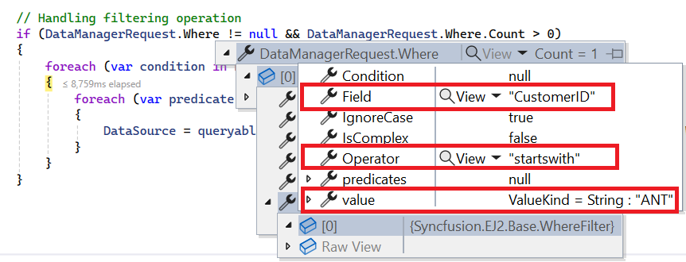
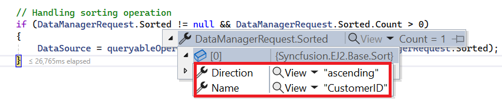
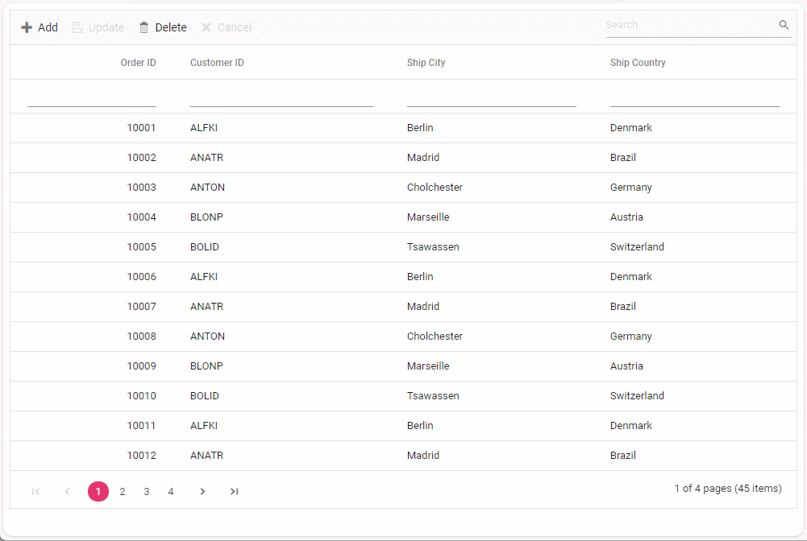

# Remote data binding with custom REST API using UrlAdaptor

The `UrlAdaptor` enables the Syncfusion<sup style="font-size:70%">&reg;</sup> React Grid to communicate with any custom REST API service. It converts grid operations (filtering, sorting, paging, CRUD) into `HTTP POST` requests and processes `JSON` responses.

This documentation outlines the complete process for setting up `UrlAdaptor` with the React Grid, from backend API creation to frontend integration and CRUD operations.

## Why use UrlAdaptor?

The [UrlAdaptor](https://ej2.syncfusion.com/react/documentation/data/adaptors#url-adaptor) works with **any custom REST API**—no OData or GraphQL required.

**Key benefits:**
1. **Backend agnostic**: Works with backend server technology.
2. **Server-side processing**: Handles large datasets (100K+ records) efficiently on the server.
3. **Automatic requests**: Grid operations generate structured `HTTP` requests automatically.
4. **Full CRUD support**: Manages insert, update, delete operations seamlessly.
5. **Extensible**: Add authentication, caching, or custom transformations easily.

**When to use UrlAdaptor:**
- Custom REST API implementations.
- Server-side operations for large datasets (100K+ records).
- Integration with existing backend services.
- CRUD operations requiring custom validation.

**How it works:**
- Compatibility exists with any backend (ASP.NET Core, Node.js, PHP, Java, Python).
- Filtering, sorting, paging, searching, grouping, and CRUD operations are supported.
- Grid actions convert into structured parameters.
- `HTTP POST` requests transmit to the backend API.
- `JSON` responses with data and count process automatically.

## Understanding the required response format

Before choosing a backend technology (ASP.NET Core, Node.js, PHP, Java, Python, or any other), understand that every API endpoint used with `UrlAdaptor` must return data in exactly this `JSON` structure:

```json
{
  "result": [
    { "OrderID": 10001, "CustomerID": "ALFKI", "ShipCity": "Berlin" },
    { "OrderID": 10002, "CustomerID": "ANATR", "ShipCity": "Madrid" },
    ...
  ],
  "count": 45
}
```

**Field Descriptions:**
- **result** (required): Array containing data records for current page/request.
- **count** (required): Total number of records in the dataset (not just current page).

**Why this format?**

- **result**: Contains the actual data to display in the grid
- **count**: Enables paging calculations (e.g., "Page 2 of 10")

> * Without the `count` field, paging and virtual scrolling cannot function correctly.
> * APIs returning just an array `[{...}, {...}]` instead of `{result: [...], count: ...}` will prevent proper Grid data display. Responses must wrap in the required structure.

## Supported databases and technologies

The `UrlAdaptor` is **completely backend-agnostic**. It connects to any database through a REST API that returns the required `JSON` format.

**Common Database Integrations:**

| Database | Use Case | Notes |
|----------|----------|-------|
| **SQL Server** | Enterprise applications | Robust querying, stored procedures support |
| **MySQL** | Web applications | Open-source, high performance |
| **PostgreSQL** | Complex data models | Advanced features, `JSON` support |
| **SQLite** | Embedded applications | Lightweight, serverless |
| **MongoDB** | Document databases | NoSQL, flexible schema |
| **Oracle** | Enterprise systems | High scalability, reliability |
| **Azure SQL Database** | Cloud applications | Managed service, auto-scaling |

> **Key Point**: `UrlAdaptor` is **backend-agnostic**. Compatibility exists with any technology stack that:
> 1. Accepts `HTTP POST` requests with `JSON` body.
> 2. Parses request parameters (filters, sorts, page info).
> 3. Returns data in the required `{result, count}` format.

## Part 1: Backend setup (ASP.NET Core API)

**Why choose ASP.NET Core:**
- Syncfusion provides `Syncfusion.EJ2.AspNet.Core` NuGet package with built-in helper methods.
- `DataManagerRequest` class for easy parameter parsing.
- `QueryableOperation` class for filtering, sorting, paging.
- Strong typing and performance.

### Step 1: Create project

**Option 1: Visual Studio (Recommended for this guide)**

1. Open **Visual Studio 2022**
2. Select **Create a new project**
3. Search for "**ASP.NET Core with React.js**" template
4. Name the project: **UrlAdaptorDemo**
5. Choose framework: **.NET 6.0 or later**
6. Click **Create**

For detailed setup instructions, see [Microsoft's official documentation](https://learn.microsoft.com/en-us/visualstudio/javascript/tutorial-asp-net-core-with-react?view=vs-2022).

**Option 2: Command Line**

```bash
dotnet new react -n UrlAdaptorDemo
cd UrlAdaptorDemo
```

**Project Structure After Creation:**
```
UrlAdaptorDemo/
├── ClientApp/           # React frontend
│   ├── src/
│   │   ├── App.jsx
│   │   └── index.css
│   └── package.json
├── Controllers/         # API controllers (will be created here)
├── Models/              # Data models (will be created here)
└── Program.cs           # Server configuration
```

### Step 2: Install required NuGet package

The `Syncfusion.EJ2.AspNet.Core` package provides server-side data operation methods (`PerformFiltering`, `PerformSorting`, etc.) for `UrlAdaptor` functionality. This package is required for the guide examples.

**Installation via NuGet Package Manager:**
1. In Visual Studio, navigate to **Tools → NuGet Package Manager → Manage NuGet Packages for Solution**
2. Search for **Syncfusion.EJ2.AspNet.Core**
3. Select the package and click **Install**

**Or via Package Manager Console:**
```bash
Install-Package Syncfusion.EJ2.AspNet.Core
```

**Or via .NET CLI:**
```bash
dotnet add package Syncfusion.EJ2.AspNet.Core
```

> **Note:** Without this package, manual implementation of filtering, sorting, and paging logic is required instead of using the built-in helper methods shown in this guide.

### Step 3: Create data model

Create a **Models** folder in the project root (if it doesn't exist), then add **OrdersDetails.cs**:




using System.ComponentModel.DataAnnotations;

namespace UrlAdaptorDemo.Models
{
    public class OrdersDetails
    {
        // Static in-memory data store (replace with database in production)
        public static List<OrdersDetails> order = new List<OrdersDetails>();

        // Default constructor
        public OrdersDetails()
        {
        }

        // Parameterized constructor for easy object creation
        public OrdersDetails(int OrderID, string CustomerId, int EmployeeId, double Freight, 
            bool Verified, DateTime OrderDate, string ShipCity, string ShipName, 
            string ShipCountry, DateTime ShippedDate, string ShipAddress)
        {
            this.OrderID = OrderID;
            this.CustomerID = CustomerId;
            this.EmployeeID = EmployeeId;
            this.Freight = Freight;
            this.ShipCity = ShipCity;
            this.Verified = Verified;
            this.OrderDate = OrderDate;
            this.ShipName = ShipName;
            this.ShipCountry = ShipCountry;
            this.ShippedDate = ShippedDate;
            this.ShipAddress = ShipAddress;
        }

        /// <summary>
        /// Generates sample order data. In production, replace with database query.
        /// </summary>
        public static List<OrdersDetails> GetAllRecords()
        {
            if (order.Count() == 0)
            {
                int code = 10000;
                for (int i = 1; i < 10; i++)
                {
                    order.Add(new OrdersDetails(code + 1, "ALFKI", i + 0, 2.3 * i, false, 
                        new DateTime(1991, 05, 15), "Berlin", "Simons bistro", "Denmark", 
                        new DateTime(1996, 7, 16), "Kirchgasse 6"));
                    order.Add(new OrdersDetails(code + 2, "ANATR", i + 2, 3.3 * i, true, 
                        new DateTime(1990, 04, 04), "Madrid", "Queen Cozinha", "Brazil", 
                        new DateTime(1996, 9, 11), "Avda. Azteca 123"));
                    order.Add(new OrdersDetails(code + 3, "ANTON", i + 1, 4.3 * i, true, 
                        new DateTime(1957, 11, 30), "Cholchester", "Frankenversand", "Germany", 
                        new DateTime(1996, 10, 7), "Carrera 52 con Ave. Bolívar #65-98 Llano Largo"));
                    order.Add(new OrdersDetails(code + 4, "BLONP", i + 3, 5.3 * i, false, 
                        new DateTime(1930, 10, 22), "Marseille", "Ernst Handel", "Austria", 
                        new DateTime(1996, 12, 30), "Magazinweg 7"));
                    order.Add(new OrdersDetails(code + 5, "BOLID", i + 4, 6.3 * i, true, 
                        new DateTime(1953, 02, 18), "Tsawassen", "Hanari Carnes", "Switzerland", 
                        new DateTime(1997, 12, 3), "1029 - 12th Ave. S."));
                    code += 5;
                }
            }
            return order;
        }

        // Properties with validation attributes
        [Key]
        public int? OrderID { get; set; }
        
        public string? CustomerID { get; set; }
        
        public int? EmployeeID { get; set; }
        
        public double? Freight { get; set; }
        
        public string? ShipCity { get; set; }
        
        public bool? Verified { get; set; }
        
        public DateTime OrderDate { get; set; }
        
        public string? ShipName { get; set; }
        
        public string? ShipCountry { get; set; }
        
        public DateTime ShippedDate { get; set; }
        
        public string? ShipAddress { get; set; }
    }
}




> **Production Note:** This example uses a static in-memory list (`order`) for simplicity. In real applications, replace `GetAllRecords()` with database queries using Entity Framework Core, Dapper, or the preferred data access layer.

### Step 4: Create API controller

Create **GridController.cs** in the **Controllers** folder. This controller handles all data requests from the Grid.




using Microsoft.AspNetCore.Mvc;
using UrlAdaptorDemo.Models;
using Syncfusion.EJ2.Base;

namespace UrlAdaptorDemo.Controllers
{
    [Route("api/[controller]")]
    [ApiController]
    public class GridController : ControllerBase
    {
        /// <summary>
        /// Main endpoint for Grid data requests.
        /// Handles initial load and all grid operations (paging, filtering, sorting, etc.)
        /// </summary>
        [HttpPost]
        public object Post([FromBody] DataManagerRequest dm)
        {
            // Retrieve data from data source (replace with the database query)
            IQueryable<OrdersDetails> DataSource = GetOrderData().AsQueryable();

            // Get total records count BEFORE paging
            int totalRecordsCount = DataSource.Count();

            // Apply server-side operations here (will be added later)
            // For now, return all data with count

            // CRITICAL: Return in {result, count} format
            return new { result = DataSource, count = totalRecordsCount };
        }

        /// <summary>
        /// Helper method to retrieve order data.
        /// In production, replace with database query:
        /// return _dbContext.Orders.ToList();
        /// </summary>
        [HttpGet]
        public List<OrdersDetails> GetOrderData()
        {
            return OrdersDetails.GetAllRecords().ToList();
        }
    }
}




**Key Points:**
- **[FromBody] DataManagerRequest**: This parameter receives all grid operation details (filters, sorts, page info).
- **IQueryable<OrdersDetails>**: Use `IQueryable` for efficient database queries.
- **count**: Must be total count before paging (not just current page count).
- **HttpPost**: Grid sends `POST` requests by default for data operations.

### Step 5: Configure CORS (Cross-Origin Resource Sharing)

**Why CORS is needed:**
When React frontend (e.g., `https://localhost:3000`) and ASP.NET Core backend (e.g., `https://localhost:5001`) run on different ports, browsers block requests by default for security. CORS configuration allows these cross-origin requests.

**Common error without CORS:**
```
Access to XMLHttpRequest at 'https://localhost:5001/api/grid' from origin 
'https://localhost:3000' has been blocked by CORS policy.
```

**Configure CORS in Program.cs:**




using Newtonsoft.Json.Serialization;

var builder = WebApplication.CreateBuilder(args);

// Add CORS policy to allow frontend access
builder.Services.AddCors(options =>
{
    options.AddDefaultPolicy(policy =>
    {
        policy.AllowAnyOrigin()      // Allow requests from any origin
              .AllowAnyMethod()       // Allow GET, POST, PUT, DELETE, etc.
              .AllowAnyHeader();      // Allow any request headers
    });
});

// Add controllers to the service collection
builder.Services.AddControllers();

// Configure JSON serialization (preserves property casing)
builder.Services.AddMvc().AddNewtonsoftJson(options =>
{
    options.SerializerSettings.ContractResolver = new DefaultContractResolver();
});

var app = builder.Build();

// Enable CORS middleware (must be before UseRouting)
app.UseCors();

// Map controller routes
app.MapControllers();

app.Run();




**Production CORS configuration:**
For production, restrict CORS to specific origins:

```csharp
builder.Services.AddCors(options =>
{
    options.AddDefaultPolicy(policy =>
    {
        policy.WithOrigins("https://yourdomain.com")  // Specific frontend URL
              .AllowAnyMethod()
              .AllowAnyHeader();
    });
});
```

> **Security Note:** `AllowAnyOrigin()` provides convenience for development but production environments require restriction to specific trusted domains.

### Step 6: Test the backend API

**Run the application:**

1. In Visual Studio, press **F5** or click the **Run** button.
2. The application starts on a URL like **https://localhost:5001** (port may vary).
3. Record the exact port number for frontend configuration.

**Verify API endpoint:**

**Method 1: Using browser**
- Navigate to: `https://localhost:5001/api/grid` (replace 5001 with the actual port).
- Empty results display since `GET` requests are used (Grid uses `POST`).

**Method 2: Using Postman or Thunder Client**
- **Method**: `POST`
- **URL**: `https://localhost:5001/api/grid`
- **Body**: `{}`
- **Expected Response**:
```json
{
  "result": [
    {
      "orderID": 10001,
      "customerID": "ALFKI",
      "employeeID": 1,
      "freight": 2.3,
      "shipCity": "Berlin",
      "verified": false,
      "orderDate": "1991-05-15T00:00:00",
      "shipName": "Simons bistro",
      "shipCountry": "Denmark",
      "shippedDate": "1996-07-16T00:00:00",
      "shipAddress": "Kirchgasse 6"
    },
    // ... more records
  ],
  "count": 45
}
```

**Troubleshooting:**
-  **Empty response**: Check if `GetAllRecords()` is populating data.
-  **404 Error**: Verify controller route is `[Route("api/[controller]")]`.
-  **500 Error**: Check server logs in Visual Studio Output window.
-  **CORS Error**: Ensure CORS is configured in Program.cs.

> **Note:** Keep the backend server running during React frontend setup.


## Part 2: Frontend setup (React with UrlAdaptor)

With backend API ready (either ASP.NET Core or Node.js), Syncfusion React Grid integration with `UrlAdaptor` enables data display and interaction. Frontend setup remains identical regardless of backend choice (ASP.NET Core or Node.js). `UrlAdaptor` works with any backend returning data in the correct `JSON` format.

### Step 1: Install Syncfusion packages

Open a terminal in the **ClientApp** folder (or project root) and install the required packages:

```bash
npm install @syncfusion/ej2-react-grids --save
npm install @syncfusion/ej2-data --save
```

**Package purposes:**
- **@syncfusion/ej2-react-grids**: React Grid component with all features.
- **@syncfusion/ej2-data**: `DataManager` and adaptors (including `UrlAdaptor`).

**Verify installation:**
Check `package.json` to ensure both packages appear in dependencies:
```json
"dependencies": {
  "@syncfusion/ej2-react-grids": "^27.x.x",
  "@syncfusion/ej2-data": "^27.x.x",
  ...
}
```

### Step 2: Add CSS styles

Syncfusion Grid requires CSS for proper rendering. Add these imports to `index.css` or `App.css`:

```ts



/* Base styles - Required for all Syncfusion components */
@import '../node_modules/@syncfusion/ej2-base/styles/tailwind3.css';

/* Component-specific styles */
@import '../node_modules/@syncfusion/ej2-buttons/styles/tailwind3.css';
@import '../node_modules/@syncfusion/ej2-calendars/styles/tailwind3.css';
@import '../node_modules/@syncfusion/ej2-dropdowns/styles/tailwind3.css';
@import '../node_modules/@syncfusion/ej2-inputs/styles/tailwind3.css';
@import '../node_modules/@syncfusion/ej2-navigations/styles/tailwind3.css';
@import '../node_modules/@syncfusion/ej2-popups/styles/tailwind3.css';
@import '../node_modules/@syncfusion/ej2-splitbuttons/styles/tailwind3.css';

/* Grid component styles - Required */
@import '../node_modules/@syncfusion/ej2-react-grids/styles/tailwind3.css';



```

**Available themes:**
- `material3.css` - Material Design (Google)
- `bootstrap5.css` - Bootstrap 5 theme
- `fluent.css` - Microsoft Fluent Design
- `tailwind.css` - Tailwind CSS theme
- `fabric.css` - Microsoft Fabric Design

To use a different theme, replace `material` with the preferred theme name in all imports.

**Minimal CSS (if file size is a concern):**
```css
@import '../node_modules/@syncfusion/ej2-base/styles/material3.css';
@import '../node_modules/@syncfusion/ej2-react-grids/styles/material3.css';
```

> **Note:** Additional CSS files are needed when enabling features like filtering, editing, or paging that use dropdowns, buttons, or date pickers.

### Step 3: Create Grid component with UrlAdaptor

Grid creation and backend API connection uses `UrlAdaptor`.

**Update App.jsx:**

```ts



import React from 'react';
import { DataManager, UrlAdaptor } from '@syncfusion/ej2-data';
import { ColumnDirective, ColumnsDirective, GridComponent } from '@syncfusion/ej2-react-grids';

function App() {
  // Configure DataManager with UrlAdaptor
  const data = new DataManager({ 
    url: 'https://localhost:5001/api/grid',  // Replace 5001 with the backend port
    adaptor: new UrlAdaptor()                // Specify UrlAdaptor for custom REST API
  });

  return (
    <div className="App">
      <h2>Orders Data with UrlAdaptor</h2>
      <GridComponent dataSource={data} height={400}>
        <ColumnsDirective>
          <ColumnDirective 
            field='OrderID' 
            headerText='Order ID' 
            isPrimaryKey={true} 
            width='120' 
            textAlign='Right' 
          />
          <ColumnDirective 
            field='CustomerID' 
            headerText='Customer ID' 
            width='150' 
          />
          <ColumnDirective 
            field='ShipCity' 
            headerText='Ship City' 
            width='150' 
          />
          <ColumnDirective 
            field='ShipCountry' 
            headerText='Ship Country' 
            width='150' 
          />
        </ColumnsDirective>
      </GridComponent>
    </div>
  );
}

export default App;




```

**Key configuration elements:**

1. **DataManager**: Manages data source and operations.
   ```javascript
   const data = new DataManager({ 
     url: 'https://localhost:5001/api/grid',
     adaptor: new UrlAdaptor()
   });
   ```

2. **`url` property**: The backend API endpoint (replace port number).
3. **`adaptor` property**: Set to `new UrlAdaptor()` for custom REST APIs.
4. **`isPrimaryKey` property**: Set to `true` on OrderID for CRUD operations.

**Replace port number:**
Make sure to replace `5001` with the actual backend port number. Visual Studio output window shows the exact URL when the backend starts.

**Common ports:**
- ASP.NET Core: typically 5001, 7001, or random port
- Node.js: typically 3001, 5000, 8080
- Can be found in: `Properties/launchSettings.json`

### Step 4: Run the application

**Start backend (if not already running):**
1. Press **F5** in Visual Studio to start the ASP.NET Core server.
2. Record the port number (e.g., `https://localhost:5001`).

**Start frontend:**
1. Open terminal in **ClientApp** folder.
2. Run: `npm start`.
3. React app will open at `https://localhost:3000` (or similar).

**Expected result:**
Grid displays order data fetched from the backend API:


**Troubleshooting:**
-  **Empty Grid**: Check browser console for errors and verify API URL correctness.
-  **CORS Error**: Backend **Program.cs** must contain CORS configuration.
-  **Network Error**: Verify backend accessibility and status.
-  **Wrong Data Format**: API responses must return `{result: [...], count: number}` in `JSON` format.

> **Developer Tools**: Browser DevTools (F12) → Network tab displays actual requests and responses between Grid and API.

## Part 3: Server-side data operations

Large dataset optimization requires server-side data operations (filtering, sorting, paging) rather than browser-based processing. The `Syncfusion.EJ2.AspNet.Core` package provides built-in methods for efficient operation handling.

### Understanding server-side operations

**Why server-side processing?**
- **Performance**: Process 100K+ records without client slowdown.
- **Scalability**: Server handles heavy lifting, not browser.
- **Bandwidth**: Transfer only needed data (e.g., 10 records instead of 10,000).
- **Security**: Sensitive filtering logic stays on server.

**How it works:**
1. Grid action execution (e.g., sorting by "CustomerID").
2. `POST` request transmission with operation details to backend.
3. Backend processes request and returns filtered/sorted data.
4. Grid data display with processed results.

### Server-side operation methods

The `Syncfusion.EJ2.Base` namespace provides these methods:

| Operation | Method(s) | Purpose | Use Case |
|-----------|-----------|---------|----------|
| **Paging** | `PerformSkip`, `PerformTake` | Load specific page of data | Show 10 records at a time from 100K records |
| **Filtering** | `PerformFiltering` | Apply filter conditions | Show only orders from "Germany" |
| **Searching** | `PerformSearching` | Search across columns | Find all records containing "ALFKI" |
| **Sorting** | `PerformSorting` | Sort by one/multiple columns | Order by CustomerID ascending |
| **Grouping** | `PerformGrouping` | Group data with aggregates | Group by ShipCountry with totals |

**Required imports:**
```csharp
using Syncfusion.EJ2.Base;  // DataManagerRequest, QueryableOperation, DataOperations
```

> **Note:** It must have `Syncfusion.EJ2.AspNet.Core` NuGet package installed (covered in [Step 2](#step-2-install-required-nuget-package)).

### Paging and virtual scrolling (remote)

Paging implementation uses `PerformTake` and `PerformSkip` from `QueryableOperation` on the server to apply paging from the `DataManagerRequest`. Virtual scrolling requires `enableVirtualization` in the grid with server-side large skip handling.


```cs



[HttpPost]
public object Post([FromBody] DataManagerRequest DataManagerRequest)
{
  // Retrieve data from the data source (e.g., database).
  IQueryable<OrdersDetails> DataSource = GetOrderData().AsQueryable();

  // Get the total records count.
  int totalRecordsCount = DataSource.Count();

  // Initialize QueryableOperation instance.
  QueryableOperation queryableOperation = new QueryableOperation(); 

  // Handling paging operation.
  if (DataManagerRequest.Skip != 0)
  {
    DataSource = queryableOperation.PerformSkip(DataSource, DataManagerRequest.Skip);
  }
  if (DataManagerRequest.Take != 0)
  {
    DataSource = queryableOperation.PerformTake(DataSource, DataManagerRequest.Take);
  }

  // Return data based on the request.
  return new { result = DataSource, count = totalRecordsCount };
}


```
```ts


import { ColumnDirective, ColumnsDirective, GridComponent, Page, Inject } from '@syncfusion/ej2-react-grids';
import { DataManager, UrlAdaptor } from '@syncfusion/ej2-data';

function App() {
  const data = new DataManager({ 
    url: 'https://localhost:xxxx/api/grid', // Replace with the hosted link.
    adaptor: new UrlAdaptor()
  });
  return (
    <GridComponent dataSource={data} allowPaging={true} height={320}>
      <ColumnsDirective>
        <ColumnDirective field='OrderID' headerText='Order ID' isPrimaryKey={true} width='150' textAlign='Right'></ColumnDirective>
        <ColumnDirective field='CustomerID' headerText='Customer ID' width='150'></ColumnDirective>
        <ColumnDirective field='ShipCity' headerText='Ship City' width='150'/>
        <ColumnDirective field='ShipCountry' headerText='Ship Country' width='150'/>
      </ColumnsDirective>
      <Inject services={[Page]} />
    </GridComponent>
  );
};
export default App;



```

### Filtering

API endpoints supporting custom filtering criteria use `PerformFiltering` from `QueryableOperation` to apply filters from the `DataManagerRequest`. Complex predicates require iteration through nested conditions.

**Single column filtering**


**Multi column filtering**


```cs



public object Post([FromBody] DataManagerRequest DataManagerRequest)
{
  // Retrieve data from the data source (e.g., database).
  IQueryable<OrdersDetails> DataSource = GetOrderData().AsQueryable();

  // Initialize QueryableOperation instance.
  QueryableOperation queryableOperation = new QueryableOperation(); 

  if (DataManagerRequest.Where != null && DataManagerRequest.Where.Count > 0)
  {
    // Handling filtering operation.
    DataSource = queryableOperation.PerformFiltering(DataSource, DataManagerRequest.Where);
  }

  // Get the total records count.
  int totalRecordsCount = DataSource.Count();

  // Return data based on the request.
  return new { result = DataSource, count = totalRecordsCount };
}


```
```ts


import { ColumnDirective, ColumnsDirective, GridComponent, Filter, Inject } from '@syncfusion/ej2-react-grids';
import { DataManager, UrlAdaptor } from '@syncfusion/ej2-data';

function App() {
  const data = new DataManager({ 
    url: 'https://localhost:xxxx/api/grid', // Replace with the hosted link.
    adaptor: new UrlAdaptor()
  });
  return (
    <GridComponent dataSource={data} allowFiltering={true} height={320}>
      <ColumnsDirective>
        <ColumnDirective field='OrderID' headerText='Order ID' isPrimaryKey={true} width='150' textAlign='Right'></ColumnDirective>
        <ColumnDirective field='CustomerID' headerText='Customer ID' width='150'></ColumnDirective>
        <ColumnDirective field='ShipCity' headerText='Ship City' width='150'/>
        <ColumnDirective field='ShipCountry' headerText='Ship Country' width='150'/>
      </ColumnsDirective>
      <Inject services={[Filter]} />
    </GridComponent>
  );
};
export default App;



```

### Searching

`PerformSearching` from `QueryableOperation` processes search criteria from the `DataManagerRequest`.


```cs



[HttpPost]
public object Post([FromBody] DataManagerRequest DataManagerRequest)
{
  // Retrieve data from the data source (e.g., database).
  IQueryable<OrdersDetails> DataSource = GetOrderData().AsQueryable();

  // Initialize QueryableOperation instance.
  QueryableOperation queryableOperation = new QueryableOperation(); 

  // Handling searching operation.
  if (DataManagerRequest.Search != null && DataManagerRequest.Search.Count > 0)
  {
    DataSource = queryableOperation.PerformSearching(DataSource, DataManagerRequest.Search);
  }

  // Get the total records count.
  int totalRecordsCount = DataSource.Count();

  // Return data based on the request.
  return new { result = DataSource, count = totalRecordsCount };
}


```
```ts


import { ColumnDirective, ColumnsDirective, GridComponent, ToolbarItems, Toolbar, Inject } from '@syncfusion/ej2-react-grids';
import { DataManager, UrlAdaptor } from '@syncfusion/ej2-data';

function App() {
  const data = new DataManager({ 
    url: 'https://localhost:xxxx/api/grid', // Replace with the hosted link.
    adaptor: new UrlAdaptor()
  });
  const toolbar = ['Search'];
  return (
    <GridComponent dataSource={data} toolbar={toolbar} height={320}>
      <ColumnsDirective>
        <ColumnDirective field='OrderID' headerText='Order ID' isPrimaryKey={true} width='150' textAlign='Right'></ColumnDirective>
        <ColumnDirective field='CustomerID' headerText='Customer ID' width='150'></ColumnDirective>
        <ColumnDirective field='ShipCity' headerText='Ship City' width='150'/>
        <ColumnDirective field='ShipCountry' headerText='Ship Country' width='150'/>
      </ColumnsDirective>
      <Inject services={[Toolbar]} />
    </GridComponent>
  );
};
export default App;



```

### Sorting

`PerformSorting` from `QueryableOperation` applies sorting from the `DataManagerRequest`.

**Single column sorting**


**Multi column sorting**


```cs



[HttpPost]
public object Post([FromBody] DataManagerRequest DataManagerRequest)
{
  // Retrieve data from the data source (e.g., database).
  IQueryable<OrdersDetails> DataSource = GetOrderData().AsQueryable();

  // Initialize QueryableOperation instance.
  QueryableOperation queryableOperation = new QueryableOperation(); 

  // Handling sorting operation.
  if (DataManagerRequest.Sorted != null && DataManagerRequest.Sorted.Count > 0)
  {
    DataSource = queryableOperation.PerformSorting(DataSource, DataManagerRequest.Sorted);
  }

  // Get the total count of records.
  int totalRecordsCount = DataSource.Count();

  // Return data based on the request.
  return new { result = DataSource, count = totalRecordsCount };
}


```
```ts


import { ColumnDirective, ColumnsDirective, GridComponent, Sort, Inject } from '@syncfusion/ej2-react-grids';
import { DataManager, UrlAdaptor } from '@syncfusion/ej2-data';

function App() {
  const data = new DataManager({ 
    url: 'https://localhost:xxxx/api/grid', // Replace with the hosted link.
    adaptor: new UrlAdaptor()
  });
  return (
    <GridComponent dataSource={data} allowSorting={true} height={320}>
      <ColumnsDirective>
        <ColumnDirective field='OrderID' headerText='Order ID' isPrimaryKey={true} width='150' textAlign='Right'></ColumnDirective>
        <ColumnDirective field='CustomerID' headerText='Customer ID' width='150'></ColumnDirective>
        <ColumnDirective field='ShipCity' headerText='Ship City' width='150'/>
        <ColumnDirective field='ShipCountry' headerText='Ship Country' width='150'/>
      </ColumnsDirective>
      <Inject services={[Sort]} />
    </GridComponent>
  );
};
export default App;



```

### Grouping and aggregates

Server processing of group and aggregate details from the `DataManagerRequest` computes aggregates on the full dataset and applies grouping with `PerformGrouping`.

```cs



[HttpPost]
public object Post([FromBody] DataManagerRequest DataManagerRequest)
{
  // Retrieve data from the data source (e.g., database).
  IEnumerable<OrdersDetails> DataSource = GetOrderData().AsEnumerable();

  // Initialize DataOperation instance.
  DataOperations operation = new DataOperations(); 

  int totalRecordsCount = DataSource.Count();

  // Calculate aggregates on the entire dataset instead of just the page.
  List<string> fields = new List<string>();
  if (DataManagerRequest.Aggregates != null)
  {
    // Process the aggregates on the full dataset.
    for (var i = 0; i < DataManagerRequest.Aggregates.Count; i++)
      fields.Add(DataManagerRequest.Aggregates[i].Field);
  }
  IEnumerable<object> aggregateValue = ((IEnumerable<object>)operation.PerformSelect(DataSource, fields)).ToList();

  IEnumerable groupedData = null;
  // Handling grouping operation.
  if (DataManagerRequest.Group != null)
  {
    groupedData = operation.PerformGrouping<OrdersDetails>(DataSource, DataManagerRequest); 
  }
  // Return the result and count object.
  return DataManagerRequest.RequiresCounts ? new JsonResult(new { 
    result = (groupedData == null) ? DataSource : groupedData, 
    groupDs = groupedData, 
    aggregate = aggregateValue,  
    count = totalRecordsCount }) : new JsonResult(DataSource); 
}


```
```ts


import { DataManager, UrlAdaptor } from '@syncfusion/ej2-data';
import { ColumnDirective, ColumnsDirective, AggregatesDirective, AggregateDirective, AggregateColumnsDirective, AggregateColumnDirective, GridComponent, Inject, Group, Aggregate } from '@syncfusion/ej2-react-grids';

function App() {
  const groupSettings = {
    columns: ['ShipCountry'],
    showDropArea: true
  };
  const captionTemplate = (props) => {
    return (<span>Max: {props.Max}</span>);
  };
  const data = new DataManager({
    url: 'https://localhost:xxxx/api/grid', // Replace with the hosted link.
    adaptor: new UrlAdaptor()
  });
  return (
    <GridComponent dataSource={data} allowGrouping={true} groupSettings={groupSettings}>
      <ColumnsDirective>
        <ColumnDirective field='OrderID' headerText='Order ID' isPrimaryKey={true} width='150' textAlign='Right'></ColumnDirective>
        <ColumnDirective field='CustomerID' headerText='Customer ID' width='150'></ColumnDirective>
        <ColumnDirective field='ShipCity' headerText='Ship City' width='150' />
        <ColumnDirective field='Freight' headerText='Freight' format='C2' width='150' />
        <ColumnDirective field='ShipCountry' headerText='Ship Country' width='150' />
      </ColumnsDirective>
      <AggregatesDirective>
        <AggregateDirective>
          <AggregateColumnsDirective>
            <AggregateColumnDirective field='Freight' type='Max' groupCaptionTemplate={captionTemplate} />
          </AggregateColumnsDirective>
        </AggregateDirective>
      </AggregatesDirective>
      <Inject services={[Group, Aggregate]} />
    </GridComponent>
  );
};
export default App;



```

## CRUD operations

Syncfusion<sup style="font-size:70%">&reg;</sup> React Grid integrates CRUD (Create, Read, Update, Delete) operations with server-side controller actions through `insertUrl`, `removeUrl`, `updateUrl`, `crudUrl`, and `batchUrl` properties.

### Configure CRUD URL mapping

CRUD operations map to server-side controller actions through specific properties:

1. **insertUrl**: Specifies the URL for inserting new records.
2. **updateUrl**: Specifies the URL for updating existing records.
3. **removeUrl**: Specifies the URL for deleting records.
4. **crudUrl**: Specifies a single URL for all CRUD operations (alternative to individual URLs).
5. **batchUrl**: Specifies the URL for batch editing (multiple changes in one request).

**When to use each approach**:
- **Individual URLs** (`insertUrl`, `updateUrl`, `removeUrl`): Best for APIs with separate endpoints
- **Single endpoint** (`crudUrl`): Simpler for backend that route by action type
- **Batch URL** (`batchUrl`): Best for bulk operations (multiple changes in one request)

For detailed editing setup, refer to the [editing documentation](https://ej2.syncfusion.com/react/documentation/grid/editing/edit). The following example demonstrates inline edit [`mode`](https://ej2.syncfusion.com/react/documentation/api/grid/editSettings#mode) with a [`toolbar`](https://ej2.syncfusion.com/react/documentation/api/grid#toolbar) for action buttons.

```ts



import { ColumnDirective, ColumnsDirective, GridComponent, Toolbar, Edit, Inject } from '@syncfusion/ej2-react-grids';
import { DataManager, UrlAdaptor } from '@syncfusion/ej2-data';

function App() {
  const data = new DataManager({ 
    url: 'https://localhost:xxxx/api/grid', // Replace with the hosted link.
    insertUrl: 'https://localhost:xxxx/api/grid/Insert',
    updateUrl: 'https://localhost:xxxx/api/grid/Update',
    removeUrl: 'https://localhost:xxxx/api/grid/Remove',
    adaptor: new UrlAdaptor()
  });
  const editSettings = { allowEditing: true, allowAdding: true, allowDeleting: true };
  const toolbar = ['Add', 'Edit', 'Delete', 'Update', 'Cancel', 'Search'];
  const orderIDRules = {required: true};
  const customerIDRules = {required: true, minLength: 3};
  return (
    <GridComponent dataSource={data} editSettings={editSettings} toolbar={toolbar} height={320}>
      <ColumnsDirective>
        <ColumnDirective field='OrderID' headerText='Order ID' isPrimaryKey={true} width='150' textAlign='Right' validationRules={orderIDRules}></ColumnDirective>
        <ColumnDirective field='CustomerID' headerText='Customer ID' width='150' validationRules={customerIDRules}></ColumnDirective>
        <ColumnDirective field='ShipCity' headerText='Ship City' width='150'/>
        <ColumnDirective field='ShipCountry' headerText='Ship Country' width='150'/>
      </ColumnsDirective>
      <Inject services={[Toolbar, Edit]} />
    </GridComponent>
  );
};
export default App;



```

> * Normal or inline editing represents the default [`mode`](https://ej2.syncfusion.com/react/documentation/api/grid/editSettings#mode).
> * CRUD operations require [`isPrimaryKey`](https://ej2.syncfusion.com/react/documentation/api/grid/column#isprimarykey) property set to `true` on a unique column.

The below class is used to structure data sent during CRUD operations.

```cs
public class CRUDModel<T> where T : class
{
  public string? action { get; set; }
  public string? keyColumn { get; set; }
  public object? key { get; set; }
  public T? value { get; set; }
  public List<T>? added { get; set; }
  public List<T>? changed { get; set; }
  public List<T>? deleted { get; set; }
  public IDictionary<string, object>? @params { get; set; }
}
```

### Insert

The `insertUrl` property specifies the controller action mapping URL for insert operations. The **newRecord** parameter contains newly added record details.


```cs
/// <summary>
/// Inserts a new data item into the data collection.
/// </summary>
/// <param name="newRecord">It contains the new record detail that needs to be inserted.</param>
/// <returns>Returns void</returns>
[HttpPost]
[Route("api/[controller]/Insert")]
public void Insert([FromBody] CRUDModel<OrdersDetails> newRecord)
{
  if (newRecord.value != null)
  {
    OrdersDetails.GetAllRecords().Insert(0, newRecord.value);
  }
}
```

### Update

The `updateUrl` property specifies the controller action mapping URL for update operations. The **updatedRecord** parameter contains updated record details.


```cs
/// <summary>
/// Update an existing data item from the data collection.
/// </summary>
/// <param name="Order">It contains the updated record detail that needs to be updated.</param>
/// <returns>Returns void</returns>
[HttpPost]
[Route("api/[controller]/Update")]
public void Update([FromBody] CRUDModel<OrdersDetails> Order)
{
  var updatedOrder = Order.value;
  var data = OrdersDetails.GetAllRecords().FirstOrDefault(existingOrder => existingOrder.OrderID == updatedOrder.OrderID);
  if (data != null)
  {
    // Update the existing record.
    data.OrderID = updatedOrder.OrderID;
    data.CustomerID = updatedOrder.CustomerID;
    data.ShipCity = updatedOrder.ShipCity;
    data.ShipCountry = updatedOrder.ShipCountry;
    // Update other properties similarly.
  }
}
```

### Delete

The `removeUrl` property specifies the controller action mapping URL for delete operations. The **deletedRecord** parameter contains the primary key value of the deleted record.


```cs
/// <summary>
/// Remove a specific data item from the data collection.
/// </summary>
/// <param name="value">It contains the specific record detail that needs to be removed.</param>
/// <returns>Returns void</returns>
[HttpPost]
[Route("api/[controller]/Remove")]
public void Remove([FromBody] CRUDModel<OrdersDetails> value)
{
  int orderId = int.Parse(value.key.ToString());
  var data = OrdersDetails.GetAllRecords().FirstOrDefault(orderData => orderData.OrderID == orderId);
  if (data != null)
  {
    // Remove the record from the data collection.
    OrdersDetails.GetAllRecords().Remove(data);
  }
}
```


### Batch CRUD

Batch operations require edit [`mode`](https://ej2.syncfusion.com/react/documentation/api/grid/editSettings#mode) set to `Batch` with `batchUrl` property in the DataManager. Add rows with the **Add** button, edit cells by double-clicking, and delete rows with the **Delete** button. The **Update** button submits all changes in one `POST` request.

```ts
// App.jsx
import { ColumnDirective, ColumnsDirective, GridComponent, Toolbar, Edit, Inject } from '@syncfusion/ej2-react-grids';
import { DataManager, UrlAdaptor } from '@syncfusion/ej2-data';

function App() {
  const data = new DataManager({ 
    url: 'https://localhost:xxxx/api/grid', // Replace with the hosted link.
    batchUrl: 'https://localhost:xxxx/api/grid/BatchUpdate',
    adaptor: new UrlAdaptor()
  });
  const editSettings = { allowEditing: true, allowAdding: true, allowDeleting: true, mode: 'Batch' };
  const toolbar = ['Add', 'Edit', 'Delete', 'Update', 'Cancel', 'Search'];
  const orderIDRules = {required: true};
  const customerIDRules = {required: true, minLength: 3};
  return (
    <GridComponent dataSource={data} editSettings={editSettings} toolbar={toolbar} height={320}>
      <ColumnsDirective>
        <ColumnDirective field='OrderID' headerText='Order ID' isPrimaryKey={true} width='150' textAlign='Right' validationRules={orderIDRules}></ColumnDirective>
        <ColumnDirective field='CustomerID' headerText='Customer ID' width='150' validationRules={customerIDRules}></ColumnDirective>
        <ColumnDirective field='ShipCity' headerText='Ship City' width='150'/>
        <ColumnDirective field='ShipCountry' headerText='Ship Country' width='150'/>
      </ColumnsDirective>
      <Inject services={[Toolbar, Edit]} />
    </GridComponent>
  );
};
export default App;
```

```cs
public IActionResult BatchUpdate([FromBody] CRUDModel<OrdersDetails> batchOperation)
{
  if (batchOperation.added != null)
  {
    foreach (var addedOrder in batchOperation.added)
    {
      OrdersDetails.GetAllRecords().Insert(0, addedOrder);
    }
  }
  if (batchOperation.changed != null)
  {
    foreach (var changedOrder in batchOperation.changed)
    {
      var existingOrder = OrdersDetails.GetAllRecords().FirstOrDefault(or => or.OrderID == changedOrder.OrderID);
      if (existingOrder != null)
      {
        existingOrder.CustomerID = changedOrder.CustomerID;
        existingOrder.ShipCity = changedOrder.ShipCity;
        // Update other properties as needed.
      }
    }
  }
  if (batchOperation.deleted != null)
  {
    foreach (var deletedOrder in batchOperation.deleted)
    {
      var orderToDelete = OrdersDetails.GetAllRecords().FirstOrDefault(or => or.OrderID == deletedOrder.OrderID);
      if (orderToDelete != null)
      {
        OrdersDetails.GetAllRecords().Remove(orderToDelete);
      }
    }
  }
  return Json(batchOperation);
}
```


### Single endpoint for all CRUD actions

The `crudUrl` property specifies the controller action mapping URL for all CRUD operations using a single server-side method instead of separate endpoint specifications.

```ts
import { ColumnDirective, ColumnsDirective, GridComponent, Toolbar, Edit, Inject } from '@syncfusion/ej2-react-grids';
import { DataManager, UrlAdaptor } from '@syncfusion/ej2-data';

function App() {
  const data = new DataManager({ 
    url: 'https://localhost:xxxx/api/grid', // Replace with the hosted link.
    crudUrl: 'https://localhost:xxxx/api/grid/CrudUpdate',
    adaptor: new UrlAdaptor()
  });
  const editSettings = { allowEditing: true, allowAdding: true, allowDeleting: true, mode: 'Normal' };
  const toolbar = ['Add', 'Edit', 'Delete', 'Update', 'Cancel', 'Search'];
  const orderIDRules = {required: true};
  const customerIDRules = {required: true, minLength: 3};
  return (
    <GridComponent dataSource={data} editSettings={editSettings} toolbar={toolbar} height={320}>
      <ColumnsDirective>
        <ColumnDirective field='OrderID' headerText='Order ID' isPrimaryKey={true} width='150' textAlign='Right' validationRules={orderIDRules}></ColumnDirective>
        <ColumnDirective field='CustomerID' headerText='Customer ID' width='150' validationRules={customerIDRules}></ColumnDirective>
        <ColumnDirective field='ShipCity' headerText='Ship City' width='150'/>
        <ColumnDirective field='ShipCountry' headerText='Ship Country' width='150'/>
      </ColumnsDirective>
      <Inject services={[Toolbar, Edit]} />
    </GridComponent>
  );
};
export default App;
```

```cs
[HttpPost]
[Route("api/[controller]/CrudUpdate")]
public void CrudUpdate([FromBody] CRUDModel<OrdersDetails> request)
{
  if (request.action == "update")
  {
    var orderValue = request.value;
    OrdersDetails existingRecord = OrdersDetails.GetAllRecords().Where(or => or.OrderID == orderValue.OrderID).FirstOrDefault();
    existingRecord.OrderID = orderValue.OrderID;
    existingRecord.CustomerID = orderValue.CustomerID;
    existingRecord.ShipCity = orderValue.ShipCity;
  }
  else if (request.action == "insert")
  {
    OrdersDetails.GetAllRecords().Insert(0, request.value);
  }
  else if (request.action == "remove")
  {
    OrdersDetails.GetAllRecords().Remove(OrdersDetails.GetAllRecords().Where(or => or.OrderID == int.Parse(request.key.ToString())).FirstOrDefault());
  }
}
```

## Foreign key columns

Foreign key column configuration with remote data using `UrlAdaptor` requires assigning the `DataManager` instance with endpoint URL to the column data source along with foreign key field and value properties. When both grid and foreign key column use `UrlAdaptor`, grid data and foreign key data are fetched separately from respective remote endpoints. Filtering and sorting operations trigger server requests based on the foreign key field and corresponding value.

```ts
[App.jsx]
import {  GridComponent, ColumnsDirective, ColumnDirective, Page, Filter, Inject, Sort, ForeignKey, Toolbar } from '@syncfusion/ej2-react-grids';
import { DataManager, UrlAdaptor } from '@syncfusion/ej2-data';

function ForeignKeyColumn() {
  let gridInstance;
  const toolbarOptions = ['Search'];
  // Grid data source.
  let orders = new DataManager({
    url: 'http://localhost:xxxx/api/grid',
    adaptor: new UrlAdaptor(),
  });
  // Foreign key data source.
  let customers = new DataManager({
    url: 'http://localhost:xxxx/api/Customers',
    adaptor: new UrlAdaptor(),
  });

  return (
    <div className="control-pane">
      <div className="control-section">
        <GridComponent dataSource={orders} allowPaging={true} ref={(grid) => (gridInstance = grid)} allowFiltering={true} allowSorting={true} filterSettings={{ type: 'Menu' }} toolbar={toolbarOptions} >
          <ColumnsDirective>
            <ColumnDirective field="OrderID" headerText="Order ID" width="120" textAlign="Right" isPrimaryKey={true} ></ColumnDirective>
            <ColumnDirective field="CustomerID" headerText="Customer Name" width="150" foreignKeyValue="CustomerName" foreignKeyField="CustomerID" dataSource={customers}></ColumnDirective>
            <ColumnDirective field="Freight" headerText="Freight" width="150" format="C2" textAlign="Right" editType="numericedit"></ColumnDirective>
          </ColumnsDirective>
          <Inject services={[Filter, Page, Sort, ForeignKey, Toolbar]} />
        </GridComponent>
      </div>
    </div>
  );
}
export default ForeignKeyColumn;
```

### Filter and search operation

Filtering foreign-key columns automatically displays related text values via the `foreignKeyValue` property, while actual filtering uses the `foreignKeyField` property.


```cs
[HttpPost]
public object Post([FromBody] DataManagerRequest DataManagerRequest)
{
  // Retrieve data from the data source.
  IQueryable<OrdersDetails> DataSource = GetOrderData().AsQueryable();

  // Initialize QueryableOperation instance.
  QueryableOperation queryableOperation = new QueryableOperation(); 

  // Handling filtering operation.
  if (DataManagerRequest.Where != null && DataManagerRequest.Where.Count > 0)
  {
   DataSource = operation.PerformFiltering(DataSource, DataManagerRequest.Where, DataManagerRequest.Where[0].Operator);
  }

  // Get the total count of records.
  int totalRecordsCount = DataSource.Count();

  // Return data based on the request.
  return new { result = DataSource, count = totalRecordsCount };
}
```
> Grid search with foreign key columns creates a filter query for each column. Foreign key columns query the associated data source to retrieve the underlying field value matching the search term.

### Sort operation

Foreign key column sorting orders records based on the underlying "CustomerID" field value. Foreign key value sorting requires supplying the foreign key's data source to the sorted query within the `PerformSorting` method.


```csharp
[HttpPost]
public object Post([FromBody] DataManagerRequest DataManagerRequest)
{
  // Retrieve data from the data source (e.g., database).
  IQueryable<OrdersDetails> DataSource = GetOrderData().AsQueryable();

  // Initialize QueryableOperation instance.
  QueryableOperation queryableOperation = new QueryableOperation(); 

  // Handling sorting operation.
  if (DataManagerRequest.Sorted != null && DataManagerRequest.Sorted.Count > 0) 
  {
    for (int i = 0; i < DataManagerRequest.Sorted.Count; i++)
    {
      if (DataManagerRequest.Sorted[i].ForeignKeyValue == "CustomerName")
      {
        DataManagerRequest.Sorted[i].ForeignKeyDataSource = GetCustomerData().AsQueryable();
      }
    }
    DataSource = operation.PerformSorting(DataSource, DataManagerRequest.Sorted);
  }
  // Get the total count of records.
  int totalRecordsCount = DataSource.Count();

  // Return data based on the request.
  return new { result = DataSource, count = totalRecordsCount };
}
```
> Foreign key column sorting based on foreign key value requires including the foreign key data source in the sorted query of the `DataManager` request on the server. Without the foreign key data source, sorting performs based on the column field.
