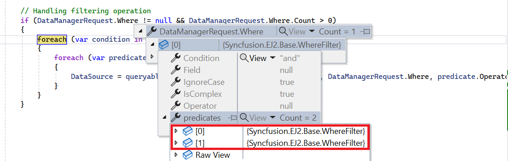
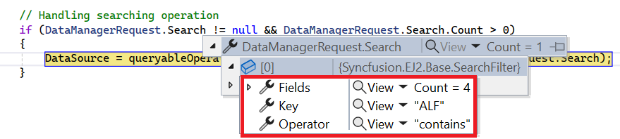

# UrlAdaptor in Syncfusion React Grid Component

The [UrlAdaptor](https://ej2.syncfusion.com/react/documentation/data/adaptors#url-adaptor) serves as the base adaptor for facilitating communication between remote data services and an UI component. It enables seamless data binding and interaction with custom API services or any remote service through URLs. The UrlAdaptor is particularly useful for the scenarios where a custom API service with unique logic for handling data and CRUD operations is in place. This approach allows for custom handling of data and CRUD operations, and the resultant data returned in the `result` and `count` format for display in the Syncfusion React Grid component.

This section describes a step-by-step process for retrieving data using UrlAdaptor, then binding it to the React Grid component to facilitate data and CRUD operations.

## Creating an API service

To configure a server with Syncfusion React Grid, you need to follow the below steps:

**1. Project Creation:**

Open Visual Studio and create an React and ASP.NET Core project named **UrlAdaptor**. To create an React and ASP.NET Core application, follow the documentation [link](https://learn.microsoft.com/en-us/visualstudio/javascript/tutorial-asp-net-core-with-react?view=vs-2022) for detailed steps.

**2. Model Class Creation:**

Create a model class named **OrdersDetails.cs** in the server-side **Models** folder to represent the order data.




 namespace UrlAdaptor.Server.Models
 {
 public class OrdersDetails
 {
    public static List<OrdersDetails> order = new List<OrdersDetails>();
    public OrdersDetails()
    {

    }
    public OrdersDetails(
    int OrderID, string CustomerId, int EmployeeId, double Freight, bool Verified,
    DateTime OrderDate, string ShipCity, string ShipName, string ShipCountry,
    DateTime ShippedDate, string ShipAddress)
    {
    this.OrderID = OrderID;
    this.CustomerID = CustomerId;
    this.EmployeeID = EmployeeId;
    this.Freight = Freight;
    this.ShipCity = ShipCity;
    this.Verified = Verified;
    this.OrderDate = OrderDate;
    this.ShipName = ShipName;
    this.ShipCountry = ShipCountry;
    this.ShippedDate = ShippedDate;
    this.ShipAddress = ShipAddress;
    }

    public static List<OrdersDetails> GetAllRecords()
    {
    if (order.Count() == 0)
    {
        int code = 10000;
        for (int i = 1; i < 10; i++)
        {
        order.Add(new OrdersDetails(code + 1, "ALFKI", i + 0, 2.3 * i, false, new DateTime(1991, 05, 15), "Berlin", "Simons bistro", "Denmark", new DateTime(1996, 7, 16), "Kirchgasse 6"));
        order.Add(new OrdersDetails(code + 2, "ANATR", i + 2, 3.3 * i, true, new DateTime(1990, 04, 04), "Madrid", "Queen Cozinha", "Brazil", new DateTime(1996, 9, 11), "Avda. Azteca 123"));
        order.Add(new OrdersDetails(code + 3, "ANTON", i + 1, 4.3 * i, true, new DateTime(1957, 11, 30), "Cholchester", "Frankenversand", "Germany", new DateTime(1996, 10, 7), "Carrera 52 con Ave. Bolívar #65-98 Llano Largo"));
        order.Add(new OrdersDetails(code + 4, "BLONP", i + 3, 5.3 * i, false, new DateTime(1930, 10, 22), "Marseille", "Ernst Handel", "Austria", new DateTime(1996, 12, 30), "Magazinweg 7"));
        order.Add(new OrdersDetails(code + 5, "BOLID", i + 4, 6.3 * i, true, new DateTime(1953, 02, 18), "Tsawassen", "Hanari Carnes", "Switzerland", new DateTime(1997, 12, 3), "1029 - 12th Ave. S."));
        code += 5;
        }
    }
    return order;
    }

    public int? OrderID { get; set; }
    public string? CustomerID { get; set; }
    public int? EmployeeID { get; set; }
    public double? Freight { get; set; }
    public string? ShipCity { get; set; }
    public bool? Verified { get; set; }
    public DateTime OrderDate { get; set; }
    public string? ShipName { get; set; }
    public string? ShipCountry { get; set; }
    public DateTime ShippedDate { get; set; }
    public string? ShipAddress { get; set; }
 }
}




**3. API Controller Creation:**

Create a file named `GridController.cs` under the **Controllers** folder. This controller will handle data communication with the React Grid component.




using Microsoft.AspNetCore.Http;
using Microsoft.AspNetCore.Mvc;
using UrlAdaptor.Server.Models;

namespace UrlAdaptor.Server.Controllers
{
  [Route("api/[controller]")]
  [ApiController]
  public class GridController : ControllerBase
  {
    [HttpPost]
    public object Post()
    {
      // Retrieve data from the data source (e.g., database)
      IQueryable<OrdersDetails> DataSource = GetOrderData().AsQueryable();

      // Get the total records count
      int totalRecordsCount = DataSource.Count();

      // Return data based on the request
      return new { result = DataSource, count = totalRecordsCount };
    }

    [HttpGet]
    public List<OrdersDetails> GetOrderData()
    {
      var data = OrdersDetails.GetAllRecords().ToList();
      return data;
    }
  }
}




> The **GetOrderData** method retrieves sample order data. You can replace it with your custom logic to fetch data from a database or any other source.

**4. Run the Application:**

Run the application in Visual Studio. It will be accessible on a URL like **https://localhost:xx**. 

After running the application, you can verify that the server-side API controller is successfully returning the order data in the URL(https://localhost:xx/api/Grid). Here **xx** denotes the port number.


### Connecting Syncfusion React Grid to an API service

To integrate the Syncfusion Grid component into your React and ASP.NET Core project using Visual Studio, follow these steps:

**Step 1: Install syncfusion package**

Open your terminal in the project's root directory and install the required Syncfusion packages using npm:

```bash
npm install @syncfusion/ej2-react-grids --save
npm install @syncfusion/ej2-data --save
```

**Step 2: Adding CSS reference**

Include the necessary CSS files in your `styles.css` file to style the Syncfusion React components:




@import '../node_modules/@syncfusion/ej2-base/styles/material.css';
@import '../node_modules/@syncfusion/ej2-buttons/styles/material.css';
@import '../node_modules/@syncfusion/ej2-calendars/styles/material.css';
@import '../node_modules/@syncfusion/ej2-dropdowns/styles/material.css';
@import '../node_modules/@syncfusion/ej2-inputs/styles/material.css';
@import '../node_modules/@syncfusion/ej2-navigations/styles/material.css';
@import '../node_modules/@syncfusion/ej2-popups/styles/material.css';
@import '../node_modules/@syncfusion/ej2-splitbuttons/styles/material.css';
@import '../node_modules/@syncfusion/ej2-react-grids/styles/material.css';




**Step 4: Adding Syncfusion component**

In your component file (e.g., App.ts), import `DataManager` and `UrlAdaptor` from `@syncfusion/ej2-data`. Create a `DataManager` instance specifying the URL of your API endpoint(https:localhost:xx/api/Grid) using the `url` property and set the adaptor `UrlAdaptor`.




import { DataManager, UrlAdaptor } from '@syncfusion/ej2-data';
import { ColumnDirective, ColumnsDirective, GridComponent } from '@syncfusion/ej2-react-grids';

function App() {
    // Set the adaptor as UrlAdaptor
    const data = new DataManager({ 
      url:'https://localhost:xxxx/api/grid', // Here xxxx represents the port number
      adaptor: new UrlAdaptor()
    });
    return <GridComponent dataSource={data} >
        <ColumnsDirective>
            <ColumnDirective field='OrderID' headerText='Order ID' isPrimaryKey={true} width='150'textAlign='Right'></ColumnDirective>
            <ColumnDirective field='CustomerID' headerText='Customer ID' width='150'></ColumnDirective>
            <ColumnDirective field='ShipCity' headerText='Ship City' width='150'/>
            <ColumnDirective field='ShipCountry' headerText='Ship Country' width='150'/>
        </ColumnsDirective>
    </GridComponent>
};
export default App;




> Replace https://localhost:****/api/grid with the actual **URL** of your API endpoint that provides the data in a consumable format (e.g., JSON).

Run the application in Visual Studio. It will be accessible on a URL like https://localhost:xx.

> Ensure your API service is configured to handle CORS (Cross-Origin Resource Sharing) if necessary.

```cs
[program.cs]
builder.Services.AddCors(options =>
{
  options.AddDefaultPolicy(builder =>
  {
    builder.AllowAnyOrigin().AllowAnyMethod().AllowAnyHeader();
  });
});
var app = builder.Build();
app.UseCors();
```


> * The Syncfusion Grid component provides built-in support for handling various data operations such as searching, sorting, filtering, aggregate and paging on the server-side. These operations can be handled using methods such as [PerformSearching](https://help.syncfusion.com/cr/aspnetmvc-js2/Syncfusion.EJ2.Base.QueryableOperation.html#Syncfusion_EJ2_Base_QueryableOperation_PerformSearching__1_System_Linq_IQueryable___0__System_Collections_Generic_List_Syncfusion_EJ2_Base_SearchFilter__), [PerformFiltering](https://help.syncfusion.com/cr/aspnetmvc-js2/Syncfusion.EJ2.Base.QueryableOperation.html#Syncfusion_EJ2_Base_QueryableOperation_PerformFiltering__1_System_Linq_IQueryable___0__System_Collections_Generic_List_Syncfusion_EJ2_Base_WhereFilter__System_String_), [PerformSorting](https://help.syncfusion.com/cr/aspnetmvc-js2/Syncfusion.EJ2.Base.QueryableOperation.html#Syncfusion_EJ2_Base_QueryableOperation_PerformSorting__1_System_Linq_IQueryable___0__System_Collections_Generic_List_Syncfusion_EJ2_Base_Sort__), [PerformTake](https://help.syncfusion.com/cr/aspnetmvc-js2/Syncfusion.EJ2.Base.QueryableOperation.html#Syncfusion_EJ2_Base_QueryableOperation_PerformTake__1_System_Linq_IQueryable___0__System_Int32_) and [PerformSkip](https://help.syncfusion.com/cr/aspnetmvc-js2/Syncfusion.EJ2.Base.QueryableOperation.html#Syncfusion_EJ2_Base_QueryableOperation_PerformSkip__1_System_Linq_IQueryable___0__System_Int32_) available in the `Syncfusion.EJ2.AspNet.Core` package. Let’s explore how to manage these data operations using the `UrlAdaptor`.
> * In an API service project, add `Syncfusion.EJ2.AspNet.Core` by opening the NuGet package manager in Visual Studio (Tools → NuGet Package Manager → Manage NuGet Packages for Solution), search and install it.
> * To access [DataManagerRequest](https://help.syncfusion.com/cr/aspnetmvc-js2/Syncfusion.EJ2.Base.DataManagerRequest.html) and [QueryableOperation](https://help.syncfusion.com/cr/aspnetmvc-js2/Syncfusion.EJ2.Base.QueryableOperation.html), import `Syncfusion.EJ2.Base` in `GridController.cs` file.

### Handling filtering operation

To handle filtering operation, ensure that your API endpoint supports custom filtering criteria. Implement the filtering logic on the server-side using the [PerformFiltering](https://help.syncfusion.com/cr/aspnetmvc-js2/Syncfusion.EJ2.Base.QueryableOperation.html#Syncfusion_EJ2_Base_QueryableOperation_PerformFiltering__1_System_Linq_IQueryable___0__System_Collections_Generic_List_Syncfusion_EJ2_Base_WhereFilter__System_String_) method from the [QueryableOperation](https://help.syncfusion.com/cr/aspnetmvc-js2/Syncfusion.EJ2.Base.QueryableOperation.html) class. This allows the custom data source to undergo filtering based on the criteria specified in the incoming [DataManagerRequest](https://help.syncfusion.com/cr/aspnetmvc-js2/Syncfusion.EJ2.Base.DataManagerRequest.html) object.

**Single column filtering**


**Multi column filtering**




public object Post([FromBody] DataManagerRequest DataManagerRequest)
{
  // Retrieve data from the data source (e.g., database)
  IQueryable<OrdersDetails> DataSource = GetOrderData().AsQueryable();

  QueryableOperation queryableOperation = new QueryableOperation(); // Initialize QueryableOperation instance

  if (DataManagerRequest.Where != null && DataManagerRequest.Where.Count > 0)
  {
    // Handling filtering operation
    foreach (var condition in DataManagerRequest.Where)
    {
      foreach (var predicate in condition.predicates)
      {
        DataSource = queryableOperation.PerformFiltering(DataSource, DataManagerRequest.Where, predicate.Operator);
      }
    }
  }
  // Get the total records count
  int totalRecordsCount = DataSource.Count();

  // Return data based on the request
  return new { result = DataSource, count = totalRecordsCount };
}


import { ColumnDirective, ColumnsDirective, GridComponent, Filter, Inject } from '@syncfusion/ej2-react-grids';
import { DataManager, UrlAdaptor } from '@syncfusion/ej2-data';

function App() {
    const data = new DataManager({ 
        url: 'https://localhost:xxxx/api/Grid', // Replace your hosted link
        adaptor: new UrlAdaptor()
    });
    return <GridComponent dataSource={data} allowFiltering={true} height={320}>
        <ColumnsDirective>
            <ColumnDirective field='OrderID' headerText='Order ID' isPrimaryKey={true} width='150' textAlign='Right'></ColumnDirective>
            <ColumnDirective field='CustomerID' headerText='Customer ID' width='150'></ColumnDirective>
            <ColumnDirective field='ShipCity' headerText='Ship City' width='150'/>
            <ColumnDirective field='ShipCountry' headerText='Ship Country' width='150'/>
        </ColumnsDirective>
        <Inject services={[Filter]} />
    </GridComponent>
};
export default App;




### Handling searching operation

To handle searching operation, ensure that your API endpoint supports custom searching criteria. Implement the searching logic on the server-side using the [PerformSearching](https://help.syncfusion.com/cr/aspnetmvc-js2/Syncfusion.EJ2.Base.QueryableOperation.html#Syncfusion_EJ2_Base_QueryableOperation_PerformSearching__1_System_Linq_IQueryable___0__System_Collections_Generic_List_Syncfusion_EJ2_Base_SearchFilter__) method from the [QueryableOperation](https://help.syncfusion.com/cr/aspnetmvc-js2/Syncfusion.EJ2.Base.QueryableOperation.html) class. This allows the custom data source to undergo searching based on the criteria specified in the incoming [DataManagerRequest](https://help.syncfusion.com/cr/aspnetmvc-js2/Syncfusion.EJ2.Base.DataManagerRequest.html) object.





[HttpPost]
public object Post([FromBody] DataManagerRequest DataManagerRequest)
{
  // Retrieve data from the data source (e.g., database)
  IQueryable<OrdersDetails> DataSource = GetOrderData().AsQueryable();
  QueryableOperation queryableOperation = new QueryableOperation(); // Initialize QueryableOperation instance

  // Handling Searching
  if (DataManagerRequest.Search != null && DataManagerRequest.Search.Count > 0)
  {
      DataSource = queryableOperation.PerformSearching(DataSource, DataManagerRequest.Search);
  }
  // Get the total records count
  int totalRecordsCount = DataSource.Count();

  // Return data based on the request
  return new { result = DataSource, count = totalRecordsCount };
}


import { ColumnDirective, ColumnsDirective, GridComponent, ToolbarItems, Toolbar, Inject } from '@syncfusion/ej2-react-grids';
import { DataManager, UrlAdaptor } from '@syncfusion/ej2-data';

function App() {
    const data = new DataManager({ 
        url: 'https://localhost:xxxx/api/Grid', // Replace your hosted link
        adaptor: new UrlAdaptor()
    });
    const toolbar: ToolbarItems[] = ['Search'];
    return <GridComponent dataSource={data} toolbar={toolbar} height={320}>
        <ColumnsDirective>
            <ColumnDirective field='OrderID' headerText='Order ID' isPrimaryKey={true} width='150' textAlign='Right'></ColumnDirective>
            <ColumnDirective field='CustomerID' headerText='Customer ID' width='150'></ColumnDirective>
            <ColumnDirective field='ShipCity' headerText='Ship City' width='150'/>
            <ColumnDirective field='ShipCountry' headerText='Ship Country' width='150'/>
        </ColumnsDirective>
        <Inject services={[Toolbar]} />
    </GridComponent>
};
export default App;



### Handling sorting operation

To handle sorting operation, ensure that your API endpoint supports custom sorting criteria. Implement the sorting logic on the server-side using the [PerformSorting](https://help.syncfusion.com/cr/aspnetmvc-js2/Syncfusion.EJ2.Base.QueryableOperation.html#Syncfusion_EJ2_Base_QueryableOperation_PerformSorting__1_System_Linq_IQueryable___0__System_Collections_Generic_List_Syncfusion_EJ2_Base_Sort__) method from the [QueryableOperation](https://help.syncfusion.com/cr/aspnetmvc-js2/Syncfusion.EJ2.Base.QueryableOperation.html) class. This allows the custom data source to undergo sorting based on the criteria specified in the incoming [DataManagerRequest](https://help.syncfusion.com/cr/aspnetmvc-js2/Syncfusion.EJ2.Base.DataManagerRequest.html) object.

**Single column sorting**


**Multi column sorting**




[HttpPost]
public object Post([FromBody] DataManagerRequest DataManagerRequest)
{
  // Retrieve data from the data source (e.g., database)
  IQueryable<OrdersDetails> DataSource = GetOrderData().AsQueryable();

  QueryableOperation queryableOperation = new QueryableOperation(); // Initialize QueryableOperation instance

  // Handling Sorting operation
  if (DataManagerRequest.Sorted != null && DataManagerRequest.Sorted.Count > 0)
  {
    DataSource = queryableOperation.PerformSorting(DataSource, DataManagerRequest.Sorted);
  }

  // Get the total count of records
  int totalRecordsCount = DataSource.Count();

  // Return data based on the request
  return new { result = DataSource, count = totalRecordsCount };
}


import { ColumnDirective, ColumnsDirective, GridComponent, Sort, Inject } from '@syncfusion/ej2-react-grids';
import { DataManager, UrlAdaptor } from '@syncfusion/ej2-data';

function App() {
    const data = new DataManager({ 
        url: 'https://localhost:xxxx/api/Grid', // Replace your hosted link
        adaptor: new UrlAdaptor()
    });
    return <GridComponent dataSource={data} allowSorting={true} height={320}>
        <ColumnsDirective>
            <ColumnDirective field='OrderID' headerText='Order ID' isPrimaryKey={true} width='150' textAlign='Right'></ColumnDirective>
            <ColumnDirective field='CustomerID' headerText='Customer ID' width='150'></ColumnDirective>
            <ColumnDirective field='ShipCity' headerText='Ship City' width='150'/>
            <ColumnDirective field='ShipCountry' headerText='Ship Country' width='150'/>
        </ColumnsDirective>
        <Inject services={[Sort]} />
    </GridComponent>
};
export default App;



### Handling paging operation

To handle paging operation, ensure that your API endpoint supports custom paging criteria. Implement the paging logic on the server-side using the [PerformTake](https://help.syncfusion.com/cr/aspnetmvc-js2/Syncfusion.EJ2.Base.QueryableOperation.html#Syncfusion_EJ2_Base_QueryableOperation_PerformTake__1_System_Linq_IQueryable___0__System_Int32_) and [PerformSkip](https://help.syncfusion.com/cr/aspnetmvc-js2/Syncfusion.EJ2.Base.QueryableOperation.html#Syncfusion_EJ2_Base_QueryableOperation_PerformSkip__1_System_Linq_IQueryable___0__System_Int32_) method from the [QueryableOperation](https://help.syncfusion.com/cr/aspnetmvc-js2/Syncfusion.EJ2.Base.QueryableOperation.html) class. This allows the custom data source to undergo paging based on the criteria specified in the incoming [DataManagerRequest](https://help.syncfusion.com/cr/aspnetmvc-js2/Syncfusion.EJ2.Base.DataManagerRequest.html) object.




[HttpPost]
public object Post([FromBody] DataManagerRequest DataManagerRequest)
{
  // Retrieve data from the data source (e.g., database)
  IQueryable<OrdersDetails> DataSource = GetOrderData().AsQueryable();

  // Get the total records count
  int totalRecordsCount = DataSource.Count();

  QueryableOperation queryableOperation = new QueryableOperation(); // Initialize QueryableOperation instance

  // Handling paging operation.
  if (DataManagerRequest.Skip != 0)
  {
    // Paging
    DataSource = queryableOperation.PerformSkip(DataSource, DataManagerRequest.Skip);
  }
  if (DataManagerRequest.Take != 0)
  {
    DataSource = queryableOperation.PerformTake(DataSource, DataManagerRequest.Take);
  }

  // Return data based on the request
  return new { result = DataSource, count = totalRecordsCount };
}


import { ColumnDirective, ColumnsDirective, GridComponent, Page, Inject } from '@syncfusion/ej2-react-grids';
import { DataManager, UrlAdaptor } from '@syncfusion/ej2-data';

function App() {
    const data = new DataManager({ 
        url: 'https://localhost:xxxx/api/Grid', // Replace your hosted link
        adaptor: new UrlAdaptor()
    });
    return <GridComponent dataSource={data} allowPaging={true} height={320}>
        <ColumnsDirective>
            <ColumnDirective field='OrderID' headerText='Order ID' isPrimaryKey={true} width='150' textAlign='Right'></ColumnDirective>
            <ColumnDirective field='CustomerID' headerText='Customer ID' width='150'></ColumnDirective>
            <ColumnDirective field='ShipCity' headerText='Ship City' width='150'/>
            <ColumnDirective field='ShipCountry' headerText='Ship Country' width='150'/>
        </ColumnsDirective>
        <Inject services={[Page]} />
    </GridComponent>
};
export default App;



## Handling CRUD operation

The Syncfusion React Grid Component seamlessly integrates CRUD (Create, Read, Update, Delete) operations with server-side controller actions through specific properties: [insertUrl](https://help.syncfusion.com/cr/aspnetmvc-js2/Syncfusion.EJ2.DataManager.html#Syncfusion_EJ2_DataManager_InsertUrl), [removeUrl](https://help.syncfusion.com/cr/aspnetmvc-js2/Syncfusion.EJ2.DataManager.html#Syncfusion_EJ2_DataManager_RemoveUrl), [updateUrl](https://help.syncfusion.com/cr/aspnetmvc-js2/Syncfusion.EJ2.DataManager.html#Syncfusion_EJ2_DataManager_UpdateUrl), [crudUrl](https://help.syncfusion.com/cr/aspnetmvc-js2/Syncfusion.EJ2.DataManager.html#Syncfusion_EJ2_DataManager_CrudUrl), and [batchUrl](https://help.syncfusion.com/cr/aspnetmvc-js2/Syncfusion.EJ2.DataManager.html#Syncfusion_EJ2_DataManager_BatchUrl). These properties enable the grid to communicate with the data service for every grid action, facilitating server-side operations.

**CRUD Operations Mapping**

CRUD operations within the grid can be mapped to server-side Controller actions using specific properties:

1. **insertURL**: Specifies the URL for inserting new data.
2. **removeUrl**: Specifies the URL for removing existing data.
3. **updateUrl**: Specifies the URL for updating existing data.
4. **crudUrl**: Specifies a single URL for CRUD operations.
5. **batchUrl**: Specifies the URL for batch editing.

To enable editing in this React Grid component, refer to the editing [documentation](https://ej2.syncfusion.com/react/documentation/grid/editing/edit).In the below example, the inline edit [mode](https://ej2.syncfusion.com/react/documentation/api/grid/editSettings/#mode) is enabled and [toolbar](https://helpej2.syncfusion.com/react/documentation/api/grid/#toolbar) property is configured to display toolbar items for editing purposes.



import { ColumnDirective, ColumnsDirective, GridComponent, ToolbarItems, EditSettingsModel, Toolbar, Edit, Inject } from '@syncfusion/ej2-react-grids';
import { DataManager, UrlAdaptor } from '@syncfusion/ej2-data';

function App() {
    const data = new DataManager({ 
      url: 'https://localhost:xxxx/api/grid', // Replace your hosted link
      insertUrl: 'https://localhost:xxxx/api/grid/Insert',
      updateUrl: 'https://localhost:xxxx/api/grid/Update',
      removeUrl: 'https://localhost:xxxx/api/grid/Remove',
      adaptor: new UrlAdaptor()
    });
    const editSettings: EditSettingsModel = { allowEditing: true, allowAdding: true, allowDeleting: true, mode: 'Batch' };
    const toolbar: ToolbarItems[] = ['Add', 'Edit', 'Delete', 'Update', 'Cancel', 'Search'];
    const orderIDRules: object = {required: true};
    const customerIDRules: object = {required: true, minLength: 3};
    return <GridComponent dataSource={data} editSettings={editSettings} toolbar={toolbar} height={320}>
        <ColumnsDirective>
            <ColumnDirective field='OrderID' headerText='Order ID' isPrimaryKey={true} width='150' textAlign='Right' validationRules={orderIDRules}></ColumnDirective>
            <ColumnDirective field='CustomerID' headerText='Customer ID' width='150' validationRules={customerIDRules}></ColumnDirective>
            <ColumnDirective field='ShipCity' headerText='Ship City' width='150'/>
            <ColumnDirective field='ShipCountry' headerText='Ship Country' width='150'/>
        </ColumnsDirective>
        <Inject services={[Toolbar, Edit]} />
    </GridComponent>
};
export default App;



> Normal/Inline editing is the default edit [mode](https://ej2.syncfusion.com/react/documentation/api/grid/editSettings/#mode) for the Grid component. To enable CRUD operations, ensure that the [isPrimaryKey](https://ej2.syncfusion.com/react/documentation/api/grid/column/#isprimarykey) property is set to true for a specific Grid Column, ensuring that its value is unique.

The below class is used to structure data sent during CRUD operations.

```cs
public class CRUDModel<T> where T : class
{
  public string? action { get; set; }
  public string? keyColumn { get; set; }
  public object? key { get; set; }
  public T? value { get; set; }
  public List<T>? added { get; set; }
  public List<T>? changed { get; set; }
  public List<T>? deleted { get; set; }
  public IDictionary<string, object>? @params { get; set; }
}
```

**Insert operation**

To insert a new record, utilize the [insertUrl](https://help.syncfusion.com/cr/aspnetmvc-js2/Syncfusion.EJ2.DataManager.html#Syncfusion_EJ2_DataManager_InsertUrl) property to specify the controller action mapping URL for the insert operation. The newly added record details are bound to the **newRecord** parameter.


```cs
/// <summary>
/// Inserts a new data item into the data collection.
/// </summary>
/// <param name="newRecord">It contains the new record detail which is need to be inserted.</param>
/// <returns>Returns void</returns>
[HttpPost]
[Route("api/Grid/Insert")]
public void Insert([FromBody] CRUDModel<OrdersDetails> newRecord)
{
  if(newRecord != null){
    OrdersDetails.GetAllRecords().Insert(0, newRecord.value);
  }
}
```

**Update operation**

For updating existing records, utilize the [updateUrl](https://help.syncfusion.com/cr/aspnetmvc-js2/Syncfusion.EJ2.DataManager.html#Syncfusion_EJ2_DataManager_UpdateUrl) property to specify the controller action mapping URL for the update operation. The updated record details are bound to the **updatedRecord** parameter.


```cs
/// <summary>
/// Update a existing data item from the data collection.
/// </summary>
/// <param name="Order">It contains the updated record detail which is need to be updated.</param>
/// <returns>Returns void</returns>
[HttpPost]
[Route("api/Grid/Update")]
public void Update([FromBody] CRUDModel<OrdersDetails> Order)
{
    var updatedOrder = Order.value;
    var data = OrdersDetails.GetAllRecords().FirstOrDefault(existingOrder => existingOrder.OrderID == updatedOrder.OrderID);
    if (data != null)
    {
        // Update the existing record
        data.OrderID = updatedOrder.OrderID;
        data.CustomerID = updatedOrder.CustomerID;
        data.ShipCity = updatedOrder.ShipCity;
        data.ShipCountry = updatedOrder.ShipCountry;
        // Update other properties similarly
    }
}
```

**Delete operation**

To delete existing records, use the [removeUrl](https://help.syncfusion.com/cr/aspnetmvc-js2/Syncfusion.EJ2.DataManager.html#Syncfusion_EJ2_DataManager_RemoveUrl) property to specify the controller action mapping URL for the delete operation. The primary key value of the deleted record is bound to the **deletedRecord** parameter.


```cs
/// <summary>
/// Remove a specific data item from the data collection.
/// </summary>
/// <param name="value">It contains the specific record detail which is need to be removed.</param>
/// <return>Returns void</return>
[HttpPost]
[Route("api/Grid/Remove")]
public void Remove([FromBody] CRUDModel<OrdersDetails> value)
{
    int orderId = int.Parse(value.key.ToString());
    var data = OrdersDetails.GetAllRecords().FirstOrDefault(orderData => orderData.OrderID == orderId);
    if (data != null)
    {
        // Remove the record from the data collection
        OrdersDetails.GetAllRecords().Remove(data);
    }
}
```


**Single method for performing all CRUD operations**

Using the `crudUrl` property, the controller action mapping URL can be specified to perform all the CRUD operation at server-side using a single method instead of specifying separate controller action method for CRUD (insert, update and delete) operations.

The following code example describes the above behavior.

```ts
import { GridComponent, ToolbarItems, EditSettingsModel } from '@syncfusion/ej2-react-grids';
import { DataManager, UrlAdaptor } from '@syncfusion/ej2-data';

function App() {
    const data = new DataManager({ 
      url: 'https://localhost:xxxx/api/grid', // Replace your hosted link
      crudUrl:'https://localhost:xxxx/api/grid/CrudUpdate',
        adaptor: new UrlAdaptor()
    });
    const editSettings: EditSettingsModel = { allowEditing: true, allowAdding: true, allowDeleting: true, mode: 'Normal' };
    const toolbar: ToolbarItems[] = ['Add', 'Edit', 'Delete', 'Update', 'Cancel', 'Search'];
    const orderIDRules: object = {required: true};
    const customerIDRules: object = {required: true, minLength: 3};
    return <GridComponent dataSource={data} editSettings={editSettings} toolbar={toolbar} height={320}>
      <ColumnsDirective>
          <ColumnDirective field='OrderID' headerText='Order ID' isPrimaryKey={true} width='150' textAlign='Right' validationRules={orderIDRules}></ColumnDirective>
          <ColumnDirective field='CustomerID' headerText='Customer ID' width='150' validationRules={customerIDRules}></ColumnDirective>
          <ColumnDirective field='ShipCity' headerText='Ship City' width='150'/>
          <ColumnDirective field='ShipCountry' headerText='Ship Country' width='150'/>
      </ColumnsDirective>
      <Inject services={[Toolbar, Edit]} />
  </GridComponent>
};
export default App;
```

```cs
[HttpPost]
[Route("api/[controller]/CrudUpdate")]
public void CrudUpdate([FromBody] CRUDModel<OrdersDetails> request)
{
  if (request.action == "update")
  {
    var orderValue = request.value;
    OrdersDetails existingRecord = OrdersDetails.GetAllRecords().Where(or => or.OrderID == orderValue.OrderID).FirstOrDefault();
    existingRecord.OrderID = orderValue.OrderID;
    existingRecord.CustomerID = orderValue.CustomerID;
    existingRecord.ShipCity = orderValue.ShipCity;
  }
  else if (request.action == "insert")
  {
    OrdersDetails.GetAllRecords().Insert(0, request.value);
  }
  else if (request.action == "remove")
  {
    OrdersDetails.GetAllRecords().Remove(OrdersDetails.GetAllRecords().Where(or => or.OrderID == int.Parse(request.key.ToString())).FirstOrDefault());
  }
}
```

**Batch operation**

To perform batch operation, define the edit [mode](https://ej2.syncfusion.com/react/documentation/api/grid/editSettings/#mode) as **Batch** and specify the `batchUrl` property in the DataManager. Use the **Add** toolbar button to insert new row in batch editing mode. To edit a cell, double-click the desired cell and update the value as required. To delete a record, simply select the record and press the **Delete** toolbar button. Now, all CRUD operations will be executed in single request. Clicking the **Update** toolbar button will update the newly added, edited, or deleted records from the OrdersDetails table using a single API POST request.

```ts
[App.tsx]
import { ColumnDirective, ColumnsDirective, GridComponent, ToolbarItems, EditSettingsModel, Toolbar, Edit, Inject } from '@syncfusion/ej2-react-grids';
import { DataManager, UrlAdaptor } from '@syncfusion/ej2-data';

function App() {
    const data = new DataManager({ 
      url: 'https://localhost:xxxx/api/grid', // Replace your hosted link
      batchUrl: 'https://localhost:xxxx/api/grid/BatchUpdate',
      adaptor: new UrlAdaptor()
    });
    const editSettings: EditSettingsModel = { allowEditing: true, allowAdding: true, allowDeleting: true, mode: 'Batch' };
    const toolbar: ToolbarItems[] = ['Add', 'Edit', 'Delete', 'Update', 'Cancel', 'Search'];
    const orderIDRules: object = {required: true};
    const customerIDRules: object = {required: true, minLength: 3};
    return <GridComponent dataSource={data} editSettings={editSettings} toolbar={toolbar} height={320}>
        <ColumnsDirective>
            <ColumnDirective field='OrderID' headerText='Order ID' isPrimaryKey={true} width='150' textAlign='Right' validationRules={orderIDRules}></ColumnDirective>
            <ColumnDirective field='CustomerID' headerText='Customer ID' width='150' validationRules={customerIDRules}></ColumnDirective>
            <ColumnDirective field='ShipCity' headerText='Ship City' width='150'/>
            <ColumnDirective field='ShipCountry' headerText='Ship Country' width='150'/>
        </ColumnsDirective>
        <Inject services={[Toolbar, Edit]} />
    </GridComponent>
};
export default App;
```

```cs
public IActionResult BatchUpdate([FromBody] CRUDModel<OrdersDetails> batchOperation)
{
  if (batchOperation.added != null)
  {
    foreach (var addedOrder in batchOperation.added)
    {
      OrdersDetails.GetAllRecords().Insert(0, addedOrder);
    }
  }
 if (batchOperation.changed != null)
  {
    foreach (var changedOrder in batchOperation.changed)
    {
      var existingOrder = OrdersDetails.GetAllRecords().FirstOrDefault(or => or.OrderID == changedOrder.OrderID);
      if (existingOrder != null)
      {
        existingOrder.CustomerID = changedOrder.CustomerID;
        existingOrder.ShipCity = changedOrder.ShipCity;
        // Update other properties as needed
      }
    }
  }
if (batchOperation.deleted != null)
  {
    foreach (var deletedOrder in batchOperation.deleted)
    {
      var orderToDelete = OrdersDetails.GetAllRecords().FirstOrDefault(or => or.OrderID == deletedOrder.OrderID);
      if (orderToDelete != null)
      {
        OrdersDetails.GetAllRecords().Remove(orderToDelete);
      }
    }
  }
  return Json(batchOperation);
}
```
