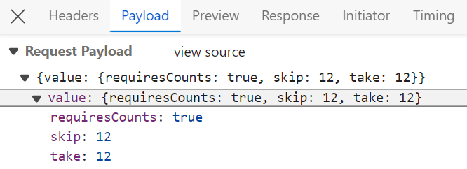
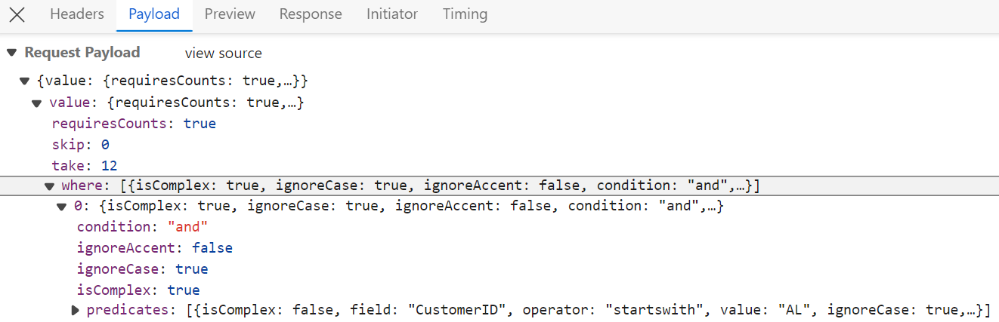
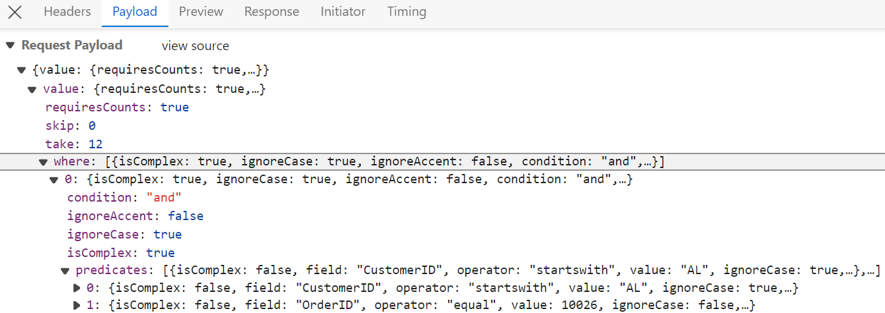
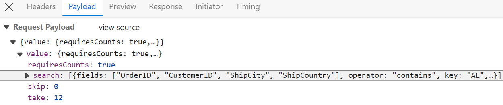
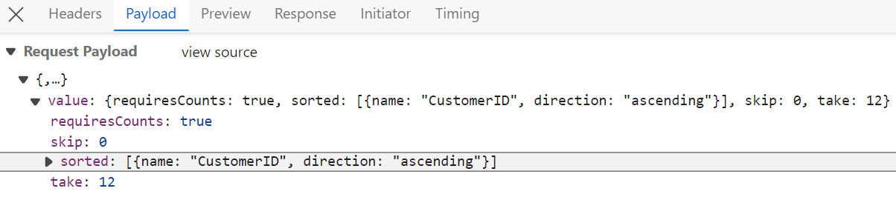
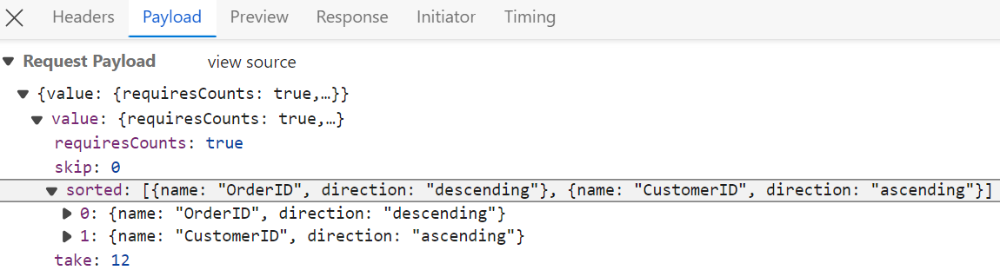
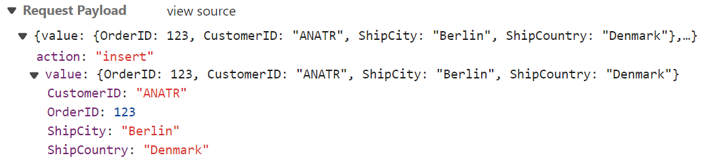
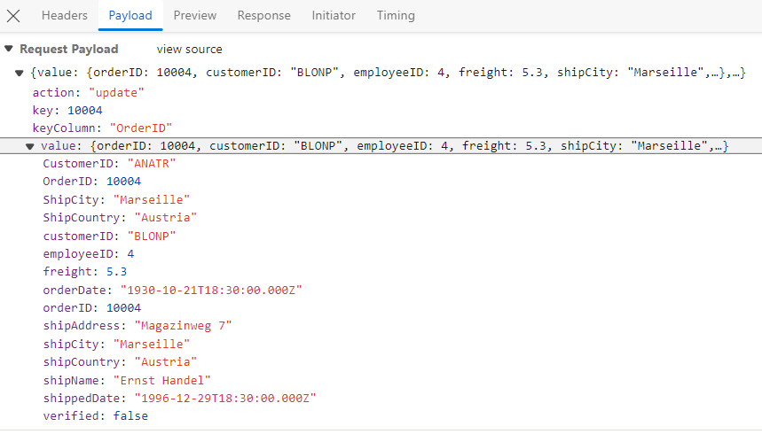
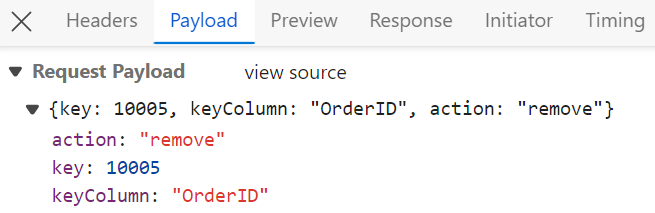

# WebMethodAdaptor in Syncfusion React Grid Component

The `WebMethodAdaptor` in Syncfusion<sup style="font-size:70%">&reg;</sup> React Grid facilitates data binding from remote services using web methods. This powerful feature enables efficient communication between the client-side application and the server. The `WebMethodAdaptor`, like the `URLAdaptor`, sends query parameters encapsulated within an object named `value`. Within this `value` object, various datamanager properties such as `requiresCounts`, `skip`, `take`, `sorted`, and `where` queries are included.
 


For complete server‑side configuration and additional implementation details, refer to the DataManager Webmethod Adaptor documentation, which covers endpoint setup, query processing, and best practices for integrating WebMethod‑based services.

Once the project creation and backend setup are complete, the next step is to render the Syncfusion<sup style="font-size:70%">&reg;</sup> React Grid Component on the client side.

**Project structure:**

```
WebMethodAdaptor/
├── WebmethodAdaptor.client/     # React frontend (Vite/React project).
│   ├── src/
│   │   ├── App.css
│   │   └── App.jsx                  # Add WebMethodAdaptor here.
│   └── package.json
└── WebMethodAdaptor.Server/     # ASP.NET Core backend (API).
    ├── Controllers/                 # API controllers (will be created here).
    ├── Models/                      # Data models (will be created here).
    └── Program.cs                   # Server configuration.
```

## React Grid frontend setup using Syncfusion WebMethodAdaptor

After finishing the backend setup for the **WebMethodAdaptor** ASP.NET Core project, next step is to integrate the Syncfusion<sup style="font-size:70%">&reg;</sup> React Grid on the client side by following these instructions.

### Step 1: Install Syncfusion packages

Right‑click the **WebMethodAdaptor.client** folder in **Solution Explorer** and select **Open in Terminal** (available in newer Visual Studio versions), or open a Developer Command prompt/PowerShell from the Start menu and navigate manually to the **WebMethodAdaptor.client**. Once inside the folder, confirm that **package.json** is present, then run the following commands to install the required Syncfusion<sup style="font-size:70%">&reg;</sup> packages:

```bash
npm install @syncfusion/ej2-react-grids --save
npm install @syncfusion/ej2-data --save
```

### Step 2: Add CSS styles

Navigate to the **src** folder and open (or create) the stylesheet such as **styles.css** or **App.css**, then add the required CSS import statements to apply the Grid's styling.

```css
/* Base styles - Required for all Syncfusion components */
@import '../node_modules/@syncfusion/ej2-base/styles/material3.css';

/* Component-specific styles */
@import '../node_modules/@syncfusion/ej2-buttons/styles/material3.css';
@import '../node_modules/@syncfusion/ej2-calendars/styles/material3.css';
@import '../node_modules/@syncfusion/ej2-dropdowns/styles/material3.css';
@import '../node_modules/@syncfusion/ej2-inputs/styles/material3.css';
@import '../node_modules/@syncfusion/ej2-navigations/styles/material3.css';
@import '../node_modules/@syncfusion/ej2-popups/styles/material3.css';
@import '../node_modules/@syncfusion/ej2-splitbuttons/styles/material3.css';

/* Grid component styles - Required */
@import '../node_modules/@syncfusion/ej2-react-grids/styles/material3.css';
```

Import the **App.css** in the application entry point(**App.jsx**).

```js
import "./App.css";
...
...

```
### Step 3: Create React Grid component with WebMethodAdaptor

Grid integration with server‑side Web Methods is enabled through the `WebMethodAdaptor`, which acts as a bridge between the Syncfusion `DataManager` and Web Forms based endpoints such as ASMX services and Page Methods. It automatically converts Grid actions such as paging, sorting, filtering, searching, and grouping into structured `POST` requests that the server can process. 

By delegating these operations to the server rather than executing them in the browser, the Grid ensures that only the required data is retrieved for each request.



import { DataManager, WebMethodAdaptor } from '@syncfusion/ej2-data';
import { ColumnDirective, ColumnsDirective, GridComponent } from '@syncfusion/ej2-react-grids';

function App() {
    const data = new DataManager({ 
      url:'https://localhost:xxxx/api/grid', // Here xxxx represents the port number
      adaptor: new WebMethodAdaptor(),
      crossDomain: true
    });
    return <GridComponent dataSource={data} >
        <ColumnsDirective>
            <ColumnDirective field='OrderID' headerText='Order ID' isPrimaryKey={true} width='150'textAlign='Right'></ColumnDirective>
            <ColumnDirective field='CustomerID' headerText='Customer ID' width='150'></ColumnDirective>
            <ColumnDirective field='ShipCity' headerText='Ship City' width='150'/>
            <ColumnDirective field='ShipCountry' headerText='Ship Country' width='150'/>
        </ColumnsDirective>
    </GridComponent>
};
export default App;



> The Grid sends a `DataManagerRequest` via POST to a Web Method, and the server returns JSON in the format { result: [...], count: N } for proper data binding and paging.

## Server-side data operations

React Grid optimizes large datasets by relying on server‑side data operations such as filtering, sorting, and paging rather than processing everything in the browser. The `Syncfusion.EJ2.AspNet.Core` package supports this approach by providing built‑in methods that efficiently handle these operations on the server, ensuring smooth performance even with heavy data loads.

### Server-side operation methods

The `Syncfusion.EJ2.Base` namespace provides these methods:

| Operation | Method(s) | Purpose | Use Case |
|-----------|-----------|---------|----------|
| **Paging** | `PerformSkip`, `PerformTake` | Load specific page of data. | Show 10 records at a time from "100K" records. |
| **Filtering** | `PerformFiltering` | Apply filter conditions. | Show only orders from "Germany". |
| **Searching** | `PerformSearching` | Search across columns | Find all records containing "ALFKI". |
| **Sorting** | `PerformSorting` | Sort by one/multiple columns. | Order by "CustomerID" ascending. |
| **Grouping** | `PerformGrouping` | Group data with aggregates. | Group by "ShipCountry" with totals. |

Add the following package import to enable server‑side `DataManager` operations:

```csharp
[GridController.cs]

using Syncfusion.EJ2.Base; // DataManagerRequest, QueryableOperation, DataOperations
using Microsoft.AspNetCore.Mvc;
using WebMethodAdaptorDemo.Server.Models;

namespace WebMethodAdaptorDemo.Controllers
{
  .  .  .
  .  .  .
}
```

> It must have `Syncfusion.EJ2.AspNet.Core` NuGet package installed (covered in WebMethod backend setup documentation).


In the `WebMethodAdaptor` configuration, the `DataManager` request payload is wrapped inside a value object. To properly access the `DataManagerRequest` on the server, a dedicated class is defined to represent this value wrapper. This ensures that the server can deserialize the incoming request and retrieve the `DataManagerRequest` details correctly.

```cs
[GridController.cs]

using Syncfusion.EJ2.Base; // DataManagerRequest, QueryableOperation, DataOperations
using Microsoft.AspNetCore.Mvc;
using WebMethodAdaptorDemo.Server.Models;

namespace WebMethodAdaptorDemo.Controllers
{
    // Model for handling data manager requests
    public class DataManager
    {
        public required DataManagerRequest Value { get; set; }
    }
}
```

### Paging

The paging feature is enabled by setting the `allowPaging` property to `true` and injecting the `Page` module from `@syncfusion/ej2-react-grids` into the grid.

```ts
  <GridComponent dataSource={data} allowPaging={true}>
    . . .
    . . .
    . . .
    <Inject services={[Page]}/>
  </GridComponent>
```

After enabling paging on the client side, the server processes the incoming page requests using the `PerformSkip` and `PerformTake` methods. These methods, provided by the `QueryableOperation` class, apply paging based on the values received in the `DataManagerRequest`. 



[HttpPost]
public object Post([FromBody] DataManager DataManagerRequest)
{
    // Retrieve data from the data source (e.g., database)
    IQueryable<OrdersDetails> DataSource = GetOrderData().AsQueryable();

    // Get the total records count
    int totalRecordsCount = DataSource.Count();

    QueryableOperation queryableOperation = new QueryableOperation(); // Initialize QueryableOperation instance

    // Retrieve data manager value
    DataManagerRequest DataManagerParams = DataManagerRequest.Value;

    // Handling paging operation.
    if (DataManagerParams.Skip != 0)
    {
        // Paging
        DataSource = queryableOperation.PerformSkip(DataSource, DataManagerParams.Skip);
    }
    if (DataManagerParams.Take != 0)
    {
        DataSource = queryableOperation.PerformTake(DataSource, DataManagerParams.Take);
    }

    // Return data based on the request
    return new { result = DataSource, count = totalRecordsCount };
}

// Model for handling data manager requests
public class DataManager
{
    public required DataManagerRequest Value { get; set; }
}


import { DataManager, WebMethodAdaptor } from '@syncfusion/ej2-data';
import { ColumnDirective, ColumnsDirective, GridComponent, Page, Inject } from '@syncfusion/ej2-react-grids';

function App() {
    const data = new DataManager({ 
      url:'https://localhost:xxxx/api/grid', // Here xxxx represents the port number.
      adaptor: new WebMethodAdaptor()
    });
    return <GridComponent dataSource={data} allowPaging={true} height={320}>
        <ColumnsDirective>
            <ColumnDirective field='OrderID' headerText='Order ID' isPrimaryKey={true} width='150'textAlign='Right'></ColumnDirective>
            <ColumnDirective field='CustomerID' headerText='Customer ID' width='150'></ColumnDirective>
            <ColumnDirective field='ShipCity' headerText='Ship City' width='150'/>
        </ColumnsDirective>
        <Inject services={[Page]} />
    </GridComponent>
};
export default App;



The following example demonstrates the server’s handling of paging requests sent from the client.



### Filtering

The filtering feature is enabled by setting the `allowFiltering` property to `true` and injecting the `Filter` module from `@syncfusion/ej2-react-grids` into the grid.

```ts
  <GridComponent dataSource={data} allowFiltering={true}>
    . . .
    . . .
    . . .
    <Inject services={[Filter]}/>
  </GridComponent>
```

After enabling filtering on the client side, the server processes incoming filter requests using the `PerformFiltering` method. This method, provided by the `QueryableOperation` class, applies filtering based on the conditions received in the `DataManagerRequest`.

**Single column filtering**



**Multi column filtering**





[HttpPost]
public object Post([FromBody] DataManager DataManagerRequest)
{
    // Retrieve data from the data source (e.g., database)
    IQueryable<OrdersDetails> DataSource = GetOrderData().AsQueryable();

    QueryableOperation queryableOperation = new QueryableOperation(); // Initialize QueryableOperation instance

    // Retrieve data manager value
    DataManagerRequest DataManagerParams = DataManagerRequest.Value;

    if (DataManagerParams.Where != null && DataManagerParams.Where.Count > 0)
    {
        // Handling filtering operation
        foreach (var condition in DataManagerParams.Where)
        {
            foreach (var predicate in condition.predicates)
            {
                DataSource = queryableOperation.PerformFiltering(DataSource, DataManagerParams.Where, predicate.Operator);
            }
        }
    }
    // Get the total records count
    int totalRecordsCount = DataSource.Count();

    // Return data based on the request
    return new { result = DataSource, count = totalRecordsCount };
}

// Model for handling data manager requests
public class DataManager
{
    public required DataManagerRequest Value { get; set; }
}


import { DataManager, WebMethodAdaptor } from '@syncfusion/ej2-data';
import { ColumnDirective, ColumnsDirective, GridComponent, Inject, Filter } from '@syncfusion/ej2-react-grids';

function App() {
    const data = new DataManager({ 
      url:'https://localhost:xxxx/api/grid', // Here xxxx represents the port number.
      adaptor: new WebMethodAdaptor()
    });
    return <GridComponent dataSource={data} allowFiltering={true}>
        <ColumnsDirective>
            <ColumnDirective field='OrderID' headerText='Order ID' isPrimaryKey={true} width='150'textAlign='Right'></ColumnDirective>
            <ColumnDirective field='CustomerID' headerText='Customer ID' width='150'></ColumnDirective>
            <ColumnDirective field='ShipCity' headerText='Ship City' width='150'/>
        </ColumnsDirective>
        <Inject services={[Filter]} />
    </GridComponent>
};
export default App;



### Searching

The searching feature is enabled by configuring the `toolbar` property with `Search` item and injecting the `Toolbar` and `Search` modules from `@syncfusion/ej2-react-grids` into the grid.

```ts
  <GridComponent dataSource={data} toolbar={['Search']}>
    . . .
    . . .
    . . .
    <Inject services={[Search,Toolbar]}/>
  </GridComponent>
```

After enabling the search feature on the client side, the server processes incoming search requests using the `PerformSearching` method. This method, provided by the `QueryableOperation` class, applies search criteria based on the values received in the `DataManagerRequest`. 



    [HttpPost]
    public object Post([FromBody] DataManager DataManagerRequest)
    {
        // Retrieve data from the data source (e.g., database)
        IQueryable<OrdersDetails> DataSource = GetOrderData().AsQueryable();

        QueryableOperation queryableOperation = new QueryableOperation(); // Initialize QueryableOperation instance

        // Retrieve data manager value
        DataManagerRequest DataManagerParams = DataManagerRequest.Value;

        // Handling Searching
        if (DataManagerParams.Search != null && DataManagerParams.Search.Count > 0)
        {
        DataSource = queryableOperation.PerformSearching(DataSource, DataManagerParams.Search);
        }
        // Get the total records count
        int totalRecordsCount = DataSource.Count();

        // Return data based on the request
        return new { result = DataSource, count = totalRecordsCount };
    }

    // Model for handling data manager requests
    public class DataManager
    {
        public required DataManagerRequest Value { get; set; }
    }


import { DataManager, WebMethodAdaptor } from '@syncfusion/ej2-data';
import { ColumnDirective, ColumnsDirective, GridComponent, Toolbar, ToolbarItems } from '@syncfusion/ej2-react-grids';

function App() {
    const data = new DataManager({ 
      url:'https://localhost:xxxx/api/grid', // Here xxxx represents the port number.
      adaptor: new WebMethodAdaptor()
    });
    const toolbar: ToolbarItems[] = ['Search'];
    return <GridComponent dataSource={data} toolbar={toolbar} height={320}>
        <ColumnsDirective>
            <ColumnDirective field='OrderID' headerText='Order ID' isPrimaryKey={true} width='150'textAlign='Right'></ColumnDirective>
            <ColumnDirective field='CustomerID' headerText='Customer ID' width='150'></ColumnDirective>
            <ColumnDirective field='ShipCity' headerText='Ship City' width='150'/>
        </ColumnsDirective>
        <Inject services={[Toolbar]} />
    </GridComponent>
};
export default App;





### Sorting

The sorting feature is enabled by setting the `allowSorting` property to `true` and injecting the `Sort` module from `@syncfusion/ej2-react-grids` into the grid.

```ts
  <GridComponent dataSource={data} allowSorting={true}>
    . . .
    . . .
    . . .
    <Inject services={[Sort]}/>
  </GridComponent>
```

After enabling sorting on the client side, the server processes incoming sort requests using the `PerformSorting` method. This method, provided by the `QueryableOperation` class, applies the sorting rules received in the `DataManagerRequest`.  



[HttpPost]
public object Post([FromBody] DataManager DataManagerRequest)
{
    // Retrieve data from the data source (e.g., database)
    IQueryable<OrdersDetails> DataSource = GetOrderData().AsQueryable();

    QueryableOperation queryableOperation = new QueryableOperation(); // Initialize QueryableOperation instance

    // Retrieve data manager value
    DataManagerRequest DataManagerParams = DataManagerRequest.Value;

    // Handling Sorting operation
    if (DataManagerParams.Sorted != null && DataManagerParams.Sorted.Count > 0)
    {
        DataSource = queryableOperation.PerformSorting(DataSource, DataManagerParams.Sorted);
    }

    // Get the total count of records
    int totalRecordsCount = DataSource.Count();

    // Return data based on the request
    return new { result = DataSource, count = totalRecordsCount };
}

// Model for handling data manager requests
public class DataManager
{
    public required DataManagerRequest Value { get; set; }
}


import { DataManager, WebMethodAdaptor } from '@syncfusion/ej2-data';
import { ColumnDirective, ColumnsDirective, GridComponent, Sort } from '@syncfusion/ej2-react-grids';

function App() {
    const data = new DataManager({ 
      url:'https://localhost:xxxx//Orders', // Here xxxx represents the port number.
      adaptor: new WebMethodAdaptor()
    });
    return <GridComponent dataSource={data} allowSorting={true} height={320}>
        <ColumnsDirective>
            <ColumnDirective field='OrderID' headerText='Order ID' isPrimaryKey={true} width='150'textAlign='Right'></ColumnDirective>
            <ColumnDirective field='CustomerID' headerText='Customer ID' width='150'></ColumnDirective>
            <ColumnDirective field='ShipCity' headerText='Ship City' width='150'/>
        </ColumnsDirective>
        <Inject services={[Sort]} />
    </GridComponent>
};
export default App;



**Single column sorting**



**Multi column sorting**



**Sort indicator legend:**
- ↑ (Up arrow): Indicates ascending sort direction.
- ↓ (Down arrow): Indicates descending sort direction.
- Numeric indicator (1, 2, 3): Displays sort priority in multi-column sorting scenarios.

The Grid has now been successfully created with including paging, sorting, filtering. the next step is to enabling CRUD operations.

## CRUD operations

The Syncfusion<sup style="font-size:70%">&reg;</sup> React Grid Component seamlessly integrates CRUD (Create, Read, Update, Delete) operations with server-side controller actions through specific properties: [insertUrl](https://help.syncfusion.com/cr/aspnetmvc-js2/Syncfusion.EJ2.DataManager.html#Syncfusion_EJ2_DataManager_InsertUrl), [removeUrl](https://help.syncfusion.com/cr/aspnetmvc-js2/Syncfusion.EJ2.DataManager.html#Syncfusion_EJ2_DataManager_RemoveUrl), [updateUrl](https://help.syncfusion.com/cr/aspnetmvc-js2/Syncfusion.EJ2.DataManager.html#Syncfusion_EJ2_DataManager_UpdateUrl), [crudUrl](https://help.syncfusion.com/cr/aspnetmvc-js2/Syncfusion.EJ2.DataManager.html#Syncfusion_EJ2_DataManager_CrudUrl), and [batchUrl](https://help.syncfusion.com/cr/aspnetmvc-js2/Syncfusion.EJ2.DataManager.html#Syncfusion_EJ2_DataManager_BatchUrl). These properties enable the grid to communicate with the data service for every grid action, facilitating server-side operations.

**CRUD Operations Mapping**

CRUD operations within the grid can be mapped to server-side controller actions using specific properties:

1. **insertUrl**: Specifies the URL for inserting new data.
2. **removeUrl**: Specifies the URL for removing existing data.
3. **updateUrl**: Specifies the URL for updating existing data.
4. **crudUrl**: Specifies a single URL for all CRUD operations.
5. **batchUrl**: Specifies the URL for batch editing.

To enable editing in React Grid component, refer to the editing [documentation](https://ej2.syncfusion.com/react/documentation/grid/editing/edit). In the below example, the inline edit [mode](https://ej2.syncfusion.com/react/documentation/api/grid/editSettings#mode) is enabled and [toolbar](https://ej2.syncfusion.com/react/documentation/api/grid/index-default#toolbar) property is configured to display toolbar items for editing purposes.



import { DataManager, WebMethodAdaptor } from '@syncfusion/ej2-data';
import { ColumnDirective, ColumnsDirective, GridComponent, ToolbarItems, EditSettingsModel, Toolbar, Edit, Inject } from '@syncfusion/ej2-react-grids';

function App() {
    const data = new DataManager({ 
      url: 'https://localhost:xxxx/api/grid', // Here xxxx represents the port number.
      insertUrl: 'https://localhost:xxxx/api/grid/Insert',
      updateUrl: 'https://localhost:xxxx/api/grid/Update',
      removeUrl: 'https://localhost:xxxx/api/grid/Remove',
      adaptor: new WebMethodAdaptor()
    });
    const editSettings: EditSettingsModel = { allowEditing: true, allowAdding: true, allowDeleting: true, mode: 'Batch' };
    const toolbar: ToolbarItems[] = ['Add', 'Edit', 'Delete', 'Update', 'Cancel'];
    return <GridComponent dataSource={data} toolbar={toolbar} editSettings={editSettings}>
        <ColumnsDirective>
            <ColumnDirective field='OrderID' headerText='Order ID' isPrimaryKey={true} width='150'textAlign='Right'></ColumnDirective>
            <ColumnDirective field='CustomerID' headerText='Customer ID' width='150'></ColumnDirective>
            <ColumnDirective field='ShipCity' headerText='Ship City' width='150'/>
            <ColumnDirective field='ShipCountry' headerText='Ship Country' width='150'/>
        </ColumnsDirective>
        <Inject services={[Edit, Toolbar]}/>
    </GridComponent>
};
export default App;



> Normal/Inline editing is the default edit [mode](https://ej2.syncfusion.com/react/documentation/api/grid/editSettings#mode) for the Grid component. To enable CRUD operations, ensure that the [isPrimaryKey](https://ej2.syncfusion.com/react/documentation/api/grid/column#isprimarykey) property is set to `true` for a specific Grid column, ensuring that its value is unique.
The below class is used to structure data sent during CRUD operations.

The following class on the server side defines the structure of data exchanged during CRUD operations:

```cs
public class CRUDModel<T> where T : class
{
  public string? action { get; set; }
  public string? keyColumn { get; set; }
  public object? key { get; set; }
  public T? value { get; set; }
  public List<T>? added { get; set; }
  public List<T>? changed { get; set; }
  public List<T>? deleted { get; set; }
  public IDictionary<string, object>? @params { get; set; }
}
```

**Insert operation:**

To insert a new record, utilize the [insertUrl](https://help.syncfusion.com/cr/aspnetmvc-js2/Syncfusion.EJ2.DataManager.html#Syncfusion_EJ2_DataManager_InsertUrl) property to specify the controller action mapping URL for the insert operation. The newly added record details are bound to the **newRecord** parameter.



```cs

/// <summary>
/// Inserts a new data item into the data collection.
/// </summary>
/// <param name="newRecord">It contains the new record detail which is need to be inserted.</param>
/// <returns>Returns void</returns>
[HttpPost]
[Route("api/[controller]/Insert")]
public void Insert([FromBody] CRUDModel<OrdersDetails> newRecord)
{
    // Check if new record is not null
    if (newRecord.value != null)
    {
        // Insert new record
        OrdersDetails.GetAllRecords().Insert(0, newRecord.value);
    }
}
```

**Update operation:**

For updating existing records, utilize the [updateUrl](https://help.syncfusion.com/cr/aspnetmvc-js2/Syncfusion.EJ2.DataManager.html#Syncfusion_EJ2_DataManager_UpdateUrl) property to specify the controller action mapping URL for the update operation. The updated record details are bound to the **updatedRecord** parameter.



```cs

/// <summary>
/// Update a existing data item from the data collection.
/// </summary>
/// <param name="updatedRecord">It contains the updated record detail which is need to be updated.</param>
/// <returns>Returns void</returns>
[HttpPost]
[Route("api/[controller]/Update")]
public void Update([FromBody] CRUDModel<OrdersDetails> updatedRecord)
{
    // Retrieve updated order
    var updatedOrder = updatedRecord.value;
    if (updatedOrder != null)
    {
        // Find existing record
        var data = OrdersDetails.GetAllRecords().FirstOrDefault(or => or.OrderID == updatedOrder.OrderID);
        if (data != null)
        {
            // Update existing record
            data.OrderID = updatedOrder.OrderID;
            data.CustomerID = updatedOrder.CustomerID;
            data.ShipCity = updatedOrder.ShipCity;
            data.ShipCountry = updatedOrder.ShipCountry;
            // Update other properties similarly
        }
    }
}
```

**Delete operation:**

To delete existing records, use the [removeUrl](https://help.syncfusion.com/cr/aspnetmvc-js2/Syncfusion.EJ2.DataManager.html#Syncfusion_EJ2_DataManager_RemoveUrl) property to specify the controller action mapping URL for the delete operation. The primary key value of the deleted record is bound to the **deletedRecord** parameter.



```cs
/// <summary>
/// Remove a specific data item from the data collection.
/// </summary>
/// <param name="deletedRecord">It contains the specific record detail which is need to be removed.</param>
/// <return>Returns void</return>
[HttpPost]
[Route("api/[controller]/Remove")]
public void Remove([FromBody] CRUDModel<OrdersDetails> deletedRecord)
{
    int orderId = int.Parse(deletedRecord.key.ToString()); // get key value from the deletedRecord
    var data = OrdersDetails.GetAllRecords().FirstOrDefault(orderData => orderData.OrderID == orderId);
    if (data != null)
    {
        // Remove the record from the data collection
        OrdersDetails.GetAllRecords().Remove(data);
    }
}
```

**Single method for performing all CRUD operations**

Using the `crudUrl` property, the controller action mapping URL can be specified to perform all the CRUD operation at server-side using a single method instead of specifying separate controller action method for CRUD (insert, update and delete) operations.

The following code example describes the above behavior.

```js
[src/app.jsx]

import { DataManager, WebMethodAdaptor } from '@syncfusion/ej2-data';
import { ColumnDirective, ColumnsDirective, GridComponent, ToolbarItems, EditSettingsModel, Toolbar, Edit, Inject } from '@syncfusion/ej2-react-grids';

function App() {
    const data = new DataManager({ 
      url: 'https://localhost:xxxx/api/grid', // Here xxxx represents the port number.
      crudUrl:'https://localhost:xxxx/api/grid/CrudUpdate',
      adaptor: new WebMethodAdaptor()
    });
    const editSettings: EditSettingsModel = { allowEditing: true, allowAdding: true, allowDeleting: true, mode: 'Batch' };
    const toolbar: ToolbarItems[] = ['Add', 'Edit', 'Delete', 'Update', 'Cancel'];
    return <GridComponent dataSource={data} toolbar={toolbar} editSettings={editSettings}>
        <ColumnsDirective>
            <ColumnDirective field='OrderID' headerText='Order ID' isPrimaryKey={true} width='150'textAlign='Right'></ColumnDirective>
            <ColumnDirective field='CustomerID' headerText='Customer ID' width='150'></ColumnDirective>
            <ColumnDirective field='ShipCity' headerText='Ship City' width='150'/>
            <ColumnDirective field='ShipCountry' headerText='Ship Country' width='150'/>
        </ColumnsDirective>
        <Inject services={[Edit, Toolbar]}/>
    </GridComponent>
};
export default App;
```

```cs
[Controller/GridController.cs]

[HttpPost]
[Route("api/[controller]/CrudUpdate")]
public void CrudUpdate([FromBody] CRUDModel<OrdersDetails> request)
{
  // perform update operation
  if (request.action == "update")
  {
    var orderValue = request.value;
    OrdersDetails existingRecord = OrdersDetails.GetAllRecords().Where(or => or.OrderID == orderValue.OrderID).FirstOrDefault();
    existingRecord.OrderID = orderValue.OrderID;
    existingRecord.CustomerID = orderValue.CustomerID;
    existingRecord.ShipCity = orderValue.ShipCity;
  }
  // perform insert operation
  else if (request.action == "insert")
  {
    OrdersDetails.GetAllRecords().Insert(0, request.value);
  }
  // perform remove operation
  else if (request.action == "remove")
  {
    OrdersDetails.GetAllRecords().Remove(OrdersDetails.GetAllRecords().Where(or => or.OrderID == int.Parse(request.key.ToString())).FirstOrDefault());
  }
}
```

**Batch operation**

To perform batch operation, define the edit [mode](https://ej2.syncfusion.com/react/documentation/api/grid/editSettings#mode) as `Batch` and specify the `batchUrl` property in the DataManager. Use the `Add` toolbar button to insert new row in batch editing mode. To edit a cell, double-click the desired cell and update the value as required. To delete a record, simply select the record and press the `Delete` toolbar button. Now, all CRUD operations will be executed in single request. Clicking the `Update` toolbar button will update the newly added, edited, or deleted records from the "OrdersDetails" table using a single API POST request.

```ts
[App.tsx]
import { DataManager, WebMethodAdaptor } from '@syncfusion/ej2-data';
import { ColumnDirective, ColumnsDirective, GridComponent, ToolbarItems, EditSettingsModel, Toolbar, Edit, Inject } from '@syncfusion/ej2-react-grids';

function App() {
    const data = new DataManager({ 
      url: 'https://localhost:xxxx/api/grid', // Here xxxx represents the port number.
      batchUrl:'https://localhost:xxxx/api/grid/BatchUpdate',
      adaptor: new WebMethodAdaptor()
    });
    const editSettings: EditSettingsModel = { allowEditing: true, allowAdding: true, allowDeleting: true, mode: 'Batch' };
    const toolbar: ToolbarItems[] = ['Add', 'Edit', 'Delete', 'Update', 'Cancel'];
    return <GridComponent dataSource={data} toolbar={toolbar} editSettings={editSettings}>
        <ColumnsDirective>
            <ColumnDirective field='OrderID' headerText='Order ID' isPrimaryKey={true} width='150'textAlign='Right'></ColumnDirective>
            <ColumnDirective field='CustomerID' headerText='Customer ID' width='150'></ColumnDirective>
            <ColumnDirective field='ShipCity' headerText='Ship City' width='150'/>
            <ColumnDirective field='ShipCountry' headerText='Ship Country' width='150'/>
        </ColumnsDirective>
        <Inject services={[Edit, Toolbar]}/>
    </GridComponent>
};
export default App;
```

```cs
[HttpPost]
[Route("api/[controller]/BatchUpdate")]
public IActionResult BatchUpdate([FromBody] CRUDModel<OrdersDetails> batchOperation)
{
  if (batchOperation.added != null)
  {
    foreach (var addedOrder in batchOperation.added)
    {
      OrdersDetails.GetAllRecords().Insert(0, addedOrder);
    }
  }
 if (batchOperation.changed != null)
  {
    foreach (var changedOrder in batchOperation.changed)
    {
      var existingOrder = OrdersDetails.GetAllRecords().FirstOrDefault(or => or.OrderID == changedOrder.OrderID);
      if (existingOrder != null)
      {
        existingOrder.CustomerID = changedOrder.CustomerID;
        existingOrder.ShipCity = changedOrder.ShipCity;
        // Update other properties as needed
      }
    }
  }
if (batchOperation.deleted != null)
  {
    foreach (var deletedOrder in batchOperation.deleted)
    {
      var orderToDelete = OrdersDetails.GetAllRecords().FirstOrDefault(or => or.OrderID == deletedOrder.OrderID);
      if (orderToDelete != null)
      {
        OrdersDetails.GetAllRecords().Remove(orderToDelete);
      }
    }
  }
  return Json(batchOperation);
}
```

## Run the application

Run the application in Visual Studio, accessible on a URL like **https://localhost:xxxx**. Verify the API returns order data at **https://localhost:xxxx/api/grid**, where **xxxx** is the port. Grid displays order data fetched from the backend API:


## Troubleshooting

| Issue               | Resolution                                                                                     |
|---------------------|-------------------------------------------------------------------------------------------------|
| **Empty Grid**      | Check the browser console for errors and verify that the API URL is correct.                   |
| **CORS Error**      | Ensure the backend has proper CORS configuration in **Program.cs**.                             |
| **Network Error**   | Confirm the backend service is running and accessible.                                          |
| **Wrong Data Format** | API responses must return JSON in the format `{ result: [...], count: number }`.              |

## Complete sample repository

For the complete working implementation of this example, refer to the [GitHub](https://github.com/SyncfusionExamples/ej2-react-grid-samples/tree/master/connecting-to-adaptors/WebMethodAdaptor) repository.
