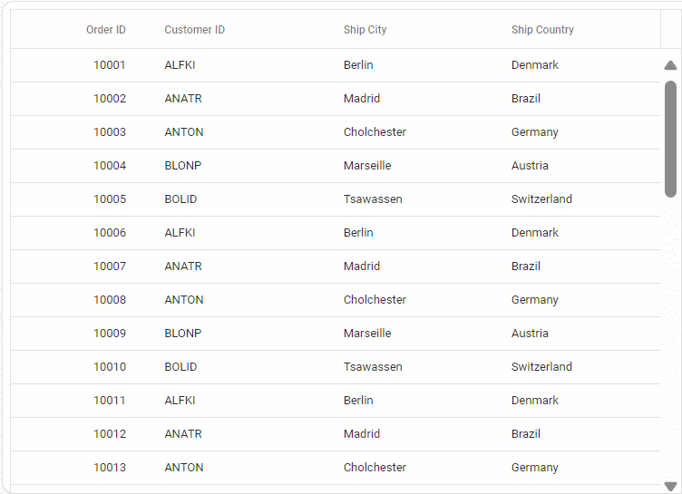
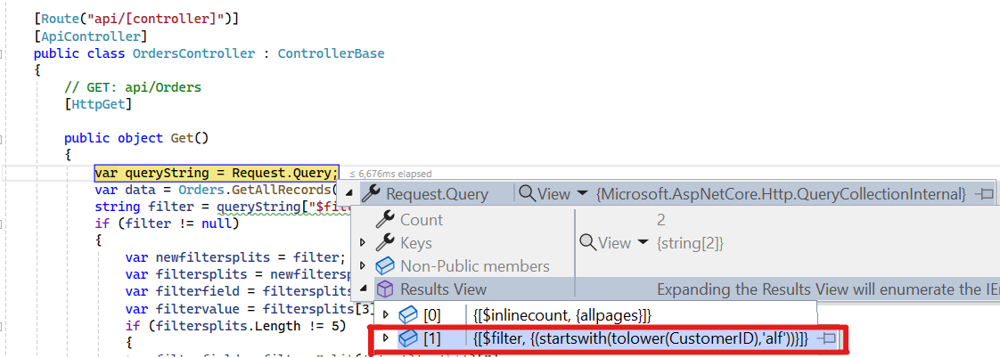
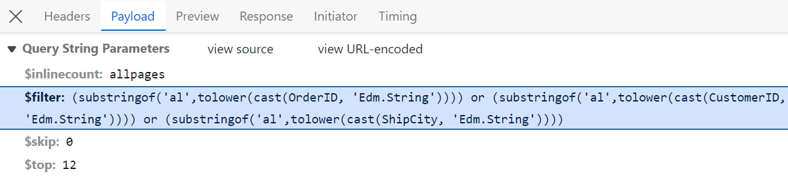
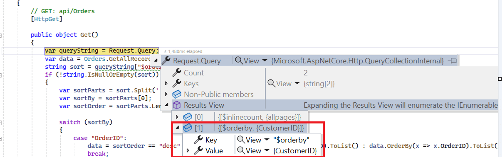
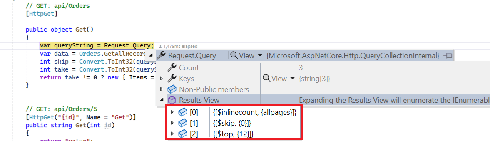
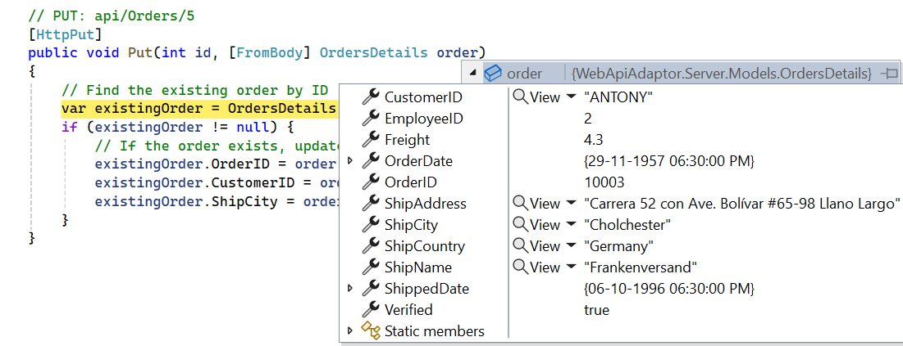
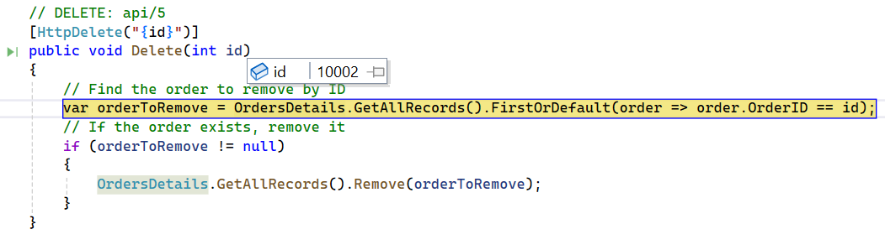

# WebApiAdaptor in Syncfusion React Grid

The Syncfusion<sup style="font-size:70%">&reg;</sup> React Grid integrates with Web API services for efficient data retrieval and manipulation through RESTful APIs. This guide provides a complete step-by-step process for configuring and using the `WebApiAdaptor` with the Syncfusion React Grid to perform server-side operations such as paging, sorting, filtering, and CRUD.

For details on configuring the backend (expected request/response format, server‑side processing), refer to the [WebApiAdaptor backend setup documentation](https://ej2.syncfusion.com/react/documentation/data/adaptors#web-api-adaptor).

## React Grid setup (client-side configuration)

With the Web API service operational, the next phase involves configuring the React Grid component to consume and display data from the service.

### Syncfusion package installation

Right‑click **ClientApp** in **Solution Explorer**, open a terminal, then run the following npm commands in the terminal:

```bash
npm install @syncfusion/ej2-react-grids --save
npm install @syncfusion/ej2-data --save
```

### Add CSS styles

Syncfusion Grid requires CSS for proper rendering. Add these imports to `index.css` or `App.css`:




@import '../node_modules/@syncfusion/ej2-base/styles/tailwind3.css';
@import '../node_modules/@syncfusion/ej2-buttons/styles/tailwind3.css';
@import '../node_modules/@syncfusion/ej2-calendars/styles/tailwind3.css';
@import '../node_modules/@syncfusion/ej2-dropdowns/styles/tailwind3.css';
@import '../node_modules/@syncfusion/ej2-inputs/styles/tailwind3.css';
@import '../node_modules/@syncfusion/ej2-navigations/styles/tailwind3.css';
@import '../node_modules/@syncfusion/ej2-popups/styles/tailwind3.css';
@import '../node_modules/@syncfusion/ej2-splitbuttons/styles/tailwind3.css';
@import '../node_modules/@syncfusion/ej2-react-grids/styles/tailwind3.css';




> - **Theme customization**: Alternative themes available include `bootstrap5.css`, `fluent.css`, `tailwind.css`, and others. All theme files maintain consistent path structure with only the filename varying.
> - Ensure the stylesheet is imported in the entry file (**main.jsx** or **index.jsx**).

### Basic Grid component implementation

This section demonstrates creating a React Grid component with Web API service integration.

Open the **src** folder, access or create the **App.jsx** file, and replace its existing content with the grid implementation shown below.




import { DataManager, WebApiAdaptor } from '@syncfusion/ej2-data';
import { GridComponent, ColumnsDirective, ColumnDirective } from '@syncfusion/ej2-react-grids';

function App() {
    // Create DataManager with WebApiAdaptor
    const data = new DataManager({ 
        url: 'https://localhost:xxxx/api/Orders', // Replace xxxx with your port number.
        adaptor: new WebApiAdaptor(), // This handles Web API communication.
        crossDomain: true // Allow cross-domain requests.
    });
    
    return (
        <div style={{ margin: '20px' }}>
            <h2>Orders Grid</h2>
            <GridComponent dataSource={data} height={320}>
                <ColumnsDirective>
                    <ColumnDirective 
                        field='OrderID' 
                        headerText='Order ID' 
                        isPrimaryKey={true} 
                        width='150' 
                        textAlign='Right'>
                    </ColumnDirective>
                    <ColumnDirective 
                        field='CustomerID' 
                        headerText='Customer ID' 
                        width='150'>
                    </ColumnDirective>
                    <ColumnDirective 
                        field='ShipCity' 
                        headerText='Ship City' 
                        width='150'>
                    </ColumnDirective>
                    <ColumnDirective 
                        field='ShipCountry' 
                        headerText='Ship Country' 
                        width='150'>
                    </ColumnDirective>
                </ColumnsDirective>
            </GridComponent>
        </div>
    );
}

export default App;




### Run the application

Run the application in Visual Studio, accessible on a URL like **https://localhost:xxxx**. Verify the API returns order data at **https://localhost:xxxx/api/Orders**, where **xxxx** is the port. Grid displays order data fetched from the backend API:



**Common issues and resolutions:**

| Issue | Resolution |
|-------|----------|
| **CORS error** | Verify CORS configuration in **Program.cs** (already covered above). |
| **404 not found** | Confirm URL and port number match server configuration. |
| **Empty Grid** | Inspect browser console for errors; verify server data response format. |
| **Styles missing** | Confirm styles.css import in main application file. |
| **Incorrect response format** | Ensure server returns `{ Items: [], Count: number }` format. |

---

## Performing data operations

This section covers implementation of advanced Grid features including filtering, sorting, pagination, and global search with custom server-side handling.

### Filtering

The filtering feature enables data refinement by applying conditional criteria. With WebApiAdaptor, the Grid sends OData-style filter queries that must be manually processed on the server side.

**Key difference from OData:**
- OData: Framework automatically handles filtering with `[EnableQuery]`
- WebApi: Manual parsing and filtering logic required in controller

Update the **OrdersController.cs** `Get()` method to handle filter query parameters:




using Microsoft.AspNetCore.Mvc;
using WebApiAdaptor.Server.Models;

namespace WebApiAdaptor.Server.Controllers
{
    [Route("api/[controller]")]
    [ApiController]
    public class OrdersController : ControllerBase
    {
        /// <summary>
        /// Retrieves orders with filtering support.
        /// Handles OData-style $filter query parameter.
        /// </summary>
        [HttpGet]
        public object Get()
        {
            var queryString = Request.Query;
            var data = OrdersDetails.GetAllRecords().ToList();
            string filter = queryString["$filter"];

            if (!string.IsNullOrEmpty(filter))
            {
                filter = filter.Trim();
                
                // Remove one level of outer parentheses if present.
                if (filter.StartsWith("(") && filter.EndsWith(")"))
                {
                    int openCount = filter.Count(c => c == '(');
                    int closeCount = filter.Count(c => c == ')');

                    if (openCount == closeCount && openCount > 0)
                    {
                        filter = filter.Substring(1, filter.Length - 2).Trim();
                    }
                }
                
                // Split multiple filter conditions (AND logic).
                var filters = filter.Split(new string[] { " and " }, StringSplitOptions.RemoveEmptyEntries);
                
                foreach (var filterItem in filters)
                {
                    var filterfield = "";
                    var filtervalue = "";
                    
                    // Parse filter expression.
                    var filterParts = filterItem.Split('(', ')', '\'');
                    
                    if (filterParts.Length != 9)
                    {
                        // Simple filter: field eq 'value'.
                        var filterValueParts = filterParts[1].Split();
                        filterfield = filterValueParts[0];
                        filtervalue = filterValueParts[2];
                    }
                    else
                    {
                        // Function filter: substringof('value', field).
                        filterfield = filterParts[3];
                        filtervalue = filterParts[5];
                    }
                    
                    // Apply filter based on field.
                    switch (filterfield)
                    {
                        case "OrderID":
                            data = data.Where(x => x.OrderID.ToString() == filtervalue).ToList();
                            break;
                        case "CustomerID":
                            data = data.Where(x => x.CustomerID.ToLower().Contains(filtervalue.ToLower())).ToList();
                            break;
                        case "ShipCity":
                            data = data.Where(x => x.ShipCity.ToLower().Contains(filtervalue.ToLower())).ToList();
                            break;
                        case "ShipCountry":
                            data = data.Where(x => x.ShipCountry.ToLower().Contains(filtervalue.ToLower())).ToList();
                            break;
                        // Add more cases for other filterable fields.
                    }
                }
            }
            
            return new { Items = data, Count = data.Count() };
        }
    }
}





import { DataManager, WebApiAdaptor } from '@syncfusion/ej2-data';
import { GridComponent, ColumnsDirective, ColumnDirective, Filter, Inject } from '@syncfusion/ej2-react-grids';

function App() {
    const data = new DataManager({ 
        url: 'https://localhost:xxxx/api/Orders', // Replace with actual endpoint URL.
        adaptor: new WebApiAdaptor(),
        crossDomain: true
    });
    
    return <GridComponent dataSource={data} allowFiltering={true} height={320}>
        <ColumnsDirective>
            <ColumnDirective 
                field='OrderID' 
                headerText='Order ID' 
                isPrimaryKey={true} 
                width='150' 
                textAlign='Right'>
            </ColumnDirective>
            <ColumnDirective 
                field='CustomerID' 
                headerText='Customer ID' 
                width='150'>
            </ColumnDirective>
            <ColumnDirective 
                field='ShipCity' 
                headerText='Ship City' 
                width='150'>
            </ColumnDirective>
            <ColumnDirective 
                field='ShipCountry' 
                headerText='Ship Country' 
                width='150'>
            </ColumnDirective>
        </ColumnsDirective>
        <Inject services={[Filter]} />
    </GridComponent>
};
export default App;






> Available filter operators include string‑based (Contains, Equals, Starts With, Ends With) and number‑based (Equals, Greater Than, Less Than).

### Searching

The search feature provides a global search interface that queries across all columns simultaneously. Unlike column-specific filtering, searching performs keyword matching across the entire dataset. Filtering is column‑specific, while searching matches keywords across all columns.

Update the **OrdersController.cs** to handle search operations within the filter logic:




using Microsoft.AspNetCore.Mvc;
using WebApiAdaptor.Server.Models;

namespace WebApiAdaptor.Server.Controllers
{
    [Route("api/[controller]")]
    [ApiController]
    public class OrdersController : ControllerBase
    {
        /// <summary>
        /// Retrieves orders with filtering and searching support.
        /// </summary>
        [HttpGet]
        public object Get()
        {
            var queryString = Request.Query;
            var data = OrdersDetails.GetAllRecords().ToList();
            string filter = queryString["$filter"];

            if (!string.IsNullOrEmpty(filter))
            {
                filter = filter.Trim();
                
                // Remove outer parentheses.
                if (filter.StartsWith("(") && filter.EndsWith(")"))
                {
                    int openCount = filter.Count(c => c == '(');
                    int closeCount = filter.Count(c => c == ')');

                    if (openCount == closeCount && openCount > 0)
                    {
                        filter = filter.Substring(1, filter.Length - 2).Trim();
                    }
                }
                
                var filters = filter.Split(new string[] { " and " }, StringSplitOptions.RemoveEmptyEntries);

                foreach (var filterItem in filters)
                {
                    if (filterItem.Contains("substringof"))
                    {
                        // Handle SEARCH operation (global search across all columns).
                        var searchParts = filterItem.Split('(', ')', '\'');
                        var searchValue = searchParts[3].ToLower();

                        // Search across all searchable fields.
                        data = data.Where(x =>
                            (x.OrderID?.ToString().Contains(searchValue) ?? false) ||
                            (x.CustomerID?.ToLower().Contains(searchValue) ?? false) ||
                            (x.ShipCountry?.ToLower().Contains(searchValue) ?? false) ||
                            (x.ShipCity?.ToLower().Contains(searchValue) ?? false) ||
                            (x.ShipName?.ToLower().Contains(searchValue) ?? false)
                        ).ToList();
                    }
                    else
                    {
                        // Handle FILTER operation (column-specific filtering).
                        var filterfield = "";
                        var filtervalue = "";
                        var filterParts = filterItem.Split('(', ')', '\'');
                        
                        if (filterParts.Length != 9)
                        {
                            var filterValueParts = filterParts[1].Split();
                            filterfield = filterValueParts[0];
                            filtervalue = filterValueParts[2];
                        }
                        else
                        {
                            filterfield = filterParts[3];
                            filtervalue = filterParts[5];
                        }
                        
                        switch (filterfield)
                        {
                            case "OrderID":
                                data = data.Where(x => x.OrderID.ToString() == filtervalue).ToList();
                                break;
                            case "CustomerID":
                                data = data.Where(x => x.CustomerID.ToLower().Contains(filtervalue.ToLower())).ToList();
                                break;
                            case "ShipCity":
                                data = data.Where(x => x.ShipCity.ToLower().Contains(filtervalue.ToLower())).ToList();
                                break;
                            case "ShipCountry":
                                data = data.Where(x => x.ShipCountry.ToLower().Contains(filtervalue.ToLower())).ToList();
                                break;
                        }
                    }
                }
            }
            
            return new { Items = data, Count = data.Count() };
        }
    }
}





import { DataManager, WebApiAdaptor } from '@syncfusion/ej2-data';
import { GridComponent, ColumnsDirective, ColumnDirective, Toolbar, ToolbarItems, Inject } from '@syncfusion/ej2-react-grids';

function App() {
    const data = new DataManager({ 
        url: 'https://localhost:xxxx/api/Orders', // Replace with actual endpoint URL
        adaptor: new WebApiAdaptor(),
        crossDomain: true
    });
    
    const toolbar = ['Search'];
    
    return <GridComponent dataSource={data} height={320} toolbar={toolbar}>
        <ColumnsDirective>
            <ColumnDirective 
                field='OrderID' 
                headerText='Order ID' 
                isPrimaryKey={true} 
                width='150' 
                textAlign='Right'>
            </ColumnDirective>
            <ColumnDirective 
                field='CustomerID' 
                headerText='Customer ID' 
                width='150'>
            </ColumnDirective>
            <ColumnDirective 
                field='ShipCity' 
                headerText='Ship City' 
                width='150'>
            </ColumnDirective>
            <ColumnDirective 
                field='ShipCountry' 
                headerText='Ship Country' 
                width='150'>
            </ColumnDirective>
        </ColumnsDirective>
        <Inject services={[Toolbar]} />
    </GridComponent>
};
export default App;






**Search behavior characteristics:**
- Searches multiple columns simultaneously
- Case-insensitive matching
- Partial string matching
- Real-time result updates during input

### Sorting

Record sorting provides organization of data in ascending or descending order based on column values. Both single-column and multi-column sorting are supported.

Update the **OrdersController.cs** `Get()` method to handle sort query parameters:



  // GET: api/Orders.
  [HttpGet]

  public object Get()
  {
    var queryString = Request.Query;
    var data = Orders.GetAllRecords().ToList();
    string sort = queryString["$orderby"];     
    if (!string.IsNullOrEmpty(sort))
    {
      var sortConditions = sort.Split(',');
      var orderedData = data.OrderBy(x => 0); // Start with a stable sort.
      foreach (var sortCondition in sortConditions)
      {
        var sortParts = sortCondition.Trim().Split(' ');
        var sortBy = sortParts[0];
        var sortOrder = sortParts.Length > 1 && sortParts[1].ToLower() == "desc";
        switch (sortBy)
        {
          case "OrderID":
              orderedData = sortOrder ? orderedData.ThenByDescending(x => x.OrderID) : orderedData.ThenBy(x => x.OrderID);
              break;
          case "CustomerID":
              orderedData = sortOrder ? orderedData.ThenByDescending(x => x.CustomerID) : orderedData.ThenBy(x => x.CustomerID);
              break;
          case "ShipCity":
              orderedData = sortOrder ? orderedData.ThenByDescending(x => x.ShipCity) : orderedData.ThenBy(x => x.ShipCity);
              break;
          case "ShipCountry":
              orderedData = sortOrder ? orderedData.ThenByDescending(x => x.ShipCountry) : orderedData.ThenBy(x => x.ShipCountry);
              break;
          // Add more cases for other sort fields if needed.
        }
      }
      data = orderedData.ToList();
    }
    return new { Items = data, Count = data.Count() };
  }





import { DataManager, WebApiAdaptor } from '@syncfusion/ej2-data';
import { GridComponent, ColumnsDirective, ColumnDirective, Sort, Inject } from '@syncfusion/ej2-react-grids';

function App() {
    const data = new DataManager({ 
        url: 'https://localhost:xxxx/api/Orders', // Replace with the actual endpoint URL.
        adaptor: new WebApiAdaptor()
    });
    return <GridComponent dataSource={data} allowSorting={true} height={320}>
        <ColumnsDirective>
            <ColumnDirective field='OrderID' headerText='Order ID' isPrimaryKey={true} width='150' textAlign='Right'></ColumnDirective>
            <ColumnDirective field='CustomerID' headerText='Customer ID' width='150'></ColumnDirective>
            <ColumnDirective field='ShipCity' headerText='Ship City' width='150'/>
            <ColumnDirective field='ShipCountry' headerText='Ship Country' width='150'/>
        </ColumnsDirective>
        <Inject services={[Sort]} />
    </GridComponent>
};
export default App;






### Paging

Record pagination provides navigation through large datasets by dividing records into manageable pages. Implement paging logic on the server-side according to the received OData-formatted query parameters.




// GET: api/Orders.
[HttpGet]

public object Get()
{
    var queryString = Request.Query;
    var data = Orders.GetAllRecords().ToList();
    int skip = Convert.ToInt32(queryString["$skip"]);
    int take = Convert.ToInt32(queryString["$top"]);
    return take != 0 ? new { Items = data.Skip(skip).Take(take).ToList(), Count = data.Count() } : new { Items = data, Count = data.Count() };
}





import { DataManager, WebApiAdaptor } from '@syncfusion/ej2-data';
import { GridComponent, ColumnsDirective, ColumnDirective, Page, Inject } from '@syncfusion/ej2-react-grids';

function App() {
    const data = new DataManager({ 
        url: 'https://localhost:xxxx/api/Orders', // Replace with the actual endpoint URL.
        adaptor: new WebApiAdaptor()
    });
    return <GridComponent dataSource={data} allowPaging={true} height={320}>
        <ColumnsDirective>
            <ColumnDirective field='OrderID' headerText='Order ID' isPrimaryKey={true} width='150' textAlign='Right'></ColumnDirective>
            <ColumnDirective field='CustomerID' headerText='Customer ID' width='150'></ColumnDirective>
            <ColumnDirective field='ShipCity' headerText='Ship City' width='150'/>
            <ColumnDirective field='ShipCountry' headerText='Ship Country' width='150'/>
        </ColumnsDirective>
        <Inject services={[Page]} />
    </GridComponent>
};
export default App;






### Handling CRUD operations

To manage CRUD (Create, Read, Update, Delete) operations using the WebApiAdaptor, follow the provided guide for configuring the Syncfusion<sup style="font-size:70%">&reg;</sup> Grid for [editing](https://ej2.syncfusion.com/react/documentation/grid/editing/edit) and utilize the sample implementation of the `OrdersController` in the server application. This controller handles HTTP requests for CRUD operations such as GET, POST, PUT, and DELETE.

To enable CRUD operations in the Syncfusion<sup style="font-size:70%">&reg;</sup> Grid component within an React application, follow these steps:




import { ColumnDirective, ColumnsDirective, GridComponent, ToolbarItems, EditSettingsModel, Toolbar, Edit, Inject } from '@syncfusion/ej2-react-grids';
import { DataManager, WebApiAdaptor } from '@syncfusion/ej2-data';

function App() {
    const data = new DataManager({ 
      url: 'https://localhost:xxxx/api/Orders', // Replace with the actual endpoint URL.
      adaptor: new WebApiAdaptor()
    });
    const editSettings = { allowEditing: true, allowAdding: true, allowDeleting: true, mode: 'Normal' };
    const toolbar = ['Add', 'Edit', 'Delete', 'Update', 'Cancel', 'Search'];
    const orderIDRules = {required: true};
    const customerIDRules = {required: true, minLength: 3};
    return <GridComponent dataSource={data} editSettings={editSettings} toolbar={toolbar} height={320}>
        <ColumnsDirective>
            <ColumnDirective field='OrderID' headerText='Order ID' isPrimaryKey={true} width='150' textAlign='Right' validationRules={orderIDRules}></ColumnDirective>
            <ColumnDirective field='CustomerID' headerText='Customer ID' width='150' validationRules={customerIDRules}></ColumnDirective>
            <ColumnDirective field='ShipCity' headerText='Ship City' width='150'/>
            <ColumnDirective field='ShipCountry' headerText='Ship Country' width='150'/>
        </ColumnsDirective>
        <Inject services={[Toolbar, Edit]} />
    </GridComponent>
};

export default App;




> Normal/Inline editing is the default edit [mode](https://ej2.syncfusion.com/react/documentation/api/grid/editSettings#mode) for the Grid component. To enable CRUD operations, ensure that the [isPrimaryKey](https://ej2.syncfusion.com/react/documentation/api/grid/column#isprimarykey) property is set to **true** for a specific Grid column, ensuring that its value is unique.

**Insert record**

To insert a new record into the Syncfusion<sup style="font-size:70%">&reg;</sup> Grid, utilize the `HttpPost` method in the server application. Below is a sample implementation of inserting a record using the OrdersController:


```cs
// POST: api/Orders
[HttpPost]
/// <summary>
/// Inserts a new data item into the data collection.
/// </summary>
/// <param name="newRecord">It holds new record detail which is need to be inserted.</param>
/// <returns>Returns void</returns>
public void Post([FromBody] OrdersDetails newRecord)
{
  // Insert a new record into the OrdersDetails model.
  OrdersDetails.GetAllRecords().Insert(0, newRecord);
}
```

**Update record**

To update a record in the Syncfusion<sup style="font-size:70%">&reg;</sup> Grid, utilize the `HttpPut` method in the controller. Below is a sample implementation:



```cs
// PUT: api/Orders
[HttpPut]
/// <summary>
/// Update a existing data item from the data collection.
/// </summary>
/// <param name="updatedOrder">It holds updated record detail which is need to be updated.</param>
/// <returns>Returns void</returns>
public void Put([FromBody] OrdersDetails updatedOrder)
{
  // Find the existing order by ID
  var existingOrder = OrdersDetails.GetAllRecords().FirstOrDefault(o => o.OrderID == updatedOrder.OrderID);
  if (existingOrder != null)
  {
    // If the order exists, update its properties.
    existingOrder.OrderID = updatedOrder.OrderID;
    existingOrder.CustomerID = updatedOrder.CustomerID;
    existingOrder.ShipCity = updatedOrder.ShipCity;
    existingOrder.ShipCountry = updatedOrder.ShipCountry;
    // Update other properties similarly.
  }
}
```

**Delete record**

To delete a record from the Syncfusion<sup style="font-size:70%">&reg;</sup> Grid, utilize the `HttpDelete` method in the controller. Below is a sample implementation:



```cs
// DELETE: api/5
[HttpDelete("{key}")]
/// <summary>
/// Remove a specific data item from the data collection.
/// </summary>
/// <param name="key">It holds specific record detail id which is need to be removed.</param>
/// <returns>Returns void</returns>
public void Delete(int key)
{
  // Find the order to remove by ID.
  var orderToRemove = OrdersDetails.GetAllRecords().FirstOrDefault(order => order.OrderID == key);
  // If the order exists, remove it.
  if (orderToRemove != null)
  {
    OrdersDetails.GetAllRecords().Remove(orderToRemove);
  }
}
```
