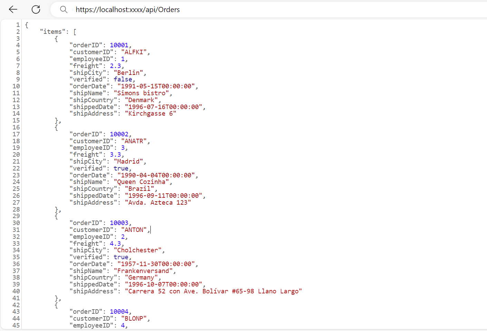
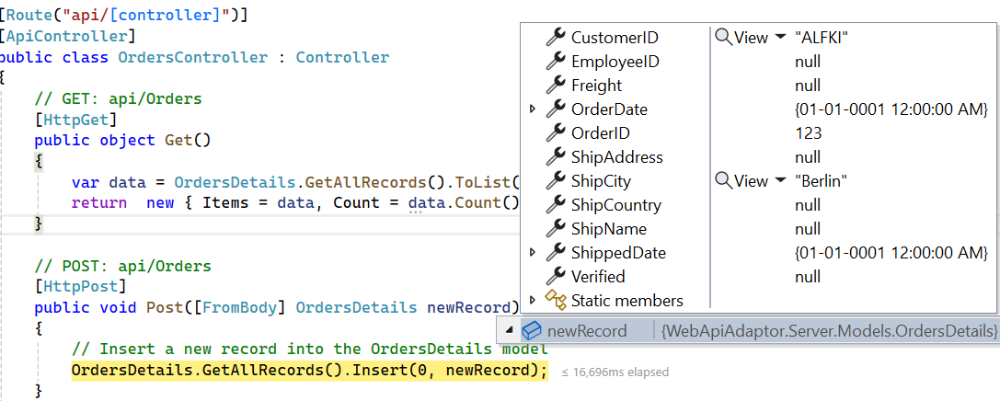

# WebApiAdaptor in Syncfusion React Grid

The Syncfusion<sup style="font-size:70%">&reg;</sup> React Grid integrates with Web API services for efficient data retrieval and manipulation through RESTful APIs. This guide provides a complete step-by-step process for configuring and using the `WebApiAdaptor` with the Syncfusion React Grid to perform server-side operations such as paging, sorting, filtering, and CRUD.

## Understanding WebApiAdaptor

The `WebApiAdaptor` is an extension of the `ODataAdaptor`, specifically designed to interact with Web APIs that support OData query conventions. This adaptor enables seamless communication between the Syncfusion<sup style="font-size:70%">&reg;</sup> Grid and Web API endpoints, providing efficient data operations while maintaining compatibility with standard Web API architecture.

### WebApiAdaptor vs ODataV4Adaptor

While both adaptors work with OData-style queries, they have distinct use cases:

| Feature | WebApiAdaptor | ODataV4Adaptor |
|---------|---------------|----------------|
| **Server Type** | ASP.NET Web API with custom handling. | Full OData V4 service. |
| **Query Format** | OData query strings. | Standard OData V4 protocol. |
| **Response Format** | Custom: `{ Items: [], Count: number }` | Standard OData: `{ value: [], @odata.count: number }` |
| **Server Control** | Full control over query processing. | Framework handles queries automatically. |
| **Use Case** | Existing Web APIs with custom logic. | Standard OData V4 services. |

**WebApiAdaptor Benefits:**
- Compatible with existing ASP.NET Web API projects.
- Full control over server-side query processing.
- Flexible response formatting.
- Custom business logic implementation.
- Works with OData query syntax without full OData infrastructure.

### WebApiAdaptor Workflow


1. **Grid Action** → User performs operation (filter, sort, page, etc.).
2. **Query Generation** → WebApiAdaptor generates OData-style query string.
3. **HTTP Request** → Request sent to Web API endpoint with query parameters.
4. **Server Processing** → Web API controller processes the query.
5. **Response Format** → Server returns `{ Items: [...], Count: number }`
6. **Grid Rendering** → WebApiAdaptor processes response and updates Grid.

**Example Query Flow:**
- **Filter**: `GET /api/Orders?$filter=substringof('Denmark',ShipCountry)`
- **Sort**: `GET /api/Orders?$orderby=OrderID desc`
- **Page**: `GET /api/Orders?$skip=10&$top=10`
- **CRUD**: Uses standard HTTP verbs (POST, PUT, DELETE)

## Prerequisites and System Requirements

**Development Environment:**

1. **Visual Studio 2022** (Community, Professional, or Enterprise)
   - Download: https://visualstudio.microsoft.com/
   
2. **Node.js** version 14.0 or later
   - Download: https://nodejs.org/
   - Verification command: `node --version`

3. **Basic Knowledge:**
   - ASP.NET Core Web API development.
   - React and TypeScript fundamentals.
   - HTTP methods and RESTful APIs.

## Implementation Overview

**Server-Side Components:**
- ASP.NET Core Web API service endpoint (https://localhost:xxxx/api/Orders).
- OrdersDetails model class with sample data.
- OrdersController handling HTTP operations (GET, POST, PUT, DELETE).
- Custom query processing logic for filtering, sorting, and paging.
- In-memory data store with 45 sample order records.

**Client-Side Components:**
- React application with Syncfusion Grid component.
- DataManager configured with `WebApiAdaptor` instance.
- Complete CRUD interface (Create, Read, Update, Delete).
- Advanced features: filtering, sorting, pagination, and global search.

**Key Differences from OData:**
- Custom response format: `{ Items: [], Count: number }`.
- Manual query parsing implementation required.
- Greater flexibility in business logic.
- Standard Web API controller patterns.

## Configure Web API Service in ASP.NET Core (Server-Side)

This section covers the complete configuration of an ASP.NET Core Web API service for data operations with WebApiAdaptor.

### Project Creation

**Creating ASP.NET Core with React Project:**

1. Launch **Visual Studio 2022**.
2. Select **Create a new project**.
3. Search for **"ASP.NET Core with React.js"** template.
4. Click **Next**.
5. Configure project settings:
   - Project name: **WebApiAdaptor**.
   - Location: Select appropriate directory.
6. Click **Create**.
7. Select framework: **.NET 8.0** or later.
8. Confirm by clicking **Create**.

> **Reference**: For detailed React and ASP.NET Core integration guidance, consult the [official Microsoft documentation](https://learn.microsoft.com/en-us/visualstudio/javascript/tutorial-asp-net-core-with-react?view=vs-2022).

**Project Structure:**
- **Server folder**: Contains ASP.NET Core Web API implementation (backend service).
- **Client folder**: Contains React application implementation (Grid UI frontend).
- **Communication**: HTTP-based request-response pattern between client and server.

### NuGet Package Installation

**Installing Microsoft.AspNetCore.Mvc.NewtonsoftJson:**

1. Navigate to **Tools** → **NuGet Package Manager** → **Manage NuGet Packages for Solution**.
2. Select the **Browse** tab.
3. Search for **"Microsoft.AspNetCore.Mvc.NewtonsoftJson"**.
4. Select the package version matching your project's **target framework** from the result.
5. Mark the server project checkbox in the right panel.
6. Click **Install**.
7. Accept license terms when prompted.

**Package Functionality:**
The `Microsoft.AspNetCore.Mvc.NewtonsoftJson` package provides essential JSON serialization extensions for ASP.NET Core applications, including:

- Enabling the **Newtonsoft.Json** serializer instead of the default `System.Text.Json`.
- Support for **property casing**, **contract resolution**, and **custom naming strategies**.
- Configuration options for **reference loop handling**, **null value handling**, and **date formatting**.
- Backward compatibility for applications previously relying on Newtonsoft.Json behavior

> This package is required when applying JSON **casing** in Syncfusion ASP.NET Core Grid. Refer to the [troubleshooting guide](https://ej2.syncfusion.com/aspnetcore/documentation/grid/data-binding/data-binding#troubleshoot-syncfusion-aspnet-core-grid-render-rows-without-data) for more details.

### Data Model Definition

**Creating Models Folder:**

1. In **Solution Explorer**, right-click the **Server** project
2. Select **Add** → **New Folder**
3. Assign name: **"Models"**

**Creating OrdersDetails Model Class:**

1. Right-click the **Models** folder
2. Select **Add** → **Class**
3. Assign name: **"OrdersDetails.cs"**
4. Replace default content with the implementation below:




namespace WebApiAdaptor.Server.Models
{
    public class OrdersDetails
    {
        public static List<OrdersDetails> order = new List<OrdersDetails>();
        
        public OrdersDetails()
        {

        }
        
        public OrdersDetails(
            int OrderID, string CustomerId, int EmployeeId, double Freight, bool Verified,
            DateTime OrderDate, string ShipCity, string ShipName, string ShipCountry,
            DateTime ShippedDate, string ShipAddress)
        {
            this.OrderID = OrderID;
            this.CustomerID = CustomerId;
            this.EmployeeID = EmployeeId;
            this.Freight = Freight;
            this.ShipCity = ShipCity;
            this.Verified = Verified;
            this.OrderDate = OrderDate;
            this.ShipName = ShipName;
            this.ShipCountry = ShipCountry;
            this.ShippedDate = ShippedDate;
            this.ShipAddress = ShipAddress;
        }

        public static List<OrdersDetails> GetAllRecords()
        {
            if (order.Count() == 0)
            {
                int code = 10000;
                for (int i = 1; i < 10; i++)
                {
                    order.Add(new OrdersDetails(code + 1, "ALFKI", i + 0, 2.3 * i, false, new DateTime(1991, 05, 15), "Berlin", "Simons bistro", "Denmark", new DateTime(1996, 7, 16), "Kirchgasse 6"));
                    order.Add(new OrdersDetails(code + 2, "ANATR", i + 2, 3.3 * i, true, new DateTime(1990, 04, 04), "Madrid", "Queen Cozinha", "Brazil", new DateTime(1996, 9, 11), "Avda. Azteca 123"));
                    order.Add(new OrdersDetails(code + 3, "ANTON", i + 1, 4.3 * i, true, new DateTime(1957, 11, 30), "Cholchester", "Frankenversand", "Germany", new DateTime(1996, 10, 7), "Carrera 52 con Ave. Bolívar #65-98 Llano Largo"));
                    order.Add(new OrdersDetails(code + 4, "BLONP", i + 3, 5.3 * i, false, new DateTime(1930, 10, 22), "Marseille", "Ernst Handel", "Austria", new DateTime(1996, 12, 30), "Magazinweg 7"));
                    order.Add(new OrdersDetails(code + 5, "BOLID", i + 4, 6.3 * i, true, new DateTime(1953, 02, 18), "Tsawassen", "Hanari Carnes", "Switzerland", new DateTime(1997, 12, 3), "1029 - 12th Ave. S."));
                    code += 5;
                }
            }
            return order;
        }

        public int? OrderID { get; set; }
        public string? CustomerID { get; set; }
        public int? EmployeeID { get; set; }
        public double? Freight { get; set; }
        public string? ShipCity { get; set; }
        public bool? Verified { get; set; }
        public DateTime OrderDate { get; set; }
        public string? ShipName { get; set; }
        public string? ShipCountry { get; set; }
        public DateTime ShippedDate { get; set; }
        public string? ShipAddress { get; set; }
    }
}




**Model Components Explained:**
- **Static list**: In-memory data storage for demonstration purposes
- **Constructor**: Initializes order properties with sample data
- **GetAllRecords()**: Static method generating 45 sample order records for testing
- **Nullable properties (`?`)**: Allow optional field values
- **Production Implementation**: Replace in-memory data with database integration using Entity Framework Core

### Web API Controller Configuration

**Creating Controllers Folder (if not exist in project creation template):**

1. Right-click the **Server** project in Solution Explorer
2. Select **Add** → **New Folder**
3. Assign name: **"Controllers"**

**Creating OrdersController:**

1. Right-click the **Controllers** folder
2. Select **Add** → **Controller**
3. Choose **API Controller - Empty** template
4. Assign name: **"OrdersController.cs"**
5. Replace generated content with the basic GET implementation below:

**Basic Controller Implementation:**

This initial implementation returns all data in the format required by WebApiAdaptor: `{ Items: [], Count: number }`




using Microsoft.AspNetCore.Mvc;
using WebApiAdaptor.Server.Models;

namespace WebApiAdaptor.Server.Controllers
{
    [Route("api/[controller]")]
    [ApiController]
    public class OrdersController : ControllerBase
    {
        /// <summary>
        /// Retrieves all orders with custom response format required by WebApiAdaptor.
        /// </summary>
        /// <returns>Object containing Items array and Count property</returns>
        [HttpGet]
        public object Get()
        {
            var data = OrdersDetails.GetAllRecords().ToList();
            
            // WebApiAdaptor requires this specific response format
            return new { Items = data, Count = data.Count() };
        }
    }
}




**Controller Implementation Analysis:**

- **[Route("api/[controller]")]**: Defines API endpoint as `/api/Orders`
- **[ApiController]**: Enables automatic model validation and routing features
- **Response Format**: Returns object with two properties:
  - `Items`: Array of order records
  - `Count`: Total number of records (required for pagination)
- **Why this format?**: WebApiAdaptor expects `{ Items, Count }` structure, unlike OData which uses `{ value, @odata.count }`

### CORS Configuration

**Adding CORS Support:**

Web API projects require CORS (Cross-Origin Resource Sharing) configuration to allow React client to communicate with the API server.

Open **Program.cs** and add CORS configuration:

```cs
var builder = WebApplication.CreateBuilder(args);

// Add services to the container
builder.Services.AddControllers();

// Add CORS support (required for React app to call API)
builder.Services.AddCors(options =>
{
    options.AddDefaultPolicy(policy =>
    {
        policy.AllowAnyOrigin()  // Allows requests from any origin
              .AllowAnyMethod()  // Allows all HTTP methods (GET, POST, PUT, DELETE)
              .AllowAnyHeader(); // Allows any request headers
    });
});

// Add NewtonsoftJson for controlling JSON contract resolution (required for casing behavior)
builder.Services.AddMvc().AddNewtonsoftJson(options =>
{
    options.SerializerSettings.ContractResolver =
        new Newtonsoft.Json.Serialization.DefaultContractResolver(); // Applies PascalCase (DefaultContractResolver)
});

var app = builder.Build();

// Configure middleware
if (app.Environment.IsDevelopment())
{
    app.UseDeveloperExceptionPage();
}

app.UseHttpsRedirection();
app.UseCors(); // Important: Enable CORS middleware
app.UseAuthorization();
app.MapControllers();

app.Run();
```

> **Security Consideration**: `AllowAnyOrigin()` is suitable for development. Production environments should specify exact origins: `policy.WithOrigins("https://yourdomain.com")`

### Web API Service Verification

**Application Execution:**

1. In Visual Studio, press **F5** or click the **Run** button
2. Application launches and opens in default browser
3. Note the assigned URL and port number (example: **https://localhost:7001**)

**API Endpoint Verification:**

1. Open a web browser
2. Navigate to: **https://localhost:xxxx/api/Orders** (replace **xxxx** with actual port number)
3. Expected result: JSON response containing `Items` array and `Count` property

**Example Response:**
```json
{
  "Items": [
    {
      "orderID": 10001,
      "customerID": "ALFKI",
      "employeeID": 1,
      "freight": 2.3,
      "shipCity": "Berlin",
      "verified": false,
      "orderDate": "1991-05-15T00:00:00",
      "shipName": "Simons bistro",
      "shipCountry": "Denmark",
      "shippedDate": "1996-07-16T00:00:00",
      "shipAddress": "Kirchgasse 6"
    }
    // ... more records
  ],
  "count": 45
}
```




## React Grid Setup (Client-Side Configuration)

With the Web API service operational, the next phase involves configuring the React Grid component to consume and display data from the service.

### Syncfusion Package Installation

**Opening Terminal in Client Directory:**

1. In **Solution Explorer**, right-click the **ClientApp** folder (or React project root)
2. Select **Open in Terminal**
3. Verify current directory contains `package.json` file

**Installing Required Dependencies:**

Execute the following npm commands in the terminal:

```bash
npm install @syncfusion/ej2-react-grids --save
npm install @syncfusion/ej2-data --save
```

**Package Descriptions:**
- `@syncfusion/ej2-react-grids`: Complete React Grid component library with comprehensive UI features
- `@syncfusion/ej2-data`: Data management library containing DataManager and adaptors including `WebApiAdaptor`

### Syncfusion Stylesheet Integration

**Locating Stylesheet File:**

1. Navigate to the **src** folder in the React project
2. Open existing **index.css** file or create new stylesheet (alternate: **App.css**)

**Importing Syncfusion CSS:**

Add the following CSS import statements to apply proper Grid component styling:

```ts



@import '../node_modules/@syncfusion/ej2-base/styles/tailwind3.css';
@import '../node_modules/@syncfusion/ej2-buttons/styles/tailwind3.css';
@import '../node_modules/@syncfusion/ej2-calendars/styles/tailwind3.css';
@import '../node_modules/@syncfusion/ej2-dropdowns/styles/tailwind3.css';
@import '../node_modules/@syncfusion/ej2-inputs/styles/tailwind3.css';
@import '../node_modules/@syncfusion/ej2-navigations/styles/tailwind3.css';
@import '../node_modules/@syncfusion/ej2-popups/styles/tailwind3.css';
@import '../node_modules/@syncfusion/ej2-splitbuttons/styles/tailwind3.css';
@import '../node_modules/@syncfusion/ej2-react-grids/styles/tailwind3.css';



```
**Stylesheet Component Breakdown:**
- `ej2-base`: Foundation styles required by all Syncfusion components
- `ej2-buttons`, `ej2-inputs`, `ej2-calendars`, etc.: Feature-specific styles utilized by Grid functionality
- `ej2-react-grids`: Grid component-specific styling definitions

> **Theme Customization**: Alternative themes available include `bootstrap5.css`, `fluent.css`, `tailwind.css`, and others. All theme files maintain consistent path structure with only the filename varying.

**Stylesheet Import in Application:**

Import the stylesheet in the **main.jsx** or **index.jsx** application entry point:

```typescript
import './index.css';
```

### Basic Grid Component Implementation

This section demonstrates creating a React Grid component with Web API service integration.

**Opening or Creating App.jsx:**

1. Navigate to the **src** folder
2. Open existing **App.jsx** file or create new file if absent

**Grid Component Implementation:**

Replace existing content with the following implementation:



import { DataManager, WebApiAdaptor } from '@syncfusion/ej2-data';
import { GridComponent, ColumnsDirective, ColumnDirective } from '@syncfusion/ej2-react-grids';

function App() {
    // Create DataManager with WebApiAdaptor
    const data = new DataManager({ 
        url: 'https://localhost:xxxx/api/Orders', // Replace xxxx with your port number
        adaptor: new WebApiAdaptor(), // This handles Web API communication
        crossDomain: true // Allow cross-domain requests
    });
    
    return (
        <div style={{ margin: '20px' }}>
            <h2>Orders Grid</h2>
            <GridComponent dataSource={data} height={320}>
                <ColumnsDirective>
                    <ColumnDirective 
                        field='OrderID' 
                        headerText='Order ID' 
                        isPrimaryKey={true} 
                        width='150' 
                        textAlign='Right'>
                    </ColumnDirective>
                    <ColumnDirective 
                        field='CustomerID' 
                        headerText='Customer ID' 
                        width='150'>
                    </ColumnDirective>
                    <ColumnDirective 
                        field='ShipCity' 
                        headerText='Ship City' 
                        width='150'>
                    </ColumnDirective>
                    <ColumnDirective 
                        field='ShipCountry' 
                        headerText='Ship Country' 
                        width='150'>
                    </ColumnDirective>
                </ColumnsDirective>
            </GridComponent>
        </div>
    );
}

export default App;




**Implementation Analysis:**

**DataManager Configuration:**
- `url`: Specifies Web API endpoint URL
- `adaptor: new WebApiAdaptor()`: Configures DataManager to utilize Web API protocol with OData-style queries
- Request pattern: Generates HTTP requests such as `GET https://localhost:xxxx/api/Orders`
- `crossDomain: true`: Enables cross-origin requests

**Grid Component Configuration:**
- `dataSource={data}`: Binds Grid component to Web API service via DataManager
- `ColumnsDirective`: Defines visible column configuration

**Column Properties:**
- `field`: Maps to corresponding property name in "OrdersDetails" model
- `headerText`: Specifies column header display text
- `isPrimaryKey`: Designates column as unique identifier (mandatory for CRUD operations)
- `width`: Defines column width in pixels
- `textAlign`: Controls text alignment (options: Left, Right, Center)

### Application Execution and Verification

**Starting the Application:**

1. In Visual Studio, press **F5** to execute
2. Application launches in default browser
3. Expected result: Grid displays all 45 orders retrieved from Web API service

**Connection Verification:**

- Open browser **Developer Tools** (keyboard shortcut: F12)
- Navigate to **Network** tab
- Refresh the page to capture network traffic
- Observe request to: `https://localhost:xxxx/api/Orders`
- Verify response contains JSON data payload with `Items` and `Count` properties

**Network Tab Verification Checklist:**
- **Request URL**: Confirms endpoint `https://localhost:xxxx/api/Orders`
- **Request Method**: Confirms HTTP method `GET`
- **Status Code**: Confirms success status `200 OK`
- **Response Body**: Contains JSON object with `Items` array and `Count` property

**Common Issues and Resolutions:**

| Issue | Resolution |
|-------|----------|
| **CORS Error** | Verify CORS configuration in **Program.cs** (already covered above). |
| **404 Not Found** | Confirm URL and port number match server configuration. |
| **Empty Grid** | Inspect browser console for errors; verify server data response format. |
| **Styles Missing** | Confirm styles.css import in main application file. |
| **Incorrect Response Format** | Ensure server returns `{ Items: [], Count: number }` format. |


---

## Performing Data Operations

This section covers implementation of advanced Grid features including filtering, sorting, pagination, and global search with custom server-side handling.

### Filtering

The filtering feature enables data refinement by applying conditional criteria. With WebApiAdaptor, the Grid sends OData-style filter queries that must be manually processed on the server side.

**Filtering Workflow:**
1. Filter criteria entered in Grid column header
2. WebApiAdaptor converts criteria to OData query syntax: `$filter=substringof('Denmark',ShipCity)`
3. Server receives query string and manually parses filter parameters
4. Custom logic filters data and returns matching records
5. Grid renders filtered result set with updated count

**Key Difference from OData:**
- OData: Framework automatically handles filtering with `[EnableQuery]`
- WebApi: Manual parsing and filtering logic required in controller

**Implementation Steps:**

**Server-Side Filtering Implementation:**

Update the **OrdersController.cs** `Get()` method to handle filter query parameters:




using Microsoft.AspNetCore.Mvc;
using WebApiAdaptor.Server.Models;

namespace WebApiAdaptor.Server.Controllers
{
    [Route("api/[controller]")]
    [ApiController]
    public class OrdersController : ControllerBase
    {
        /// <summary>
        /// Retrieves orders with filtering support.
        /// Handles OData-style $filter query parameter.
        /// </summary>
        [HttpGet]
        public object Get()
        {
            var queryString = Request.Query;
            var data = OrdersDetails.GetAllRecords().ToList();
            string filter = queryString["$filter"];

            if (!string.IsNullOrEmpty(filter))
            {
                filter = filter.Trim();
                
                // Remove one level of outer parentheses if present
                if (filter.StartsWith("(") && filter.EndsWith(")"))
                {
                    int openCount = filter.Count(c => c == '(');
                    int closeCount = filter.Count(c => c == ')');

                    if (openCount == closeCount && openCount > 0)
                    {
                        filter = filter.Substring(1, filter.Length - 2).Trim();
                    }
                }
                
                // Split multiple filter conditions (AND logic)
                var filters = filter.Split(new string[] { " and " }, StringSplitOptions.RemoveEmptyEntries);
                
                foreach (var filterItem in filters)
                {
                    var filterfield = "";
                    var filtervalue = "";
                    
                    // Parse filter expression
                    var filterParts = filterItem.Split('(', ')', '\'');
                    
                    if (filterParts.Length != 9)
                    {
                        // Simple filter: field eq 'value'
                        var filterValueParts = filterParts[1].Split();
                        filterfield = filterValueParts[0];
                        filtervalue = filterValueParts[2];
                    }
                    else
                    {
                        // Function filter: substringof('value', field)
                        filterfield = filterParts[3];
                        filtervalue = filterParts[5];
                    }
                    
                    // Apply filter based on field
                    switch (filterfield)
                    {
                        case "OrderID":
                            data = data.Where(x => x.OrderID.ToString() == filtervalue).ToList();
                            break;
                        case "CustomerID":
                            data = data.Where(x => x.CustomerID.ToLower().Contains(filtervalue.ToLower())).ToList();
                            break;
                        case "ShipCity":
                            data = data.Where(x => x.ShipCity.ToLower().Contains(filtervalue.ToLower())).ToList();
                            break;
                        case "ShipCountry":
                            data = data.Where(x => x.ShipCountry.ToLower().Contains(filtervalue.ToLower())).ToList();
                            break;
                        // Add more cases for other filterable fields
                    }
                }
            }
            
            return new { Items = data, Count = data.Count() };
        }
    }
}




import { DataManager, WebApiAdaptor } from '@syncfusion/ej2-data';
import { GridComponent, ColumnsDirective, ColumnDirective, Filter, Inject } from '@syncfusion/ej2-react-grids';

function App() {
    const data = new DataManager({ 
        url: 'https://localhost:xxxx/api/Orders', // Replace with actual endpoint URL
        adaptor: new WebApiAdaptor(),
        crossDomain: true
    });
    
    return <GridComponent dataSource={data} allowFiltering={true} height={320}>
        <ColumnsDirective>
            <ColumnDirective 
                field='OrderID' 
                headerText='Order ID' 
                isPrimaryKey={true} 
                width='150' 
                textAlign='Right'>
            </ColumnDirective>
            <ColumnDirective 
                field='CustomerID' 
                headerText='Customer ID' 
                width='150'>
            </ColumnDirective>
            <ColumnDirective 
                field='ShipCity' 
                headerText='Ship City' 
                width='150'>
            </ColumnDirective>
            <ColumnDirective 
                field='ShipCountry' 
                headerText='Ship Country' 
                width='150'>
            </ColumnDirective>
        </ColumnsDirective>
        <Inject services={[Filter]} />
    </GridComponent>
};
export default App;




**Implementation Details:**

**Client-Side:**
- `allowFiltering={true}`: Activates filtering capability in Grid component
- `Filter`: Syncfusion service providing filtering infrastructure
- `Inject services={[Filter]}`: Registers Filter service with Grid instance

**Server-Side:**
- Manually parses `$filter` query parameter
- Handles both simple filters (`field eq 'value'`) and function filters (`substringof('value', field)`)
- Supports multiple filters with AND logic
- Returns filtered data with updated count

**Filter Usage:**
1. Execute the application
2. Click filter icon in column header
3. Enter filter value (example: "Denmark" in ShipCountry column)
4. Press Enter to apply filter
5. Grid displays records matching filter criteria

**Available Filter Types:**
- **String columns**: Contains, Equals, Starts With, Ends With operators
- **Number columns**: Equals, Greater Than, Less Than operators


### Searching

The search feature provides a global search interface that queries across all columns simultaneously. Unlike column-specific filtering, searching performs keyword matching across the entire dataset.

**Filtering vs. Searching:**
- **Filtering**: Column-specific with precise conditional logic
- **Searching**: Global keyword matching across all columns

**Search Workflow:**
1. Search term entered in search box
2. WebApiAdaptor constructs `$filter` query with `substringof()` function
3. Server receives search query and manually processes it
4. Custom logic searches across all columns
5. Grid displays aggregated search results

**Implementation Steps:**

**Server-Side Search Implementation:**

Update the **OrdersController.cs** to handle search operations within the filter logic:
```cs



using Microsoft.AspNetCore.Mvc;
using WebApiAdaptor.Server.Models;

namespace WebApiAdaptor.Server.Controllers
{
    [Route("api/[controller]")]
    [ApiController]
    public class OrdersController : ControllerBase
    {
        /// <summary>
        /// Retrieves orders with filtering and searching support.
        /// </summary>
        [HttpGet]
        public object Get()
        {
            var queryString = Request.Query;
            var data = OrdersDetails.GetAllRecords().ToList();
            string filter = queryString["$filter"];

            if (!string.IsNullOrEmpty(filter))
            {
                filter = filter.Trim();
                
                // Remove outer parentheses
                if (filter.StartsWith("(") && filter.EndsWith(")"))
                {
                    int openCount = filter.Count(c => c == '(');
                    int closeCount = filter.Count(c => c == ')');

                    if (openCount == closeCount && openCount > 0)
                    {
                        filter = filter.Substring(1, filter.Length - 2).Trim();
                    }
                }
                
                var filters = filter.Split(new string[] { " and " }, StringSplitOptions.RemoveEmptyEntries);

                foreach (var filterItem in filters)
                {
                    if (filterItem.Contains("substringof"))
                    {
                        // Handle SEARCH operation (global search across all columns)
                        var searchParts = filterItem.Split('(', ')', '\'');
                        var searchValue = searchParts[3].ToLower();

                        // Search across all searchable fields
                        data = data.Where(x =>
                            (x.OrderID?.ToString().Contains(searchValue) ?? false) ||
                            (x.CustomerID?.ToLower().Contains(searchValue) ?? false) ||
                            (x.ShipCountry?.ToLower().Contains(searchValue) ?? false) ||
                            (x.ShipCity?.ToLower().Contains(searchValue) ?? false) ||
                            (x.ShipName?.ToLower().Contains(searchValue) ?? false)
                        ).ToList();
                    }
                    else
                    {
                        // Handle FILTER operation (column-specific filtering)
                        var filterfield = "";
                        var filtervalue = "";
                        var filterParts = filterItem.Split('(', ')', '\'');
                        
                        if (filterParts.Length != 9)
                        {
                            var filterValueParts = filterParts[1].Split();
                            filterfield = filterValueParts[0];
                            filtervalue = filterValueParts[2];
                        }
                        else
                        {
                            filterfield = filterParts[3];
                            filtervalue = filterParts[5];
                        }
                        
                        switch (filterfield)
                        {
                            case "OrderID":
                                data = data.Where(x => x.OrderID.ToString() == filtervalue).ToList();
                                break;
                            case "CustomerID":
                                data = data.Where(x => x.CustomerID.ToLower().Contains(filtervalue.ToLower())).ToList();
                                break;
                            case "ShipCity":
                                data = data.Where(x => x.ShipCity.ToLower().Contains(filtervalue.ToLower())).ToList();
                                break;
                            case "ShipCountry":
                                data = data.Where(x => x.ShipCountry.ToLower().Contains(filtervalue.ToLower())).ToList();
                                break;
                        }
                    }
                }
            }
            
            return new { Items = data, Count = data.Count() };
        }
    }
}


```
```ts


import { DataManager, WebApiAdaptor } from '@syncfusion/ej2-data';
import { GridComponent, ColumnsDirective, ColumnDirective, Toolbar, ToolbarItems, Inject } from '@syncfusion/ej2-react-grids';

function App() {
    const data = new DataManager({ 
        url: 'https://localhost:xxxx/api/Orders', // Replace with actual endpoint URL
        adaptor: new WebApiAdaptor(),
        crossDomain: true
    });
    
    const toolbar = ['Search'];
    
    return <GridComponent dataSource={data} height={320} toolbar={toolbar}>
        <ColumnsDirective>
            <ColumnDirective 
                field='OrderID' 
                headerText='Order ID' 
                isPrimaryKey={true} 
                width='150' 
                textAlign='Right'>
            </ColumnDirective>
            <ColumnDirective 
                field='CustomerID' 
                headerText='Customer ID' 
                width='150'>
            </ColumnDirective>
            <ColumnDirective 
                field='ShipCity' 
                headerText='Ship City' 
                width='150'>
            </ColumnDirective>
            <ColumnDirective 
                field='ShipCountry' 
                headerText='Ship Country' 
                width='150'>
            </ColumnDirective>
        </ColumnsDirective>
        <Inject services={[Toolbar]} />
    </GridComponent>
};
export default App;



```
**Implementation Details:**

**Client-Side:**
- `toolbar={toolbar}`: Adds toolbar component to Grid
- `toolbar = ['Search']`: Configures toolbar with search box
- `Toolbar`: Syncfusion service providing toolbar infrastructure
- `Inject services={[Toolbar]}`: Registers Toolbar service with Grid

**Server-Side:**
- Detects search operation by checking for `substringof` function in filter
- Searches across all specified columns simultaneously
- Uses null-conditional operators (`?.`) for safe property access
- Returns matched records with updated count

**Search Usage:**
1. Execute the application
2. Search box appears in top-right Grid corner
3. Enter search keyword (examples: "Denmark", "ALFKI", "10005")
4. Grid displays matching records from any column
5. Clear search box to restore complete dataset


**Search Behavior Characteristics:**
- Searches multiple columns simultaneously
- Case-insensitive matching
- Partial string matching
- Real-time result updates during input

### Sorting

Record sorting provides organization of data in ascending or descending order based on column values. Both single-column and multi-column sorting are supported.

**Sorting Workflow:**
1. Column header clicked
2. First click: Ascending sort applied (A→Z, 0→9)
3. Second click: Descending sort applied (Z→A, 9→0)
4. Third click: Sort removed
5. WebApiAdaptor generates query: `$orderby=ColumnName asc/desc`
6. Server manually processes sort parameter and orders data

**Multi-Column Sorting:**
Hold **Ctrl** key (Windows) or **Cmd** key (Mac) and click multiple column headers to establish multi-column sort priority.

**Implementation Steps:**

**Server-Side Sorting Implementation:**

Update the **OrdersController.cs** `Get()` method to handle sort query parameters:
```cs


  // GET: api/Orders.
  [HttpGet]

  public object Get()
  {
    var queryString = Request.Query;
    var data = Orders.GetAllRecords().ToList();
    string sort = queryString["$orderby"];     
    if (!string.IsNullOrEmpty(sort))
    {
      var sortConditions = sort.Split(',');
      var orderedData = data.OrderBy(x => 0); // Start with a stable sort.
      foreach (var sortCondition in sortConditions)
      {
        var sortParts = sortCondition.Trim().Split(' ');
        var sortBy = sortParts[0];
        var sortOrder = sortParts.Length > 1 && sortParts[1].ToLower() == "desc";
        switch (sortBy)
        {
          case "OrderID":
              orderedData = sortOrder ? orderedData.ThenByDescending(x => x.OrderID) : orderedData.ThenBy(x => x.OrderID);
              break;
          case "CustomerID":
              orderedData = sortOrder ? orderedData.ThenByDescending(x => x.CustomerID) : orderedData.ThenBy(x => x.CustomerID);
              break;
          case "ShipCity":
              orderedData = sortOrder ? orderedData.ThenByDescending(x => x.ShipCity) : orderedData.ThenBy(x => x.ShipCity);
              break;
          case "ShipCountry":
              orderedData = sortOrder ? orderedData.ThenByDescending(x => x.ShipCountry) : orderedData.ThenBy(x => x.ShipCountry);
              break;
          // Add more cases for other sort fields if needed.
        }
      }
      data = orderedData.ToList();
    }
    return new { Items = data, Count = data.Count() };
  }


```
```ts


import { DataManager, WebApiAdaptor } from '@syncfusion/ej2-data';
import { GridComponent, ColumnsDirective, ColumnDirective, Sort, Inject } from '@syncfusion/ej2-react-grids';

function App() {
    const data = new DataManager({ 
        url: 'https://localhost:xxxx/api/Orders', // Replace with the actual endpoint URL.
        adaptor: new WebApiAdaptor()
    });
    return <GridComponent dataSource={data} allowSorting={true} height={320}>
        <ColumnsDirective>
            <ColumnDirective field='OrderID' headerText='Order ID' isPrimaryKey={true} width='150' textAlign='Right'></ColumnDirective>
            <ColumnDirective field='CustomerID' headerText='Customer ID' width='150'></ColumnDirective>
            <ColumnDirective field='ShipCity' headerText='Ship City' width='150'/>
            <ColumnDirective field='ShipCountry' headerText='Ship Country' width='150'/>
        </ColumnsDirective>
        <Inject services={[Sort]} />
    </GridComponent>
};
export default App;



```
### Handling paging operation

Record pagination provides navigation through large datasets by dividing records into manageable pages. Implement paging logic on the server-side according to the received OData-formatted query parameters.


```cs



// GET: api/Orders
[HttpGet]

public object Get()
{
    var queryString = Request.Query;
    var data = Orders.GetAllRecords().ToList();
    int skip = Convert.ToInt32(queryString["$skip"]);
    int take = Convert.ToInt32(queryString["$top"]);
    return take != 0 ? new { Items = data.Skip(skip).Take(take).ToList(), Count = data.Count() } : new { Items = data, Count = data.Count() };
}


```
```ts


import { DataManager, WebApiAdaptor } from '@syncfusion/ej2-data';
import { GridComponent, ColumnsDirective, ColumnDirective, Page, Inject } from '@syncfusion/ej2-react-grids';

function App() {
    const data = new DataManager({ 
        url: 'https://localhost:xxxx/api/Orders', // Replace with the actual endpoint URL.
        adaptor: new WebApiAdaptor()
    });
    return <GridComponent dataSource={data} allowPaging={true} height={320}>
        <ColumnsDirective>
            <ColumnDirective field='OrderID' headerText='Order ID' isPrimaryKey={true} width='150' textAlign='Right'></ColumnDirective>
            <ColumnDirective field='CustomerID' headerText='Customer ID' width='150'></ColumnDirective>
            <ColumnDirective field='ShipCity' headerText='Ship City' width='150'/>
            <ColumnDirective field='ShipCountry' headerText='Ship Country' width='150'/>
        </ColumnsDirective>
        <Inject services={[Page]} />
    </GridComponent>
};
export default App;



```
### Handling CRUD operations

To manage CRUD (Create, Read, Update, Delete) operations using the WebApiAdaptor, follow the provided guide for configuring the Syncfusion<sup style="font-size:70%">&reg;</sup> Grid for [editing](https://ej2.syncfusion.com/react/documentation/grid/editing/edit) and utilize the sample implementation of the `OrdersController` in the server application. This controller handles HTTP requests for CRUD operations such as GET, POST, PUT, and DELETE.

To enable CRUD operations in the Syncfusion<sup style="font-size:70%">&reg;</sup> Grid component within an React application, follow these steps:

```ts


import { ColumnDirective, ColumnsDirective, GridComponent, ToolbarItems, EditSettingsModel, Toolbar, Edit, Inject } from '@syncfusion/ej2-react-grids';
import { DataManager, WebApiAdaptor } from '@syncfusion/ej2-data';

function App() {
    const data = new DataManager({ 
      url: 'https://localhost:xxxx/api/Orders', // Replace with the actual endpoint URL.
      adaptor: new WebApiAdaptor()
    });
    const editSettings = { allowEditing: true, allowAdding: true, allowDeleting: true, mode: 'Normal' };
    const toolbar = ['Add', 'Edit', 'Delete', 'Update', 'Cancel', 'Search'];
    const orderIDRules = {required: true};
    const customerIDRules = {required: true, minLength: 3};
    return <GridComponent dataSource={data} editSettings={editSettings} toolbar={toolbar} height={320}>
        <ColumnsDirective>
            <ColumnDirective field='OrderID' headerText='Order ID' isPrimaryKey={true} width='150' textAlign='Right' validationRules={orderIDRules}></ColumnDirective>
            <ColumnDirective field='CustomerID' headerText='Customer ID' width='150' validationRules={customerIDRules}></ColumnDirective>
            <ColumnDirective field='ShipCity' headerText='Ship City' width='150'/>
            <ColumnDirective field='ShipCountry' headerText='Ship Country' width='150'/>
        </ColumnsDirective>
        <Inject services={[Toolbar, Edit]} />
    </GridComponent>
};
export default App;



```
> Normal/Inline editing is the default edit [mode](https://ej2.syncfusion.com/react/documentation/api/grid/editSettings#mode) for the Grid component. To enable CRUD operations, ensure that the [isPrimaryKey](https://ej2.syncfusion.com/react/documentation/api/grid/column#isprimarykey) property is set to **true** for a specific Grid column, ensuring that its value is unique.

**Insert Record**

To insert a new record into the Syncfusion<sup style="font-size:70%">&reg;</sup> Grid, utilize the `HttpPost` method in the server application. Below is a sample implementation of inserting a record using the OrdersController:



```cs
// POST: api/Orders
[HttpPost]
/// <summary>
/// Inserts a new data item into the data collection.
/// </summary>
/// <param name="newRecord">It holds new record detail which is need to be inserted.</param>
/// <returns>Returns void</returns>
public void Post([FromBody] OrdersDetails newRecord)
{
  // Insert a new record into the OrdersDetails model.
  OrdersDetails.GetAllRecords().Insert(0, newRecord);
}
```

**Update Record**

To update a record in the Syncfusion<sup style="font-size:70%">&reg;</sup> Grid, utilize the `HttpPut` method in the controller. Below is a sample implementation:


```cs
// PUT: api/Orders
[HttpPut]
/// <summary>
/// Update a existing data item from the data collection.
/// </summary>
/// <param name="updatedOrder">It holds updated record detail which is need to be updated.</param>
/// <returns>Returns void</returns>
public void Put([FromBody] OrdersDetails updatedOrder)
{
  // Find the existing order by ID
  var existingOrder = OrdersDetails.GetAllRecords().FirstOrDefault(o => o.OrderID == updatedOrder.OrderID);
  if (existingOrder != null)
  {
    // If the order exists, update its properties.
    existingOrder.OrderID = updatedOrder.OrderID;
    existingOrder.CustomerID = updatedOrder.CustomerID;
    existingOrder.ShipCity = updatedOrder.ShipCity;
    existingOrder.ShipCountry = updatedOrder.ShipCountry;
    // Update other properties similarly.
  }
}
```

**Delete Record**

To delete a record from the Syncfusion<sup style="font-size:70%">&reg;</sup> Grid, utilize the `HttpDelete` method in the controller. Below is a sample implementation:


```cs
// DELETE: api/5
[HttpDelete("{key}")]
/// <summary>
/// Remove a specific data item from the data collection.
/// </summary>
/// <param name="key">It holds specific record detail id which is need to be removed.</param>
/// <returns>Returns void</returns>
public void Delete(int key)
{
  // Find the order to remove by ID.
  var orderToRemove = OrdersDetails.GetAllRecords().FirstOrDefault(order => order.OrderID == key);
  // If the order exists, remove it.
  if (orderToRemove != null)
  {
    OrdersDetails.GetAllRecords().Remove(orderToRemove);
  }
}
```

